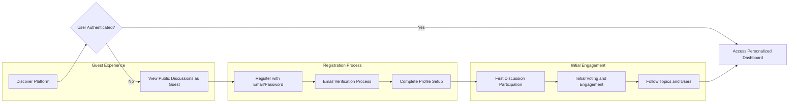
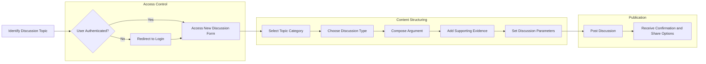
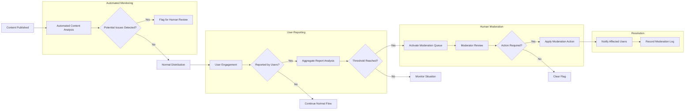
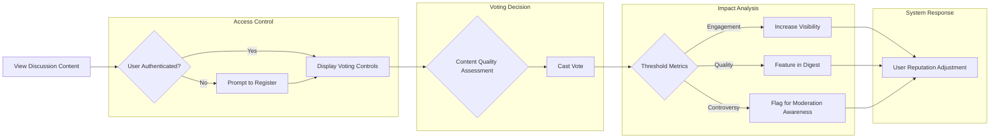

# User Journey Analysis Report: Economic/Political Discussion Board

## Service Overview and Business Model

### Why This Service Exists
This economic/political discussion board fills a critical gap in the digital public sphere by providing a structured platform for civil discourse on complex societal issues. Current platforms often devolve into polarized echo chambers or unmoderated flame wars, while academic forums remain inaccessible to the general public. Our service creates a balanced environment where:

- Users can engage with diverse perspectives on economic policies and political ideologies
- Discussions are structured to promote logical argumentation over emotional rhetoric
- Expertise is valued but accessibility is maintained for informed citizens

The platform serves as a digital town square for democratic engagement, supporting informed civic participation in an era of increasing political polarization and misinformation.

### Revenue Strategy
The platform will operate on a freemium model with the following revenue streams:
- Basic access and participation: free for all registered users
- Premium membership: $4.99/month for advanced features (in-depth analytics, enhanced personalization, ad-free experience)
- Institutional subscriptions: $99/month for educational institutions and think tanks (classroom management tools, research datasets)
- Non-intrusive, contextually relevant advertising: 15% of page view impressions

### Growth Plan
User acquisition will proceed through three phases:
1. **Seed phase**: Partner with political science departments and economics blogs to generate initial content
2. **Growth phase**: Target users through political event coverage and economic policy debates
3. **Maturity phase**: Expand into related topics (social policy, environmental economics) while maintaining core focus

### Success Metrics
Primary KPIs will include:
- Daily Active Users (DAU): Target 5,000 within 12 months
- Discussion Completion Rate: 70% of initiated threads reach substantive conclusion
- User Retention: 40% of users return weekly after first month
- Content Diversity: Maximum 60% of content from any single political ideology
- Moderation Response Time: 90% of reports addressed within 24 hours

## User Role Structure and Authentication Flow

### Authentication Requirements

#### Core Authentication Functions
Users can register with email and password to participate in discussions. The system provides secure authentication while maintaining accessibility for broad participation in democratic discourse.

THE discussion board system SHALL provide email/password authentication for all users.

WHEN a user registers with a valid email and password, THE system SHALL create a verified user account and initiate a session.

WHEN a user attempts to log in with correct credentials, THE system SHALL authenticate the user and establish a session token.

THE system SHALL maintain user sessions for 30 days unless explicitly logged out.

#### User Role Definitions

The system supports four distinct user roles with progressively increasing capabilities:

1. **Guest User**: Unauthenticated user who can view public discussions and register for an account
2. **Registered User**: Authenticated user who can create discussions, post comments, and vote on content
3. **Moderator**: Trusted user who can moderate content, handle reports, and maintain civil discourse
4. **Administrator**: System administrator who manages user accounts, system settings, and overall platform operation

### JWT Token Requirements

The system SHALL use JSON Web Tokens (JWT) for authentication with the following specifications:

- Access tokens SHALL expire after 30 minutes of inactivity
- Refresh tokens SHALL expire after 30 days
- JWT payload SHALL include userId, role, and permissions array
- Tokens SHALL be stored in localStorage with optional secure httpOnly cookie alternative
- Password reset tokens SHALL expire after 1 hour

### Permission Matrix

| Functionality | Guest User | Registered User | Moderator | Administrator |
|---------------|----------|----------------|-----------|---------------|
| View public discussions | ✅ | ✅ | ✅ | ✅ |
| Register for account | ✅ | ❌ | ❌ | ❌ |
| Post new discussions | ❌ | ✅ | ✅ | ✅ |
| Comment on discussions | ❌ | ✅ | ✅ | ✅ |
| Vote on content | ❌ | ✅ | ✅ | ✅ |
| Report inappropriate content | ❌ | ✅ | ✅ | ✅ |
| Edit own content | ❌ | ✅ | ✅ | ✅ |
| Delete own content | ❌ | ✅ | ✅ | ✅ |
| Moderate reported content | ❌ | ❌ | ✅ | ✅ |
| Issue user warnings | ❌ | ❌ | ✅ | ✅ |
| Suspend user accounts | ❌ | ❌ | ❌ | ✅ |
| Access system analytics | ❌ | ❌ | ✅ | ✅ |
| Configure platform settings | ❌ | ❌ | ❌ | ✅ |

## Key User Journey Scenarios

### New User Journey

The new user journey begins with discovery and progresses through registration to first engagement. This critical path determines whether users become active participants or abandon the platform.

#### Scenario Details

**Discovery Phase**

WHEN a potential user discovers the platform through search or referral, THE system SHALL display public discussions with highlighted diverse perspectives.

THE system SHALL prominently display the value proposition: "Engage in civil economic and political discourse with informed citizens."

**Registration Process**

WHEN a guest user clicks the registration button, THE system SHALL present a streamlined registration form with only email and password fields.

THE system SHALL send an email verification link to the provided address within 1 minute of registration.

WHEN a user clicks the verification link, THE system SHALL automatically log them in and redirect to profile setup.

**Profile Setup**

THE system SHALL request minimal profile information: preferred name, primary areas of interest (economics, domestic policy, foreign affairs, etc.), and political perspective spectrum (left, center-left, center, center-right, right).

THE system SHALL emphasize that political perspective is used only for content personalization and moderation balance, with all user identities otherwise private.

**First Engagement**

After profile setup, THE system SHALL guide new users to three curated discussions matching their interests.

THE system SHALL provide a tutorial overlay highlighting key interaction elements: posting, commenting, voting, and reporting.

THE system SHALL limit the first post to 300 words to encourage concise argumentation.

### Content Creation Flow

The content creation flow enables users to initiate discussions on economic and political topics with structured formats that promote civil discourse.

#### Discussion Types

The system supports three types of structured discussions:

1. **Policy Debate**: Focused on specific legislative proposals or economic policies
2. **Ideological Comparison**: Examination of different political philosophies or economic theories
3. **Event Analysis**: Discussion of current political events with historical and policy context

WHEN a registered user initiates a new discussion, THE system SHALL require selection of one of the three discussion types.

THE system SHALL display appropriate argumentation guidelines based on the selected discussion type.

#### Content Guidelines

THE system SHALL enforce the following content rules for all discussions:

- Posts SHALL be limited to 1,000 words maximum
- Arguments SHALL include at least one verifiable claim
- Economic claims SHALL reference relevant indicators (GDP, unemployment, inflation, etc.)
- Political claims SHALL reference constitutional principles or relevant precedent
- Users SHALL avoid ad hominem attacks and personal insults

WHEN a user submits a post containing ad hominem language, THE system SHALL flag it for review and notify the user of community guidelines.

THE system SHALL provide real-time feedback on post structure, highlighting missing elements like supporting evidence or proper citation.

#### Publication Process

WHEN a user submits a discussion post, THE system SHALL perform automated content analysis for policy terminology, economic indicators, and argument structure.

THE system SHALL assign relevant tags based on content analysis for discovery and moderation purposes.

THE system SHALL publish the discussion immediately to the relevant category, with instant notification to followers.

### Moderation Process

The moderation process ensures civil discourse while protecting free expression. The system employs a graduated approach with user reports, automated detection, and human moderation.

#### Automated Content Analysis

THE system SHALL analyze all content upon submission for:

- Logical fallacies (ad hominem, straw man, false dilemma, etc.)
- Emotional language intensity
- Factual claims requiring verification
- Political bias indicators
- Economic terminology accuracy

WHEN automated analysis detects potential issues above threshold levels, THE system SHALL flag the content for human moderator review.

#### User Reporting System

WHEN a user encounters inappropriate content, THE system SHALL provide a reporting interface with specific categories:

- Personal attacks or harassment
- Misinformation or unverified claims
- Off-topic content
- Spam or self-promotion
- Other (with text explanation)

THE system SHALL aggregate reports and trigger moderator review when three independent users report the same content within 24 hours.

#### Moderator Review Process

WHEN content enters the moderation queue, THE system SHALL present moderators with:

- The flagged content
- Reporting reasons and users
- Automated analysis results
- Post history of the author
- Relevant community guidelines

THE moderator SHALL have the following options:

- Approve: Clear the flag and allow content to stand
- Warn: Send educational notification to the user
- Edit: Request specific revisions to problematic elements
- Hide: Remove content from public view while preserving for appeal
- Remove: Delete content with permanent record

THE system SHALL require justification for all moderator actions to ensure accountability and consistency.

#### Escalation Protocol

THE system SHALL escalate moderation decisions as follows:

- First-time violations: Educational warning with policy clarification
- Repeat violations: Temporary posting restrictions (24 hours, 7 days, 30 days)
- Severe violations: Immediate suspension with administrator review
- Appeals: Redirect to administrator for final decision within 72 hours

### Voting Experience

The voting system enables community-driven content valuation while minimizing polarization effects through thoughtful design.

#### Voting Mechanics

THE system SHALL implement a dual-axis voting system:

- **Agreement Scale**: Range from Strongly Disagree to Strongly Agree
- **Quality Assessment**: Binary upvote/downvote on argument quality regardless of agreement

WHEN a user votes on content, THE system SHALL record both agreement stance and quality assessment separately.

THE system SHALL prevent users from changing their vote after submission to ensure stability of engagement metrics.

#### Visibility and Ranking

THE system SHALL rank content based on a composite score that considers:

- Number of quality upvotes (more significant than agreement votes)
- Diversity of agreement (content receiving votes from across the political spectrum ranks higher)
- Engagement depth (length and quality of responses)
- Author reputation

THE system SHALL promote content with balanced agreement across ideological lines, even with moderate overall engagement.

#### Reputation System

THE system SHALL calculate user reputation based on:

- Quality votes received on their content
- Number of civil discussions initiated
- Community moderation ratings
- Educational contributions (verified factual claims, useful citations)

WHERE user reputation exceeds community thresholds, THE system SHALL grant additional privileges:

- Ability to moderate low-severity reports
- Influence in content ranking algorithms
- Early access to new features
- Recognition as trusted contributor

## Functional Requirements in EARS Format

### Core Platform Functions

THE discussion board system SHALL enable users to engage in structured discussions on economic and political topics.

THE system SHALL organize content by topic categories including economics, domestic policy, foreign affairs, and governance.

WHEN a user accesses the platform, THE system SHALL present a personalized content feed based on their interests and engagement history.

THE system SHALL ensure all user interactions support civil discourse and informed debate.

### User Management

WHEN a new user registers with a valid email and password, THE system SHALL create a guest account with view-only permissions.

WHEN a user verifies their email address, THE system SHALL upgrade their account to registered user status with full participation rights.

THE system SHALL allow users to update their profile information at any time.

IF a user attempts to register with an email that already exists, THEN THE system SHALL notify them and offer password recovery option.

THE system SHALL prevent users from creating multiple accounts through IP tracking and device fingerprinting.

### Discussion Management

WHEN a registered user creates a new discussion, THE system SHALL require selection of topic category and discussion type.

THE system SHALL limit discussion titles to 100 characters to ensure clarity and focus.

THE system SHALL require discussion content to be between 200 and 1,000 words to encourage substantive contributions.

THE system SHALL allow users to edit their own discussions within 24 hours of posting.

IF a discussion receives reports from three different users within 24 hours, THEN THE system SHALL flag it for moderator review.

WHERE a discussion covers sensitive political topics, THE system SHALL automatically suggest relevant policy documents and historical context.

### Comment System

WHEN a user comments on a discussion, THE system SHALL limit comments to 500 words maximum.

THE system SHALL allow threaded replies up to three levels deep to maintain conversation clarity.

THE system SHALL require users to read the full discussion thread before posting a comment to reduce repetitive arguments.

THE system SHALL highlight comments that introduce new evidence or perspectives not previously discussed.

IF a comment is identified as potentially inflammatory by automated analysis, THEN THE system SHALL prompt the user to revise before posting.

WHERE a user has a history of civil contributions, THE system SHALL reduce friction in their commenting process.

### Voting Mechanism

THE system SHALL allow registered users to vote on discussions and comments.

WHEN a user votes, THE system SHALL require separate assessment of content quality and personal agreement.

THE system SHALL display aggregate voting results while preserving individual vote privacy.

THE system SHALL update content ranking algorithms in real-time based on incoming votes.

IF a user attempts to vote multiple times on the same content, THEN THE system SHALL prevent duplicate voting and notify them of the restriction.

WHERE content receives high quality votes from users across the political spectrum, THE system SHALL feature it in the "Bridge Building" section.

### Content Moderation

THE system SHALL provide reporting functionality for inappropriate content.

WHEN a moderator takes action on reported content, THE system SHALL notify the affected user with explanation and appeal process.

THE system SHALL maintain a transparent moderation log accessible to administrators.

THE system SHALL provide educational resources to users who receive warnings about policy violations.

IF automated systems detect coordinated inauthentic behavior, THEN THE system SHALL quarantine affected accounts and notify administrators.

WHERE a discussion repeatedly violates community guidelines, THE system SHALL restrict its visibility and notify participants.

### User Profiles

THE system SHALL display user contribution metrics including number of discussions, comments, and quality ratings.

WHEN a user views another user's profile, THE system SHALL display their participation history and reputation score.

THE system SHALL allow users to maintain privacy by not revealing real identity.

THE system SHALL distinguish between verified experts (economists, political scientists) and general users in profile displays.

IF a user's reputation falls below community standards due to repeated violations, THEN THE system SHALL limit their posting frequency.

WHERE a user has contributed substantively to policy debates, THE system SHALL highlight this in their profile summary.

## Business Rules and Constraints

### Community Guidelines

THE discussion board SHALL enforce the following community principles:

- Focus on ideas, not individuals
- Support claims with evidence
- Acknowledge uncertainty and complexity
- Engage in good faith
- Respect differing perspectives

THE system SHALL terminate accounts that repeatedly violate these principles after warnings and temporary restrictions.

### Content Rules

All content SHALL adhere to the following requirements:

- Economic arguments SHALL reference relevant data and avoid oversimplification
- Political arguments SHALL respect constitutional principles and legal frameworks
- Policy proposals SHALL consider implementation feasibility and unintended consequences
- Historical references SHALL be accurate and contextually appropriate

THE system SHALL provide factual accuracy warnings when users make claims contradicted by established data sources.

### Moderation Policies

Moderators SHALL follow these principles:

- Protect free expression while preventing harm
- Focus on content, not ideology
- Ensure balanced representation of perspectives
- Prioritize educational responses over punitive actions
- Document all moderation decisions

THE moderation team SHALL include representatives from diverse political perspectives to ensure fairness.

### Voting Constraints

THE voting system SHALL implement these safeguards:

- No voting on own content
- Vote weighting based on user reputation
- Time decay on vote influence after 7 days
- Protection against coordinated voting campaigns

THE system SHALL analyze voting patterns daily to detect manipulation attempts.

## Improvement Opportunities

### Short-term Enhancements (0-3 months)

1. **Onboarding Optimization**: Implement A/B testing on registration flow to increase conversion
2. **Mobile Experience**: Develop responsive design for mobile participation in discussions
3. **Notification System**: Create personalized alerts for replies and mentions
4. **Search Functionality**: Implement robust search with filters for topic, date, and ideological spectrum

### Medium-term Enhancements (3-6 months)

1. **Expert Verification**: Create system for verifying credentials of economists and political scientists
2. **Fact-Checking Integration**: Partner with non-partisan fact-checking organizations
3. **Discussion Templates**: Develop specialized templates for different policy analysis methods
4. **Educational Content**: Integrate primers on economic theories and political systems

### Long-term Enhancements (6-12 months)

1. **AI-Assisted Moderation**: Implement machine learning to predict content quality and potential conflicts
2. **Deliberative Polling**: Create structured formats for community consensus building
3. **Policy Impact Tracking**: Follow real-world outcomes of discussed policies
4. **Cross-platform Debates**: Enable structured discussions with participants from competing platforms

### Key Pain Points to Address

1. **Barrier to Entry**: New users may feel intimidated by expert participants
   - Solution: Create "new participant" forums with mentoring system

2. **Time Commitment**: High-quality policy discussion requires significant time
   - Solution: Implement discussion summaries and highlight reels

3. **Emotional Responses**: Political topics can trigger strong emotions
   - Solution: Develop emotion-aware interface that suggests breaks

4. **Information Overload**: Complex economic discussions may overwhelm users
   - Solution: Create layered information displays with executive summaries

## Success Criteria

The platform SHALL be considered successful when it achieves:

- 70% of users report learning something new about opposing viewpoints
- 60% of heated discussions are successfully de-escalated by community norms
- Average discussion includes references to at least two data sources
- User base represents balanced distribution across political spectrum
- Fewer than 5% of discussions require moderator intervention

> *Developer Note: This document defines **business requirements only**. All technical implementations (architecture, APIs, database design, etc.) are at the discretion of the development team.*