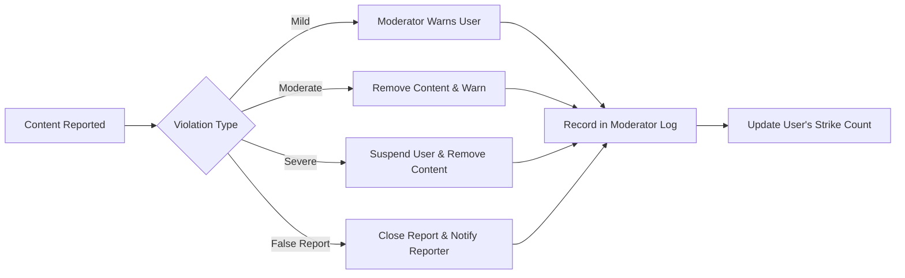
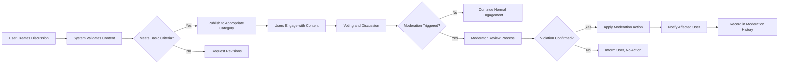

# Business Rules for Economic/Political Discussion Board

This document outlines the comprehensive business rules that govern the behavior of the economic/political discussion board platform. These rules define the constraints, policies, and operational guidelines that ensure civil discourse, maintain content quality, and provide a structured environment for users to engage in political and economic discussions.

## Business Model Context

### Why This Service Exists
THE economic/political discussion board SHALL create a structured environment for meaningful discourse on socioeconomic and political topics. IF unmoderated discussions lead to toxic environments, THEN THE system SHALL implement tiered user roles and moderation capabilities to maintain civil discourse. IF important discussions become buried in content overload, THEN THE system SHALL implement voting mechanisms and intelligent sorting to highlight valuable contributions.

WHILE misinformation spreads easily in online forums, THE system SHALL encourage evidence-based discussions by providing citation tools and content verification features. WHEN users encounter conflicting viewpoints, THE system SHALL structure conversations to promote understanding rather than confrontation.

### Revenue Strategy
WHILE the core discussion functionality SHALL remain free to access, THE system SHALL implement a freemium model with premium features for power users and organizations. WHERE user engagement reaches significant scale, THE system SHALL generate revenue through premium subscriptions, sponsored research partnerships, targeted non-intrusive advertising, and grants from foundations supporting democratic discourse.

### Growth Plan
THE system SHALL pursue user acquisition through organic growth, partnerships with educational institutions, strategic content marketing focused on the value of civil discourse, and integration with existing academic and policy research networks.

### Success Metrics
THE system SHALL measure success through key performance indicators including daily active users, average session duration, discussions created per day, comments per discussion, user retention, report resolution time, and user satisfaction score as specified in the service overview.

## Content Rules

### Content Creation and Ownership
THE system SHALL allow users to create discussions on economic or political topics following specific guidelines to ensure quality and relevance. Discussions must be substantive and contribute to meaningful discourse rather than serving as platforms for personal attacks or superficial commentary.

THE system SHALL ensure that all content submitted by users is owned by the original author while granting the platform a non-exclusive license to host and distribute the content for the purpose of the discussion board.

THE system SHALL require that all discussions have a clear, descriptive title that accurately reflects the content.

THE system SHALL limit discussion titles to 100 characters maximum.

THE system SHALL require that discussion bodies contain at least 200 characters of meaningful content.

### Content Categories
WHEN a user creates a new discussion, THE system SHALL require them to classify the topic into one of the predefined categories:
- Fiscal Policy
- Monetary Policy
- International Relations
- Domestic Policy
- Political Theory
- Economic Systems
- Elections and Voting
- Government Structure

### Discussion Lifecycle
THE system SHALL maintain discussions indefinitely unless removed through moderation or user deletion.

THE system SHALL allow the original author to delete their own discussions within 7 days of creation.

THE system SHALL permanently preserve discussions after 7 days, making them read-only and preventing deletion by the author.

THE system SHALL allow moderators to archive discussions that are no longer actively contributing to meaningful discourse.

THE system SHALL display archived discussions with a clear visual indicator.

WHEN a discussion is identified as containing false information or disinformation, THE system SHALL allow moderators to attach fact-checking notes and expert commentary.

### Content Standards
THE system SHALL prohibit content that includes:
- Personal attacks or ad hominem arguments
- Hate speech or discriminatory language
- Unfounded conspiracy theories
- Deliberate misinformation
- Copyrighted material without proper citation
- Illegal content

THE system SHALL require users to support factual claims with citations to reputable sources when possible.

THE system SHALL encourage users to distinguish between factual statements and opinions.

THE system SHALL require discussions to focus on policy, systems, and ideas rather than personal attacks on political figures.

## User Behavior Rules

### Account Management
THE system SHALL allow users to create accounts using email registration.

THE system SHALL require email verification before allowing users to post content.

THE system SHALL require users to choose a display name during registration.

THE system SHALL restrict display names to alphanumeric characters and spaces only.

THE system SHALL prevent users from impersonating public figures or institutions in their display names.

WHEN a user attempts to create a display name that could cause confusion with an existing user, THE system SHALL require disambiguation.

### Posting Frequency and Rate Limiting
THE system SHALL limit users to 5 new discussions per 24-hour period.

THE system SHALL limit users to 20 comments per 24-hour period.

THE system SHALL implement progressive rate limiting for users who receive multiple moderation actions.

THE system SHALL limit guest users from creating discussions, posting comments, or voting on content to maintain accountability.

### Editing and Revision
THE system SHALL allow users to edit their own discussions and comments within 12 hours of posting.

THE system SHALL display a visual indicator when a discussion or comment has been edited.

THE system SHALL maintain a revision history for all edits to discussions.

THE system SHALL prevent users from changing the fundamental argument of a discussion after it has received multiple responses.

WHEN a user attempts to submit a new discussion, THE system SHALL validate the content with length requirements of 50 to 10,000 characters and publish it immediately upon validation pass.

### Account Status and Suspension
IF a user accumulates three serious moderation violations within a 30-day period, THEN THE system SHALL temporarily suspend the account for 7 days.

IF a user repeatedly violates community guidelines after returning from suspension, THEN THE system SHALL consider permanent banning.

THE system SHALL allow banned users to appeal their status through a formal review process.

## Moderation Policies

### Moderator Authority
WHERE moderator role, THE system SHALL grant authority to perform the following actions:
- Remove inappropriate content
- Issue warnings to users
- Temporarily suspend user accounts
- Lock discussions that have become unproductive or hostile
- Highlight exemplary contributions
- Attach fact-checking information to discussions
- Merge duplicate discussions on the same topic

THE system SHALL allow trusted community members to report content that appears to violate guidelines, providing categories such as harassment, misinformation, spam, or rule violation.

THE system SHALL notify relevant moderators based on topic categories when content is reported.

IF harmful content is identified, THEN THE system SHALL allow moderators to take actions such as editing, hiding, or deleting content while preserving discussion integrity.

### Moderation Levels
THE system SHALL implement a tiered moderation system with three levels of severity:

1. **Warning**: For minor violations (e.g., slightly uncivil language)
   - THE system SHALL record the warning in the user's moderation history
   - THE system SHALL notify the user of the warning

2. **Content Removal**: For serious violations (e.g., personal attacks, misinformation)
   - THE system SHALL remove the offending content
   - THE system SHALL provide a clear explanation for removal
   - THE system SHALL notify the user and record the action

3. **Temporary Suspension**: For repeated or severe violations
   - THE system SHALL prevent the user from posting for a defined period
   - THE system SHALL provide specific guidelines for returning to good standing

### User Reporting System
THE system SHALL allow users to report inappropriate content through a streamlined process.

WHEN a user reports content, THE system SHALL:
1. Record the report with timestamp and reason
2. Notify moderators of the report
3. Allow the reporting user to provide additional context
4. Prevent the reporting user from making duplicate reports on the same content

THE system SHALL categorize reports into types:
- Uncivil discourse
- Factual inaccuracy
- Personal attacks
- Off-topic content
- Spam
- Other (with user explanation)

THE system SHALL prioritize reports based on severity and number of users reporting the same content.

### Moderation Response Time
THE system SHALL require moderators to acknowledge reports within 24 hours.

THE system SHALL require resolution of high-severity reports within 72 hours.

THE system SHALL provide users with status updates on their reports.

THE system SHALL allow users to appeal moderation decisions through a formal process.

### Conflict of Interest
THE system SHALL require moderators to recuse themselves from moderating discussions where they have a direct personal or professional interest.

THE system SHALL maintain transparency by recording moderator recusals.

THE moderation system SHALL follow this workflow:

## Voting Constraints

### Voting Mechanism
THE system SHALL implement a double voting system for each piece of content:

1. **Quality Vote**: Assesses the quality of the argument
   - Excellent (well-reasoned, evidence-based)
   - Good (reasonable argument)
   - Poor (weak argument, lacking evidence)
   - Uncivil (personal attacks, inappropriate language)

2. **Agreement Vote**: Assesses personal agreement with the position
   - Strongly Agree
   - Agree
   - Disagree
   - Strongly Disagree

THE system SHALL allow registered users to vote on discussions and comments.

WHEN a user votes on content, THE system SHALL prevent the user from voting on their own content.

THE system SHALL display the current net vote count for each discussion and comment.

### Vote Requirements
THE system SHALL require users to have a verified account to cast votes.

THE system SHALL require users to have read a discussion or comment before voting on it.

THE system SHALL prevent users from voting on their own content.

THE system SHALL allow users to change their vote within 24 hours of casting it.

THE system SHALL prevent users from voting multiple times on the same content.

### Vote Visibility and Aggregation
THE system SHALL display the aggregate quality scores for discussions and comments.

THE system SHALL display agreement distributions as percentages rather than raw vote counts to prevent bandwagon effects.

THE system SHALL hide individual users' votes to prevent social pressure.

THE system SHALL allow users to view the voting history of content creators as a trust metric.

### Voting Impact
THE system SHALL use quality scores to influence content visibility in discussion threads.

THE system SHALL highlight content with exceptionally high quality scores.

THE system SHALL allow users to filter content by minimum quality score.

THE system SHALL consider quality scores in moderator prioritization of content reviews.

THE system SHALL calculate a reputation score for each user based on community feedback from votes received on their content.

## Business Rules Summary

### Core Principles
The discussion board operates on several core principles that guide all business rules:

1. **Civil Discourse**: Promoting respectful exchange of ideas over confrontation
2. **Evidence-Based Discussion**: Encouraging factual accuracy and citation of sources
3. **Quality over Popularity**: Prioritizing argument quality over agreement metrics
4. **Transparency**: Making moderation processes and voting systems clear to users
5. **Accountability**: Ensuring users are responsible for their contributions

### User Journey Alignment
THE system SHALL ensure that business rules support the user journey from guest to active participant to trusted contributor. Rules are designed to lower barriers to entry while gradually introducing more responsibility as users become more engaged.

### Business Logic Flow
The following Mermaid diagram illustrates the core business logic flow for content submission and moderation:

### Data Flow Constraints
THE system SHALL ensure that user data is handled in compliance with privacy regulations.

THE system SHALL anonymize voting data for analysis purposes.

THE system SHALL provide users with the ability to export their contribution history.

THE system SHALL provide users with the ability to delete their account and associated personal data.

### Business Rule Enforcement
THE system SHALL implement automated validation for certain business rules at the application level.

THE system SHALL use machine learning algorithms to flag potential violations for moderator review.

THE system SHALL provide administrators with dashboards to monitor rule compliance and system health.

THE system SHALL generate regular reports on business rule effectiveness and community health metrics.

### Future Business Rule Considerations
- Implementation of reputation systems based on consistent high-quality contributions
- Introduction of structured debate formats with timed responses
- Development of topic expertise verification for certain discussion areas
- Integration with fact-checking databases for automated source verification

> *Developer Note: This document defines **business requirements only**. All technical implementations (architecture, APIs, database design, etc.) are at the discretion of the development team.*