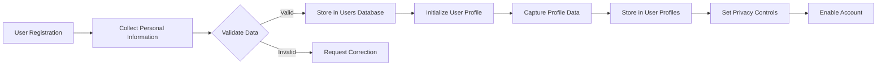
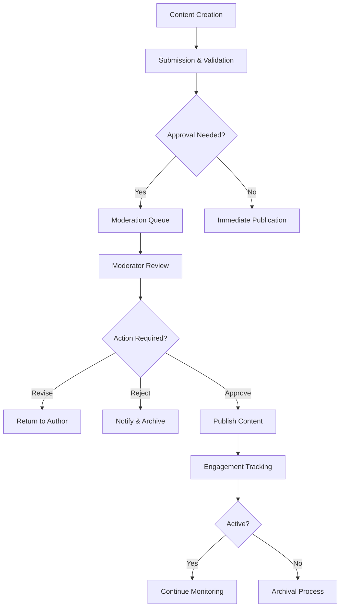
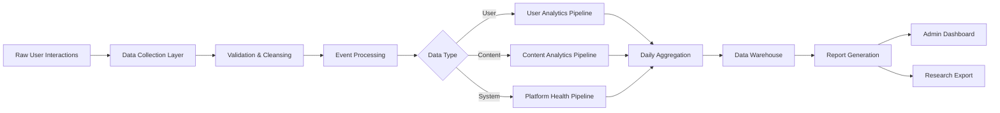
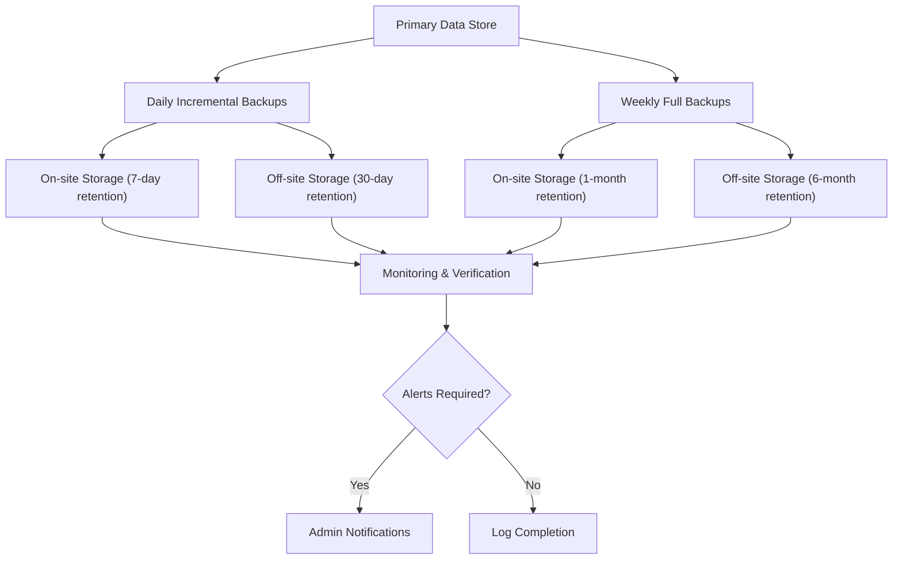

# Data Flow and Lifecycle Management

## User Data Flow

THE system SHALL collect user registration information (email, password hash, creation timestamp) at account creation.

WHEN a user registers, THE system SHALL store their authentication credentials using industry-standard hashing (bcrypt) in the users database.

THE system SHALL capture user profile data (username, biography, topic interests) in the user_profiles table upon profile completion.

WHEN a user participates in discussions, THE system SHALL record their contributions (discussion posts, comments, votes) in the user_activity_log with timestamps.

THE system SHALL maintain session data (JWT tokens, last active timestamp) in secure storage for authentication purposes.

WHEN a user updates their preferences, THE system SHALL synchronize these settings across all relevant services through the user_preferences topic.

THE system SHALL transmit user engagement data to the analytics service through encrypted channels for processing.

WHEN a user requests data export, THE system SHALL compile their complete contribution history and personal data into a standardized format within 24 hours.

IF a user deletes their account, THEN THE system SHALL initiate data anonymization procedures for all their contributions while maintaining aggregated analytics data.

## Content Lifecycle

WHEN a user creates a discussion, THE system SHALL validate the content against community guidelines before publication.

THE system SHALL assign unique identifiers to all discussions and store metadata (title, category, author, timestamp) in the discussions table.

WHEN a discussion receives comments, THE system SHALL maintain the conversation thread structure in the comments database with parent-child relationships.

THE system SHALL apply moderation rules to all content, flagging potentially problematic submissions for review based on automated analysis.

WHEN a moderator takes action on content, THE system SHALL record the decision, rationale, and timestamp in the moderation_log table.

THE system SHALL track content engagement metrics (views, votes, replies) in real-time and update the content_popularity_index accordingly.

WHEN content becomes inactive (no activity for 90 days), THE system SHALL move it to archival storage while maintaining search accessibility.

THE system SHALL purge deleted content from primary storage after 30 days, retaining only anonymized analytics data.

THE system SHALL implement content versioning for edited discussions and comments, preserving previous versions for transparency.

WHEN a user reports content, THE system SHALL create a moderation_task with priority based on reporter reputation and violation severity.

## Analytics Pipeline

THE system SHALL collect raw interaction data (views, clicks, time on page) from user sessions for analytics processing.

WHEN users contribute content, THE system SHALL capture metrics on discussion quality, engagement depth, and civil discourse indicators.

THE system SHALL process daily aggregates of user activity, content performance, and platform health metrics.

THE system SHALL generate weekly reports on key performance indicators including active users, discussion creation rates, and moderation statistics.

WHEN generating analytics reports, THE system SHALL anonymize personal data to protect user privacy while preserving meaningful trends.

THE system SHALL calculate user reputation scores based on community feedback, contribution quality, and civil discourse metrics.

THE system SHALL identify trending topics by analyzing discussion volume, engagement velocity, and cross-topic connections.

THE system SHALL monitor discourse quality indicators including ratio of constructive to non-constructive comments and moderation intervention rates.

THE system SHALL provide administrators with dashboards showing real-time platform metrics and historical trends.

THE system SHALL export anonymized dataset snapshots monthly for external research on political and economic discourse patterns.

## Backup Strategy

THE system SHALL perform daily incremental backups of all user data and discussion content.

THE system SHALL conduct weekly full backups of the entire database with encryption at rest.

WHEN performing backups, THE system SHALL store copies in geographically distributed locations for disaster recovery.

THE system SHALL maintain backup retention periods of 30 days for incremental backups and 6 months for full backups.

THE system SHALL implement point-in-time recovery capabilities to restore data to any moment within the last 7 days.

WHEN a data corruption event occurs, THE system SHALL initiate recovery procedures following the documented disaster recovery plan.

THE system SHALL conduct quarterly backup restoration drills to verify data integrity and recovery time objectives.

THE system SHALL encrypt all backup data using AES-256 encryption to protect against unauthorized access.

THE system SHALL maintain detailed logs of all backup operations, including success/failure status and duration.

THE system SHALL notify administrators of backup failures immediately through multiple alert channels.

> *Developer Note: This document defines **business requirements only**. All technical implementations (architecture, APIs, database design, etc.) are at the discretion of the development team.*