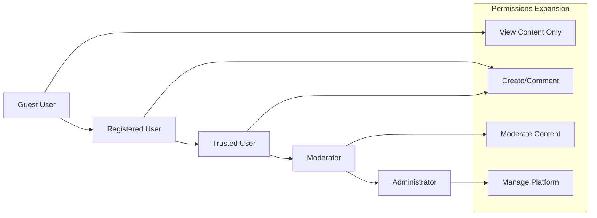
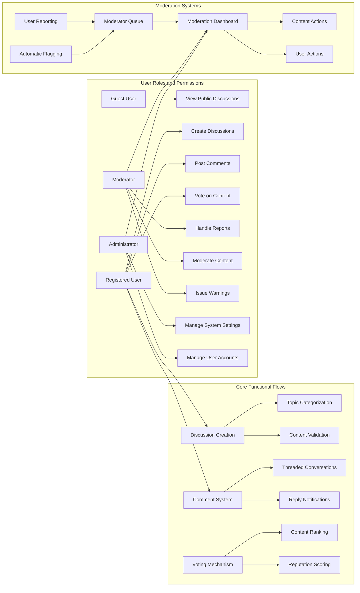
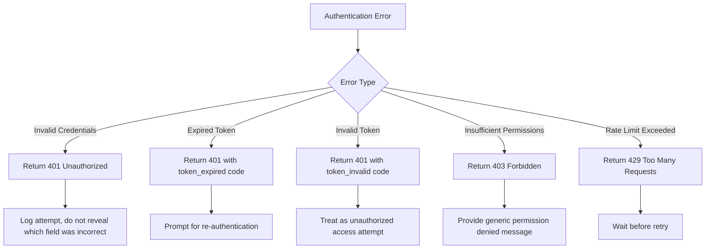

# Requirements Analysis Report: Economic/Political Discussion Board

## 1. Service Overview and Business Model

### Why This Service Exists
The economic/political discussion board fills a critical gap in the digital public discourse landscape, providing a structured platform for civil conversations on socioeconomic and political issues. As online discourse becomes increasingly polarized and toxic, this platform creates a space for users to engage in meaningful dialogue, share diverse perspectives, and deepen their understanding of complex societal challenges. The service counters the trend of unproductive online arguments by implementing structural incentives for constructive participation, evidence-based reasoning, and respectful disagreement.

The platform differentiates itself from existing social media by focusing exclusively on quality discussion rather than engagement metrics. While platforms like Reddit or Twitter host political discussions, they often lack the specialized features needed to support high-quality socioeconomic discourse. Our solution combines academic rigor with community engagement, creating a unique space between academic journals and general social media for substantive dialogue accessible to the general public.

### Target Users
The discussion board serves multiple user segments with varying levels of engagement and expertise:
- General citizens interested in political and economic issues
- Students and academics studying social sciences
- Policy professionals and public sector employees
- Journalists and media professionals
- Educators using the platform for teaching civic discourse

### Revenue Strategy
The platform follows a sustainable business model that supports long-term operation while maintaining independence and editorial integrity:

WHILE the core discussion functionality SHALL remain free to access, THE system SHALL generate revenue through:
- Premium subscriptions ($9.99/month) offering ad-free experience, advanced analytics, and exclusive content
- Institutional subscriptions ($99/month) for universities, think tanks, and media organizations with administrative controls
- Sponsored research partnerships with academic institutions studying public discourse patterns
- Non-intrusive, contextually relevant advertising focused on educational and civic organizations
- Grants from foundations supporting democratic discourse and public education

THE system SHALL prioritize user experience and discourse quality over monetization, delaying aggressive revenue generation until achieving critical user engagement metrics.

### Growth Plan
THE system SHALL pursue organic growth through:
- Partnerships with educational institutions for academic use
- Strategic content marketing focused on civil discourse and civic education
- Integration with academic and policy research networks
- Community-driven organic growth via user referrals and content sharing

WHERE user engagement reaches threshold levels, THE system SHALL expand category offerings and introduce specialized discussion formats. WHILE building community trust, THE system SHALL gradually introduce additional user roles and privileges based on contribution quality and length of participation.

### Success Metrics
THE system SHALL measure success through comprehensive key performance indicators:

| Metric | Target | Measurement Frequency |
|--------|--------|---------------------|
| Daily Active Users | 5,000 within 12 months | Daily |
| Average Session Duration | 12 minutes | Daily |
| Discussions Created per Day | 200 | Daily |
| Comments per Discussion | 8 | Daily |
| User Retention (30-day) | 45% | Weekly |
| Report Resolution Time | < 4 hours | Daily |
| User Satisfaction Score | 4.2/5.0 | Monthly |

THE system SHALL track these metrics to evaluate platform health and identify areas for improvement. WHEN metrics indicate specific challenges, THE system SHALL trigger review processes to consider feature adjustments or policy changes.

## 2. User Roles and Permission Matrix

### User Role Hierarchy
The following Mermaid diagram illustrates the user role progression pathway and permission expansion:



### Guest User
Guest users are unauthenticated visitors with limited access to public content.

THE system SHALL allow guest users to:
- View public discussion topics
- Read existing discussion threads and comments
- Search through public content
- View user profiles (limited information)
- Access registration and login pages

WHEN a guest user attempts to create content, THE system SHALL restrict access to posting functionality and redirect to login page.

### Registered User
Registered users are authenticated members who can actively participate in discussions.

THE system SHALL allow registered users to:
- Create new discussion topics in appropriate categories
- Post comments in existing threads
- Edit their own content within 24 hours of posting
- Delete their own content
- Vote on discussions and comments
- Report inappropriate content to moderators
- Follow specific topics or users
- Receive notifications for replies to their content
- Update their user profile information
- Change their account password

### Moderator
Moderators are trusted users with responsibility for maintaining civil discourse.

THE system SHALL allow moderators to:
- Review and take action on user-reported content
- Edit or remove inappropriate content from any user
- Issue warnings to users who violate guidelines
- Temporarily suspend users for severe violations
- Pin important discussions to the top of categories
- Close discussions that have become unproductive
- Access moderator dashboard with reporting analytics
- View user posting history for context during moderation

### Administrator
Administrators have complete control over the platform's operation.

THE system SHALL allow administrators to:
- Create, modify, and delete discussion categories
- Configure platform-wide settings and policies
- Manage user accounts (suspend, ban, restore)
- Assign and remove moderator roles
- Access complete system analytics and reports
- Perform bulk content management operations
- Configure automated content filters
- Manage platform integrations and APIs
- Access complete audit logs
- Initiate platform maintenance or updates

### Permission Matrix

| Action | Guest User | Registered User | Moderator | Administrator |
|--------|------------|-----------------|----------|---------------|
| View public discussions | ✅ | ✅ | ✅ | ✅ |
| Create discussion topic | ❌ | ✅ | ✅ | ✅ |
| Post comments | ❌ | ✅ | ✅ | ✅ |
| Edit own content | ❌ | ✅ | ✅ | ✅ |
| Delete own content | ❌ | ✅ | ✅ | ✅ |
| Vote on content | ❌ | ✅ | ✅ | ✅ |
| Report content | ❌ | ✅ | ✅ | ✅ |
| Search content | ✅ | ✅ | ✅ | ✅ |
| View user profiles | ✅ | ✅ | ✅ | ✅ |
| Edit profile information | ❌ | ✅ | ✅ | ✅ |
| Review reported content | ❌ | ❌ | ✅ | ✅ |
| Remove inappropriate content | ❌ | ❌ | ✅ | ✅ |
| Issue user warnings | ❌ | ❌ | ✅ | ✅ |
| Suspend users temporarily | ❌ | ❌ | ✅ | ✅ |
| Permanently ban users | ❌ | ❌ | ❌ | ✅ |
| Create discussion categories | ❌ | ❌ | ❌ | ✅ |
| Configure platform settings | ❌ | ❌ | ❌ | ✅ |
| Assign moderator roles | ❌ | ❌ | ❌ | ✅ |
| Access complete audit logs | ❌ | ❌ | ❌ | ✅ |
| Perform system maintenance | ❌ | ❌ | ❌ | ✅ |
| Access emergency protocols | ❌ | ❌ | ❌ | ✅ |

## 3. Functional Requirements

### Discussion Management

THE system SHALL provide a platform for structured economic and political discussions.

WHEN a user creates a new discussion thread, THE system SHALL require a descriptive title, category classification, and initial content explaining the topic.

THE system SHALL require discussion titles to be between 10 and 150 characters.

THE system SHALL require discussion content to be between 50 and 10,000 characters.

WHEN a user submits a new discussion, THE system SHALL validate the content and publish it immediately.

THE system SHALL allow discussions to be categorized by topic (economic policy, foreign relations, domestic issues, elections, etc.).

THE system SHALL automatically generate a unique URL slug from the discussion title for SEO and sharing purposes.

WHEN a user navigates to a discussion page, THE system SHALL load the complete discussion content and all associated comments.

THE system SHALL display a preview of each discussion including title, author, creation date, number of comments, vote count, and topic category.

THE system SHALL display the full discussion title, content, author, creation timestamp, last edited timestamp (if applicable), vote count, and comment count.

THE system SHALL highlight the discussion as "hot" IF it has received more than 50 interactions (comments or votes) in the past 24 hours.

THE system SHALL display a "sticky" indicator IF the discussion has been marked as important by moderators or administrators.

THE system SHALL allow discussion authors to edit their own discussions within 24 hours of initial posting.

WHEN a user edits a discussion, THE system SHALL update the content and set the "last edited" timestamp.

THE system SHALL display an "edited" indicator with the timestamp when a discussion has been modified.

THE system SHALL prevent editing of the main discussion content after 24 hours.

THE system SHALL allow administrators to edit any discussion at any time for moderation purposes.

THE system SHALL allow discussion authors to delete their own discussions.

WHEN a user deletes their discussion, THE system SHALL remove it from public view.

THE system SHALL maintain deleted discussions in a soft-delete state for audit purposes.

THE system SHALL prevent deletion of discussions that have received more than 50 comments.

THE system SHALL only allow deletion of discussions with more than 50 comments by moderators or administrators.

WHEN a moderator or administrator deletes a discussion, THE system SHALL provide a deletion reason visible to the author.

THE system SHALL provide a search function to find discussions by keywords.

WHEN a user submits a search query, THE system SHALL return results instantly with relevance ranking.

THE system SHALL support filtering discussions by topic category, date range, author, and popularity.

THE system SHALL provide a "trending topics" section highlighting frequently discussed themes.

THE system SHALL recommend related discussions based on content similarity when viewing a discussion.

THE system SHALL allow users to subscribe to topics of interest for notifications of new discussions.

### Comment System

THE system SHALL allow registered users to post comments on discussions.

WHEN a user submits a comment, THE system SHALL validate the content and publish it immediately.

THE system SHALL limit comments to 2,000 characters maximum.

THE system SHALL require comments to be at least 10 characters to prevent spam or frivolous responses.

THE system SHALL allow nested replies to comments up to 5 levels deep.

WHEN a user replies to a comment, THE system SHALL create a threaded conversation structure.

IF a user attempts to post identical content to the same discussion within 5 minutes, THEN THE system SHALL treat it as spam and block the submission.

THE system SHALL display comments in chronological order, oldest first, within each discussion.

THE system SHALL implement infinite scroll for long comment threads instead of pagination.

THE system SHALL visually distinguish direct replies to the main discussion from nested comments.

THE system SHALL highlight comments that have received more than 10 upvotes as "popular".

THE system SHALL collapse comment threads with more than 20 replies by default, with an option to expand.

THE system SHALL provide a "jump to new comments" feature for users returning to active discussions.

THE system SHALL display comment author, submission timestamp, vote count, and reply count for each comment.

THE system SHALL allow comment authors to edit their own comments within 2 hours of initial submission.

WHEN a user edits a comment, THE system SHALL update the content and set an "edited" indicator.

THE system SHALL prevent further editing of comments after 2 hours to preserve conversation context.

THE system SHALL allow moderators to edit comments for rule violations or clarity.

WHEN a moderator edits a comment, THE system SHALL preserve the original content for audit purposes.

THE system SHALL allow comment authors to delete their own comments.

WHEN a user deletes their comment, THE system SHALL replace it with a "deleted" placeholder.

THE system SHALL maintain deleted comment content in a soft-delete state for audit purposes.

THE system SHALL allow moderators to delete comments that violate community guidelines.

WHEN a moderator deletes a comment, THE system SHALL record the reason and make it visible to the comment author.

THE system SHALL prevent deletion of comments that have received replies to maintain conversation context.

THE system SHALL notify the discussion author when a new comment is posted.

THE system SHALL notify comment authors when someone replies to their comment.

THE system SHALL provide users with notification preferences for comment activity.

THE system SHALL implement a "mute thread" feature to stop notifications for specific discussions.

THE system SHALL batch notifications during high-activity periods to prevent overwhelming users.

### Voting Mechanism

THE system SHALL allow registered users to vote on discussions and comments.

WHEN a user votes on content, THE system SHALL record the vote type (upvote or downvote) and timestamp.

THE system SHALL allow only one vote per user per piece of content.

IF a user attempts to vote multiple times on the same content, THEN THE system SHALL update the existing vote instead of creating a new one.

THE system SHALL prevent users from voting on their own content.

THE system SHALL allow users to change their vote (from upvote to downvote or vice versa) at any time.

THE system SHALL display the current net vote count (upvotes minus downvotes) for each discussion and comment.

THE system SHALL use vote counts as a primary factor in discussion ranking on listing pages.

THE system SHALL consider high vote count discussions more likely to be "trending".

THE system SHALL incorporate vote counts into personalized content recommendations.

WHEN a discussion receives a high volume of downvotes, THE system SHALL flag it for moderator review.

THE system SHALL incorporate voting patterns into user reputation scoring.

THE system SHALL treat rapid downvoting from multiple new accounts as potential vote manipulation.

THE system SHALL display only the net vote count to regular users.

THE system SHALL hide the specific breakdown of upvotes and downvotes from regular users.

THE system SHALL allow moderators and administrators to view vote breakdowns for investigation purposes.

THE system SHALL implement vote hiding for content that receives rapid downvotes to prevent bandwagon effects.

THE system SHALL display a "controversial" indicator when content has received more than 20 upvotes and more than 20 downvotes.

### Content Moderation

THE system SHALL provide a "report" button on each discussion and comment.

WHEN a user reports content, THE system SHALL present reporting categories (harassment, misinformation, spam, rule violation, etc.).

THE system SHALL require users to provide a brief explanation when reporting content.

THE system SHALL limit users to 5 reports per day to prevent abuse of the reporting system.

WHEN a user submits a report, THE system SHALL add it to a moderator queue and notify the reporting user of receipt.

IF a user's reports are frequently dismissed by moderators, THEN THE system SHALL reduce the priority of their future reports.

THE system SHALL provide moderators with a dashboard showing all pending reports.

THE system SHALL prioritize reports based on severity, number of reports for the same content, and reporter reputation.

THE system SHALL display reported content with context (surrounding comments, user history) to moderators.

THE system SHALL allow moderators to take actions on reported content (approve, edit, warn user, suspend user, delete content).

WHEN a moderator takes action, THE system SHALL notify the content author and the reporting user.

THE system SHALL maintain a complete audit log of all moderation actions with timestamps and reasons.

THE system SHALL allow moderators to issue user warnings for minor violations.

THE system SHALL automatically flag discussions or comments containing banned keywords.

THE system SHALL flag content with excessive capitalization (more than 50% of characters in caps) as potentially aggressive.

THE system SHALL flag content with more than 3 consecutive exclamation points or question marks.

THE system SHALL flag posts with identical content across multiple discussions as potential spam.

THE system SHALL flag rapid posting (more than 10 posts in 5 minutes) by a single user.

THE system SHALL flag content containing hyperlinks to known malicious domains.

THE system SHALL flag discussions with high downvote velocity as potentially controversial or problematic.

THE system SHALL allow moderators to issue formal warnings to users for rule violations.

WHEN a user receives a warning, THE system SHALL send a notification and record it in their profile.

THE system SHALL allow moderators to temporarily suspend users for severe violations.

THE system SHALL enforce escalating consequences: first warning, then 24-hour suspension, then 7-day suspension, then permanent ban.

THE system SHALL allow administrators to permanently ban users for egregious violations.

THE system SHALL prevent banned users from creating new accounts using previously associated email addresses.

THE system SHALL allow users to appeal moderation decisions through a formal process.

### User Profile Features

THE system SHALL create a profile for each registered user.

THE system SHALL display user profiles including username, join date, and post statistics.

THE system SHALL show the number of discussions created, comments posted, and votes cast on user profiles.

THE system SHALL display user reputation score on profiles.

THE system SHALL allow users to add a brief bio (maximum 500 characters) to their profile.

THE system SHALL allow users to link their professional affiliations or credentials.

THE system SHALL prevent users from changing their username more than once per month.

THE system SHALL calculate a reputation score for each user based on community feedback.

THE system SHALL increase user reputation when their content receives upvotes.

THE system SHALL decrease user reputation when their content receives downvotes.

THE system SHALL increase user reputation for receiving replies to their comments (indicating engagement).

THE system SHALL decrease user reputation for having content removed by moderators.

THE system SHALL use reputation scores to influence the visibility of user contributions.

THE system SHALL grant increased privileges (such as reduced moderation scrutiny) to users with high reputation.

THE system SHALL maintain a public activity feed on each user profile.

THE system SHALL record all user discussions, comments, and votes (except when reversed) in their activity feed.

THE system SHALL allow users to filter their activity feed by content type.

THE system SHALL display recent activity including timestamps and content links.

THE system SHALL allow users to delete their own comments, which will be reflected in the activity feed.

THE system SHALL maintain deleted content references in the activity feed with a "deleted" status.

### Cross-Cutting Requirements

THE system SHALL support simultaneous active users up to 10,000 without degradation of performance.

THE system SHALL maintain responsiveness during peak political events when traffic may increase by 10x.

WHEN a user loads the discussion listing page, THE system SHALL display the first 20 discussions within 2 seconds.

WHEN a user navigates to a discussion page, THE system SHALL load the main discussion content within 1.5 seconds.

WHEN a user submits new content (discussion or comment), THE system SHALL confirm receipt and display the content within 3 seconds.

WHEN a user searches for content, THE system SHALL return results instantly (within 1 second) for queries up to 3 keywords.

WHEN a user attempts to access a deleted discussion, THE system SHALL display a meaningful error message explaining the content is no longer available.

WHEN a user experiences a failed submission, THE system SHALL return specific validation errors explaining what needs correction.

IF a user session expires during content composition, THEN THE system SHALL preserve their draft content for recovery.

WHEN a moderation action is taken on content a user is viewing, THE system SHALL update the display to reflect the change without requiring a page refresh.

IF the voting system is temporarily unavailable, THEN THE system SHALL queue votes for processing when service is restored.

WHEN a search query fails, THE system SHALL suggest alternative terms or display the most recent relevant content.



## 4. Authentication Requirements

### Core Authentication Functions
THE system SHALL implement these authentication capabilities for all user roles:

- Users can register with email and password
- Users can log in to access their account
- Users can log out to end their session
- System maintains user sessions securely
- Users can verify their email address
- Users can reset forgotten passwords
- Users can change their password
- Users can revoke access from all devices
- System detects and handles concurrent sessions
- Authentication attempts are rate-limited to prevent abuse

### JWT Token Structure
THE system SHALL use JWT (JSON Web Tokens) for session management with the following payload structure:

```json
{
  "userId": "string (UUID format)",
  "role": "string (enum: guestUser, registeredUser, moderator, administrator)",
  "permissions": "array of strings representing specific permissions",
  "iat": "number (issued at timestamp)",
  "exp": "number (expiration timestamp)",
  "emailVerified": "boolean"
}
```

Token expiration requirements:
- Access token: 15 minutes
- Refresh token: 7 days
- Refresh token rotation on each use
- Refresh token invalidation after logout
- Blacklist mechanism for compromised tokens

### Role-Based Access Control
THE system SHALL implement role-based access control with these principles:

- All API endpoints require authentication token verification
- Requested actions are validated against user's role permissions
- Users cannot escalate their own privileges
- Permission checks occur at the service layer, not just API gateway
- Failed permission attempts are logged for security audit
- Temporary permission elevation requires explicit approval
- Permission changes take effect immediately across all services

### Security Requirements
THE system SHALL meet these security standards for user authentication:

- Passwords stored with bcrypt or equivalent strong hashing
- HTTPS enforcement across all authentication endpoints
- Protection against common OAuth threats (CSRF, token leakage)
- Regular security audits of authentication systems
- Monitoring for suspicious login patterns
- Immediate notification of successful logins from new devices
- Account lockout after 5 failed login attempts
- Support for secure password recovery workflows

### Error Handling
THE system SHALL handle authentication errors appropriately:



> *Developer Note: This document defines **business requirements only**. All technical implementations (architecture, APIs, database design, etc.) are at the discretion of the development team.*