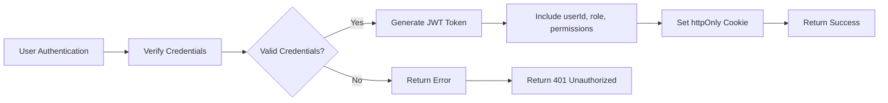
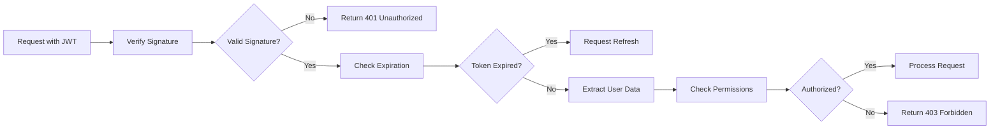

# User Roles and Authentication Requirements

## Authentication Requirements

### Core Authentication Functions
THE user authentication system SHALL provide secure registration, login, and account verification processes.

WHEN a user registers with email and password, THE system SHALL validate email format, verify password strength (minimum 8 characters with uppercase, lowercase, numeric, and special characters), hash the password using bcrypt, and create a new user account with member role.

WHEN a user registers, THE system SHALL assign the guest role until email verification is complete, then upgrade to member role upon verification.

WHEN a user submits registration information, THE system SHALL send a verification email containing a unique token link valid for 24 hours.

WHEN a user clicks the verification link, THE system SHALL validate the token, verify it has not expired, and upgrade the user's role from guest to member.

IF a user does not verify their email within 24 hours, THEN THE system SHALL allow the user to request a new verification email with appropriate rate limiting.

WHEN a user logs in, THE system SHALL verify credentials against the stored password hash, generate secure authentication tokens, and establish a user session.

WHEN a user logs in with unverified email, THEN THE system SHALL display a prompt requesting verification before allowing access to member-only features.

IF a user enters invalid login credentials, THEN THE system SHALL respond with generic error message to prevent account enumeration attacks.

IF a user fails to authenticate 5 consecutive times within 15 minutes, THEN THE system SHALL temporarily lock the account for 30 minutes to prevent brute force attacks.

WHEN a user requests password reset, THE system SHALL prompt for email or username, verify it exists in the system, and send a reset token to the registered email address.

THE password reset token SHALL expire after 1 hour of issuance or after single use.

WHEN a user accesses the reset link, THE system SHALL validate the token is valid and not expired, then allow the user to enter a new password.

THE password reset form SHALL require the new password to meet the same strength requirements as registration.

THE system SHALL require users to confirm their new password by entering it twice, and SHALL display an error if the passwords do not match.

AFTER successfully changing the password, THE system SHALL invalidate all existing sessions for that user and require re-authentication.

THE system SHALL maintain user sessions for up to 30 days of inactivity, after which the user SHALL need to re-authenticate.

THE system SHALL provide a "Remember Me" option during login that extends the session duration to 30 days regardless of activity.

THE system SHALL allow users to terminate all active sessions from account settings, which SHALL be particularly useful if they believe their account has been compromised.

## User Role Hierarchy

### Guest
THE guest role applies to unauthenticated users or authenticated users without verified email.

WHEN a user registers but has not verified their email, THE system SHALL assign the guest role until verification is complete.

THE guest role SHALL grant the following permissions:
- View public communities and posts
- Read comments on posts
- Browse community directories
- Access platform information and rules

THE guest role SHALL explicitly deny the following actions:
- Create posts (text, links, images)
- Comment on posts
- Vote on content
- Subscribe to communities
- Access personalized feeds
- Send private messages

### Member
THE member role applies to authenticated users who have verified their email address.

WHEN a user completes email verification, THE system SHALL upgrade their role from guest to member.

THE member role SHALL grant all permissions of the guest role PLUS:
- Create posts in public communities
- Create communities
- Comment on posts with nested replies
- Upvote and downvote posts and comments
- Subscribe to public and restricted communities
- Report inappropriate content
- Edit own posts and comments within 2 hours
- Delete own posts and comments
- Access personalized feed of subscribed communities
- View user profiles
- Send private messages

THE member role SHALL accumulate karma based on upvotes and downvotes received on their content.

THE system SHALL display the user's accumulated karma on their profile and in author contexts.

### Community Moderator
The community moderator role applies to members who have been granted moderation privileges for specific communities they created or were assigned to.

WHEN a user creates a new community, THE system SHALL automatically grant them the community moderator role for that community.

THE community moderator role SHALL grant all permissions of the member role PLUS:
- Remove posts and comments in their community that violate rules
- Add warning labels to posts and comments
- Ban users from their community temporarily or permanently
- Set and modify community rules
- Access community analytics and statistics
- Manage community settings (name, description, rules, type)
- Appoint other members as moderators
- Access reported content queue for their community
- Take action on reported content
- Set post flairs and categories
- Create community announcements
- Manage membership requests for restricted communities

THE system SHALL track all moderator actions in an audit log with timestamps and context.

THE community moderator role SHALL be specific to individual communities, allowing users to be moderators of some communities while remaining regular members in others.

### Admin
The admin role applies to platform staff with full system access.

THE admin role SHALL grant all permissions of members and community moderators across all communities PLUS:
- Manage all user accounts (view, suspend, ban, restore)
- Create and manage global platform rules
- View and manage all reported content across the platform
- Take action on any content (remove, restore, pin)
- Assign moderator roles to users
- Manage system-wide settings and configurations
- View platform analytics and metrics
- Create global announcements
- Manage advertising and monetization settings
- Manage platform integrations and API access
- Access to all moderation and administrative tools

## Permission Matrix

| Action | Guest | Member | Community Moderator | Admin |
|--------|-------|--------|-------------------|-------|
| View public communities | ✅ | ✅ | ✅ | ✅ |
| View private communities | ❌ | ❌ | ✅ | ✅ |
| Create community | ❌ | ✅ | ✅ | ✅ |
| Post text content | ❌ | ✅ | ✅ | ✅ |
| Post link content | ❌ | ✅ | ✅ | ✅ |
| Post image content | ❌ | ✅ | ✅ | ✅ |
| Upvote posts | ❌ | ✅ | ✅ | ✅ |
| Downvote posts | ❌ | ✅ | ✅ | ✅ |
| Upvote comments | ❌ | ✅ | ✅ | ✅ |
| Downvote comments | ❌ | ✅ | ✅ | ✅ |
| Comment on posts | ❌ | ✅ | ✅ | ✅ |
| Create nested replies | ❌ | ✅ | ✅ | ✅ |
| Edit own posts/comments | ❌ | ✅ | ✅ | ✅ |
| Delete own posts/comments | ❌ | ✅ | ✅ | ✅ |
| Subscribe to communities | ❌ | ✅ | ✅ | ✅ |
| View user profiles | ❌ | ✅ | ✅ | ✅ |
| Report content | ❌ | ✅ | ✅ | ✅ |
| View reported content | ❌ | ❌ | ✅ | ✅ |
| Moderate community posts | ❌ | ❌ | ✅ | ✅ |
| Moderate community comments | ❌ | ❌ | ✅ | ✅ |
| Set community rules | ❌ | ❌ | ✅ | ✅ |
| Manage community settings | ❌ | ❌ | ✅ | ✅ |
| Appoint community moderators | ❌ | ❌ | ✅ | ✅ |
| Manage all users | ❌ | ❌ | ❌ | ✅ |
| Manage global platform rules | ❌ | ❌ | ❌ | ✅ |
| Manage system settings | ❌ | ❌ | ❌ | ✅ |
| View platform analytics | ❌ | ❌ | ❌ | ✅ |
| Manage monetization | ❌ | ❌ | ❌ | ✅ |

## JWT Structure

THE system SHALL use JWT (JSON Web Tokens) for authentication and authorization.

THE access token SHALL expire after 30 minutes of inactivity.

THE refresh token SHALL expire after 7 days of inactivity.

THE system SHALL store tokens in httpOnly cookies to prevent XSS attacks.

THE JWT payload SHALL include the following claims:
- userId: string (UUID v4 format)
- role: string (one of: "guest", "member", "communityModerator", "admin")
- permissions: array of strings representing user capabilities
- iat: number (issued at timestamp in Unix format)
- exp: number (expiration timestamp in Unix format)

THE system SHALL sign JWT tokens using secure algorithm (HS256 or RS256) with a strong secret key managed securely.

THE system SHALL validate JWT signature on every request to protected resources.

THE system SHALL verify token expiration before granting access.

THE back-end system SHALL provide a refresh endpoint to obtain new access token using valid refresh token.

THE refresh token SHALL be invalidated after use to prevent replay attacks.

THE system SHALL implement secure JWT secret key management with regular rotation.

> *Developer Note: This document defines **business requirements only**. All technical implementations (architecture, APIs, database design, etc.) are at the discretion of the development team.*