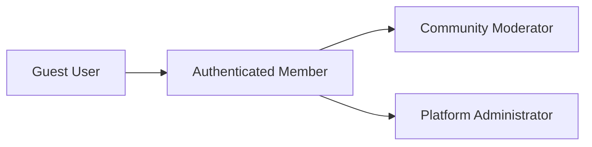
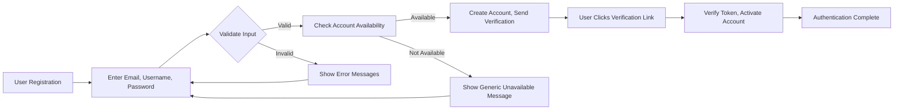
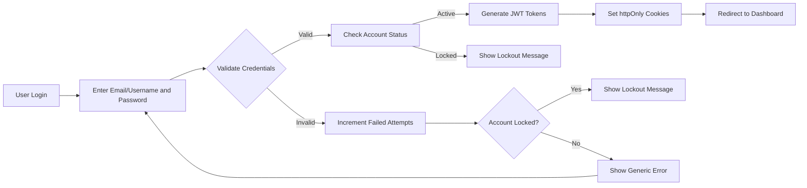
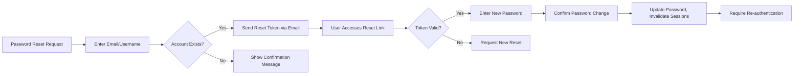
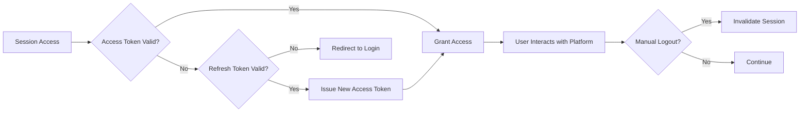

# User Authentication Requirements: Reddit-like Community Platform

## Service Overview

THE community platform SHALL provide secure user authentication services that enable users to register, log in, reset passwords, and maintain secure sessions. This system SHALL establish user identity and control access to platform features based on authenticated status and user roles.

### Authentication Context

The authentication system SHALL serve as the foundation for all user interactions with the platform. THE system SHALL verify user identity before granting access to community creation, content posting, commenting, voting, and other platform features that require user accountability.

Authentication SHALL be required for:
- Creating communities (subreddits)
- Posting content (text, links, images)
- Commenting on posts with nested replies
- Voting on posts and comments
- Subscribing to communities
- Reporting inappropriate content
- Managing user profiles and preferences

## User Roles and Authentication

### Role Hierarchy

THE system SHALL implement a four-tier role structure to govern user permissions and access:



### Role Definitions

**Guest (Unauthenticated)**:
- Can browse public communities and posts
- Can view comments on public posts
- Cannot create content or interact with platform features requiring accountability
- Has limited access to personalized features

**Member (Authenticated)**:
- Has all Guest permissions
- Can create posts in communities
- Can comment on posts with nested replies
- Can upvote and downvote content
- Can create and manage communities
- Can subscribe to communities
- Can report inappropriate content
- Accumulates karma based on engagement
- Has user profile displaying activity history

**Community Moderator**:
- Has all Member permissions
- Can moderate content within specific communities
- Can remove posts and comments violating community rules
- Can ban users from specific communities
- Can set community rules and guidelines
- Can manage community settings and appearance
- Can appoint other moderators

**Administrator**:
- Has all Moderator permissions
- Can manage all users and communities
- Can suspend or ban users from the entire platform
- Can override community moderation decisions
- Can manage platform-wide rules and settings

## Authentication Process

### User Registration

THE registration process SHALL allow prospective users to create accounts with verified email addresses.

WHEN a user accesses the registration interface, THE system SHALL present fields for email address, username, and password.

THE system SHALL validate that the email address is in proper format (local@domain.tld) according to RFC 5322 standards.

THE system SHALL validate that the username is 3-20 characters, contains only alphanumeric characters and underscores, and does not already exist in the system.

THE system SHALL validate that the password meets minimum security requirements of at least 8 characters, including uppercase, lowercase, numeric, and special characters.

WHEN a user submits valid registration information, THE system SHALL create a new user account with "member" role and password stored using bcrypt hashing with cost factor 12.

THE system SHALL generate a unique verification token with 24-hour expiration and send a verification email containing a confirmation link to the provided email address.

WHEN a user accesses the verification link, THE system SHALL verify the token validity, confirm the email address, and upgrade the account from unverified to fully active member status.

### Login Process

THE login process SHALL verify user credentials and establish secure sessions.

WHEN a user submits login credentials (email/username and password), THE system SHALL verify the account exists and the password matches the stored hash.

THE system SHALL implement rate limiting of maximum 5 login attempts per 15-minute window from the same IP address to prevent brute force attacks.

WHEN a user fails to log in 5 times within 15 minutes, THE system SHALL temporarily lock the account for 30 minutes and notify the user of the lockout.

WHEN a user provides valid credentials, THE system SHALL generate a JWT access token and refresh token for session management.

THE system SHALL set tokens in httpOnly cookies to protect against XSS attacks and provide secure authentication.

### Password Reset

THE password recovery process SHALL allow users to securely reset forgotten passwords.

WHEN a user requests password reset, THE system SHALL prompt for their email address or username.

IF the provided email/username exists in the system, THEN THE system SHALL generate a time-limited password reset token valid for 1 hour and send it to the user's registered email address.

WHEN a user accesses the reset link with a valid token, THE system SHALL present a secure interface to enter a new password.

THE system SHALL validate that the new password meets the same strength requirements as during registration.

WHEN a user successfully updates their password, THE system SHALL invalidate all existing login sessions and tokens to ensure security.

### Session Management

THE session system SHALL maintain user authentication state with secure token handling.

THE system SHALL implement JWT (JSON Web Tokens) for session management with the following specifications:
- Access token: 30 minutes expiration
- Refresh token: 7 days expiration
- Token storage: httpOnly cookies for enhanced security

THE JWT payload SHALL contain the following claims:
- userId: unique identifier for the user
- role: user's current role (member, moderator, admin)
- permissions: array of actions the user is authorized to perform
- iat: token issuance timestamp
- exp: token expiration timestamp

WHEN a user's access token expires, THE system SHALL allow token refresh using a valid refresh token without requiring full re-authentication.

THE system SHALL allow users to terminate all active sessions from security settings, which IS particularly useful if they believe their account has been compromised.

WHEN a user logs out, THE system SHALL invalidate the current session and remove authentication tokens from the browser.

## Security Requirements

THE authentication system SHALL implement multiple security measures to protect user accounts and platform integrity.

THE system SHALL use HTTPS with TLS 1.3 for all authentication-related communications to encrypt data in transit.

THE system SHALL implement CSRF protection for all state-changing authentication operations to prevent cross-site request forgery.

THE system SHALL protect against common vulnerabilities including:
- SQL injection through parameterized queries
- Cross-site scripting (XSS) through input sanitization
- Session fixation through random session identifiers
- Credential stuffing through rate limiting

THE system SHALL monitor for suspicious activity patterns, including rapid authentication attempts, access from multiple geolocations, and other indicators of compromised accounts.

## Business Rules

### Email Verification
THE system SHALL require email verification before granting full member privileges.

WHEN a user registers, THE system SHALL restrict account permissions to guest-level access until email verification is completed.

IF email verification is not completed within 7 days, THEN THE system SHALL send reminder emails on days 3 and 6 after registration.

IF email verification is not completed within 14 days, THEN THE system SHALL automatically deactivate the account, requiring the user to re-register.

### Account Recovery
THE system SHALL allow account recovery through verified email address only.

WHEN a user requests password reset for an unverified account, THEN THE system SHALL direct them to re-send the verification email instead.

THE system SHALL invalidate password reset tokens after single use to prevent replay attacks.

### User Privacy
THE system SHALL not expose whether an email address or username is already registered during registration to prevent account enumeration.

WHEN a user attempts to register with an existing email/username, THE system SHALL respond with a generic message such as "This email address is not available" without confirming account existence.

THE system SHALL not reveal the status of other users' accounts through authentication interfaces.

## Functional Requirements

### Core Authentication Functions

- Users can register with email and password
- Users can log in to access their account
- Users can log out to end their session
- System maintains user sessions securely
- Users can verify their email address
- Users can reset forgotten passwords
- Users can change their password
- Users can revoke access from all devices

These functions SHALL be implemented with proper validation, security measures, and user feedback mechanisms.

## Permission Matrix

| Action | Guest | Member | Community Moderator | Admin |
|--------|-------|--------|----------------------|-------|
| View public communities | ✅ | ✅ | ✅ | ✅ |
| View private communities | ❌ | ✅ | ✅ | ✅ |
| Create communities | ❌ | ✅ | ✅ | ✅ |
| Create posts | ❌ | ✅ | ✅ | ✅ |
| Create comments | ❌ | ✅ | ✅ | ✅ |
| Upvote content | ❌ | ✅ | ✅ | ✅ |
| Downvote content | ❌ | ✅ | ✅ | ✅ |
| Edit own content | ❌ | ✅ | ✅ | ✅ |
| Delete own content | ❌ | ✅ | ✅ | ✅ |
| Subscribe to communities | ❌ | ✅ | ✅ | ✅ |
| Report content | ❌ | ✅ | ✅ | ✅ |
| Moderate community content | ❌ | ❌ | ✅ | ✅ |
| Ban users from community | ❌ | ❌ | ✅ | ✅ |
| Manage community settings | ❌ | ❌ | ✅ | ✅ |
| Assign moderators | ❌ | ❌ | ✅ | ✅ |
| Manage all users | ❌ | ❌ | ❌ | ✅ |
| View platform analytics | ❌ | ❌ | ❌ | ✅ |
| Manage monetization | ❌ | ❌ | ❌ | ✅ |

## JWT Structure

THE authentication system SHALL use JWT tokens with the following structure:

```json
{
  "userId": "string (UUID v4)",
  "role": "string (member, communityModerator, admin)",
  "permissions": "array of strings",
  "iat": "number (issued at timestamp)",
  "exp": "number (expiration timestamp)"
}
```

The permission claims SHALL be pre-computed based on the user's role and any community-specific moderator status.

## User Scenarios

### Scenario 1: User Registration and Verification

1. User visits registration page and enters email, username, and password
2. System verifies input format and checks for existing accounts
3. System creates account with "member" role and sends verification email
4. User finds email and clicks the verification link
5. System validates the token and activates the user's full member privileges
6. User is redirected to platform with authenticated status



### Scenario 2: Login Process

1. User navigates to login page
2. User enters email/username and password
3. System verifies credentials and checks for account lockout
4. System generates JWT tokens and sets httpOnly cookies
5. System redirects user to their personalized feed
6. User begins interacting with the platform



### Scenario 3: Password Reset

1. User clicks "Forgot Password" on login page
2. User enters registered email address or username
3. System verifies account existence and sends reset token
4. User checks email and clicks the reset link
5. System verifies token validity and presents password change interface
6. User enters new password and confirms changes
7. System updates password and invalidates existing sessions
8. User logs in with new credentials



### Scenario 4: Session Management

1. User accesses platform and is automatically logged in via JWT cookie
2. After 30 minutes of inactivity, access token expires
3. System automatically uses refresh token to obtain new access token
4. User continues interacting with the platform without interruption
5. User manually logs out, invalidating current session
6. User visits security settings and terminates all devices
7. System invalidates all authentication tokens



### Scenario 5: Secure Account Recovery

1. User attempts to log in but cannot remember password
2. User requests password reset using registered email
3. System sends time-limited reset token to the email address
4. User accesses email on mobile device and clicks reset link
5. System validates token and allows password update
6. System confirms change and requires re-login
7. User logs in with new password successfully

## Error Handling

### Input Validation Errors

WHEN a user submits invalid registration information, THE system SHALL return specific validation error messages indicating which fields failed and their requirements.

WHEN a user's email address is invalid format, THE system SHALL display "Please enter a valid email address".

WHEN a user's username is too short, THE system SHALL display "Username must be at least 3 characters long".

WHEN a user's password does not meet requirements, THE system SHALL display specific messages for each missing requirement (uppercase, lowercase, number, special character).

### Authentication Errors

WHEN a user's login credentials are incorrect, THE system SHALL return generic error message "Invalid credentials" without specifying whether the email/username or password was incorrect to prevent account enumeration.

WHEN a user's account is locked due to excessive failed attempts, THE system SHALL display "Account temporarily locked. Please try again in 30 minutes."

WHEN a password reset token is invalid or expired, THE system SHALL direct users to request a new reset instead of providing specific reasons.

WHEN a JWT token is invalid or expired, THE system SHALL redirect users to re-authenticate without revealing specific token issues.

## Non-Functional Requirements

### Performance

THE authentication system SHALL process registration, login, and password reset requests within 2 seconds under normal load conditions.

THE system SHALL support concurrent authentication operations from at least 5,000 users without degradation of performance.

THE login process SHALL complete and redirect users within 1 second of valid credential submission.

### Security

THE system SHALL protect all authentication endpoints with rate limiting (max 10 requests per minute per IP) to prevent brute force attacks.

THE system SHALL never log or store plaintext passwords.

THE system SHALL encrypt all sensitive user data at rest using AES-256 encryption.

THE system SHALL implement proper CORS policies to restrict cross-origin authentication requests.

THE system SHALL log authentication events (successful and failed logins, password changes) for security monitoring.

### Reliability

THE authentication system SHALL provide 99.9% uptime excluding scheduled maintenance.

THE system SHALL implement automatic failover to backup authentication servers in case of primary server failure.

THE system SHALL perform regular backups of user authentication data with recovery point objective of no more than 15 minutes.

### Scalability

THE authentication system SHALL be designed to scale horizontally by adding additional authentication servers.

THE database for authentication SHALL support read replicas to distribute query load.

THE system SHALL implement caching for frequently accessed authentication data to reduce database load.

## Success Metrics

- Registration conversion rate: Percentage of visitors who complete registration
- Authentication success rate: Percentage of login attempts that succeed
- Average login time: Time from credential submission to successful authentication
- Password reset completion rate: Percentage of initiated password resets that are completed
- Account lockout rate: Number of accounts locked due to failed login attempts
- Suspicious activity detection rate: Number of potential security incidents identified by the system

> *Developer Note: This document defines **business requirements only**. All technical implementations (architecture, APIs, database design, etc.) are at the discretion of the development team.*