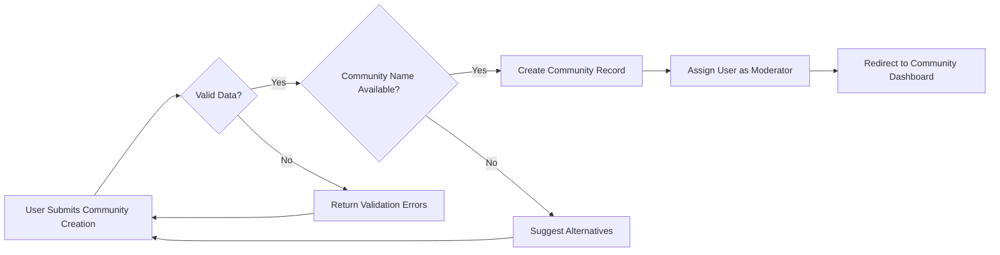
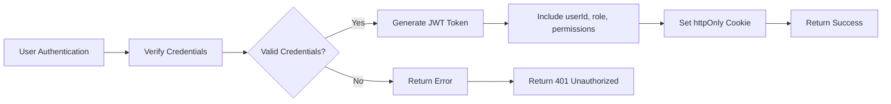
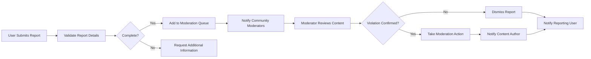

# Enhanced Community Management System - Requirements Analysis Report

## 1. Service Vision & Overview

THE community platform SHALL be a Reddit-inspired content sharing and discussion system that enables users to create specialized communities, share content, engage in discussions, and build reputation through participation. The platform SHALL facilitate knowledge sharing, community building, and content discovery through user-driven curation and voting mechanisms.

THE platform SHALL differentiate itself through a more intuitive user experience, advanced content discovery algorithms, and robust community management tools that empower moderators to effectively steward their communities.

## 2. Core Functional Requirements

### 2.1 User Authentication & Session Management

THE authentication system SHALL implement secure registration, login, password recovery, and session management functions.

WHEN a user registers with email and password, THE system SHALL validate email format, verify password strength requirements (minimum 8 characters with uppercase, lowercase, numeric, and special characters), create a new user account with member role, and send verification email to the provided address.

WHEN a user clicks verification link in email, THE system SHALL upgrade account to member status and grant full participation privileges.

WHEN a user attempts to log in, THE system SHALL verify credentials against stored bcrypt hashes (cost factor 12), generate secure JWT tokens, and establish user sessions.

THE system SHALL implement rate limiting on login attempts (maximum 5 attempts per minute per IP) and temporary account lockout after 3 consecutive failed attempts (15 minute lock).

THE JWT access token SHALL expire after 30 minutes of inactivity and contain:
- userId: string (UUID v4)
- role: string ("guest", "member", "communityModerator", "admin")
- permissions: array of strings
- iat: number (issued at timestamp)
- exp: number (expiration timestamp)

THE refresh token SHALL expire after 7 days and can be used to obtain new access tokens without re-authentication.

WHEN a user requests password reset, THE system SHALL send reset token to verified email address with 1-hour expiration.

### 2.2 Community Creation & Management

THE community management system SHALL support the creation of topic-specific communities (subreddits) that operate as independent discussion forums within the larger ecosystem.

WHEN a member creates a new community, THE system SHALL validate community name uniqueness within 3-21 character length with only lowercase letters, numbers, and hyphens, record community details, assign the creator as moderator, and make the community publicly accessible.

THE system SHALL support three community visibility types:

**Public communities**: Accessible to all users with content visible to guests, enabling anyone to join and participate.

**Restricted communities**: Visible to all users but participation requires explicit moderator approval, with content accessible only to approved members.

**Private communities**: Hidden from public listings with access requiring invitation from moderator or existing member, and content visible only to members.

WHEN a community owner attempts to modify community settings, THE system SHALL validate role permissions and apply changes to community records.

WHEN changing community type from public to restricted, THE system SHALL maintain existing member access while requiring moderator approval for new members.

WHEN changing community type from restricted to public, THE system SHALL make all existing content visible to everyone without requiring member approval.

WHEN a user attempts to create a community with a name that is already taken or violates formatting rules, THEN THE system SHALL return specific error messages indicating the conflict and suggest available alternatives.

THE visual customization system SHALL allow moderators to upload profile icon (maximum 200x200px) and header/banner image (maximum 1200x400px), and select color schemes within platform guidelines.

### 2.3 Content Management & Moderation

THE content management system SHALL enforce community-specific rules on posting and commenting.

WHEN a user attempts to create a post in a community, THE system SHALL display current community rules and require agreement before submission.

WHEN a moderator creates a post, THE system SHALL provide options to mark posts as announcements with special visual treatment.

THE system SHALL maintain a record of all moderation actions with timestamps and moderator identification for transparency and accountability.

THE report escalation system SHALL automatically notify administrators when multiple reports target the same user or community, enabling rapid response to emerging issues.

### 2.4 Content Reporting & Moderation Workflow

THE content reporting system SHALL allow all authenticated users to report inappropriate content through a streamlined interface.

WHEN a user reports content, THE system SHALL present predefined categories including "Spam", "Harassment", "Hate speech", "Personal information", and "Other", and require at least 10 characters of explanation for "Other" category.

THE system SHALL record the report with timestamp, user identifier, reason, and explanation in the moderation queue, and maintain the content's visibility status pending moderator review.

WHEN a moderator accesses the moderation queue, THE system SHALL display reported content with full context including author information, vote history, and previous moderation actions.

WHEN a moderator takes action on reported content (approve, remove, mark as spam, warn user), THE system SHALL record the moderator's decision, apply the action to the content, and update the report status.

THE system SHALL notify content authors of moderation actions within 15 minutes, including the specific rule violation and appeal process information.

THE system SHALL notify users who reported content of the outcome (action taken, dismissed, or incomplete information) within 24 hours of moderator decision.

THE appeal process SHALL allow users to request review of moderator decisions through administrator intervention, with escalated cases requiring majority vote from multiple administrators.

### 2.5 Subscription System

THE subscription system SHALL allow users to follow communities of interest and customize their content experience.

WHEN a user subscribes to a community, THE system SHALL add the community to their subscription list, include its content in their personalized feed, and initiate notification preferences based on user settings.

THE system SHALL display subscriber counts publicly for each community to indicate community size and popularity.

WHEN a user unsubscribes from a community, THE system SHALL remove the community from their subscription feed and stop notifications while preserving their historical contribution record.

THE personalized feed generation system SHALL aggregate posts from all subscribed communities and rank them using configurable algorithms (hot, new, top, controversial).

### 2.6 User Profiles & Activity Tracking

THE user profile system SHALL provide comprehensive member information and activity history.

WHEN a user views a member's profile, THE system SHALL display public information including account creation date, contribution history (posts and comments), and reputation metrics.

THE contribution history section SHALL present user posts and comments in chronological order with filtering options by content type and sorting preferences (new, top, controversial).

THE profile customization system SHALL allow members to upload profile pictures (maximum 2MB, JPG/PNG/GIF), create profile bios (maximum 500 characters), and organize profile sections through drag-and-drop interface.

THE privacy control system SHALL enable members to set profile visibility levels (public, members only, private) and restrict content visibility by community or user group.

### 2.7 Post Sorting Algorithms

THE content ranking system SHALL implement multiple sorting algorithms for content discovery.

THE "hot" sorting algorithm SHALL calculate content popularity based on vote velocity, using a logarithmic formula that weights recent votes more heavily than older ones, with posts decaying in ranking over 24-48 hours to surface fresh content.

THE "new" sorting algorithm SHALL display posts in strict reverse chronological order by creation timestamp, enabling users to see recently shared content first.

THE "top" sorting algorithm SHALL rank posts by their absolute vote score (upvotes minus downvotes), with configurable timeframes (today, this week, this month, all time) to address different content lifecycles.

THE "controversial" sorting algorithm SHALL use a ratio-based formula that identifies posts with high numbers of both upvotes and downvotes, prioritizing content that generates significant discussion across opinion lines.

THE sorting algorithm system SHALL allow users to set default preferences for each community and the global feed, with options to override defaults for specific browsing sessions.

## 3. User Roles & Permissions Matrix

| Action | Guest | Member | Community Moderator | Admin |
|--------|-------|--------|-------------------|-------|
| View public communities and posts | ✅ | ✅ | ✅ | ✅ |
| View restricted community content | ❌ | ✅ | ✅ | ✅ |
| View private community content | ❌ | ❌ | ✅ | ✅ |
| Create community | ❌ | ✅ | ✅ | ✅ |
| Join public community | ❌ | ✅ | ✅ | ✅ |
| Request to join restricted community | ❌ | ✅ | ✅ | ✅ |
| Create posts (text, link, images) | ❌ | ✅ | ✅ | ✅ |
| Upvote/downvote posts and comments | ❌ | ✅ | ✅ | ✅ |
| Comment on posts with nested replies | ❌ | ✅ | ✅ | ✅ |
| Edit own posts/comments | ❌ | ✅ | ✅ | ✅ |
| Delete own posts/comments | ❌ | ✅ | ✅ | ✅ |
| Subscribe to communities | ❌ | ✅ | ✅ | ✅ |
| Report inappropriate content | ❌ | ✅ | ✅ | ✅ |
| View user profiles | ✅ | ✅ | ✅ | ✅ |
| Create user profile | ❌ | ✅ | ✅ | ✅ |
| Moderate reported content | ❌ | ❌ | ✅ | ✅ |
| Remove community content | ❌ | ❌ | ✅ | ✅ |
| Lock post comments | ❌ | ❌ | ✅ | ✅ |
| Ban users from community | ❌ | ❌ | ✅ | ✅ |
| Edit community rules/settings | ❌ | ❌ | ✅ | ✅ |
| Appoint community moderators | ❌ | ❌ | ✅ | ✅ |
| Suspend community | ❌ | ❌ | ❌ | ✅ |
| Ban users from platform | ❌ | ❌ | ❌ | ✅ |
| Manage platform-wide rules | ❌ | ❌ | ❌ | ✅ |
| Access system analytics | ❌ | ❌ | ❌ | ✅ |
| Manage advertising features | ❌ | ❌ | ❌ | ✅ |
| Override moderator decisions | ❌ | ❌ | ❌ | ✅ |
| View all user subscriptions | ❌ | ❌ | ❌ | ✅ |
| Manage global platform announcements | ❌ | ❌ | ❌ | ✅ |
| Access moderation audit logs | ❌ | ❌ | ❌ | ✅ |
| Manage user verification system | ❌ | ❌ | ❌ | ✅ |

## 4. Authentication & Authorization System

### 4.1 JWT Structure & Token Management

The authentication system SHALL use JWT (JSON Web Tokens) for session management with the following payload structure:

```json
{
  "userId": "string (UUID format)",
  "role": "string (guest/member/communityModerator/admin)",
  "permissions": "array of strings defining specific permissions",
  "exp": "number (UNIX timestamp for expiration)",
  "iat": "number (UNIX timestamp for issuance)",
  "emailVerified": "boolean"
}
```

THE access token SHALL be transmitted via httpOnly cookies for enhanced security and SHALL expire after 30 minutes of inactivity.

THE refresh token SHALL be stored securely in HTTP-only cookies and SHALL expire after 7 days of inactivity.

THE token refresh system SHALL allow obtaining new access tokens using valid refresh tokens, with refresh token rotation after each use to prevent replay attacks.

### 4.2 Role-Based Access Control

Authorization SHALL be enforced at both endpoint and resource levels through permission checks in the JWT payload.

WHEN a user attempts to access a protected endpoint, THE system SHALL verify the JWT signature, check token expiration, and validate required permissions before processing the request.

THE system SHALL implement centralized permission validation middleware that automatically checks user roles and permissions against required access levels for each operation.

## 5. Workflow Diagrams

### 5.1 Community Creation Flow



### 5.2 Authentication Flow



### 5.3 Content Reporting Workflow



### 5.4 User Role Hierarchy

```mermaid
graphLR
    A{"Guest User"} --> B{"Member"}
    B --> C{"Community Moderator"}
    B --> D{"Administrator"}
```

## 6. Error Scenarios & Handling

### 6.1 Community Creation Errors

WHEN a user attempts to create a community with a duplicate name, THEN THE system SHALL return HTTP 409 Conflict with message "Community name already exists" and suggest similar available names.

WHEN a user attempts to create a community with invalid characters or length outside 3-21 character range, THEN THE system SHALL return HTTP 400 Bad Request with specific validation messages listing allowed characters and length requirements.

WHEN a user attempts to create excessive numbers of communities in a short period (more than 5 in 24 hours), THEN THE system SHALL temporarily restrict community creation and require additional verification to prevent spam.

### 6.2 Joining Community Errors

WHEN a user attempts to join a private community without invitation, THEN THE system SHALL return HTTP 403 Forbidden with message "Private community requires invitation from a member or moderator".

WHEN a user attempts to join a restricted community, THEN THE system SHALL return HTTP 202 Accepted with message "Your request has been submitted for moderator approval".

WHEN a user attempts to rejoin a community from which they were banned, THEN THE system SHALL deny the request and return HTTP 403 Forbidden with message "You have been banned from this community until [date]" or "permanently banned" as applicable.

### 6.3 Moderation Errors

WHEN a non-moderator attempts to perform moderator actions, THEN THE system SHALL return HTTP 403 Forbidden with message "Insufficient privileges: moderator status required for this action".

WHEN a moderator attempts to ban another moderator of equal standing, THEN THE system SHALL require confirmation and may require additional moderator consensus or administrative involvement based on community size and policies.

WHEN a moderator attempts to remove content in a community they don't moderate, THEN THE system SHALL return HTTP 403 Forbidden with message "Insufficient privileges: cannot moderate content outside assigned communities".

## 7. Performance Requirements

THE system SHALL respond to community creation requests within 2 seconds under normal load conditions of up to 1,000 concurrent users.

THE system SHALL display community content and membership information with initial load times under 1 second, with subsequent navigational loads under 500 milliseconds.

THE content loading system SHALL implement pagination with 25 posts per page and infinite scroll functionality, loading additional content within 1 second of user scrolling to page bottom.

THE system SHALL process subscription changes instantly, with the community feed reflecting additions and removals within 500 milliseconds of confirmation.

THE system SHALL support peak loads of 5,000 concurrent community creation requests during major events or promotions without degradation of service.

THE search function SHALL return results within 500 milliseconds for common queries and 2 seconds for complex queries across the platform.

## 8. Security & Compliance Requirements

THE system SHALL protect all user data through encryption both at rest (AES-256) and in transit (TLS 1.3).

THE authentication system SHALL protect against common attacks including brute force attempts through rate limiting, SQL injection through parameterized queries, and cross-site scripting through input sanitization.

THE platform SHALL implement comprehensive rate limiting to prevent abuse and denial-of-service attacks, with configurable limits per endpoint and user role.

THE system SHALL protect against vote manipulation and spam through behavioral analysis and pattern detection mechanisms.

THE audit logging system SHALL maintain records of all administrative actions, moderator decisions, and security-relevant events for minimum 7 years to meet regulatory requirements.

THE privacy compliance system SHALL support data subject access requests (DSAR), data portability, and right to be forgotten (erasure) as required by GDPR and other privacy regulations.

## 9. Success Criteria

This community management system SHALL be considered successful when it:

- Enables users to easily create and organize topic-focused discussion spaces
- Provides moderators with effective tools to maintain community quality and enforce rules
- Facilitates user engagement through intuitive subscription and content discovery
- Maintains platform consistency while allowing community identity and customization
- Scales effectively to support thousands of active communities
- Minimizes inappropriate content through effective moderation tools and processes
- Achieves high user satisfaction rated at 4.5/5.0 or higher in platform surveys
- Maintains moderator action approval rate of 95% or higher from reporting users
- Achieves content visibility for appropriate content within 2 seconds of creation

> *Developer Note: This document defines **business requirements only**. All technical implementations (architecture, APIs, database design, etc.) are at the discretion of the development team.*