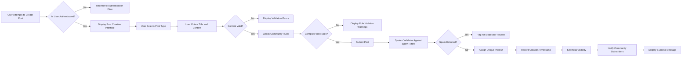

# Post Management Requirements Specification

## Introduction and Scope

This document specifies the business requirements for the post management functionality of a Reddit-like community platform. The post management system enables users to create, share, organize, and maintain content within topic-specific communities. This document covers the complete lifecycle of posts from creation through editing, deletion, and moderation.

The system supports three primary post types: text posts, link posts, and image posts. Each post exists within a community (subreddit) and is subject to community-specific rules and moderation policies. The post management system is a core component of the platform's user engagement strategy, enabling content sharing and discussion that drives community growth and user retention.

This document focuses exclusively on business requirements and user interactions. Technical implementation details such as database schemas, API specifications, and infrastructure decisions are outside the scope of this document and will be determined by the development team based on these requirements.

## Post Creation Requirements

### Authentication Requirements

THE system SHALL require user authentication for all post creation activities.

WHEN an unauthenticated user attempts to create a post, THE system SHALL redirect to the authentication flow with a prompt to register or log in.

WHEN an authenticated user accesses a community, THE system SHALL display the post creation interface with appropriate permissions.

THE system SHALL validate that the user's email address is verified before allowing post creation. IF the user's email is not verified, THEN THE system SHALL display a verification prompt before allowing content creation.

## Community Selection

THE system SHALL require users to explicitly select a community for each post.

THE system SHALL validate that the selected community exists, is active, and is accessible to the user before allowing post submission.

THE system SHALL prevent users from posting to communities they do not have access to:
- Guests can only post to public communities after authentication
- Members can post to public communities and communities they have joined
- Moderators can post to their managed communities
- Administrators can post to any community

THE system SHALL display community selection with hierarchical organization by user subscriptions, followed by recently accessed communities and popular suggestions.

## Post Creation Workflow

WHEN a user submits a post, THE system SHALL follow this comprehensive workflow:

### Post Submission Process

WHEN a user submits a post, THE system SHALL validate all required fields before processing.

THE system SHALL display specific error messages for each validation failure, clearly indicating which requirements were not met.

THE system SHALL prevent form submission until all validation requirements are satisfied, providing real-time validation feedback.

WHEN a post is successfully submitted, THE system SHALL assign a unique post identifier (UUID) and record the creation timestamp.

THE system SHALL associate the post with the author's user profile and karma calculation system.

THE system SHALL immediately make the post visible according to its visibility rules:
- Posts in public communities SHALL be immediately visible to all
- Posts in private communities SHALL only be visible to members
- Posts in restricted communities SHALL be immediately visible to members
- Posts in communities with pre-moderation SHALL be flagged as pending

THE system SHALL confirm successful post creation to the user with a success message and a direct link to the post.

THE system SHALL increment the community's post count immediately upon successful submission.

## Supported Content Types

### Text Posts

THE system SHALL support text-only posts ("self posts") where the main content is written in a rich text editor.

THE system SHALL allow text posts to include rich formatting such as:
- Paragraph text with line breaks
- Basic formatting (bold, italic, strikethrough)
- Lists (ordered and unordered)
- Blockquotes
- Code blocks
- Horizontal rules
- Mentions of other users (@username)

THE system SHALL support Markdown syntax for text formatting in posts.

THE system SHALL render Markdown to HTML for display while preserving the original Markdown content for editing.

THE system SHALL enforce a maximum content length of 40,000 characters for text posts.

THE system SHALL allow empty content for text posts (title-only posts) but display a conspicuous warning to the user.

THE system SHALL validate that text content does not contain prohibited words or spam patterns before submission.

### Link Posts

THE system SHALL support link posts that share external web content.

THE system SHALL validate that link post URLs are properly formatted with valid protocol (http:// or https://).

THE system SHALL accept URLs up to 2,000 characters in length.

THE system SHALL allow users to provide a custom title for link posts, which SHALL override the automatically extracted title.

THE system SHALL automatically resolve URL redirects to capture the final destination URL for preview generation and spam detection.

THE system SHALL attempt to extract metadata (title, description, image, favicon) from linked web pages to create rich previews.

THE system SHALL display link previews with the extracted title, source domain, and representative image when available.

THE system SHALL support preview generation for major social media platforms, news sites, and video sharing services.

THE system SHALL allow optional descriptive text to accompany link posts, with the same formatting capabilities as text posts.

THE system SHALL flag links to known malicious domains and display warnings before submission.

THE system SHALL display a "spoiler" or "NSFW" toggle for link posts with appropriate content warnings.

### Image Posts

THE system SHALL support image uploads as the primary content of posts.

THE system SHALL accept common image formats including JPG, PNG, GIF, and WEBP.

THE system SHALL enforce a maximum file size of 25MB per image.

THE system SHALL allow users to upload multiple images in a single post, creating a gallery format.

THE system SHALL limit the number of images in a single post to 10.

THE system SHALL generate optimized thumbnails and multiple display sizes (small, medium, large) for responsive rendering.

THE system SHALL preserve original image aspect ratios to prevent distortion.

THE system SHALL display image posts with proper attribution, captions, and sharing controls.

THE system SHALL validate images for inappropriate content using automated detection before making them publicly visible.

THE system SHALL support animated GIFs with reasonable size and animation length limits (maximum 30 seconds).

THE system SHALL allow users to rearrange the order of multiple images in a gallery post before submission.

THE system SHALL display a "spoiler" or "NSFW" toggle for image posts with appropriate content warnings.

### Content Type Selection Interface

THE system SHALL present users with clear, prominent options to select the post type: text, link, or image.

THE system SHALL dynamically adjust the input interface based on selected post type, showing relevant fields and hiding irrelevant ones.

THE system SHALL allow users to switch between post types before submission, preserving entered content when compatible (e.g., title text when switching from text to link post).

THE system SHALL guide users through the appropriate input fields for each content type with contextual help and examples.

## Edit and Delete Functionality

### Post Editing

THE system SHALL allow post authors to edit their posts after submission.

THE system SHALL allow edits to post titles, content, links, and image sets.

THE system SHALL track and display edit history by showing that a post has been edited, including the timestamp of the last edit.

THE system SHALL prevent editing of posts that have been locked by moderators or administrators to maintain discussion integrity.

THE system SHALL allow edits to image posts by replacing or rearranging the image set, with the same file type and quantity restrictions as original creation.

THE system SHALL allow users to convert between compatible post types (e.g., text post to link post) through editing, provided content requirements are met for the target post type.

THE system SHALL enforce the same validation rules on edited content as on original submission to maintain content standards.

THE system SHALL allow unlimited edits to posts by the author, with no time restrictions.

WHEN a post is substantially edited (determined by content difference thresholds), THE system SHALL notify active contributors in the comment thread through @mentions.

THE system SHALL allow moderators and administrators to edit any post for moderation purposes, with an "edited by moderator" indicator.

THE system SHALL allow administrators to edit deleted posts for legal or compliance reasons, with appropriate audit logging.

### Post Deletion

THE system SHALL allow post authors to delete their own posts.

THE system SHALL provide a confirmation dialog with clear warnings before permanent deletion to prevent accidental removal.

THE system SHALL allow users to undelete posts within 24 hours of deletion, fully restoring the post and its associated comments.

THE system SHALL permanently remove posts after 24 hours of deletion, with no recovery option.

THE system SHALL hide deleted posts from public view but retain them in the database with metadata for moderation and legal compliance purposes.

THE system SHALL remove upvote counts and hide the post body for deleted posts, but display a notice that the post was deleted by the author.

THE system SHALL allow deleted posts to be viewed by the original author in their user profile activity history.

THE system SHALL allow moderators to permanently delete posts that violate community guidelines, with immediate removal from all views.

THE system SHALL allow administrators to permanently delete posts for platform-wide violations.

THE system SHALL differentiate between user-deleted and moderator-deleted posts in the deletion notice.

THE system SHALL notify post authors when moderators or administrators delete their posts, providing the reason for deletion.

THE system SHALL decrement the community's post count when a post is deleted by author or moderator.

## Post Visibility and Moderation

### Content Moderation Workflow

THE system SHALL allow community moderators to configure moderation rules for their communities.

THE system SHALL support multiple moderation modes:
- **Post-moderation**: Posts are immediately visible after submission
- **Pre-moderation**: Posts require moderator approval before visibility
- **Hybrid moderation**: Certain keywords or user reputations trigger pre-approval requirements

THE system SHALL automatically apply community-level moderation rules to incoming posts, including automated filters for prohibited topics and spam detection.

THE system SHALL flag posts that potentially violate community rules for moderator review.

THE system SHALL allow moderators to take the following actions on posts:
- Approve (for pre-moderated communities)
- Remove (take down content)
- Mark as spam
- Lock (prevent further comments)
- Pin (highlight at top of community)
- Assign post flairs

THE system SHALL track all moderation actions with timestamps, moderator identification, and reasoning.

THE system SHALL allow appeal processes for removed posts, with escalation paths to higher-level moderators or administrators.

THE system SHALL provide automated suggestions for moderation decisions based on post content, user history, and community patterns.

### Post Locking

THE system SHALL allow moderators and administrators to lock posts to prevent additional comments.

WHEN a post is locked, THE system SHALL display a "locked" indicator and disable comment submission.

THE system SHALL allow editing of locked posts by the author, provided the community allows post editing.

THE system SHALL not allow deletion of locked posts by the author until the lock is removed by a moderator.

THE system SHALL allow moderators to unlock posts when appropriate.

### Post Status States

THE system SHALL support the following post statuses:
- Draft (not submitted)
- Pending (awaiting submission or moderator approval)
 - Active (visible and engaging)
- Removed (taken down by user, moderator, or administrator)
- Locked (comments disabled)
- Archived (old posts with limited interaction)
- Promoted (featured content)

THE system SHALL transition posts between status states based on user actions, moderator decisions, and automated business rules.

THE system SHALL display appropriate status indicators for posts in non-active states, including the reason for removal when applicable.

## User Interactions and Permissions

### Cross-Feature Integration

THE system SHALL integrate post management with the voting system, allowing users to upvote and downvote posts according to the voting business rules.

THE system SHALL integrate post management with the comment system, allowing users to comment on posts and create nested reply threads.

THE system SHALL integrate post management with the karma system, awarding author karma points for post engagement.

THE system SHALL integrate post management with the subscription system, allowing users to subscribe to communities and receive updates on new posts.

THE system SHALL integrate post management with user profiles, displaying all posts by a user in their profile activity section.

THE system SHALL integrate post management with the reporting system, allowing users to report inappropriate posts for moderator review.

THE system SHALL integrate with the notification system to alert users of new comments, replies, and moderation actions on their posts.

### Visibility Rules by Role

| Action | Guest | Member | Community Moderator | Admin |
|--------|-------|--------|---------------------|-------|
| View public posts | ✅ | ✅ | ✅ | ✅ |
| View private community posts | ❌ | ✅ (subscribed) | ✅ | ✅ |
| Create posts | ❌ | ✅ | ✅ | ✅ |
| Edit own posts | ❌ | ✅ | ✅ | ✅ |
| Edit others' posts | ❌ | ❌ | ❌ | ✅ |
| Delete own posts | ❌ | ✅ | ❌ | ✅ |
| Delete others' posts | ❌ | ❌ | ❌ | ✅ |
| Remove any post | ❌ | ❌ | ✅ | ✅ |
| Lock post comments | ❌ | ❌ | ✅ | ✅ |
| Mark post as official | ❌ | ❌ | ✅ | ✅ |
| Bypass rate limits | ❌ | ❌ | ❌ | ✅ |
| View deleted posts | ❌ | ❌ | ✅ | ✅ |
| Restore deleted posts | ❌ | ❌ | ❌ | ✅ |
| View moderation log | ❌ | ❌ | ✅ | ✅ |

### Community Rules Enforcement

THE system SHALL validate posts against community-specific rules before submission.

THE system SHALL display community rules to users during post creation to promote compliance and education.

THE system SHALL warn users about potential rule violations before they submit posts with pre-submission checks.

THE system SHALL prevent submission of posts that clearly violate community rules (e.g., banned topics, prohibited content types, restricted domains).

THE system SHALL allow community moderators to define custom rules for their communities with specific content restrictions and requirements.

THE system SHALL enforce both platform-wide rules and community-specific rules on all posts to maintain quality and safety standards.

THE system SHALL require moderator approval for posts containing restricted content even if submitted by moderators themselves to prevent abuse.

## Error Handling Scenarios

### Input Validation Errors

WHEN a user submits a post with an invalid title, THE system SHALL display a specific error message indicating the problem (e.g., "Title must be at least 10 characters long").

WHEN a user submits a link post with an invalid URL, THE system SHALL display an error message suggesting proper URL format ("Please enter a valid URL starting with http:// or https://").

WHEN a user attempts to upload an image of unsupported type, THE system SHALL display an error listing accepted formats ("Please upload images in JPG, PNG, GIF, or WEBP format").

WHEN a user attempts to upload an image exceeding size limits, THE system SHALL display the maximum allowed size ("Image must be smaller than 25MB").

WHEN a user exceeds the maximum number of images in a post, THE system SHALL display the limit and prevent additional uploads ("You can upload up to 10 images per post").

### Permission Errors

WHEN a user attempts to post to a private community they haven't joined, THE system SHALL display a message explaining community access requirements ("You must join this community before posting").

WHEN a guest user attempts to create a post, THE system SHALL prompt them to register or log in ("Please log in to create posts").

WHEN a user attempts to edit or delete a post they don't own, THE system SHALL display a permission denied message ("Only post authors and moderators can edit posts").

WHEN a user without moderation rights attempts to remove a post, THE system SHALL display a permission denied message ("Insufficient permissions to remove this post").

WHEN a user exceeds the rate limit for post creation, THE system SHALL display a clear message with the remaining time until the limit resets ("You have reached the maximum number of posts allowed per hour. Please try again in 30 minutes").

### System Errors

WHEN a post submission fails due to system error, THE system SHALL preserve the user's input to prevent data loss and allow resubmission after resolving the issue.

WHEN image processing fails, THE system SHALL display an error message and allow the user to retry the upload or remove the problematic image.

WHEN external link metadata extraction fails, THE system SHALL allow post submission with minimal preview or none, but continue attempting preview generation in the background.

| Error Scenario | User Message |
|----------------|--------------|
| Authentication required | "Please log in to create posts" |
| Email unverified | "Please verify your email address before creating posts" |
| Invalid title length | "Title must be between 10 and 300 characters" |
| Invalid URL format | "Please enter a valid URL starting with http:// or https://" |
| Unsupported image format | "Please upload images in JPG, PNG, GIF, or WEBP format" |
| Image size too large | "Image must be smaller than 25MB" |
| Excessive images | "You can upload up to 10 images per post" |
| Community access denied | "You must join this community before posting" |
| Edit access denied | "Only post authors and moderators can edit posts" |
| Post removal failed | "Failed to remove post. Please try again." |
| Rate limit exceeded | "You have reached the maximum number of posts allowed per hour. Please try again in X minutes" |
| Content violation | "This content violates community rules: [specific rule]" |
| Spam detection | "This post has been flagged for potential spam. It will be reviewed by moderators." |

## Post Flairs and Categorization

THE system SHALL support post flairs that allow community moderators to categorize posts within communities.

THE system SHALL allow moderators to define custom flairs with text labels and color codes.

THE system SHALL display post flairs prominently next to post titles in community views.

THE system SHALL allow post authors to select from predefined flairs during post creation, with final flair assignment at moderator discretion.

THE system SHALL support flair templates that automatically assign flairs based on post content, keywords, or author reputation.

THE system SHALL allow users to filter posts by flair within communities to focus on specific content types.

THE system SHALL include flair information in the post feed API responses for client-side filtering.

THE system SHALL allow administrators to define global flair categories for platform-wide content organization.

## Post Lifecycle Management

THE system SHALL support automated post archiving for content that has not received engagement within a configurable timeframe.

THE system SHALL allow community moderators to manually archive posts that are no longer relevant.

WHEN a post is archived, THE system SHALL:
- Prevent new comments
- Display an "archived" indicator
- Move the post to a separate archive section
- Exclude from certain sorting algorithms like "hot"

THE system SHALL allow moderators to unarchive posts when they become relevant again.

THE system SHALL implement rate limiting for post creation to prevent spam:
- Members: 10 posts per hour
- Moderators: 20 posts per hour
- Administrators: No limit

WHEN the rate limit is approached, THE system SHALL display a warning to the user.

## Relationship with Other Documents

For authentication requirements, please refer to the [Authentication Flow Guide](./02-authentication-flow.md).

For user role definitions and permissions, please refer to the [User Roles Documentation](./01-user-roles.md).

For voting system details, please refer to the [Voting System Requirements](./05-voting-system.md).

For comment system functionality, please refer to the [Comment System Design](./06-comment-system.md).

For community management features, please refer to the [Community Management Specification](./03-community-management.md).

For user profile requirements, please refer to the [User Profile Documentation](./09-user-roles.md).

For content reporting procedures, please refer to the [Content Reporting Workflow](./10-content-reporting.md).

> *Developer Note: This document defines **business requirements only**. All technical implementations (architecture, APIs, database design, etc.) are at the discretion of the development team.*