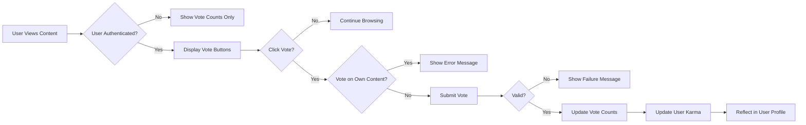
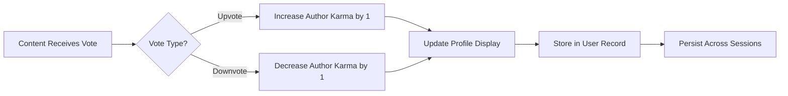

# Voting System Requirements Analysis

## Document Purpose and Scope
This document details the business requirements for the voting system within the community platform. The voting system enables users to express approval or disapproval of content through upvotes and downvotes, calculates user karma based on voting behavior, and supports content ranking algorithms. This document focuses exclusively on business requirements and user interactions, not technical implementation details.

> *Developer Note: This document defines **business requirements only**. All technical implementations (architecture, APIs, database design, etc.) are at the discretion of the development team.*

## System Overview

### Core Voting Functionality
The voting system allows authenticated users to influence content visibility and contribute to user reputation through structured voting mechanics. Voting serves as the primary engagement metric, driving content ranking while building user credibility through the karma system.

### Karma Calculation Principles
User karma represents contribution quality and community standing, calculated from votes received on user-generated content. Higher karma indicates trusted community members, potentially unlocking privileges while maintaining the core principle that every user's vote carries equal weight in content ranking.

### User Engagement Mechanics
Voting creates a feedback loop where quality content rises to prominence while users build reputation through valuable contributions. The system balances simplicity (one-click voting) with safeguards against abuse (vote limits, anti-gaming measures).

## User Roles and Permissions

### Authentication Requirements
THE system SHALL require user authentication for voting or receiving karma.
THE system SHALL allow unauthenticated users to view vote counts and overall karma.
WHEN a guest attempts to vote, THE system SHALL redirect to login without revealing vote manipulation possibilities.

### Member Voting Privileges
Members can upvote or downvote posts and comments once per content item.
Members can change their vote by selecting the opposite action within any window.
Members cannot vote on their own content to prevent self-promotion.
Members receive karma based on votes their content receives from others.

### Moderator Capabilities
Community moderators have the same voting capabilities as members.
Community moderators cannot use voting privileges to artificially influence content within communities they moderate.
Community moderators receive karma normally based on content engagement.

### Admin Oversight
Administrators have the same voting capabilities as members.
Administrators cannot manipulate votes or karma through administrative privileges.
Administrators receive karma normally based on content engagement.
Administrators can audit voting patterns for abuse detection.

## Functional Requirements (EARS Format)

### Upvote/Downvote Mechanics
WHEN a member views a post or comment, THE system SHALL display upvote and downvote buttons with current vote counts.
WHEN a member clicks the upvote button on a post, THE system SHALL increment the post's upvote count by one and reduce the downvote count by one if previously downvoted.
WHEN a member clicks the downvote button on a comment, THE system SHALL increment the comment's downvote count by one and reduce the upvote count by one if previously upvoted.
THE system SHALL prevent members from voting on their own posts or comments.
THE system SHALL update vote counts in real-time from the member's perspective immediately after voting.
THE system SHALL apply vote weighting of 1 point for upvotes and -1 point for downvotes in all calculations.

### Vote Limits and Restrictions
THE system SHALL limit each member to one vote per post or comment.
THE system SHALL not impose daily vote limits to encourage active participation.
THE system SHALL prevent automated voting patterns through behavior analysis.
THE system SHALL require human interaction for each vote action.
WHERE voting occurs from multiple devices associated with the same account, THE system SHALL treat votes as originating from the same member with all established limitations.

### Vote Reversal Rules
WHEN a member clicks their previously selected vote button again, THE system SHALL remove their vote (set to neutral) and update counts accordingly.
WHEN a member changes their vote from downvote to upvote, THE system SHALL decrement the downvote count by one and increment the upvote count by one.
THE system SHALL allow vote changes at any time with no time restriction.
The system SHALL reflect vote changes in real-time from the voter's perspective.
The system SHALL preserve vote timing for abuse detection regardless of subsequent changes.

### Karma Calculation Logic
WHEN a member's post receives an upvote from another member, THE system SHALL increase the post author's karma by 1 point.
WHEN a member's post receives a downvote from another member, THE system SHALL decrease the post author's karma by 1 point.
WHEN a member's comment receives an upvote from another member, THE system SHALL increase the comment author's karma by 1 point.
WHEN a member's comment receives a downvote from another member, THE system SHALL decrease the comment author's karma by 1 point.
THE system SHALL count all votes equally regardless of the voter's own karma level.
THE system SHALL calculate karma as the sum of all individual vote impacts on a user's content.
THE system SHALL update a member's displayed karma in real-time when they receive votes.
THE system SHALL display total karma on user profiles with historical context.

## Business Rules

### Vote Validation
THE system SHALL validate that votes originate from authenticated members.
THE system SHALL validate that members cannot vote on their own content.
THE system SHALL validate that each member can only have one active vote per content item.
THE system SHALL record the timestamp of when each vote is cast for analytics and abuse detection.
THE system SHALL maintain vote anonymity - users cannot see who voted on their content.
THE system SHALL prevent vote brigading through pattern detection of coordinated voting.
THE system SHALL treat bots and automated scripts as violations of voting integrity.

### Anti-Gaming Measures
THE system SHALL implement server-side vote validation to prevent client manipulation.
THE system SHALL monitor for sock puppet accounts created to manipulate voting.
THE system SHALL detect and neutralize coordinated voting patterns between accounts.
THE system SHALL maintain voting integrity logs for audit purposes.
IF suspicious voting patterns are detected, THEN THE system SHALL flag content for moderator review without altering votes.
IF vote manipulation is confirmed, THEN THE system SHALL allow administrators to invalidate fraudulent votes and suspend abusing accounts.
WHERE accounts are found to be voting rings, THE system SHALL allow administrators to take appropriate disciplinary action.

### Karma Impact
THE initial karma for new members SHALL be 0.
Karma SHALL serve as a visible indicator of community contribution but not as a vote weight multiplier.
High karma members SHALL not have greater influence on content ranking through voting.
Karma SHALL be publicly visible on user profiles to establish credibility.
Karma SHALL include both post and comment contributions in the total score.

## Error Handling Scenarios

### Unauthorized Voting
IF a guest attempts to vote, THEN THE system SHALL redirect to the authentication flow without confirming whether the action would have been permitted.
IF an authenticated member attempts to vote on their own content, THEN THE system SHALL display a user-friendly message explaining that self-voting is not permitted.
IF an account has voting privileges suspended, THEN THE system SHALL display a message explaining the restriction without detailing appeal processes.

### Invalid Vote Attempts
IF a member's vote request fails due to system error, THEN THE system SHALL notify the member that their vote was not recorded and suggest retrying.
IF a member attempts to cast multiple simultaneous votes through technical manipulation, THEN THE system SHALL process only one vote and maintain system integrity.
IF network connectivity is lost during voting, THEN THE system SHALL resolve the vote state when connectivity is restored based on server records.

### System Errors
IF the voting system experiences high load, THEN THE system SHALL maintain vote integrity while potentially delaying UI updates for non-voting users.
IF database connectivity is temporarily lost, THEN THE system SHALL queue votes for processing when connectivity is restored without losing user actions.
IF karma calculation fails, THEN THE system SHALL display the last known accurate karma score with a visual indicator that updates are pending.

## Performance Requirements
THE system SHALL process vote submissions and return confirmation within 2 seconds under normal load.
THE system SHALL handle voting interactions from 10,000 concurrent users during peak traffic periods.
THE system SHALL update vote counts for the voting user immediately upon successful submission.
THE system SHALL propagate vote count updates to other viewers within 5 seconds of submission.
THE system SHALL maintain voting functionality even if non-essential services (analytics, notifications) are temporarily unavailable.

## Diagrams

### Voting Flow

### Karma Calculation Flow
