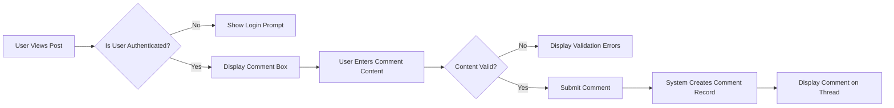
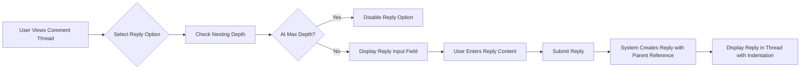
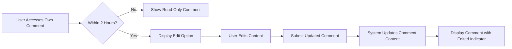
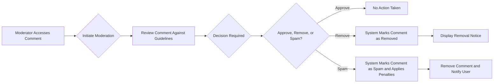

# Comment System Requirements Analysis

## Introduction and Scope

This document specifies the requirements for the comment system of a Reddit-like community platform. The comment system enables users to engage with content by adding comments to posts and replying to existing comments in a nested hierarchy. This system supports user interaction, content discussion, and community engagement through a structured commenting interface.

The scope of this document includes:
- Comment creation and submission
- Nested reply functionality with depth limitations
- Comment editing and deletion
- Comment moderation capabilities
- User interactions with comments
- Integration with voting system for comments
- Reporting mechanisms for inappropriate comments

## Business Model Context

### Why This Service Exists

The comment system is a critical component of the community platform's engagement strategy. It enables users to discuss content, share perspectives, and build relationships around shared interests. Comments increase user retention by creating ongoing conversations around posts, which drives repeat visits and platform engagement. The nested reply structure facilitates organized discussions, making it easier for users to follow threads and contribute meaningfully.

### Revenue Strategy

While the comment system itself is not directly monetized, it contributes significantly to the overall platform's value by:
- Increasing user engagement metrics that attract advertisers
- Creating valuable user-generated content that enhances platform SEO
- Building community loyalty that reduces churn and increases lifetime value
- Providing data on user interests and discussions for targeted advertising

### Growth Plan

The comment system supports the platform's growth by:
- Encouraging user participation and content creation
- Facilitating community building around topics of interest
- Creating network effects where more users attract more discussion
- Enabling viral content through shareable and engaging discussions

### Success Metrics

- Average comments per post
- Comment engagement rate (percentage of post viewers who comment)
- Reply depth (average nesting level of comments)
- Time spent on post comment threads
- User retention following commenting activity

## User Roles and Permissions

The following user roles have been defined for the system, each with specific permissions related to the comment system:

| Action | Guest | Member | Community Moderator | Admin |
|--------|-------|--------|----------------------|-------|
| View comments | ✅ | ✅ | ✅ | ✅ |
| Create comment | ❌ | ✅ | ✅ | ✅ |
| Create nested reply | ❌ | ✅ | ✅ | ✅ |
| Edit own comment | ❌ | ✅ | ✅ | ✅ |
| Delete own comment | ❌ | ✅ | ✅ | ✅ |
| Edit any comment | ❌ | ❌ | ✅ | ✅ |
| Delete any comment | ❌ | ❌ | ✅ | ✅ |
| Report comment | ❌ | ✅ | ✅ | ✅ |
| Moderate reported comments | ❌ | ❌ | ✅ | ✅ |

### Authentication Requirements

The system uses JWT (JSON Web Tokens) for authentication and authorization. The token payload contains:
- userId: String (user identifier)
- role: String (user role name)
- permissions: Array of strings (specific permissions for the user)

Access tokens expire after 30 minutes, while refresh tokens expire after 7 days. Tokens are stored in localStorage for convenience, with the option to use httpOnly cookies for enhanced security.

## Core Comment System Requirements

### Comment Creation and Submission

WHEN a user submits a comment on a post, THE system SHALL validate the comment content and create the comment if validation passes.

WHEN validating comment content, THE system SHALL enforce the following constraints:
- Content length must be between 1 and 10,000 characters
- Content must not consist solely of whitespace or empty elements
- Content must be properly escaped to prevent XSS attacks
- Content must not contain banned words as defined by community or platform rules

WHEN a member attempts to create a comment, THE system SHALL associate the comment with the user's account and the targeted post.

WHEN a guest attempts to create a comment, THE system SHALL deny the action and prompt the user to register or log in.

### Nested Reply Functionality

THE system SHALL support nested replies to comments up to a maximum depth of 6 levels.

WHEN a user creates a reply to a comment, THE system SHALL establish a parent-child relationship between the comments in the data model.

WHEN displaying comment threads, THE system SHALL render replies with visual indentation that corresponds to their nesting level, up to the maximum depth.

WHEN a comment reaches the maximum nesting depth (level 6), THE system SHALL disable the reply function for that comment and display a message indicating that the maximum reply depth has been reached.

WHEN a user views a post, THE system SHALL display top-level comments in the order determined by the sorting algorithm (default: best/hot), with replies collapsed by default.

### Comment Editing and Deletion

THE system SHALL allow users to edit or delete their own comments within 2 hours of creation.

WHEN a user edits a comment, THE system SHALL preserve the original creation timestamp and display an "edited" indicator next to the comment.

WHEN a user deletes a comment, THE system SHALL remove the visible content but retain the comment record with a "deleted" status to preserve thread integrity.

WHEN a comment is deleted, THE system SHALL display a placeholder indicating the comment was removed, and shall collapse any replies to maintain a coherent thread structure.

COMMUNITY MODERATORS AND ADMINS SHALL have the ability to edit or delete any comment regardless of time constraints.

WHEN a moderator or admin edits a comment, THE system SHALL preserve the original author information but add a moderator edit indicator.

### Reply Depth Limits

THE system SHALL enforce a maximum nesting depth of 6 levels for replies to prevent excessively deep and difficult-to-follow threads.

WHEN determining nesting depth, THE system SHALL count from the top-level comment as level 1.

WHEN a reply would exceed the maximum nesting depth, THE system SHALL prevent submission and notify the user that the maximum reply depth has been reached.

WHILE viewing a comment thread, THE system SHALL provide a "jump to top" link for deeply nested replies to improve navigation.

### Moderation Capabilities

COMMUNITY MODERATORS AND ADMINS SHALL have tools to manage comments within their designated communities.

WHEN a comment is reported by a user, THE system SHALL add it to a moderation queue for review by community moderators.

WHEN reviewing a reported comment, THE moderator SHALL have options to: approve, remove, or mark as spam.

THE system SHALL allow moderators to add explanatory notes when removing comments to guide user behavior.

ADMINISTRATORS SHALL have the ability to override moderator decisions and manage comments across all communities.

## User Workflows and Scenarios

### Comment Creation Workflow

### Nested Reply Workflow

### Comment Editing Workflow

### Moderator Comment Removal Workflow

## Key Business Rules

- **Rule 1**: Only authenticated users (members and above) may create comments or replies
- **Rule 2**: Users may edit or delete their own comments within 2 hours of creation
- **Rule 3**: Moderators and admins may edit or delete any comment at any time
- **Rule 4**: Comment threads are limited to a maximum nesting depth of 6 levels
- **Rule 5**: Deleted comments are replaced with placeholders to maintain thread integrity
- **Rule 6**: Edited comments display an "edited" indicator to maintain transparency
- **Rule 7**: All comments are subject to community guidelines and may be reported by users
- **Rule 8**: Reported comments enter a moderation queue for review
- **Rule 9**: Moderator actions on comments are logged for accountability
- **Rule 10**: Users receive notification when their comment is removed by moderation

## Error Handling and Edge Cases

IF a user attempts to create a comment while not authenticated, THEN THE system SHALL return an authentication error and redirect to login.

IF a user submits a comment with content exceeding 10,000 characters, THEN THE system SHALL reject the submission and display a character limit message.

IF a user attempts to edit a comment after the 2-hour window has expired, THEN THE system SHALL disable the edit function and display a message indicating the time limit has been reached.

IF multiple users attempt to reply to the same comment simultaneously, THEN THE system SHALL handle concurrent submissions without data loss or corruption.

IF a parent comment is deleted, THEN THE system SHALL collapse and hide its reply chain while preserving the ability to restore if the parent is undeleted.

IF there is a system failure during comment submission, THEN THE system SHALL preserve the user's entered content to allow recovery and resubmission.

IF a moderator removes a comment that has received replies, THEN THE system SHALL collapse the reply thread and display a notice that the parent comment was removed.

## Performance Expectations

WHEN a user submits a comment, THE system SHALL validate and confirm receipt within 2 seconds.

WHEN loading a post with comments, THE system SHALL display the initial comment thread view within 3 seconds, even for posts with hundreds of comments.

WHEN expanding a collapsed reply thread, THE system SHALL render the replies within 1 second.

THE system SHALL support concurrent commenting activity on popular posts with response times not exceeding 3 seconds under normal load conditions.

## Relationship to Other Documents

This document integrates with and depends on the following specifications:

- [User Roles and Permissions](./01-user-roles.md): Defines the roles and their capabilities that govern access to comment functionality
- [Post Management Requirements](./04-post-management.md): Specifies how comments are associated with posts and inherit visibility settings
- [Voting System Specification](./05-voting-system.md): Details how users can upvote/downvote comments as part of engagement
- [Content Reporting Workflow](./10-content-reporting.md): Explains the full lifecycle of reported comments from submission to resolution

Together, these documents provide a complete picture of the commenting ecosystem within the community platform.

> *Developer Note: This document defines **business requirements only**. All technical implementations (architecture, APIs, database design, etc.) are at the discretion of the development team.*