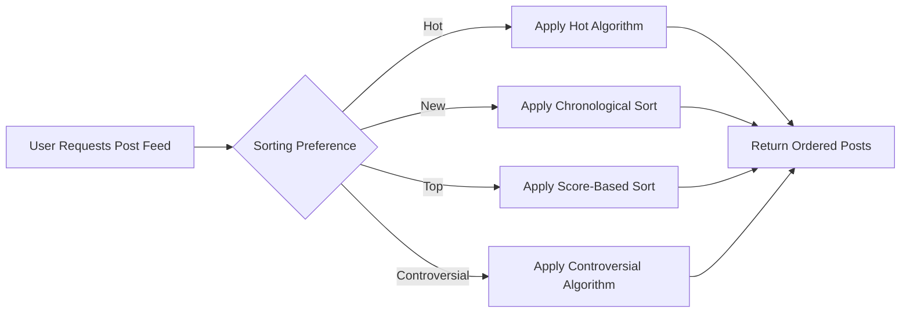

# Post Sorting System Requirements

## Introduction and Scope

This document specifies the comprehensive business requirements for the post sorting system in the Reddit-like community platform. The sorting system determines how posts are ordered and displayed to users across the platform, enabling content discovery and enhancing user engagement. The system must implement four distinct sorting algorithms: hot, new, top, and controversial, each serving different user needs and content discovery patterns.

The scope encompasses the business logic and rules for determining post rankings based on engagement metrics, time, and community input. These requirements enable backend developers to implement sorting functionality without ambiguity, ensuring consistent behavior across the platform. This document focuses exclusively on business requirements, not technical implementation details.

## Business Model Context

### Why This Service Exists

The post sorting system is a core component of the community platform's business model, serving several key functions:

- Surface high-quality, engaging content to users
- Increase user retention by providing fresh and relevant content
- Promote community participation by rewarding valuable contributions
- Support advertising revenue by increasing content discoverability and user engagement
- Enable effective content moderation through visibility controls

Unlike simple chronological feeds found on many social platforms, sophisticated sorting algorithms create a dynamic content ecosystem where valuable posts receive appropriate visibility regardless of when they were created.

### Growth Plan

The sorting system supports platform growth by:

- Surfacing new content through the "new" sort to ensure fresh posts receive visibility
- Promoting high-quality content through the "hot" and "top" sorts to encourage user participation
- Facilitating discovery of diverse perspectives through the "controversial" sort
- Balancing new and established content to maintain platform activity
- Preventing content stagnation by ensuring posts don't remain at the top indefinitely

### Success Metrics

- User engagement time: Target increase of 15% through improved content relevance
- Daily active users: Target 20% of monthly active users daily
- Content discovery rate: 70% of user sessions include viewing posts beyond top 20
- Fresh content visibility: 90% of posts receive at least 10 views within 24 hours of posting
- Return visit rate: 40% of users return within 24 hours

## Detailed Algorithm Specifications

### Hot Sorting Algorithm

THE hot sorting algorithm SHALL surface posts that are currently generating significant engagement relative to their age.

THE algorithm SHALL use a formula that considers:
- Vote velocity (votes per hour)
- Comment velocity (comments per hour)
- Current vote score (upvotes minus downvotes)
- Time since posting

WHEN calculating hot ranking, THE system SHALL exponentially decay the contribution of votes and comments over time to prioritize recent engagement.

THE system SHALL recalculate hot rankings every 5 minutes to reflect current engagement patterns.

THE hot algorithm SHALL give greater weight to comments than votes in the calculation, recognizing that comments represent deeper engagement.

FOR posts of similar age, THE system SHALL prioritize posts with higher comment-to-vote ratios to surface discussion-worthy content.

THE hot sort SHALL apply a floor to prevent newly posted content with zero engagement from appearing in hot rankings.

THE hot algorithm SHALL adjust relative weights during peak usage times to prevent popular communities from dominating the rankings.

### New Posts Sorting

THE new posts sorting SHALL display posts in reverse chronological order based solely on creation timestamp.

THE system SHALL not consider any engagement metrics when sorting by "new."

THE new sort SHALL include all posts regardless of score or content type.

WHEN a user accesses a community's new posts view, THE system SHALL display posts starting from the most recently created.

THE system SHALL not remove posts from the new view based on negative score or reporting status unless they have been removed by moderation.

THE new sort SHALL be the default view for users browsing communities they haven't joined.

THE system SHALL mark posts as "new" for 24 hours from creation time to support the "new" filtering option.

THE new sorting SHALL be available for both community-specific views and the global feed.

### Top Posts Sorting

THE top posts sorting SHALL rank content based on their overall engagement metrics.

THE system SHALL calculate top rankings differently based on the selected time frame:
- All time: Uses total vote score
- Today: Uses vote score from the past 24 hours
- This week: Uses vote score from the past 7 days
- This month: Uses vote score from the past 30 days

WHEN displaying top posts, THE system SHALL allow users to select their preferred time frame.

THE default time frame for top sorting SHALL be "all time."

THE top algorithm SHALL not apply time-based decay to votes, preserving the cumulative nature of this ranking.

THE system SHALL recalculate top rankings once per hour to reduce computational overhead while maintaining reasonable accuracy.

THE top sort SHALL exclude posts with extremely negative scores to prevent spam or malicious content from appearing.

### Controversial Sorting

THE controversial sorting SHALL highlight posts that are generating polarized reactions from the community.

THE system SHALL calculate controversy using the ratio of upvotes to downvotes combined with overall engagement.

THE controversy score SHALL increase when a post has a balanced ratio of upvotes to downvotes (between 2:1 and 1:2).

THE system SHALL require a minimum total vote threshold (50 votes) before a post qualifies for controversial ranking.

THE controversial algorithm SHALL give greater weight to posts with high comment counts in addition to balanced voting.

THE controversy score SHALL decay over time similar to the hot algorithm, ensuring timely content receives priority.

THE system SHALL recalculate controversy rankings every 10 minutes to reflect evolving community sentiment.

THE controversial sort SHALL not include posts from the past hour to ensure sufficient time for balanced voting patterns to emerge.

## Visual Representations

### Hot Sort Algorithm Flow
```mermaid
diagram graphLR
  A["Calculate Vote Velocity"] --> B["Calculate Comment Velocity"]
  B --> C["Get Current Vote Score"]
  C --> D["Determine Time Since Posting"]
  D --> E{"Apply Time Decay"}
  E -->|"Yes"| F["Reduce Vote/Comment Weight"]
  E -->|"No"| G["Maintain Full Weight"]
  F --> H["Calculate Hot Score"]
  G --> H
  H --> I["Store in Hot Rankings"]
```

### Sorting Method Selection Flow


## Business Rules

1. Only authenticated users may access personalized sorting preferences
2. Users may set default sorting preferences in their profile
3. Sorting preferences SHALL persist across sessions and devices
4. The system SHALL display the current sorting method to users
5. Users SHALL have the option to temporarily override default sorting
6. Sorting algorithms SHALL process posts within 2 seconds of request
7. The system SHALL cache sorting results for 5 minutes to improve performance
8. Moderators may manually pin posts to appear at the top regardless of sorting
9. The system SHALL respect user content filters in all sorting methods
10. Sorting SHALL not consider votes from banned or suspended users
11. The system SHALL apply shadow-banning rules to sorting when appropriate
12. Posts from blocked users SHALL be filtered out before sorting
13. The system SHALL remove posts with copyright takedown notices from all views
14. Posts awaiting moderation SHALL not appear in any public sorting views

## Error Scenarios and Handling

### Algorithm Calculation Errors

IF the hot algorithm fails to calculate a score, THEN THE system SHALL fall back to chronological sorting within the last 24 hours.

IF the controversial algorithm cannot determine a valid score due to insufficient votes, THEN THE system SHALL exclude the post from controversial rankings.

IF the top sorting algorithm encounters a system error, THEN THE system SHALL display posts in descending order of vote score.

IF a post has an invalid timestamp, THEN THE system SHALL exclude it from all sorting algorithms and flag it for moderation review.

### Data Integration Issues

IF the system cannot access vote data for sorting calculations, THEN THE system SHALL use comment counts as a primary ranking factor.

IF comment data is unavailable, THEN THE system SHALL prioritize posts with higher vote counts.

IF engagement data is corrupted for a post, THEN THE system SHALL use recency as the primary sorting factor.

### Performance Problems

IF the sorting process exceeds 3 seconds, THEN THE system SHALL return the most recent cached results with a freshness indicator.

IF the system experiences high load, THEN THE system SHALL reduce the frequency of ranking recalculations to maintain responsiveness.

WHEN a sorting algorithm causes performance degradation, THEN THE system SHALL automatically reduce its computational complexity until the issue is resolved.

## Performance Requirements

THE system SHALL process sorting requests and return results within 2 seconds under normal load conditions.

THE system SHALL support concurrent sorting requests from 10,000 active users during peak traffic periods.

THE system SHALL recalculate hot rankings every 5 minutes with 95% of posts updated within 6 minutes.

THE system SHALL recalculate top rankings every hour with 98% of posts updated within 65 minutes.

THE system SHALL recalculate controversial rankings every 10 minutes with 95% of posts updated within 12 minutes.

THE system SHALL implement server-side caching of sorting results with a 5-minute expiration for improved performance.

THE system SHALL provide a lightweight sorting option for low-bandwidth connections.

## Relationship to Other Documents

This document builds upon requirements in [User Roles and Authentication](./01-user-roles.md) for access control to sorting preferences.

The voting data used in sorting algorithms is specified in detail in [Voting System Requirements](./05-voting-system.md).

Post creation and modification timestamps referenced in sorting are defined in [Post Management Specifications](./04-post-management.md).

The display of sorting options in the user interface is covered in [User Profile Documentation](./09-user-profiles.md).

> *Developer Note: This document defines **business requirements only**. All technical implementations (architecture, APIs, database design, etc.) are at the discretion of the development team.*