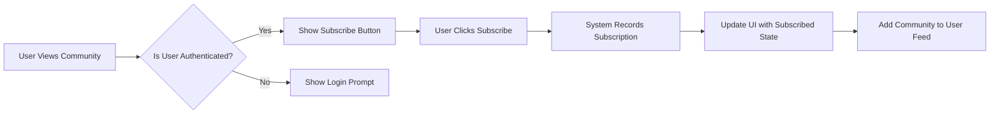
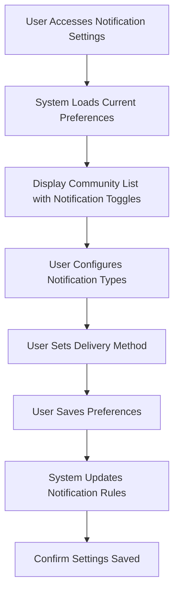
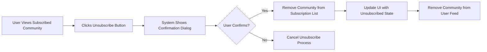
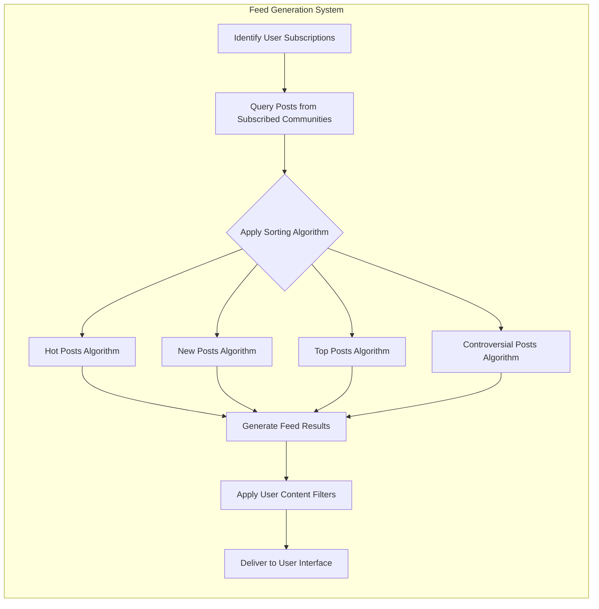

## Subscription System Requirements Analysis

This document provides comprehensive business requirements for the subscription system in our Reddit-like community platform. The subscription system enables users to follow specific communities of interest, receive notifications about new content, and maintain a personalized feed of subscribed content.

THE subscription system SHALL be a core component of the platform, enabling users to curate their content experience by selecting communities aligned with their interests. This functionality directly supports the platform's business model of user engagement and content discovery.

### Business Model Context

The subscription system supports our core business model by increasing user engagement and retention. By allowing users to follow topics of interest, we create personalized experiences that encourage daily visits and sustained participation. This drives higher ad impressions and creates opportunities for premium features such as advanced notification controls or priority content delivery.

Subscription-based engagement creates network effects where active users attract more contributors, leading to better content and community growth. This virtuous cycle supports our revenue strategy through increased user lifetime value and platform stickiness.

### Business Objectives

- Increase user engagement by providing personalized content streams
- Drive daily active users through notification mechanisms
- Enable topic-based community discovery and content organization
- Provide moderation teams with tools to manage subscriber communications
- Support platform growth through organic content discovery
- Enhance content relevance and contribution quality
- Minimize information overload through selective content filtering

## User Role Structure and Authentication Requirements

### Core Authentication Functions

- Users must authenticate to subscribe to communities
- Subscription status is tied to user accounts, not devices or sessions
- Users can view their subscriptions across devices through account sync
- Users can manage all active sessions from account security settings
- Guest users (unauthenticated) can browse public communities but cannot subscribe
- Members can subscribe to communities after email verification
- Community moderators have additional subscription-related privileges
- Administrators have full access to subscription systems and analytics

### User Role Hierarchy

THE system SHALL implement the following user role hierarchy:

- Guest: Unauthenticated users who can only view public communities and posts
- Member: Authenticated users who have verified their email and can access full platform features
- Community Moderator: Members with additional privileges to manage specific communities
- Admin: Platform staff with full system access and oversight capabilities

### Authentication Requirements

WHEN a user attempts to subscribe to a community, THE system SHALL verify authentication status before processing.

WHEN a user is not authenticated, THE system SHALL redirect to the login page and preserve the subscription intent for after authentication.

WHEN a user completes authentication, THE system SHALL resume the intended action (subscription to the community).

WHEN a user attempts to access subscription management features, THE system SHALL verify authentication and appropriate role permissions.

### User Roles and Permissions

THE system SHALL enforce role-based access control for all subscription-related actions.

| Action | Guest | Member | Community Moderator | Admin |
|--------|-------|--------|----------------------|-------|
| View public communities | ✅ | ✅ | ✅ | ✅ |
| Subscribe to communities | ❌ | ✅ | ✅ | ✅ |
| Unsubscribe from communities | ❌ | ✅ | ✅ | ✅ |
| View own subscription list | ❌ | ✅ | ✅ | ✅ |
| View other users' subscriptions | ✅ | ❌ | ❌ | ✅ |
| Receive community notifications | ❌ | ✅ | ✅ | ✅ |
| Manage community notification settings | ❌ | ✅ | ✅ | ✅ |
| View subscriber analytics | ❌ | ❌ | ✅ | ✅ |
| Receive subscription analytics reports | ❌ | ❌ | ✅ | | 
| Bulk message subscribers | ❌ | ❌ | ✅ | ✅ |
| Override subscription settings | ❌ | ❌ | ❌ | ✅ |
| Suspend community subscriptions | ❌ | ❌ | ❌ | ✅ |
| View all user subscriptions | ❌ | ❌ | ❌ | ✅ |
| Manage subscription limits | ❌ | ❌ | ❌ | ✅ |

## Subscription Mechanics

### Core Subscription Requirements

THE subscription system SHALL allow authenticated users to subscribe to public communities they wish to follow.

THE subscription system SHALL display the user's subscription count in their profile dashboard.

THE subscription system SHALL update subscription status in real-time upon user action.

THE subscription system SHALL prevent users from subscribing to the same community multiple times.

THE subscription system SHALL maintain a complete history of user subscriptions and unsubscriptions for analytics and recovery purposes.

THE subscriber analytics SHALL be available to community moderators and administrators for understanding community growth and engagement patterns.

### Subscription Process Flow

### Detailed Subscription Requirements

WHEN a user attempts to subscribe to a community, THE system SHALL verify the user is authenticated before processing.

WHEN a user successfully subscribes to a community, THE system SHALL add the community to their subscription list and confirm with visual feedback.

IF the user is not authenticated, THEN THE system SHALL redirect to login flow and preserve subscription intent for after authentication.

IF the community does not exist, THEN THE system SHALL display an error message indicating the community cannot be found.

IF the community is private and the user lacks access, THEN THE system SHALL display an error message explaining access requirements.

IF the user reaches maximum subscription limit, THEN THE system SHALL display the limit and suggest unsubscribing from inactive communities.

IF the subscription action fails due to system error, THEN THE system SHALL preserve user intent and allow retry.

### Subscription Interface Requirements

WHEN viewing a community page, THE system SHALL display a subscribe button that reflects current subscription status.

THE subscription button SHALL display in "subscribed" state when the user is currently subscribed to the community.

THE subscription button SHALL animate briefly when clicked to provide feedback on action completion.

THE system SHALL display subscription count next to the subscribe button, which is visible to all users.

WHEN a user subscribes to a community, THE system SHALL update the subscription count globally.

THE system SHALL provide immediate visual feedback upon subscription action completion.

## Notification Preferences

### Notification Management Requirements

THE notification system SHALL allow users to customize their notification preferences for each subscribed community.

THE notification system SHALL provide default notification settings that can be customized per community.

THE notification system SHALL persist user preference choices across sessions and devices.

THE notification system SHALL allow users to configure both delivery methods and content types.

### Notification Types and Controls

THE system SHALL support the following notification types for subscribed communities:

- New posts in subscribed communities
- Replies to user's subscribed post threads
- Top posts from subscribed communities
- Controversial posts from subscribed communities
- Community announcements (moderator/admin posts)
- Scheduled digest summaries (daily/weekly)
- Member milestones (karma thresholds, contribution anniversaries)

THE user SHALL be able to configure notification settings independently for each subscription.

THE system SHALL allow global notification preferences that apply to all current and future subscriptions.

THE system SHALL allow community-specific overrides of global notification preferences.

THE system SHALL provide opt-in/out controls for each notification type.

THE system SHALL allow users to set preferred delivery methods for notifications:

- In-platform notifications (notification center)
- Email alerts
- Mobile push notifications
- RSS feed (for external readers)

### Notification Preference Requirements

WHEN a user accesses notification settings, THE system SHALL display all subscribed communities with current notification configurations.

WHEN a user updates notification preferences for a community, THE system SHALL apply changes immediately and confirm successful update.

WHEN a user subscribes to a new community, THE system SHALL apply default notification settings which the user can later customize.

IF the user disables all notification types for a community, THEN THE system SHALL treat this as active subscription with silent updates (community remains in feed).

THE system SHALL allow users to set global notification preferences that apply to all current and future subscriptions.

THE system SHALL allow community-specific overrides of global notification preferences.

THE system SHALL display the effective notification setting when global and local settings conflict.

THE system SHALL allow bulk editing of notification settings across multiple communities.

THE system SHALL provide "quiet hours" settings to suppress notifications during specified time periods.

THE system SHALL respect "do not disturb" settings on user devices when sending push notifications.

THE system SHALL provide preview functionality to test notification formats and delivery.

## Unsubscribe Process

### Unsubscription Requirements

THE system SHALL allow users to unsubscribe from communities they no longer wish to follow.

THE unsubscription process SHALL be equally accessible from community pages and subscription management interfaces.

THE unsubscription process SHALL be reversible within a limited recovery window.

THE system SHALL provide a confirmation step before completing unsubscription to prevent accidental removal.

### Unsubscribe Flow

### Detailed Unsubscribe Requirements

WHEN a user initiates unsubscription, THE system SHALL display confirmation dialog with community name to prevent accidental actions.

WHEN a user confirms unsubscription, THE system SHALL remove the community from their subscription list and update the feed immediately.

IF a user chooses to cancel unsubscription, THEN THE system SHALL maintain current subscription status and return to previous interface.

THE system SHALL provide a "resubscribe" option for recently unsubscribed communities for a period of 30 days.

THE system SHALL retain user's post and comment history in the community after unsubscription, but no longer include new content in their feed.

THE system SHALL not send notifications for new content after successful unsubscription.

THE system SHALL allow users to bulk unsubscribe from multiple communities.

THE system SHALL provide a "smart unsubscribe" feature that suggests communities with low engagement for removal.

THE system SHALL record the reason for unsubscription when provided by the user for analytics purposes.

THE system SHALL provide a "scheduled unsubscribe" option to automatically unsubscribe at a future date.

## Feed Generation

### Personalized Feed Requirements

THE feed system SHALL aggregate posts from all user-subscribed communities into a single unified feed.

THE feed system SHALL support multiple sorting algorithms (hot, new, top, controversial) as specified in the [Post Sorting System](./07-post-sorting.md).

THE feed system SHALL load posts incrementally as users scroll to ensure performance and responsiveness.

THE feed system SHALL prioritize content based on user engagement patterns and preferences.

THE feed system SHALL provide filtering options to refine content display.

### Feed Generation Process

### Feed Business Logic

WHEN a user requests their personal feed, THE system SHALL retrieve posts from all currently subscribed communities.

WHEN generating the user feed, THE system SHALL exclude posts from communities the user has unsubscribed from.

WHEN a user switches feed sorting mode, THE system SHALL reapply the selected sorting algorithm across all subscribed communities.

THE system SHALL apply user-configured content filters (keyword blocking, domain blocking) to all posts in the feed.

THE system SHALL prioritize posts from communities with higher user engagement when using "hot" sorting algorithm.

THE feed SHALL update in real-time to show new posts from subscribed communities, with appropriate refresh indicators.

THE system SHALL cache feed content for offline access and synchronize when reconnected.

THE system SHALL support "infinite scroll" behavior with smooth loading of additional content.

THE system SHALL provide "mark all as read" functionality for the feed.

THE system SHALL display unread post indicators in navigation elements.

THE system SHALL allow users to save posts from their feed for later reference.

THE system SHALL provide content recommendation algorithms for non-subscribed communities based on feed engagement.

THE system SHALL support "snooze feed" functionality to temporarily pause feed updates.

THE system SHALL provide feed statistics showing origin communities of displayed content.

### Feed Customization

THE system SHALL allow users to customize feed presentation with the following options:

- Card style vs. list view
- Content density (compact vs. spacious)
- Image preview sizing
- Automatic video/audio playback
- Post content truncation
- Comment preview levels

THE system SHALL remember user feed preferences across sessions.

THE system SHALL allow feed customization to be different between desktop and mobile views.

THE system SHALL provide theme options specifically for feed presentation.

## Edge Cases and Business Rules

### Subscription Limitations

THE system SHALL allow users to subscribe to a maximum of 1,000 communities to maintain system performance.

WHEN a user reaches the subscription limit, THE system SHALL display a message suggesting they unsubscribe from inactive communities.

THE system SHALL allow administrators to adjust the subscription limit based on system capacity.

THE system SHALL provide warning notifications when users approach 80% of their subscription limit.

WHEN a user attempts to exceed the subscription limit, THE system SHALL prevent the action and display guidance on managing subscriptions.

THE system SHALL consider the subscription limit on a per-user basis, not shared across devices or sessions.

THE system SHALL provide metrics in user profiles showing subscription count versus maximum.

### Community Deletion and Status Changes

IF a community is deleted, THEN THE system SHALL automatically unsubscribe all members and remove it from their feed.

IF a community changes from public to private, THEN THE system SHALL automatically unsubscribe users who do not have access.

IF a community is suspended by moderators or administrators, THEN THE system SHALL temporarily disable notifications but retain subscription status.

WHEN a suspended community is reinstated, THE system SHALL resume normal subscription functionality and deliver missed notifications based on user settings.

IF a community is marked as "inactive" due to lack of participation, THEN THE system SHALL notify subscribers and suggest unsubscribing.

WHEN a community is transferred to new ownership, THEN THE system SHALL maintain subscription status for all existing subscribers.

IF a community merges with another community, THEN THE system SHALL notify subscribers and ask whether they want to subscribe to the new combined community.

IF a community splits into multiple communities, THEN THE system SHALL allow subscribers to choose which new communities to follow.

### Data Integrity and Sync

THE system SHALL synchronize subscription data across devices within 5 seconds of change.

THE system SHALL ensure transactional integrity when recording subscription changes to prevent data inconsistencies.

THE system SHALL audit all subscription changes for security monitoring and abuse detection.

THE system SHALL maintain subscription history for at least 2 years for compliance and recovery purposes.

THE system SHALL detect and resolve conflicts when subscription changes occur simultaneously on multiple devices.

THE system SHALL provide users with a subscription audit log showing their subscription history.

THE system SHALL ensure atomicity of subscription operations to prevent partial application of changes.

THE system SHALL provide reconciliation processes for subscription data after system outages.

## Error Scenarios and Recovery

### Connectivity Issues

IF network connectivity is lost during subscription attempt, THEN THE system SHALL queue the request and retry when connection is restored.

IF persistent connectivity issues prevent subscription sync, THEN THE system SHALL notify the user and provide manual sync option.

WHEN connectivity is restored after an outage, THE system SHALL synchronize all pending subscription changes in the correct order.

### Conflicting Actions

WHEN a user attempts to subscribe and unsubscribe simultaneously through different devices, THE system SHALL prioritize the most recent action and synchronize across devices.

WHEN conflicting subscription actions occur, THE system SHALL log the event for moderation review if it exceeds normal thresholds.

THE system SHALL detect potential race conditions in subscription operations and implement appropriate locking mechanisms.

### System Errors

IF the subscription system fails to process a request, THEN THE system SHALL return a specific error code and descriptive message.

IF the notification system fails to deliver messages, THEN THE system SHALL queue notifications for later delivery and monitor delivery success rates.

IF the feed generation system fails, THEN THE system SHALL display cached feed content with appropriate status messages.

WHEN recovering from system failures, THE subscription system SHALL preserve the last known consistent state.

## Success Metrics and KPIs

- Average subscriptions per active user
- Daily active subscribers (users who view feed)
- Notification open/click rates
- Subscription retention rate (percentage of users maintaining subscriptions over 90 days)
- Unsubscribe reasons and rates
- Feed engagement time (average time spent viewing feed)
- Conversion rate from guest to registered user (driven by subscription prompts)
- Percentage of users who customize notification settings
- Feed refresh frequency per user
- Subscription management interface usage

THE analytics system SHALL track these metrics continuously and provide reports to administrators and community moderators.

THE subscription system SHALL contribute to platform-wide metrics including user retention, engagement, and growth.

Administrators SHALL use subscription metrics to identify popular content categories and emerging interest areas.

Community moderators SHALL use subscriber analytics to understand audience composition and engagement patterns.

THE system SHALL provide quarterly subscription trend reports to stakeholders.

> *Developer Note: This document defines **business requirements only**. All technical implementations (architecture, APIs, database design, etc.) are at the discretion of the development team.*