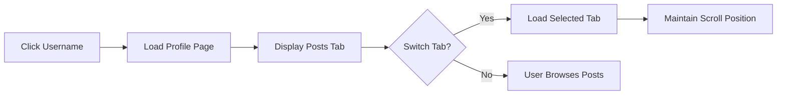

# User Profile System Requirements

## Profile Overview

The user profile system SHALL enable authenticated members to showcase their participation in the community platform while maintaining appropriate privacy controls. Profiles SHALL serve as personal dashboards that display user contributions, reputation metrics, and customization options, fostering community engagement and member identity.

## Profile Display Specifications

### Profile Information Structure
THE profile display SHALL present the following user information in a consistent, organized format:

- Display name (primary identifier)
- Profile avatar image
- Account creation date
- Total post count
- Total comment count

### Profile Header Requirements
THE profile header SHALL include:

- Profile picture (default or user-uploaded)
- Display name with unique identifier
- Account status indicator (verified or unverified)
- Follow/Unfollow action button for other members
- Three-dot menu for profile management options

WHEN a user views their own profile, THE system SHALL display an "Edit Profile" button in the header.

### User Identity Fields
THE system SHALL define the following identity fields:

- **Display Name**: THE user SHALL specify a display name during registration, which SHALL be between 3-20 characters and unique across the platform.
- **Username**: THE system SHALL generate a unique username that SHALL remain immutable after creation.
- **Profile Picture**: THE system SHALL provide a default avatar, and members SHALL have the option to upload a custom image (JPG, PNG, GIF; max 2MB).

## User Activity Tracking

### Post History Display
THE user profile SHALL display all posts created by the user, organized into the following tabs:

- All Posts (default view)
- Text Posts only
- Link Posts only
- Image Posts only

THE post history display SHALL include:

- Post title
- Community name with link
- Post type indicator
- Vote score (upvotes minus downvotes)
- Comment count
- Timestamp (relative format)
- Post status (active, edited, removed)

WHEN the user navigates to the posts tab, THE system SHALL load the most recent 20 posts and SHALL display a "Load More" option to retrieve additional posts.

THE system SHALL display the post count in the tab label and update it in real-time as the user creates new posts.

THE system SHALL show a loading indicator while retrieving posts from the server.

### Comment History Display
THE profile SHALL display a comprehensive history of user comments, including:

- Comment preview text (first 150 characters)
- Parent post title with link
n- Community name
- Vote score
- Timestamp
- Comment status (active, edited, removed)

THE comment history SHALL be sorted with the most recent comments first, and SHALL provide infinite scrolling to access older comments.

THE system SHALL display a loading spinwhile retrieving additional comments during infinite scrolling.

THE system SHALL cache recently viewed comment history to improve performance on subsequent visits.

### Activity Filtering and Sorting
THE system SHALL support the following sorting options for user activity:

- New (most recent first)
- Top (highest scoring)
- Controversial (high upvote/downvote ratio)

THE user SHALL be able to switch between sorting options, and THE system SHALL preserve the user's preferred sorting method across sessions.

WHEN a user changes the sorting method, THE system SHALL immediately reload the content with the new sort order.

THE sort selection dropdown SHALL display the currently selected sort method as the default option.

## Karma System Integration

### Karma Display Requirements
THE user profile SHALL prominently display the member's reputation score with the following specifications:

- Total karma score (sum of post and comment karma)
- Post karma breakdown
- Comment karma breakdown
- Upvote count received
- Downvote count received

THE karma metrics SHALL update in real-time as the user receives votes on their content.

THE profile SHALL display the user's current karma ranking in percentile format (e.g., "Top 15% of users").

THE system SHALL recalculate the percentile ranking daily based on the current user population.

### Karma Calculation Rules
THE karma system SHALL follow these business rules:

- User receives +1 karma for each upvote on their posts and comments
- User receives -1 karma for each downvote on their posts and comments
- Users DO NOT receive karma for voting on others' content
- Users MAY have negative total karma
- The system SHALL track karma by content type but SHALL NOT restrict functionality based on karma score

THE profile SHALL update karma displays immediately when votes are received, but SHALL only update percentile rankings on page refresh.

THE system SHALL persist karma data across user sessions and SHALL recover karma state after reauthentication.

## Profile Customization Requirements

### Editable Profile Fields
WHEN a member accesses profile editing, THE system SHALL allow modification of the following fields:

- Display name (limited to one change per 30 days)
- Profile bio/description (max 500 characters)
- Profile banner image (JPG, PNG, GIF; max 5MB)
- Privacy settings
- Notification preferences

THE system SHALL display the remaining time until next display name change is permitted.

THE system SHALL validate all input fields during profile editing and provide specific error messages for invalid input.

THE system SHALL allow only one active profile editing session per user at a time.

### Profile Personalization
THE system SHALL support personalized profile elements including:

- Profile bio with text formatting (bold, italic, links)
- Location field
- Website or portfolio link
- Social media connections
- Badge display for achievements

THE user SHALL be able to organize profile sections via drag-and-drop interface, and THE system SHALL save the preferred layout.

THE system SHALL preserve the order of profile sections across devices using account sync.

THE system SHALL display user badges in a dedicated section, sorted by date received.

### Profile Visibility Customization
THE member SHALL have control over profile visibility with the following options:

- Public (visible to all users)
- Members only (visible to authenticated users only)
- Private (only visible to the user themselves)

WHEN a profile is set to private, THE system SHALL not display any information about the user in community feeds, comment lists, or search results.

THE system SHALL allow users to set different visibility levels for profile sections (e.g., public posts, private comments).

THE privacy controls interface SHALL provide a preview of how the profile appears to different user types.

## Privacy and Visibility Rules

### Default Privacy Settings
THE system SHALL establish the following default privacy configuration upon account creation:

- Profile visibility: Public
- Activity history: Public
- Personal information: Public
- Badge display: Public

THE system SHALL document all default settings in the user onboarding tutorial.

### Privacy Control Requirements
THE profile privacy system SHALL allow granular control over information visibility:

- Users MAY set individual visibility for posts, comments, and profile information
- Users MAY restrict content visibility by community or user group
- Users MAY prevent indexing by search engines
- Users MAY disable profile viewing history tracking

WHEN a user updates privacy settings, THE system SHALL immediately apply changes to all visible content.

THE system SHALL allow users to create privacy templates for different scenarios (e.g., professional, personal).

THE privacy management interface SHALL group related settings into logical sections for usability.

### Anonymous Profile Viewing
THE system SHALL support anonymous profile viewing with the following behavior:

- Guest users MAY view public profiles
- Guest users SHALL NOT see karma details or personal information
- Guest users SHALL be prompted to register when attempting to interact with profile content

THE system SHALL detect and limit excessive anonymous profile viewing from single IP addresses.

THE user profile viewing logs SHALL not record anonymous view events to maintain privacy.

## User Scenarios and Workflows

### Profile Creation Workflow
THE new user profile creation process SHALL follow this sequence:

1. User completes registration and authentication
2. System automatically creates profile with default settings
3. System prompts user to customize profile during first login
4. User uploads profile picture and sets display name
5. System confirms profile activation



### Profile Navigation Workflow
THE user profile navigation process SHALL function as follows:

1. User clicks on any displayed username
2. System loads profile page with posts tab active
3. User may switch to comments tab or other sections
4. System maintains scroll position when switching between tabs
5. System preserves sorting preference across visits


### Profile Editing Workflow
THE profile editing process SHALL follow this workflow:

1. User clicks "Edit Profile" on their profile page
2. System displays editing modal with current values
3. User makes changes to profile fields
4. System validates changes before submission
5. User confirms changes
6. System saves and displays success message

```mermaid
graph LR
A["Click Edit Profile"] --> B["Open Editing Modal"]
B --> C["User Modifies Fields"]
++> D["System Validates Input"]
D --> E{"Valid?"}
E -->|"Yes"| F["User Confirms"]
E -->|"No"| G["Display Error"]
F --> H["System Saves Changes"]
H --> I["Show Success Message"]
```

THE system SHALL provide real-time validation feedback as users type in profile fields.

THE system SHALL allow users to cancel profile editing at any point before confirmation.

THE system SHALL temporarily save draft changes to prevent data loss during editing.

## Performance Requirements

### Profile Load Times
THE system SHALL load user profiles with the following performance targets:

- Initial page load: Complete within 2 seconds
- Tab switching: Complete within 0.5 seconds
- Sort option changes: Complete within 0.3 seconds
- Profile editing save: Complete within 1 second

THE profile loading sequence SHALL prioritize displaying the profile header and first content items before loading additional elements.

THE system SHALL implement skeleton loading states to improve perceived performance.

### Data Caching Strategy
THE system SHALL implement caching for profile data with the following rules:

- Cache profile metadata for 15 minutes
- Cache post and comment lists for 5 minutes
- Cache karma totals for 1 minute
- Cache shall be invalidated when user receives new votes or makes content changes

THE system SHALL use browser local storage for caching profile data when possible.

THE mobile application SHALL implement offline profile viewing with cached data.

## Error Handling

### Profile Not Found
IF the requested profile does not exist or has been deleted, THEN THE system SHALL:

- Display a user-friendly message: "Profile not found or has been removed"
- Provide a link to the home feed
- Not expose any information suggesting the user previously existed

THE system SHALL log the event for security monitoring to detect potential enumeration attacks.

### Privacy Violation
IF an authenticated user attempts to access a profile they do not have permission to view, THEN THE system SHALL:

- Display: "You do not have permission to view this profile"
- Log the access attempt for security monitoring
- Provide no additional information about the user

THE system SHALL not allow determination of whether a profile exists by observing response differences.

### Data Loading Errors
IF profile data fails to load completely, THEN THE system SHALL:

- Display available profile information (header, basic stats)
- Show error message: "Some profile content could not be loaded"
- Provide a "Retry" button to attempt reloading
- Preserve any user sorting or filtering preferences

THE system SHALL automatically retry data loading after short delays before presenting the error to the user.

### Profile Update Failures
IF profile update fails due to validation or system error, THEN THE system SHALL:

- Maintain the editing modal open
- Highlight fields with validation errors
- Provide specific error messages for each failed field
- Preserve user-entered values for re-submission

THE system SHALL limit profile update attempts to prevent abuse or spam.

THE system SHALL queue profile updates during temporary connectivity issues and process them when restored.

## Relationship to Other Documents

This document references and builds upon the following specifications:

- [User Roles and Authentication Requirements](./01-user-roles.md) for role-based access controls
- [Voting System Requirements](./05-voting-system.md) for karma calculations and display
- [Post Management Specifications](./04-post-management.md) for post history integration
- [Comment System Document](./06-comment-system.md) for comment history functionality
- [Subscription System](./08-subscription-system.md) for follow/unfollow features

> *Developer Note: This document defines **business requirements only**. All technical implementations (architecture, APIs, database design, etc.) are at the discretion of the development team.*