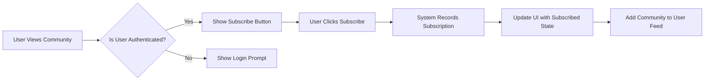
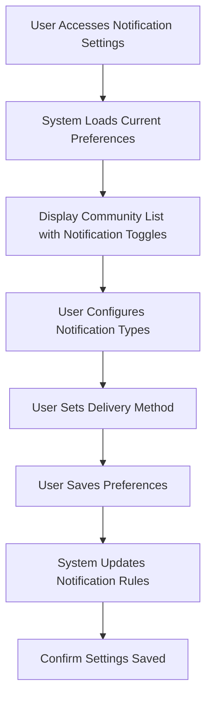
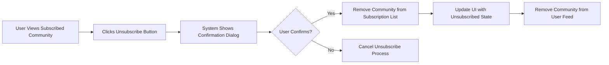
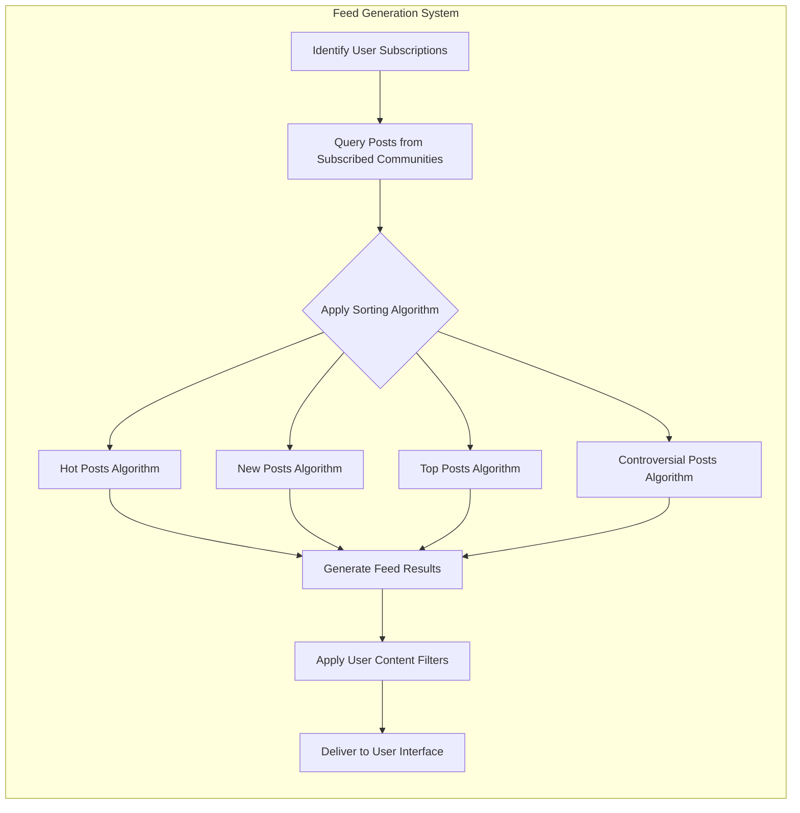

# Reddit-like Community Platform Requirements Analysis

## Service Overview

THE community platform SHALL be a discussion and content-sharing system that enables users to build and participate in communities of interest. The platform SHALL facilitate knowledge exchange, social connection, and content discovery through organized discussion threads, user-generated content, and community-driven moderation. This platform SHALL solve the problem of fragmented online discussions by providing a unified space where users can follow topics of interest through subscriptions and contribute to conversations with posts and comments.

## Business Model

### Why This Service Exists

This platform addresses the growing need for organized, topic-focused online communities where users can share content, engage in discussions, and build reputation through participation. While existing platforms offer social networking or forum capabilities, this service SHALL create a hybrid model that combines the best features of content aggregation, discussion forums, and social bookmarking to create engaging community experiences.

### Revenue Strategy

The platform SHALL generate revenue through multiple channels:
- Targeted advertising in high-traffic communities
- Premium subscription tier with enhanced features
- Sponsored community placements and promoted posts
- Verified community badges for organizations

### Growth Plan

User acquisition SHALL focus on enabling easy community creation and personalized content discovery. The subscription system SHALL drive user retention by delivering relevant content from followed communities. Growth SHALL be accelerated through referral programs and community-sharing features that encourage users to invite others to interesting discussions.

### Success Metrics

- Daily Active Users (DAU) and Monthly Active Users (MAU)
- Average number of subscriptions per active user
- Subscription retention rate (percentage of users maintaining subscriptions over time)
- Feed engagement time (average time spent viewing personalized content)
- Notification open and click-through rates
- Conversion rate from guest to registered user
- Revenue per user from advertising and premium subscriptions

## User Role Structure and Authentication Requirements

### Core Authentication Functions

- Users can register with email and password
- Users can log in to access their account
- Users can log out to end their session
- System maintains user sessions securely
- Users can verify their email address
- Users can reset forgotten passwords
- Users can change their password
- Users can revoke access from all devices

### User Role Hierarchy

#### Guest (Unauthenticated User)
- Can view public communities and posts
- Can view comments on posts
- Cannot create content
- Cannot vote
- Cannot subscribe to communities
- Can filter content by popularity metrics

#### Member (Authenticated User)
- Can create text, link, and image posts in communities
- Can comment on posts with nested replies
- Can upvote/downvote posts and comments
- Can subscribe to communities
- Can report inappropriate content
- Can edit own posts and comments within time limits
- Can manage profile settings
- Can view karma score (post and comment karma separately)
- Can filter feed by content type and sorting algorithm

#### Community Moderator
- Has all Member permissions
- Can moderate content in assigned communities
- Can remove posts/comments that violate rules
- Can ban users from specific communities
- Can edit community rules and settings
- Can appoint other moderators
- Can view reports for their communities
- Can take action on reported content
- Can send announcements to subscribers
- Can access community analytics

#### Administrator
- Has full system access
- Can create or remove any community
- Can assign moderator status to users
- Can ban users from entire platform
- Can view and act on all content reports
- Can manage platform-wide rules and settings
- Can access system analytics
- Can manage advertising and premium features
- Can override any content moderation decision
- Can suspend communities for policy violations

## Subscription Mechanics

### Core Subscription Requirements

THE subscription system SHALL allow authenticated users to follow communities of interest and receive content from them in a personalized feed.

WHEN a user navigates to a community page, THE system SHALL display a prominent subscribe button if the user is authenticated and doesn't already follow the community.

WHEN an unauthenticated user attempts to subscribe, THE system SHALL redirect to login flow while preserving the subscription intent.

WHEN a user successfully subscribes to a community, THE system SHALL immediately add that community to their personalized feed.

IF a user attempts to subscribe to a private community without invitation, THEN THE system SHALL display an appropriate message explaining access requirements.

IF a user attempts to subscribe to a suspended community, THEN THE system SHALL block subscription and notify that the community is currently suspended.

THE system SHALL prevent users from subscribing to the same community multiple times, with duplicate subscription attempts having no effect.

THE system SHALL allow users to subscribe to communities in any accessible category without restrictions on number or type.

### Subscription Process Flow

### Detailed Subscription Requirements

WHEN a user attempts to subscribe to a community, THE system SHALL verify the user is authenticated, the community exists, and the user has appropriate access permissions.

WHEN a user successfully subscribes to a community, THE system SHALL record the subscription with timestamp, update the community's subscriber count, and trigger feed reorganization.

IF the user is not authenticated, THEN THE system SHALL redirect to login flow and preserve subscription intent for after authentication.

If the community does not exist or has been deleted, THEN THE system SHALL display an error: "Community not found or has been removed."

If the community is private and the user lacks access, THEN THE system SHALL display: "This community requires an invitation to join."

If the community is restricted, THEN THE system SHALL allow subscription with appropriate messaging about approval requirements.

When a new user subscribes to a community, THE system SHALL trigger a welcome notification if enabled in community settings.

The subscription system SHALL maintain transactional integrity, ensuring subscription records, feed updates, and counters remain consistent even during system failures.

After a successful subscription, THE system SHALL display confirmation messaging: "You are now following [community name]."

The system SHALL update subscription counts in real-time, with changes visible across all user interfaces.

## Notification Preferences

### Notification Management Requirements

THE notification system SHALL allow users to customize their notification preferences for each subscribed community.

WHEN a user accesses notification settings, THE system SHALL display all subscribed communities with current notification configurations.

WHEN a user updates notification preferences for a community, THE system SHALL apply changes immediately and confirm successful update.

WHEN a user subscribes to a new community, THE system SHALL apply default notification settings which the user can later customize.

If the user disables all notification types for a community, THEN THE system SHALL treat this as active subscription with silent updates.

THE system SHALL allow users to set global notification preferences that apply to all current and future subscriptions.

THE system SHALL allow community-specific overrides of global notification preferences, with specific community settings taking precedence.</n
### Notification Types and Controls

Users can control notifications by type:
- New posts in subscribed communities
- Replies to user's comment threads
- Top weekly posts from subscribed communities
- Community announcements (moderator/admin posts)
- Digest summaries (daily/weekly with configurable content)
- Membership milestones (e.g., "Your community reached 1,000 members!")

Users can set delivery methods for notifications:
- In-app notifications
- Email
- Push notifications (mobile)
- SMS (for critical alerts, opt-in)

The system SHALL support notification batching to prevent overload, allowing users to receive digest summaries instead of individual alerts.

For each notification type, users can set time windows when notifications are delivered, supporting time-zone appropriate scheduling.

### Default Notification Settings

New users SHALL receive default notification settings upon registration:
- Global default: Email digests once per week, in-app notifications enabled
- Per-community default: Notifications enabled for community announcements and replies to user's posts

These defaults SHALL be optimized to drive engagement without overwhelming new users.

The system SHALL suggest notification settings based on user activity patterns and community engagement levels.

### Notification Delivery Requirements

THE system SHALL deliver notifications according to user preferences with the following reliability requirements:

WHEN a post is published in a subscribed community, THE system SHALL deliver notifications to users with appropriate settings within 5 minutes.

WHEN a user receives a reply to their comment, THE system SHALL deliver notifications within 1 minute.

The system SHALL implement exponential backoff for failed deliveries, attempting resend after 1, 5, 15, and 60 minutes.

THE system SHALL track delivery success rates and provide analytics to community moderators about subscriber engagement.

Users SHALL be able to access a notification history log showing all delivered and attempted notifications.

## Unsubscribe Process

### Unsubscription Requirements

THE system SHALL allow users to unfollow communities they no longer wish to receive content from.

THE unsubscription process SHALL be accessible from both community pages and subscription management interfaces.

THE system SHALL provide a confirmation step before completing unsubscription to prevent accidental removal.

THE system SHALL allow users to resubscribe to previously followed communities without restrictions.

THE system SHALL retain user's historical post and comment history in communities after unsubscription.

### Unsubscribe Flow

### Unsubscribe Business Rules

WHEN a user initiates unsubscription, THE system SHALL display confirmation dialog with community name to prevent accidental actions.

WHEN a user confirms unsubscription, THE system SHALL remove the community from their subscription list, update the feed immediately, and decrement the community's subscriber count.

IF a user chooses to cancel unsubscription, THEN THE system SHALL maintain current subscription status and return to previous interface.

THE system SHALL provide a "resubscribe" option for recently unsubscribed communities for a period of 30 days in the subscription management interface.

THE system SHALL retain user's post and comment history in the community after unsubscription, but no longer include new content in their feed.

THE system SHALL not send notifications for new content after successful unsubscription.

After unsubscription, THE system SHALL not display content from that community in the personalized feed.

THE system SHALL allow users to unsubscribe from multiple communities at once through bulk management tools.

## Feed Generation

### Personalized Feed Requirements

THE feed system SHALL aggregate posts from all user-subscribed communities into a single personalized content stream.

THE feed system SHALL support multiple sorting algorithms as specified in the post sorting requirements:
- Hot: Posts ranked by engagement relative to age
- New: Posts sorted by creation timestamp, newest first
- Top: Posts sorted by net vote score
- Controversial: Posts with high upvote/downvote ratio

THE feed system SHALL load posts incrementally as users scroll to ensure performance and responsiveness, loading 20 posts at a time.

THE system SHALL provide visual indicators when new posts are available that haven't been loaded.

### Feed Generation Process

### Feed Business Logic

WHEN a user requests their personal feed, THE system SHALL retrieve posts from all currently subscribed communities using the selected sorting algorithm.

WHEN generating the user feed, THE system SHALL exclude posts from communities the user has unsubscribed from.

WHEN a user switches feed sorting mode, THE system SHALL reapply the selected sorting algorithm across all subscribed communities.

THE system SHALL apply user-configured content filters (keyword blocking, domain blocking, NSFW content filtering) to all posts in the feed.

THE system SHALL prioritize posts from communities with higher user engagement when using "hot" sorting algorithm.

THE feed SHALL update in real-time to show new posts from subscribed communities, with appropriate refresh indicators.

THE system SHALL cache feed content for offline access and synchronize when reconnected.

The system SHALL implement infinite scroll with efficient loading to prevent performance degradation as users consume large amounts of content.

### Feed Personalization

THE system SHALL personalize the feed experience based on user behavior:

- Post visibility: Allow users to collapse post sections or hide specific types of content
- Feed layout: Support multiple view modes (card view, list view, compact view)
- Content diversity: Ensure feed includes content from all subscribed communities, not just the most active ones
- Priority communities: Allow users to designate certain communities as high-priority with content always appearing first

Users SHALL be able to save posts from their feed for later viewing through a bookmarking system.

The system SHALL provide feed analytics to users showing their content consumption patterns across different communities and content types.

### Community Migration and Ownership Change

IF a community undergoes ownership change or migration, THEN THE system SHALL maintain subscription continuity for all subscribers.

WHEN a community is transferred to new moderators or merged with another community, THE system SHALL notify subscribers of the change.

SUBSCRIBERS SHALL retain their subscription status through community rebranding, URL changes, or ownership transfers.

## Edge Cases and Business Rules

### Subscription Limitations

THE system SHALL allow users to subscribe to a maximum of 1,000 communities to maintain system performance and user experience quality.

WHEN a user reaches the subscription limit, THE system SHALL display a message suggesting they unsubscribe from inactive communities.

THE system SHALL allow administrators to adjust the subscription limit based on system capacity and business requirements.

THE subscription limit SHALL be evaluated across all communities regardless of type or access level.

### Community Status Changes

IF a community is deleted, THEN THE system SHALL automatically unsubscribe all members and remove it from their feed.

IF a community changes from public to private, THEN THE system SHALL automatically unsubscribe users who do not have access.

IF a community is suspended by moderators or administrators, THEN THE system SHALL temporarily disable notifications but retain subscription status.

WHEN a suspended community is reinstated, THE system SHALL resume normal subscription functionality and deliver missed notifications based on user settings.

IF a community restricted its membership after a user subscribed, THEN THE system SHALL maintain the user's subscription if they were grandfathered in under previous rules.

### Data Integrity and Synchronization

THE system SHALL synchronize subscription data across devices within 5 seconds of change.

THE system SHALL ensure transactional integrity when recording subscription changes to prevent data inconsistencies.

THE system SHALL audit all subscription changes for security monitoring and abuse detection.

The system SHALL implement conflict resolution for simultaneous subscription changes from multiple devices, favoring the most recent action.

Subscription changes SHALL be reflected in feed content within 10 seconds across all user interfaces.

## Error Scenarios and Recovery

### Connectivity Issues

IF network connectivity is lost during subscription attempt, THEN THE system SHALL queue the request and retry when connection is restored.

IF persistent connectivity issues prevent subscription sync, THEN THE system SHALL notify the user and provide manual sync option.

The system SHALL maintain local subscription state on user devices to allow continued feed access during temporary connectivity loss.

### Conflicting Actions

WHEN a user attempts to subscribe and unsubscribe simultaneously through different devices, THE system SHALL prioritize the most recent action and synchronize across devices.

WHEN conflicting subscription actions occur, THE system SHALL log the event for moderation review if it exceeds normal thresholds.

THE system SHALL detect and prevent subscription cycling (rapid subscribe/unsubscribe) that may indicate automated abuse.

### System Errors

IF the subscription system fails to process a request, THEN THE system SHALL return a specific error code and descriptive message.

IF the notification system fails to deliver messages, THEN THE system SHALL queue notifications for later delivery and monitor delivery success rates.

THE system SHALL implement fallback mechanisms for critical notifications, such as switching from push to email if delivery fails.

IN THE EVENT OF SYSTEM OUTAGE, THE system SHALL queue subscription changes and process them when systems are restored.

## Performance Requirements

### Subscription Operations

THE system SHALL process subscription and unsubscription requests within 1 second under normal load.

THE system SHALL support concurrent subscription operations from 5,000 users during peak periods.

THE system SHALL update subscription counters and feed content in real-time with less than 2 seconds delay.

### Feed Generation

THE system SHALL generate and deliver personalized feeds within 3 seconds of request.

THE system SHALL load additional feed pages within 1.5 seconds while scrolling.

WHEN a user has over 100 subscriptions, THE feed generation SHALL not exceed 5 seconds to maintain responsive user experience.

### Notification Delivery

THE system SHALL deliver 95% of non-critical notifications within 5 minutes of publication.

THE system SHALL deliver 95% of critical notifications (replies, mentions) within 30 seconds of publication.

THE notification system SHALL process 1,000,000 notification deliveries per hour during peak usage.

## Integration with Other Systems

### Authentication Integration

THE subscription system SHALL integrate with the authentication system to verify user identity and permissions.

WHEN a user's authentication token is refreshed, THE system SHALL ensure subscription data is synchronized across all active sessions.

IF a user's account is suspended or banned, THEN THE system SHALL automatically unsubscribe them from all communities and clear their feed.

The system SHALL include subscription count in user profile data returned by authentication endpoints.

### Content Reporting Integration

THE system SHALL prioritize reports from subscribers of a community in the content moderation queue.

WHEN a user reports content from a community they subscribe to, THE system SHALL include their subscription status as a credibility signal for moderators.

Community subscribers SHALL have the ability to report content with additional context about community norms and rules.

The reporting interface SHALL suggest relevant community rules when users from that community report content.

### Karma System Integration

THE subscription system SHALL consider user karma when recommending new communities to follow.

Users with higher karma in a topic area SHALL receive priority recommendations for related communities.

Community discovery algorithms SHALL factor in both user interests and expertise (as indicated by karma) when suggesting subscriptions.

## Success Metrics

- Average number of subscriptions per active user
- Daily active subscribers (users who view feed)
- Notification open and click-through rates
- Subscription retention rate (percentage of users maintaining subscriptions over 90 days)
- Unsubscribe reasons and rates
- Feed engagement time (average time spent viewing feed)
- Conversion rate from guest to registered user (driven by subscription prompts)
- User satisfaction with feed relevance (survey-based)

## Relationship to Other Documents

This requirement is connected to the following documents:

- [User Roles and Authentication Requirements](./01-user-roles.md)
- [Post Management Specifications](./04-post-management.md)
- [Voting System Requirements](./05-voting-system.md)
- [Post Sorting Algorithms](./07-post-sorting.md)
- [User Profile System](./09-user-profiles.md)
- [Content Reporting Workflow](./10-content-reporting.md)

> *Developer Note: This document defines **business requirements only**. All technical implementations (architecture, APIs, database design, etc.) are at the discretion of the development team.*