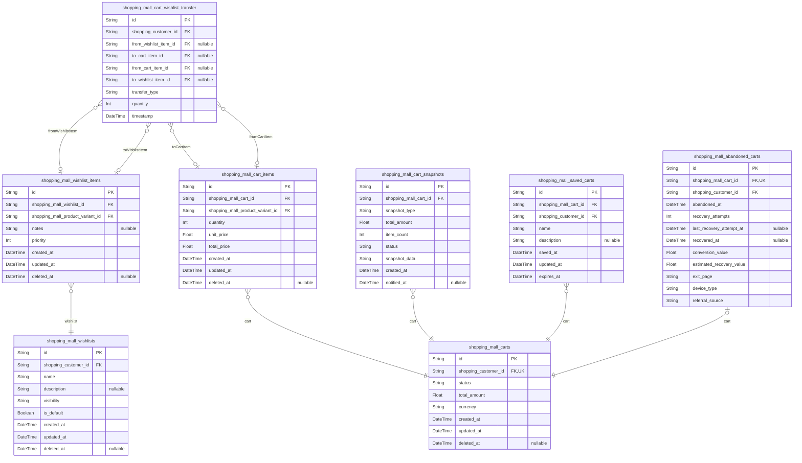
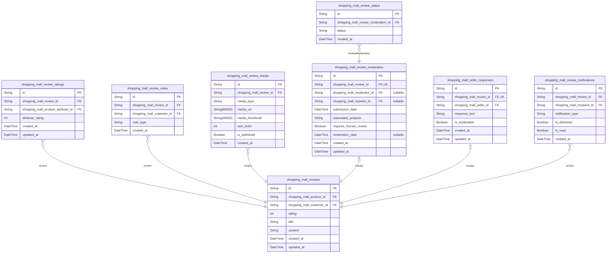
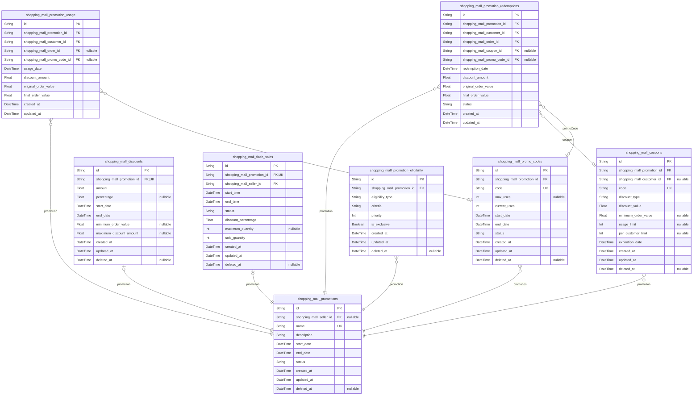

# Prisma Markdown

> Generated by [`prisma-markdown`](https://github.com/samchon/prisma-markdown)

- [Systematic](#systematic)
- [Actors](#actors)
- [Product](#product)
- [Carts](#carts)
- [Orders](#orders)
- [Payments](#payments)
- [Inventory](#inventory)
- [Reviews](#reviews)
- [Promotions](#promotions)
- [Administrative](#administrative)

## Systematic

### `shopping_mall_categories`

Stores platform-wide product categories that organize the shopping mall's
inventory structure with hierarchical relationships. These categories
provide the organizational framework for products and enhance product
discovery.

Properties as follows:

- `id`: Primary Key.
- `parent_id`
  > Optional parent category for hierarchical organization. {@link
  > shopping_mall_categories.id}.
- `creator_admin_id`
  > Administrator who created this category. {@link
  > shopping_mall_administrators.id}.
- `name`: Category name that identifies this product category in the shopping mall.
- `description`
  > Detailed description explaining the purpose and scope of this product
  > category.
- `slug`: URL-friendly version of the category name used in product navigation.
- `display_order`
  > Integer value determining the display order of this category in
  > navigation.
- `is_active`: Flag indicating whether this category is currently visible to customers.
- `created_at`: Timestamp when this category was created in the system.
- `updated_at`: Timestamp when this category was last modified.

### `shopping_mall_category_hierarchy`

Represents the hierarchical relationships between shopping mall
categories, enabling multi-level category structures. This table supports
category nesting and tree-like organizational patterns.

Properties as follows:

- `id`: Primary Key.
- `ancestor_id`
  > The ancestor category in the hierarchy relationship. {@link
  > shopping_mall_categories.id}.
- `descendant_id`
  > The descendant category in the hierarchy relationship. {@link
  > shopping_mall_categories.id}.
- `relation_creator_id`
  > Administrator who established this hierarchical relationship. {@link
  > shopping_mall_administrators.id}.
- `depth`
  > The level of separation between ancestor and descendant categories in the
  > hierarchy.
- `created_at`: Timestamp when this hierarchical relationship was created.
- `updated_at`: Timestamp when this hierarchical relationship was last modified.

### `shopping_mall_platform_settings`

Stores configurable platform-wide settings for the shopping mall
e-commerce system. These settings control global platform behavior,
policies, and operational parameters.

Properties as follows:

- `id`: Primary Key.
- `updated_by_admin_id`
  > Administrator who last modified these platform settings. {@link
  > shopping_mall_administrators.id}.
- `setting_key`
  > Unique key identifying the specific platform setting (e.g., 'site_name',
  > 'currency', 'tax_rate').
- `setting_value`
  > Current value of the platform setting, stored as text to accommodate
  > various data types.
- `setting_type`: Data type of the setting value (string, integer, decimal, boolean, json).
- `category`
  > Grouping category for the setting (e.g., 'general', 'payment',
  > 'shipping', 'display').
- `description`: Description explaining the purpose and impact of this setting.
- `is_encrypted`: Flag indicating whether this setting value is encrypted at rest.
- `status`: Current status of the setting (active, inactive, deprecated).
- `created_at`: Timestamp when this setting was first created.
- `updated_at`: Timestamp when this setting was last modified.

### `shopping_mall_search_terms`

Records popular and frequently searched terms within the shopping mall
platform, supporting search optimization, autocomplete features, and
trend analysis.

Properties as follows:

- `id`: Primary Key.
- `trend_analyzer_admin_id`
  > Administrator associated with analyzing search trends. {@link
  > shopping_mall_administrators.id}.
- `search_term`: The actual search query entered by users in the shopping mall platform.
- `search_count`: Number of times this search term has been used by platform users.
- `last_searched_at`: Timestamp when this search term was most recently used.
- `first_searched_at`: Timestamp when this search term was first recorded by the system.
- `is_blocked`: Flag indicating whether this search term is blocked from results.
- `created_at`: Timestamp when this search term was first recorded in the system.
- `updated_at`: Timestamp when this search term record was last modified.

### `shopping_mall_site_policies`

Contains the official policies and terms of service that govern the
shopping mall platform, providing legal compliance and user guidelines.

Properties as follows:

- `id`: Primary Key.
- `approved_by_admin_id`
  > Administrator who approved this policy version. {@link
  > shopping_mall_administrators.id}.
- `last_updated_by_admin_id`
  > Administrator who made the last update to this policy. {@link
  > shopping_mall_administrators.id}.
- `policy_name`: Name of the site policy (e.g., 'Privacy Policy', 'Terms of Service').
- `policy_key`: Unique key identifying the policy type for system references.
- `content`: Full text content of the policy document in HTML format.
- `version`: Semantic version number for this policy iteration.
- `effective_date`: Date when this policy version becomes effective.
- `status`: Current status of the policy (draft, approved, deprecated).
- `requires_user_consent`: Flag indicating if users must explicitly consent to this policy.
- `created_at`: Timestamp when this policy was created.
- `updated_at`: Timestamp when this policy was last modified.
- `deleted_at`: Timestamp when this policy was soft-deleted (if applicable).

## Actors

### `shopping_mall_customers`

Customer user entity that represents registered users who purchase
products through the shopping mall platform. Customers can browse
products, make purchases, manage their shopping experience, and submit
reviews for purchased products.

Properties as follows:

- `id`: Primary Key.
- `shopping_mall_user_profile_id`: User profile information. [shopping_mall_user_profiles.id](#shopping_mall_user_profiles).
- `email`: Unique email address used for authentication and communication.
- `password_hash`: Hashed password for secure authentication.
- `first_name`: Customer's first name.
- `last_name`: Customer's last name.
- `phone_number`: Customer's contact phone number.
- `created_at`: Timestamp when the customer account was created.
- `updated_at`: Timestamp when the customer account was last updated.
- `deleted_at`: Timestamp when the customer account was deleted (soft delete).

### `shopping_mall_sellers`

Seller user entity that represents vendor accounts managing product
listings and inventory within the marketplace. Sellers can create product
listings, manage inventory levels, view sales reports, and respond to
customer inquiries.

Properties as follows:

- `id`: Primary Key.
- `email`: Unique email address used for authentication and communication.
- `business_name`: Seller's business name.
- `business_registration_number`: Seller's business registration/identification number.
- `contact_person_name`: Seller's contact person name.
- `contact_person_phone`: Seller's contact person phone number.
- `created_at`: Timestamp when the seller account was created.
- `updated_at`: Timestamp when the seller account was last updated.
- `deleted_at`: Timestamp when the seller account was deleted (soft delete).
- `status`: Seller account status (active, inactive, suspended, under_review).

### `shopping_mall_administrators`

Administrator user entity that represents system administrators with full
access to manage all aspects of the shopping mall platform.
Administrators can oversee user accounts, manage product listings,
monitor orders, and configure system settings.

Properties as follows:

- `id`: Primary Key.
- `shopping_mall_user_profile_id`: User profile information. [shopping_mall_user_profiles.id](#shopping_mall_user_profiles).
- `email`: Unique email address used for authentication and communication.
- `password_hash`: Hashed password for secure authentication.
- `first_name`: Administrator's first name.
- `last_name`: Administrator's last name.
- `created_at`: Timestamp when the administrator account was created.
- `updated_at`: Timestamp when the administrator account was last updated.
- `deleted_at`: Timestamp when the administrator account was deleted (soft delete).
- `role`: Administrator role/position within the organization.
- `contact_phone`: Administrator's contact phone number.

### `shopping_mall_guests`

Guest user entity that represents unauthenticated users browsing the
shopping mall platform. Guests can browse products, view product details,
and add products to a temporary shopping cart, with the option to convert
to a registered customer during checkout.

Properties as follows:

- `id`: Primary Key.
- `shopping_mall_user_preferences_id`
  > User preferences for personalized experience. {@link
  > shopping_mall_user_preferences.id}.
- `created_at`: Timestamp when the guest session was created.
- `updated_at`: Timestamp when the guest session was last updated.
- `last_active_at`: Timestamp when the guest was last active.
- `user_agent`: Guest's browser user agent string.
- `ip_address`: Guest's IP address.
- `session_duration`: Duration of the guest session in minutes.

### `shopping_mall_user_profiles`

User profile entity that stores profile information for all user types
(customers, sellers, administrators). This table contains shared profile
attributes that can be referenced by different user roles.

Properties as follows:

- `id`: Primary Key.
- `profile_picture_id`: Reference to profile picture. [shopping_mall_product_images.id](#shopping_mall_product_images).
- `bio`: User's biography or description.
- `website`: User's personal or business website.
- `social_media_links`: JSON array of user's social media links.
- `avatar_url`: URL to user's avatar image.
- `display_name`: User's display name for public visibility.
- `created_at`: Timestamp when the user profile was created.
- `updated_at`: Timestamp when the user profile was last updated.

### `shopping_mall_user_addresses`

User address entity that stores shipping and billing address information
for users. Supports multiple addresses per user with designation of
primary address for order processing.

Properties as follows:

- `id`: Primary Key.
- `shopping_mall_customer_id`: Reference to customer. [shopping_mall_customers.id](#shopping_mall_customers).
- `shopping_mall_seller_id`: Reference to seller. [shopping_mall_sellers.id](#shopping_mall_sellers).
- `shopping_mall_administrator_id`: Reference to administrator. [shopping_mall_administrators.id](#shopping_mall_administrators).
- `address_type`: Type of address (home, work, billing, shipping, other).
- `recipient_name`: Name of the recipient at this address.
- `street_address`: Street address line.
- `street_address_line2`: Additional street address line (apartment, suite, etc.).
- `city`: City name.
- `state`: State or province name.
- `postal_code`: Postal or ZIP code.
- `country`: Country name.
- `is_primary`: Flag indicating if this is the primary address for the user.
- `created_at`: Timestamp when the address was created.
- `updated_at`: Timestamp when the address was last updated.

### `shopping_mall_user_sessions`

User session entity that captures JWT token information and manages user
authentication state securely. Stores session details including token,
expiration, user agent, and IP address.

Properties as follows:

- `id`: Primary Key.
- `shopping_mall_customer_id`: Reference to customer. [shopping_mall_customers.id](#shopping_mall_customers).
- `shopping_mall_seller_id`: Reference to seller. [shopping_mall_sellers.id](#shopping_mall_sellers).
- `shopping_mall_administrator_id`: Reference to administrator. [shopping_mall_administrators.id](#shopping_mall_administrators).
- `token`: JWT token for session authentication.
- `refresh_token`: Refresh token for session renewal.
- `expires_at`: Timestamp when the session expires.
- `created_at`: Timestamp when the session was created.
- `updated_at`: Timestamp when the session was last updated.
- `last_active_at`: Timestamp when the session was last active.
- `user_agent`: User's browser user agent string.
- `ip_address`: User's IP address.
- `is_active`: Flag indicating if the session is currently active.

### `shopping_mall_user_preferences`

User preferences entity that stores user-specific preferences for
personalized experience including language, theme, notification settings,
and privacy preferences.

Properties as follows:

- `id`: Primary Key.
- `shopping_mall_customer_id`: Reference to customer. [shopping_mall_customers.id](#shopping_mall_customers).
- `shopping_mall_seller_id`: Reference to seller. [shopping_mall_sellers.id](#shopping_mall_sellers).
- `shopping_mall_administrator_id`: Reference to administrator. [shopping_mall_administrators.id](#shopping_mall_administrators).
- `language`: User's preferred language code (e.g., en-US, ko-KR).
- `theme`: User's preferred theme (light, dark, system).
- `currency`: User's preferred currency code (e.g., USD, KRW).
- `date_format`: User's preferred date format.
- `time_format`: User's preferred time format (12h, 24h).
- `email_notifications`: Flag indicating if user wants to receive email notifications.
- `push_notifications`: Flag indicating if user wants to receive push notifications.
- `marketing_emails`: Flag indicating if user wants to receive marketing emails.
- `privacy_level`: User's privacy preference level (public, friends, private, anonymous).
- `created_at`: Timestamp when the preferences were created.
- `updated_at`: Timestamp when the preferences were last updated.
- `personalization_enabled`: Flag indicating if personalization features are enabled.

## Product

### `shopping_mall_products`

Core product information in the e-commerce platform. Contains essential
details about products available for purchase including title,
description, pricing, and status. This is a primary business entity that
customers interact with directly through browsing, searching, and
purchasing.

Properties as follows:

- `id`: Primary Key.
- `seller_id`: The seller who created the product. [shopping_mall_sellers.id](#shopping_mall_sellers).
- `primary_category_id`
  > The main category this product belongs to. {@link
  > shopping_mall_product_categories.id}.
- `title`: Product title visible to customers.
- `base_price`: Base price of the product before variant adjustments.
- `currency`: Currency code for the product price (e.g., USD, EUR).
- `brand`: Manufacturer or brand name.
- `product_status`: Lifecycle status of the product (draft, active, inactive, discontinued).
- `created_at`: When the product was created.
- `updated_at`: When the product was last updated.
- `deleted_at`: When the product was deleted (soft delete).

### `shopping_mall_product_attributes`

Structured attributes that describe product characteristics beyond basic
information. Contains specifications like material, warranty period,
dimensions, and other technical details that help customers evaluate
products. This is a subsidiary entity that supports the main product
information.

Properties as follows:

- `id`: Primary Key.
- `shopping_mall_product_id`: The product this attribute belongs to. [shopping_mall_products.id](#shopping_mall_products).
- `attribute_name`: Name of the product attribute (e.g., Material, Warranty, Dimensions).
- `attribute_value`: Value of the product attribute (e.g., Cotton, 2 years, 10x5x3 inches).
- `display_order`: Order in which this attribute should be displayed.
- `created_at`: When the attribute was created.
- `updated_at`: When the attribute was last updated.

### `shopping_mall_product_descriptions`

Rich text descriptions of products that provide detailed information to
potential customers. Contains the main product description with
formatting capabilities, longer than the basic product information. This
is a subsidiary entity that enhances the product presentation.

Properties as follows:

- `id`: Primary Key.
- `shopping_mall_product_id`
  > The product this description belongs to. {@link
  > shopping_mall_products.id}.
- `description_text`: The main product description with rich text content.
- `description_format`: Format of the description (markdown, html, plain).
- `created_at`: When the description was created.
- `updated_at`: When the description was last updated.

### `shopping_mall_product_images`

Images associated with products that visually represent the product to
customers. Contains references to image files and metadata such as
display order and alt text. This is a subsidiary entity that supports
product presentation.

Properties as follows:

- `id`: Primary Key.
- `shopping_mall_product_id`: The product this image belongs to. [shopping_mall_products.id](#shopping_mall_products).
- `image_url`: URL to the product image.
- `thumbnail_url`: URL to the thumbnail version of the product image.
- `display_order`: Order in which this image should be displayed.
- `alt_text`: Alternative text for accessibility purposes.
- `is_primary`: Whether this is the primary product image.
- `created_at`: When the image reference was created.
- `updated_at`: When the image reference was last updated.

### `shopping_mall_product_videos`

Video content associated with products that provide dynamic visual
information to customers. Contains references to video files and metadata
such as display order and captions. This is a subsidiary entity that
supports product presentation.

Properties as follows:

- `id`: Primary Key.
- `shopping_mall_product_id`: The product this video belongs to. [shopping_mall_products.id](#shopping_mall_products).
- `video_url`: URL to the product video.
- `thumbnail_url`: URL to the thumbnail image of the video.
- `video_title`: Title of the video content.
- `display_order`: Order in which this video should be displayed.
- `duration_seconds`: Duration of the video in seconds.
- `captions_url`: URL to caption file for accessibility.
- `created_at`: When the video reference was created.
- `updated_at`: When the video reference was last updated.

### `shopping_mall_product_variants`

Product variants (SKUs) representing different configurations of the same
product such as color, size, or material. Each variant has its own
pricing, inventory count, and availability. This is a primary business
entity due to its importance in inventory management and the purchasing
process.

Properties as follows:

- `id`: Primary Key.
- `shopping_mall_product_id`
  > The parent product this variant belongs to. {@link
  > shopping_mall_products.id}.
- `sku_code`: Unique stock keeping unit code for this variant.
- `price`: Current price of this variant.
- `inventory_count`: Current available inventory for this variant.
- `variant_status`: Status of the variant (active, out-of-stock, discontinued).
- `weight`: Weight of the variant in kilograms.
- `dimensions`: Dimensions of the variant (length x width x height).
- `created_at`: When the variant was created.
- `updated_at`: When the variant was last updated.
- `deleted_at`: When the variant was deleted (soft delete).

### `shopping_mall_product_options`

Configuration options that define the possible values for product
variants such as available colors, sizes, or materials. Each option
represents a specific attribute value that can be combined to create
product variants. This is a subsidiary entity that supports the product
variant system.

Properties as follows:

- `id`: Primary Key.
- `shopping_mall_product_id`: The product these options belong to. [shopping_mall_products.id](#shopping_mall_products).
- `option_group_id`
  > The group this option belongs to. {@link
  > shopping_mall_product_options.id}.
- `option_value`: Value of the option (e.g., Red, Large, Cotton).
- `display_order`: Order in which this option should be displayed.
- `created_at`: When the option was created.
- `updated_at`: When the option was last updated.

### `shopping_mall_product_reviews`

Customer reviews for products, containing ratings, written content, and
status information. Reviews undergo a moderation process before becoming
publicly visible. This is a primary business entity as it requires
independent management of its lifecycle and status.

Properties as follows:

- `id`: Primary Key.
- `shopping_mall_product_id`: The product being reviewed. [shopping_mall_products.id](#shopping_mall_products).
- `customer_id`: The customer who wrote the review. [shopping_mall_customers.id](#shopping_mall_customers).
- `rating`: Star rating from 1-5.
- `title`: Title of the review.
- `content`: Main content of the review.
- `review_status`: Current status of the review (draft, submitted, approved, rejected).
- `created_at`: When the review was created.
- `updated_at`: When the review was last updated.
- `deleted_at`: When the review was deleted (soft delete).

### `shopping_mall_product_tags`

Tags used to categorize and enhance discoverability of products. Tags
help with search functionality and allow customers to find related
products. This is a subsidiary entity that supports the search and
discovery system.

Properties as follows:

- `id`: Primary Key.
- `shopping_mall_product_id`: The product this tag belongs to. [shopping_mall_products.id](#shopping_mall_products).
- `tag_name`: Name of the tag (e.g., summer, gift, eco-friendly).
- `display_order`: Order in which this tag should be displayed.
- `created_at`: When the tag was created.
- `updated_at`: When the tag was last updated.

### `shopping_mall_product_categories`

Categories used to organize products in a hierarchical structure.
Categories enable browsing and filtering of products. This is a
subsidiary entity that provides organizational structure for the product
catalog.

Properties as follows:

- `id`: Primary Key.
- `parent_category_id`
  > The parent category if this is a subcategory. {@link
  > shopping_mall_product_categories.id}.
- `category_name`: Name of the product category.
- `description`: Description of the category.
- `category_image_url`: URL to the category image.
- `display_order`: Order in which this category should be displayed.
- `is_active`: Whether the category is active and visible to customers.
- `created_at`: When the category was created.
- `updated_at`: When the category was last updated.

## Carts

### `shopping_mall_carts`

Represents a user's shopping cart containing products they intend to
purchase. Each customer has exactly one active cart at a time, which
persists across sessions. The cart tracks items, quantities, prices, and
other purchase details before checkout. This is a primary entity as users
directly interact with their carts, managing items and proceeding to
checkout independently.

Properties as follows:

- `id`: Primary Key.
- `shopping_customer_id`: Customer who owns the cart. [shopping_mall_customers.id](#shopping_mall_customers).
- `status`: Current status of the cart (active, processing, completed, abandoned).
- `total_amount`: The total monetary value of all items in the cart.
- `currency`: The currency code for the cart's monetary values (e.g., USD).
- `created_at`: Timestamp when the cart was first created.
- `updated_at`: Timestamp when the cart was last updated.
- `deleted_at`: Timestamp when the cart was soft-deleted.

### `shopping_mall_cart_items`

Represents individual items within a shopping cart. Contains the specific
product/SKU, quantity, price at time of addition, and other details about
each item in a cart. This is a supporting entity (subsidiary) as it
exists to support the shopping_mall_carts table and has no independent
management or API operations outside the context of its parent cart.

Properties as follows:

- `id`: Primary Key.
- `shopping_mall_cart_id`: The cart to which this item belongs. [shopping_mall_carts.id](#shopping_mall_carts).
- `shopping_mall_product_variant_id`
  > The specific product variant (SKU) in this cart item. {@link
  > shopping_mall_product_variants.id}.
- `quantity`: The number of units of this item in the cart.
- `unit_price`: The price per unit at the time the item was added to the cart.
- `total_price`: The calculated total price for this item (quantity × unit_price).
- `created_at`: Timestamp when this item was added to the cart.
- `updated_at`: Timestamp when this item was last updated.
- `deleted_at`: Timestamp when this item was removed from the cart.

### `shopping_mall_wishlists`

Represents a user's wishlist containing products they want to save for
future purchase. Users can have multiple wishlists with different
purposes (e.g., gifts, personal items). Wishlists are independent
entities that users can create, rename, delete, and share. This is a
primary entity as users independently manage their wishlists regardless
of any single cart or product context.

Properties as follows:

- `id`: Primary Key.
- `shopping_customer_id`: Customer who owns the wishlist. [shopping_mall_customers.id](#shopping_mall_customers).
- `name`: The name of the wishlist (e.g., 'Birthday Gifts', 'Home Renovation').
- `description`: Optional description providing more details about the wishlist.
- `visibility`: Determines who can view the wishlist (public, private, shared).
- `is_default`: Indicates if this is the user's default wishlist.
- `created_at`: Timestamp when the wishlist was created.
- `updated_at`: Timestamp when the wishlist was last updated.
- `deleted_at`: Timestamp when the wishlist was soft-deleted.

### `shopping_mall_wishlist_items`

Represents individual items within a wishlist. Contains the specific
product/SKU added to a wishlist and associated metadata. This is a
supporting entity (subsidiary) as it exists solely to support the
shopping_mall_wishlists table and has no independent management. Users
manage wishlist items through their parent wishlist.

Properties as follows:

- `id`: Primary Key.
- `shopping_mall_wishlist_id`
  > The wishlist to which this item belongs. {@link
  > shopping_mall_wishlists.id}.
- `shopping_mall_product_variant_id`
  > The specific product variant (SKU) saved in this wishlist. {@link
  > shopping_mall_product_variants.id}.
- `notes`: User's personal notes about why they saved this item.
- `priority`: User's priority ranking for this wishlist item (1-5).
- `created_at`: Timestamp when this item was added to the wishlist.
- `updated_at`: Timestamp when this item was last updated.
- `deleted_at`: Timestamp when this item was removed from the wishlist.

### `shopping_mall_cart_wishlist_transfer`

Tracks transfers of items between carts and wishlists. Records when users
move items from their wishlist to cart or from cart to wishlist. This is
a supporting entity (subsidiary) as it's system-maintained and used to
analyze user behavior and preferences. It has no independent management
by users or administrators.

Properties as follows:

- `id`: Primary Key.
- `shopping_customer_id`: Customer who performed the transfer. [shopping_mall_customers.id](#shopping_mall_customers).
- `from_wishlist_item_id`
  > The wishlist item that was transferred. {@link
  > shopping_mall_wishlist_items.id}.
- `to_cart_item_id`
  > The resulting cart item after transfer. {@link
  > shopping_mall_cart_items.id}.
- `from_cart_item_id`: The cart item that was transferred. [shopping_mall_cart_items.id](#shopping_mall_cart_items).
- `to_wishlist_item_id`
  > The resulting wishlist item after transfer. {@link
  > shopping_mall_wishlist_items.id}.
- `transfer_type`: Type of transfer (wishlist_to_cart, cart_to_wishlist).
- `quantity`: Number of units transferred.
- `timestamp`: When the transfer occurred.

### `shopping_mall_cart_snapshots`

Captures point-in-time states of shopping carts for audit, recovery, and
analytics purposes. Stores the complete cart state at specific moments,
preserving product prices and availability as they existed at that time.
This is a snapshot entity as it captures historical cart states, enabling
cart recovery, price change analysis, and purchase behavior tracking.

Properties as follows:

- `id`: Primary Key.
- `shopping_mall_cart_id`
  > The cart whose state is captured in this snapshot. {@link
  > shopping_mall_carts.id}.
- `snapshot_type`
  > Reason for the snapshot (periodic, checkout_attempt, before_clearing,
  > etc.).
- `total_amount`: The total value of the cart at snapshot time.
- `item_count`: Number of items in the cart at snapshot time.
- `status`: Cart status at the time of snapshot.
- `snapshot_data`
  > Serialized data containing complete cart state (items, prices,
  > quantities).
- `created_at`: Timestamp when the cart snapshot was created.
- `notified_at`: When the user was notified of price changes (if applicable).

### `shopping_mall_saved_carts`

Represents carts that users have explicitly saved for future purchase.
Allows users to maintain multiple saved cart configurations for different
purchase scenarios. This is a supporting entity (subsidiary) as it
extends the functionality of shopping_mall_carts but is managed through
the same interfaces. Saved carts are essentially named references to
specific cart states.

Properties as follows:

- `id`: Primary Key.
- `shopping_mall_cart_id`: The original cart that was saved. [shopping_mall_carts.id](#shopping_mall_carts).
- `shopping_customer_id`: Customer who saved the cart. [shopping_mall_customers.id](#shopping_mall_customers).
- `name`
  > User-provided name for the saved cart (e.g., 'Office Supplies', 'Birthday
  > Gift').
- `description`: Optional description explaining the purpose of this saved cart.
- `saved_at`: When the cart was saved.
- `updated_at`: When the saved cart was last updated.
- `expires_at`: When the saved cart expires and should be cleaned up.

### `shopping_mall_abandoned_carts`

Tracks carts that were not completed through checkout. Used for cart
recovery, marketing analysis, and understanding user behavior. This is a
supporting entity (subsidiary) as it's automatically populated by the
system and used for analytics and automated recovery campaigns. It has no
direct user management interface.

Properties as follows:

- `id`: Primary Key.
- `shopping_mall_cart_id`: The abandoned cart. [shopping_mall_carts.id](#shopping_mall_carts).
- `shopping_customer_id`: Customer who abandoned the cart. [shopping_mall_customers.id](#shopping_mall_customers).
- `abandoned_at`: When the cart was identified as abandoned.
- `recovery_attempts`: Number of recovery attempts made for this abandoned cart.
- `last_recovery_attempt_at`: When the last recovery attempt was made.
- `recovered_at`: When the cart was recovered through a recovery attempt.
- `conversion_value`: Estimated value of items in the abandoned cart.
- `estimated_recovery_value`: Estimated value that could be recovered if the cart is completed.
- `exit_page`: URL where the user left the checkout process.
- `device_type`: Device used when cart was abandoned (desktop, mobile, tablet).
- `referral_source`: How the user arrived at the site (direct, google, social_media).

## Orders

### `shopping_mall_orders`

Contains core information about customer orders in the shopping mall
e-commerce platform. This table manages the primary transaction record
that links customers with their purchases, tracking order totals,
processing status, and customer information. As the central entity in the
order processing flow, it connects to various related tables for items,
payments, shipping, and order history.

Properties as follows:

- `id`: Primary Key.
- `shopping_mall_customer_id`: Customer who placed the order. [shopping_mall_customers.id](#shopping_mall_customers).
- `shopping_mall_order_status_id`: Current status of the order. [shopping_mall_order_status.id](#shopping_mall_order_status).
- `shopping_mall_payment_id`: Payment information for the order. [shopping_mall_payments.id](#shopping_mall_payments).
- `order_number`
  > Unique order identifier in format OM-YYYY-XXXXX where YYYY is the year
  > and XXXXX is sequential.
- `subtotal`: Total cost of items before shipping, taxes, and discounts.
- `shipping_cost`: Cost of shipping for the order.
- `tax_amount`: Total tax calculated based on shipping address and current tax rates.
- `discount_amount`: Total discount applied to the order from coupons or promotions.
- `total_amount`: Final total amount charged to the customer.
- `currency`: Currency code for the order (e.g., USD, EUR).
- `special_instructions`: Customer's special delivery or handling instructions.
- `created_at`: Timestamp when the order was created.
- `updated_at`: Timestamp when the order was last updated.

### `shopping_mall_order_items`

Details individual items within an order, tracking specific product
variants (SKUs), quantities, and pricing at the time of purchase. This
table ensures inventory accuracy by recording exactly what was sold and
serves as the foundation for order fulfillment by the seller.

Properties as follows:

- `id`: Primary Key.
- `shopping_mall_order_id`: Order to which this item belongs. [shopping_mall_orders.id](#shopping_mall_orders).
- `shopping_mall_product_id`: Product being ordered. [shopping_mall_products.id](#shopping_mall_products).
- `shopping_mall_seller_id`: Seller providing the product. [shopping_mall_sellers.id](#shopping_mall_sellers).
- `quantity`: Number of units ordered.
- `unit_price`: Price per unit at time of purchase.
- `total_price`: Total price for this item (quantity × unit_price).
- `currency`: Currency code for this item's price.
- `weight`: Weight of one unit for shipping calculations.
- `color`: Color variant of the product (e.g., Red, Blue).
- `size`: Size variant of the product (e.g., S, M, L).
- `material`: Material of the product (e.g., Cotton, Leather).
- `created_at`: Timestamp when the item was added to the order.
- `updated_at`: Timestamp when the item was last updated.

### `shopping_mall_order_snapshots`

Captures point-in-time snapshots of order details for audit and
historical purposes. This table preserves order information as it existed
at specific moments, ensuring data integrity for financial
reconciliation, dispute resolution, and customer service.

Properties as follows:

- `id`: Primary Key.
- `shopping_mall_order_id`: Order that was snapshotted. [shopping_mall_orders.id](#shopping_mall_orders).
- `order_number`: Order identifier from the original order.
- `subtotal`: Order subtotal at snapshot time.
- `shipping_cost`: Shipping cost at snapshot time.
- `tax_amount`: Tax amount at snapshot time.
- `discount_amount`: Discount amount at snapshot time.
- `total_amount`: Total amount at snapshot time.
- `currency`: Currency at snapshot time.
- `special_instructions`: Special instructions at snapshot time.
- `order_status_name`: Name of the order status at snapshot time (e.g., Processing, Shipped).
- `snapshot_timestamp`: Timestamp when the snapshot was taken.
- `snapshot_reason`: Reason for taking the snapshot (e.g., order confirmation, status change).

### `shopping_mall_order_status`

Lookup table containing all possible order statuses in the shopping mall
system. This table ensures data consistency by standardizing order status
values across the platform and provides a centralized definition of the
order lifecycle.

Properties as follows:

- `id`: Primary Key.
- `shopping_mall_order_status_group_id`
  > Group that this status belongs to (e.g., Active, Cancelled). {@link
  > shopping_mall_sellers.id}.
- `name`: Name of the order status (e.g., Processing, Shipped, Delivered).
- `display_order`: Order for displaying status in workflows.
- `is_final_state`: Indicates if this is a terminal state (e.g., Delivered, Cancelled).
- `created_at`: Timestamp when the status was created.
- `updated_at`: Timestamp when the status was last updated.

### `shopping_mall_order_tracking`

Manages shipping and delivery tracking information for orders, linking
order details with carrier services. This table enables real-time status
updates, automated notifications, and delivery issue resolution.

Properties as follows:

- `id`: Primary Key.
- `shopping_mall_order_id`: Order being tracked. [shopping_mall_orders.id](#shopping_mall_orders).
- `shipping_carrier_id`
  > Carrier service responsible for delivery. {@link
  > shopping_mall_sellers.id}.
- `tracking_number`: Unique tracking identifier provided by the carrier.
- `tracking_url`: URL for real-time tracking on carrier's website.
- `estimated_delivery_date`: Carrier's estimated date and time of delivery.
- `actual_delivery_date`: Date and time when delivery was confirmed.
- `delivery_signature`: Name of person who signed for delivery (if applicable).
- `delivery_instructions`: Special delivery instructions (e.g., leave at door).
- `delivery_attempts`: Number of delivery attempts made.
- `last_status_update`: Most recent status update from carrier (e.g., Out for Delivery).
- `last_location`: Last known location of the package.
- `created_at`: Timestamp when tracking was created.
- `updated_at`: Timestamp when tracking was last updated.

### `shopping_mall_order_history`

Comprehensive audit trail of all changes to orders, tracking when, why,
and by whom modifications were made. This table supports accountability,
troubleshooting, and compliance requirements.

Properties as follows:

- `id`: Primary Key.
- `shopping_mall_order_id`: Order that was modified. [shopping_mall_orders.id](#shopping_mall_orders).
- `modified_by_user_id`: User who made the change. [shopping_mall_customers.id](#shopping_mall_customers).
- `shopping_mall_administrator_id`
  > Administrator who made the change (if applicable). {@link
  > shopping_mall_administrators.id}.
- `change_type`: Type of change made (e.g., status_update, item_added, item_removed).
- `field_name`: Name of the field that was changed.
- `previous_value`: Value before the change.
- `new_value`: Value after the change.
- `reason`: Reason provided for the change.
- `ip_address`: IP address from which the change was made.
- `user_agent`: Browser/device information for the change.
- `created_at`: Timestamp when the change was recorded.

### `shopping_mall_order_cancellations`

Records instances when orders are cancelled, capturing the reason,
timing, and financial implications. This table manages the cancellation
workflow and ensures proper inventory restoration and customer
notification.

Properties as follows:

- `id`: Primary Key.
- `shopping_mall_order_id`: Order that was cancelled. [shopping_mall_orders.id](#shopping_mall_orders).
- `cancelled_by_user_id`: User who requested cancellation. [shopping_mall_customers.id](#shopping_mall_customers).
- `shopping_mall_administrator_id`
  > Administrator who processed cancellation (if applicable). {@link
  > shopping_mall_administrators.id}.
- `cancellation_reason`: Reason for cancellation (e.g., change_of_mind, out_of_stock).
- `cancellation_notes`: Additional notes about the cancellation.
- `cancellation_fee`: Fee charged for cancellation (if applicable).
- `refund_amount`: Amount to be refunded to customer.
- `currency`: Currency for financial amounts.
- `processing_status`: Status of cancellation processing (e.g., requested, approved, completed).
- `approved_at`: Timestamp when cancellation was approved.
- `completed_at`: Timestamp when cancellation was completed.
- `created_at`: Timestamp when cancellation was initiated.
- `updated_at`: Timestamp when cancellation was last updated.

### `shopping_mall_order_returns`

Manages the return process for order items, tracking return requests,
approvals, and restocking. This table coordinates the reverse logistics
workflow and ensures proper inventory and financial reconciliation.

Properties as follows:

- `id`: Primary Key.
- `shopping_mall_order_id`: Original order for returned items. [shopping_mall_orders.id](#shopping_mall_orders).
- `shopping_mall_customer_id`: Customer requesting return. [shopping_mall_customers.id](#shopping_mall_customers).
- `shopping_mall_administrator_id`: Administrator processing return. [shopping_mall_administrators.id](#shopping_mall_administrators).
- `return_shipping_carrier_id`: Carrier service for return shipping. [shopping_mall_sellers.id](#shopping_mall_sellers).
- `return_reason`: Reason for return (e.g., wrong_item, damaged, not_as_described).
- `return_notes`: Additional information about the return.
- `return_status`
  > Current status of return processing (e.g., requested, approved, received,
  > refunded).
- `refund_method`: Method of refund (e.g., original_payment, store_credit).
- `refund_amount`: Amount to be refunded for the return.
- `currency`: Currency for financial amounts.
- `return_shipping_cost`: Cost of return shipping (sometimes borne by customer).
- `restocking_fee`: Fee for processing returned items back into inventory.
- `return_tracking_number`: Tracking number for the return shipment.
- `estimated_arrival_date`: Estimated date when returned items will be received.
- `actual_receipt_date`: Date when returned items were actually received.
- `inspection_notes`: Notes from inspecting returned items.
- `condition_rating`: Rating of item condition upon return (1-5 scale).
- `created_at`: Timestamp when return was initiated.
- `updated_at`: Timestamp when return was last updated.

### `shopping_mall_order_issues`

Tracks problems or disputes related to orders, such as fulfillment
issues, customer complaints, or quality concerns. This table manages the
case resolution workflow and ensures proper communication between
customers and support staff.

Properties as follows:

- `id`: Primary Key.
- `shopping_mall_order_id`: Order with the issue. [shopping_mall_orders.id](#shopping_mall_orders).
- `shopping_mall_customer_id`: Customer reporting the issue. [shopping_mall_customers.id](#shopping_mall_customers).
- `assigned_to_administrator_id`
  > Administrator assigned to resolve the issue. {@link
  > shopping_mall_administrators.id}.
- `related_seller_id`
  > Seller associated with the order items in question. {@link
  > shopping_mall_sellers.id}.
- `issue_type`: Category of issue (e.g., shipping_delay, damaged_item, wrong_item).
- `issue_description`: Detailed description of the problem.
- `urgency_level`: Priority of the issue (e.g., low, medium, high, critical).
- `current_status`: Status of issue resolution (e.g., reported, under_review, resolved).
- `resolution_notes`: Notes about how the issue was resolved.
- `compensation_offered`: Monetary compensation provided (if any).
- `compensation_currency`: Currency for compensation.
- `is_customer_satisfied`: Indicates if customer was satisfied with resolution.
- `resolution_time_hours`: Time taken to resolve the issue in hours.
- `first_response_time_hours`: Time taken to first respond to the issue in hours.
- `created_at`: Timestamp when issue was reported.
- `updated_at`: Timestamp when issue was last updated.
- `resolved_at`: Timestamp when issue was resolved.

### `shopping_mall_order_notifications`

Manages communication events related to orders, tracking what
notifications were sent, to whom, and when. This table ensures customers
are properly informed about order status changes and critical events.

Properties as follows:

- `id`: Primary Key.
- `shopping_mall_order_id`: Order related to the notification. [shopping_mall_orders.id](#shopping_mall_orders).
- `notification_type`
  > Type of notification (e.g., order_confirmation, shipping_update,
  > delivery_reminder).
- `recipient_type`: Type of recipient (e.g., customer, seller, administrator).
- `recipient_id`: ID of the specific recipient (for targeting specific customers/sellers).
- `recipient_email`: Email address where notification was sent.
- `subject`: Subject line of the notification.
- `message_body`: Content of the notification message.
- `communication_channel`: Method of delivery (e.g., email, sms, in_app).
- `delivery_status`: Status of notification delivery (e.g., sent, failed, delivered, read).
- `failure_reason`: Reason for delivery failure (if applicable).
- `sent_at`: Timestamp when notification was sent.
- `delivered_at`: Timestamp when delivery was confirmed.
- `read_at`: Timestamp when the notification was read.
- `created_at`: Timestamp when the notification record was created.
- `updated_at`: Timestamp when the notification was last updated.

## Payments

### `shopping_mall_payments`

Handles payment processing for orders within the shopping mall e-commerce
platform

Properties as follows:

- `id`: Primary Key.
- `shopping_mall_payment_methods_id`: Payment method used. [shopping_mall_payment_methods.id](#shopping_mall_payment_methods).
- `order_id`: Associated order for this payment.
- `amount`: Payment amount in the specified currency.
- `currency`: Currency code (e.g., USD, EUR, KRW).
- `status`: Payment status (e.g., pending, confirmed, failed).
- `created_at`: Timestamp when payment was initiated.
- `updated_at`: Timestamp of last payment status update.
- `deleted_at`: Timestamp when payment was deleted or canceled.

### `shopping_mall_payment_transactions`

Records individual transactions for payment processing and reconciliation

Properties as follows:

- `id`: Primary Key.
- `shopping_mall_payments_id`: Payment this transaction belongs to. [shopping_mall_payments.id](#shopping_mall_payments).
- `transaction_id`: External transaction identifier from payment processor.
- `amount`: Transaction amount.
- `currency`: Currency code for transaction.
- `transaction_type`: Type of transaction (authorization, capture, refund, etc.).
- `status`: Transaction status (success, failed, pending).
- `response_code`: Response code from payment gateway.
- `response_message`: Human-readable response message from gateway.
- `created_at`: Timestamp when transaction was processed.
- `updated_at`: Timestamp of last transaction update.

### `shopping_mall_payment_methods`

Stores available payment methods for customers to use in the shopping mall

Properties as follows:

- `id`: Primary Key.
- `shopping_mall_customers_id`: Customer who owns this payment method. [shopping_mall_customers.id](#shopping_mall_customers).
- `type`
  > Payment method type (credit_card, debit_card, digital_wallet,
  > bank_transfer).
- `provider`: Payment provider (Visa, MasterCard, PayPal, etc.).
- `account_reference`: Masked account number or token for the payment method.
- `expiry_date`: Expiry date for card-based payment methods.
- `billing_address`: Billing address associated with this payment method.
- `is_default`: Whether this is the default payment method for the customer.
- `status`: Payment method status (active, inactive, expired).
- `created_at`: Timestamp when payment method was added.
- `updated_at`: Timestamp of last payment method update.

### `shopping_mall_refunds`

Handles refund processing for canceled orders and returned items

Properties as follows:

- `id`: Primary Key.
- `shopping_mall_payments_id`: Payment being refunded. [shopping_mall_payments.id](#shopping_mall_payments).
- `shopping_mall_orders_id`: Order associated with this refund. [shopping_mall_orders.id](#shopping_mall_orders).
- `refund_amount`: Amount being refunded.
- `currency`: Currency code for refund.
- `reason`: Reason for refund (cancellation, return, warranty, etc.).
- `status`: Refund status (pending, processing, completed, failed).
- `processed_by`: Administrator or system that processed the refund.
- `created_at`: Timestamp when refund was requested.
- `updated_at`: Timestamp of last refund status update.
- `deleted_at`: Timestamp when refund was canceled.

### `shopping_mall_refund_transactions`

Records individual transactions for refund processing and reconciliation

Properties as follows:

- `id`: Primary Key.
- `shopping_mall_refunds_id`: Refund this transaction belongs to. [shopping_mall_refunds.id](#shopping_mall_refunds).
- `transaction_id`: External transaction identifier from payment processor.
- `amount`: Refund transaction amount.
- `currency`: Currency code for transaction.
- `status`: Transaction status (success, failed, pending).
- `response_code`: Response code from payment gateway.
- `response_message`: Human-readable response message from gateway.
- `created_at`: Timestamp when refund transaction was processed.
- `updated_at`: Timestamp of last transaction update.

### `shopping_mall_fraud_detection`

System for detecting and preventing fraudulent payment activities

Properties as follows:

- `id`: Primary Key.
- `shopping_mall_payments_id`: Payment being evaluated for fraud. [shopping_mall_payments.id](#shopping_mall_payments).
- `shopping_mall_customers_id`
  > Customer associated with this fraud detection. {@link
  > shopping_mall_customers.id}.
- `risk_score`: Calculated risk score (0-1) for potential fraud.
- `detection_rules`: Comma-separated list of fraud detection rules triggered.
- `ip_address`: IP address from payment request.
- `device_fingerprint`: Unique identifier for customer's device.
- `geolocation_data`: Geolocation information from IP address.
- `transaction_velocity`: Number of transactions from this customer in defined period.
- `status`: Fraud detection status (pending, cleared, flagged, blocked).
- `reviewed_by`: Administrator who reviewed this fraud detection.
- `created_at`: Timestamp when fraud detection was triggered.
- `updated_at`: Timestamp of last fraud detection status update.

### `shopping_mall_payment_gateways`

Stores information about available payment gateway integrations

Properties as follows:

- `id`: Primary Key.
- `configured_by`
  > Administrator who configured this gateway. {@link
  > shopping_mall_administrators.id}.
- `gateway_name`: Name of the payment gateway (Stripe, PayPal, etc.).
- `api_key`: API key for gateway integration.
- `secret_key`: Secret key for secure gateway communication.
- `webhook_url`: URL for gateway webhook notifications.
- `status`: Gateway status (active, inactive, testing).
- `supported_currencies`: JSON array of supported currencies.
- `supported_methods`: JSON array of supported payment methods.
- `transaction_fee_rate`: Transaction fee percentage charged by this gateway.
- `created_at`: Timestamp when gateway was configured.
- `updated_at`: Timestamp of last gateway configuration update.

### `shopping_mall_payment_logs`

Detailed logging of all payment system activities for auditing and debugging

Properties as follows:

- `id`: Primary Key.
- `shopping_mall_payments_id`: Payment associated with this log entry. [shopping_mall_payments.id](#shopping_mall_payments).
- `shopping_mall_refunds_id`: Refund associated with this log entry. [shopping_mall_refunds.id](#shopping_mall_refunds).
- `initiated_by`
  > User or system that initiated the payment activity. {@link
  > shopping_mall_administrators.id}.
- `log_level`: Severity level of log (debug, info, warning, error).
- `message`: Log message describing the activity.
- `source`: Component that generated the log (gateway, fraud_detection, etc.).
- `details`: Additional JSON details about the log event.
- `ip_address`: IP address from which the activity originated.
- `user_agent`: User agent string from client request.
- `created_at`: Timestamp when log entry was created.

## Inventory

### `shopping_mall_inventory`

Core inventory tracking entity that maintains current stock levels for
all product variants (SKUs) in the e-commerce platform. This table is the
primary source of truth for inventory availability and prevents
overselling by ensuring real-time stock accuracy. Each record represents
the current state of inventory for a specific SKU.

Properties as follows:

- `id`: Primary Key.
- `shopping_product_variant_id`
  > The product variant (SKU) being tracked. {@link
  > shopping_mall_product_variants.id}.
- `shopping_seller_id`
  > The seller responsible for this inventory. {@link
  > shopping_mall_sellers.id}.
- `shopping_mall_location_id`
  > The physical or virtual location where inventory is stored. {@link
  > shopping_mall_sellers.id}.
- `shopping_mall_warehouse_id`: The warehouse managing this inventory. [shopping_mall_sellers.id](#shopping_mall_sellers).
- `quantity`
  > Current stock count for this SKU. Must be a non-negative integer
  > reflecting available inventory.
- `reserved_quantity`
  > Quantity of inventory reserved for pending orders that have not yet been
  > confirmed. Prevents overselling.
- `available_quantity`
  > Calculated field representing quantity available for sale (quantity -
  > reserved_quantity).
- `business_status`
  > Current inventory status (in_stock, low_stock, out_of_stock) used for
  > business logic and user interface.
- `cost_price`
  > Per-unit cost price of the inventory for accounting and profit
  > calculation purposes.
- `last_count_date`
  > Date and time when the physical inventory count was last performed for
  > accuracy verification.
- `count_accuracy`
  > Percentage accuracy rating of the current inventory count based on recent
  > physical audits.
- `reorder_point`: Minimum quantity level that triggers automatic restocking alerts.
- `created_at`: Timestamp when this inventory record was created.
- `updated_at`: Timestamp when this inventory record was last updated.
- `deleted_at`
  > Soft delete timestamp. When set, this inventory is considered deactivated
  > but retains history.

### `shopping_mall_inventory_snapshots`

Historical snapshot table that captures point-in-time states of inventory
records for audit, reporting, and recovery purposes. Each snapshot
preserves the complete state of an inventory record at a specific moment,
allowing the system to reconstruct inventory levels at any previous date
and track changes over time.

Properties as follows:

- `id`: Primary Key.
- `shopping_mall_inventory_id`
  > The inventory record this snapshot is capturing. {@link
  > shopping_mall_inventory.id}.
- `created_by_admin_id`
  > The administrator who created or triggered this snapshot. {@link
  > shopping_mall_administrators.id}.
- `created_by_seller_id`
  > The seller who created or triggered this snapshot. {@link
  > shopping_mall_sellers.id}.
- `quantity`: Stock count at the time of snapshot.
- `reserved_quantity`: Reserved quantity at the time of snapshot.
- `available_quantity`: Available quantity at the time of snapshot.
- `business_status`: Inventory status at the time of snapshot.
- `cost_price`: Cost price at the time of snapshot.
- `reorder_point`: Reorder point at the time of snapshot.
- `snapshot_type`
  > Type of snapshot created: scheduled, manual, adjustment, transfer,
  > writeoff, audit.
- `source`: Source of the snapshot: UI, API, batch process, import, system trigger.
- `created_at`
  > Timestamp when this snapshot was created, which is the point-in-time
  > being captured.

### `shopping_mall_inventory_adjustments`

Table that records manual inventory adjustments made by administrators,
warehouse managers, or automated processes. These adjustments account for
discrepancies between system records and physical counts, handling
scenarios like received shipments, damaged goods, and stock corrections.
Each adjustment represents a delta change to inventory levels.

Properties as follows:

- `id`: Primary Key.
- `shopping_mall_inventory_id`: The inventory record being adjusted. [shopping_mall_inventory.id](#shopping_mall_inventory).
- `admin_id`
  > The administrator who authorized this adjustment. {@link
  > shopping_mall_administrators.id}.
- `suspended_by_admin_id`
  > The administrator who suspended or reverted this adjustment. {@link
  > shopping_mall_administrators.id}.
- `warehouse_manager_id`
  > The warehouse manager responsible for this adjustment. {@link
  > shopping_mall_sellers.id}.
- `approver_admin_id`
  > The administrator who approved this adjustment. {@link
  > shopping_mall_administrators.id}.
- `previous_quantity`: Inventory quantity before the adjustment was applied.
- `new_quantity`: Inventory quantity after the adjustment was applied.
- `quantity_delta`: Change in inventory quantity (new_quantity - previous_quantity).
- `type`: Type of adjustment: positive, negative, or transfer_out.
- `reason`
  > Justification for the adjustment (received_shipment, physical_count,
  > damage, counting_error, expired).
- `description`: Detailed explanation of why the adjustment was necessary.
- `adjustment_date`: Date and time when the actual physical adjustment occurred.
- `adjustment_status`: Current status of the adjustment: pending, approved, rejected, completed.
- `approval_date`: Date and time when the adjustment was approved by the administrator.
- `suspension_reason`: Reason why this adjustment was suspended or reverted.
- `suspension_date`: Date and time when this adjustment was suspended.
- `adjustment_source`: Source of the adjustment: manual, automated, import, system.
- `created_at`: Timestamp when this adjustment record was created.
- `updated_at`: Timestamp when this adjustment record was last updated.

### `shopping_mall_inventory_history`

Subsidiary table that maintains a complete historical record of all
changes to inventory levels over time. This table aggregates data from
inventory snapshots, adjustments, transfers, write-offs, and other
inventory movements to provide a comprehensive audit trail of stock
changes. It is designed to support reporting, analytics, and inventory
trend analysis.

Properties as follows:

- `id`: Primary Key.
- `shopping_mall_inventory_id`
  > The inventory record this history entry relates to. {@link
  > shopping_mall_inventory.id}.
- `shopping_mall_inventory_adjustment_id`
  > The specific inventory adjustment that caused this change. {@link
  > shopping_mall_inventory_adjustments.id}.
- `shopping_mall_inventory_transfer_id`
  > The inventory transfer that caused this change. {@link
  > shopping_mall_inventory_transfers.id}.
- `shopping_mall_inventory_writeoff_id`
  > The inventory write-off that caused this change. {@link
  > shopping_mall_inventory_writeoffs.id}.
- `created_by_admin_id`
  > The administrator who initiated or approved the change. {@link
  > shopping_mall_administrators.id}.
- `quantity_before`: Inventory quantity before the change occurred.
- `quantity_after`: Inventory quantity after the change was applied.
- `quantity_delta`: Net change in inventory quantity for this event.
- `change_type`
  > Type of inventory change: adjustment, transfer_in, transfer_out,
  > writeoff, sale, restock.
- `change_source`: Source of the change: system, user, API, import, batch.
- `change_reason`: Reason for the change, corresponding to the specific event that caused it.
- `location_from`: Previous location for transfer events. [shopping_mall_locations.id](#shopping_mall_locations).
- `location_to`: New location for transfer events. [shopping_mall_locations.id](#shopping_mall_locations).
- `warehouse_from`
  > Previous warehouse for transfer events. {@link
  > shopping_mall_warehouses.id}.
- `warehouse_to`: New warehouse for transfer events. [shopping_mall_warehouses.id](#shopping_mall_warehouses).
- `business_status`: Inventory status after the change was applied.
- `is_reversal`: Indicates if this change reverses a previous inventory event.
- `reversal_for_id`
  > Reference to the inventory history record being reversed. {@link
  > shopping_mall_inventory_history.id}.
- `created_at`: Timestamp when this change was recorded in the system.
- `updated_at`: Timestamp when this history record was last updated.
- `processed_at`
  > Timestamp when this change was processed and reflected in inventory
  > counts.

### `shopping_mall_inventory_thresholds`

Table that defines configurable thresholds for inventory levels that
trigger automated alerts and business workflows. These thresholds
represent the business rules for when inventory should be monitored or
action should be taken, such as low-stock alerts, reorder triggers, and
high-stock warnings. Each threshold is associated with a specific
inventory record.

Properties as follows:

- `id`: Primary Key.
- `shopping_mall_inventory_id`
  > The inventory record this threshold applies to. {@link
  > shopping_mall_inventory.id}.
- `created_by_admin_id`
  > The administrator who created this threshold. {@link
  > shopping_mall_administrators.id}.
- `last_modified_by_admin_id`
  > The administrator who last modified this threshold. {@link
  > shopping_mall_administrators.id}.
- `low_stock_threshold`: Minimum quantity level that triggers low-stock alerts.
- `reorder_threshold`: Quantity level that triggers automatic reorder processes.
- `high_stock_threshold`
  > Maximum quantity level that triggers high-stock alerts to prevent
  > overstocking.
- `alert_recipients`
  > Comma-separated list of email addresses or user IDs to notify when
  > thresholds are crossed.
- `notification_method`: Preferred method for threshold alerts: email, in_app, both.
- `is_active`
  > Whether this threshold configuration is currently active and being
  > monitored.
- `alert_frequency`
  > How often to send alerts after threshold is crossed: once, hourly, daily,
  > weekly.
- `alert_snooze_until`: Timestamp until which alerts for this threshold should be suspended.
- `escalation_level`
  > Severity level for alerts (1-5), determining escalation path and response
  > time requirements.
- `created_at`: Timestamp when this threshold record was created.
- `updated_at`: Timestamp when this threshold record was last updated.

### `shopping_mall_inventory_transfers`

Table that documents planned and completed transfers of inventory between
locations, warehouses, or storage units. This supports the logistics of
moving stock between different physical or conceptual locations within
the fulfillment network. Transfers include information about the quantity
moved, source and destination, and fulfillment status.

Properties as follows:

- `id`: Primary Key.
- `shopping_mall_inventory_id`
  > The inventory record being transferred. {@link
  > shopping_mall_inventory.id}.
- `source_location_id`
  > The location where inventory is being transferred from. {@link
  > shopping_mall_sellers.id}.
- `destination_location_id`
  > The location where inventory is being transferred to. {@link
  > shopping_mall_sellers.id}.
- `source_warehouse_id`
  > The warehouse where inventory is being transferred from. {@link
  > shopping_mall_sellers.id}.
- `destination_warehouse_id`
  > The warehouse where inventory is being transferred to. {@link
  > shopping_mall_sellers.id}.
- `prepared_by_admin_id`
  > The administrator who prepared this transfer request. {@link
  > shopping_mall_administrators.id}.
- `approved_by_admin_id`
  > The administrator who approved this transfer. {@link
  > shopping_mall_administrators.id}.
- `executed_by_warehouse_manager_id`
  > The warehouse manager who executed this transfer. {@link
  > shopping_mall_sellers.id}.
- `canceled_by_admin_id`
  > The administrator who cancelled this transfer. {@link
  > shopping_mall_administrators.id}.
- `quantity`: Number of units being transferred.
- `current_quantity_remaining`: Quantity remaining to be fulfilled for this transfer.
- `transfer_type`: Type of transfer: internal, external, replenishment, redistribution.
- `transfer_status`
  > Current status of the transfer process: requested, approved, in_transit,
  > partially_received, completed, cancelled.
- `priority`
  > Transfer priority level (low, normal, high, urgent) affecting fulfillment
  > scheduling.
- `shipping_method`
  > Method used to transport inventory: truck, courier, hand_carry,
  > own_vehicle.
- `estimated_transit_days`: Expected number of days for the transfer to complete.
- `tracking_number`: Transport tracking identifier for the physical shipment.
- `carrier`: Shipping carrier responsible for the transfer.
- `prepared_at`: Date and time when this transfer was prepared and approved.
- `dispatched_at`: Date and time when inventory was dispatched from the source location.
- `in_transit_at`: Date and time when inventory was confirmed to be in transit.
- `estimated_arrival_at`: Expected date and time of arrival at the destination.
- `received_at`: Date and time when inventory was received at the destination.
- `canceled_at`: Date and time when this transfer was cancelled.
- `cancellation_reason`: Reason why this transfer was cancelled.
- `completion_notes`: Notes about transfer completion, including any discrepancies or issues.
- `requires_signature`: Whether the transfer requires signature upon receipt.
- `temperature_controlled`: Whether the transfer requires temperature-controlled transport.
- `created_at`: Timestamp when this transfer record was created.
- `updated_at`: Timestamp when this transfer record was last updated.

### `shopping_mall_inventory_writeoffs`

Table that records the formal write-off of inventory due to damage,
expiration, loss, or other reasons that make stock unsellable. This
represents the permanent removal of inventory from available stock and is
a business-critical operation that requires proper documentation,
authorization, and accounting treatment.

Properties as follows:

- `id`: Primary Key.
- `shopping_mall_inventory_id`
  > The inventory record being written off. {@link
  > shopping_mall_inventory.id}.
- `written_off_by_admin_id`
  > The administrator who authorized this write-off. {@link
  > shopping_mall_administrators.id}.
- `approved_by_admin_id`
  > The administrator who approved this write-off. {@link
  > shopping_mall_administrators.id}.
- `suspended_by_admin_id`
  > The administrator who suspended or reversed this write-off. {@link
  > shopping_mall_administrators.id}.
- `quantity`: Number of units being written off (removed from inventory).
- `writeoff_type`: Category of write-off: damaged, expired, lost, obsolete, recalled.
- `writeoff_reason`
  > Detailed reason for the write-off, providing context for the business
  > decision.
- `writeoff_status`
  > Current status of the write-off process: requested, approved, completed,
  > suspended, reversed.
- `estimated_value`
  > Estimated monetary value of the inventory being written off for
  > accounting purposes.
- `approved_at`: Date and time when this write-off was approved.
- `executed_at`: Date and time when the write-off was physically executed.
- `suspended_at`: Date and time when this write-off was suspended.
- `suspension_reason`: Reason why this write-off was suspended or reversed.
- `documentation_file_path`
  > File path or URI to supporting documentation for this write-off (photos,
  > reports, forms).
- `regulatory_impact`: Potential impact on regulatory compliance due to this write-off.
- `tax_implications`: Tax consequences of this write-off, important for accounting departments.
- `created_at`: Timestamp when this write-off record was created.
- `updated_at`: Timestamp when this write-off record was last updated.

## Reviews

### `shopping_mall_reviews`

Primary table for storing customer product reviews with verification and
moderation capabilities. This table captures the core review information
submitted by customers who have actually purchased products, ensuring
authenticity and preventing fake reviews. Reviews include star ratings,
titles, content, and purchase verification to build trust with
prospective buyers.

Properties as follows:

- `id`: Primary Key.
- `shopping_mall_product_id`
  > Reference to the product being reviewed. {@link
  > shopping_mall_products.id}.
- `shopping_mall_customer_id`
  > Reference to the customer who submitted the review. {@link
  > shopping_mall_customers.id}.
- `rating`: Star rating from 1-5 for the product.
- `title`: Review title (minimum 10 characters).
- `content`: Review content (minimum 50 characters, maximum 5000).
- `created_at`: Timestamp when the review was submitted.
- `updated_at`: Timestamp when the review was last updated.

### `shopping_mall_review_ratings`

Subsidiary table for storing detailed attribute ratings within a review.
This table supports rich rating feedback by allowing customers to rate
specific product attributes such as quality, value, and shipping speed.
Each attribute rating is linked to a parent review and the specific
product attribute being rated.

Properties as follows:

- `id`: Primary Key.
- `shopping_mall_review_id`: Reference to the parent review. {<@link shopping_mall_reviews.id}.
- `shopping_mall_product_attribute_id`
  > Reference to the product attribute being rated. {<@link
  > shopping_mall_product_attributes.id}.
- `attribute_rating`: Rating for the specific product attribute (1-5).
- `created_at`: Timestamp when the attribute rating was created.
- `updated_at`: Timestamp when the attribute rating was last updated.

### `shopping_mall_review_votes`

Subsidiary table for storing helpfulness votes on reviews. This table
enables customers to vote on whether a review was helpful in their
purchase decision, providing social validation and helping surface the
most useful feedback. Votes are recorded with their type (helpful or not
helpful) and timestamp.

Properties as follows:

- `id`: Primary Key.
- `shopping_mall_review_id`: Reference to the review being voted on. [shopping_mall_reviews.id](#shopping_mall_reviews).
- `shopping_mall_customer_id`
  > Reference to the customer casting the vote. {@link
  > shopping_mall_customers.id}.
- `vote_type`: Type of vote: 'helpful' or 'not_helpful'.
- `created_at`: Timestamp when the vote was cast.

### `shopping_mall_review_media`

Subsidiary table for storing media files (photos, videos) uploaded with
reviews. This table supports rich, multimedia reviews by allowing
customers to share their product experiences visually. Each media entry
includes the file type, URL, thumbnail, sort order, and optimization
status for efficient web display.

Properties as follows:

- `id`: Primary Key.
- `shopping_mall_review_id`: Reference to the parent review. [shopping_mall_reviews.id](#shopping_mall_reviews).
- `media_type`: Type of media: 'image' or 'video'.
- `media_url`: URL to the media file.
- `media_thumbnail`: URL to the thumbnail version of the media.
- `sort_order`: Order in which media should be displayed.
- `is_optimized`: Whether the media has been optimized for web display.
- `created_at`: Timestamp when the media was uploaded.

### `shopping_mall_review_moderation`

Primary table for managing the review moderation workflow. This table
tracks the complete moderation process from review submission to final
decision, including automated content analysis results, human moderator
assignments, and decision timestamps. It enables comprehensive oversight
of review quality and policy compliance.

Properties as follows:

- `id`: Primary Key.
- `shopping_mall_review_id`: Reference to the review being moderated. [shopping_mall_reviews.id](#shopping_mall_reviews).
- `shopping_mall_moderator_id`
  > Reference to the administrator moderating the review. {@link
  > shopping_mall_administrators.id}.
- `shopping_mall_reporter_id`
  > Reference to the customer who reported the review (if applicable). {@link
  > shopping_mall_customers.id}.
- `submission_date`: Timestamp when the review was submitted.
- `automated_analysis`: Results from automated content analysis algorithms.
- `requires_human_review`: Whether the review requires human moderator evaluation.
- `moderation_date`: Timestamp when human moderation was completed.
- `created_at`: Timestamp when the moderation record was created.
- `updated_at`: Timestamp when the moderation record was last updated.

### `shopping_mall_review_status`

Subsidiary table for tracking the status lifecycle of reviews through the
moderation process. This table maintains a complete audit trail of status
changes, showing the progression from draft to final publication or
rejection. Each status change is recorded with a timestamp for compliance
and accountability.

Properties as follows:

- `id`: Primary Key.
- `shopping_mall_review_moderation_id`
  > Reference to the moderation record. {<@link
  > shopping_mall_review_moderation.id}.
- `status`
  > Current status: 'draft', 'submitted', 'under_review', 'approved',
  > 'rejected', 'archived'.
- `created_at`: Timestamp when this status was recorded.

### `shopping_mall_seller_responses`

Subsidiary table for storing seller responses to customer reviews. This
table enables sellers to publicly respond to feedback, acknowledge
customer experiences, and provide clarifications. Responses are linked to
specific reviews and sellers, with moderation requirements to ensure
compliance with platform guidelines.

Properties as follows:

- `id`: Primary Key.
- `shopping_mall_review_id`
  > Reference to the review being responded to. {@link
  > shopping_mall_reviews.id}.
- `shopping_mall_seller_id`: Reference to the responding seller. [shopping_mall_sellers.id](#shopping_mall_sellers).
- `response_text`: Seller's response to the customer review.
- `is_moderated`: Whether the seller response has passed moderator review.
- `created_at`: Timestamp when the response was created.
- `updated_at`: Timestamp when the response was last updated.

### `shopping_mall_review_notifications`

Subsidiary table for managing notifications related to review activities.
This table tracks all automated and manual notifications sent to users
regarding their reviews, including submission confirmations, moderation
decisions, and seller responses. Each notification record includes the
recipient, type, and delivery status.

Properties as follows:

- `id`: Primary Key.
- `shopping_mall_review_id`: Reference to the associated review. [shopping_mall_reviews.id](#shopping_mall_reviews).
- `shopping_mall_recipient_id`
  > Reference to the user receiving the notification. {@link
  > shopping_mall_customers.id}.
- `notification_type`
  > Type of notification: 'submission_confirmation', 'approval', 'rejection',
  > 'moderator_request', 'seller_response', etc.
- `is_delivered`: Whether the notification has been successfully delivered.
- `is_read`: Whether the recipient has viewed the notification.
- `created_at`: Timestamp when the notification was created.

## Promotions

### `shopping_mall_promotions`

Contains information about marketing promotions, including start/end
dates, eligibility criteria, and status tracking.

Properties as follows:

- `id`: Primary Key.
- `shopping_mall_seller_id`: Target description. [shopping_mall_sellers.id](#shopping_mall_sellers).
- `name`: The name of the promotion for display purposes.
- `description`: Detailed description of the promotion terms and conditions.
- `start_date`: When the promotion becomes active and available.
- `end_date`: When the promotion expires and is no longer available.
- `status`: Current state of the promotion (active, expired, cancelled, pending).
- `created_at`: Timestamp of when the promotion was created.
- `updated_at`: Timestamp of when the promotion was last updated.
- `deleted_at`: Timestamp of when the promotion was soft deleted.

### `shopping_mall_coupons`

Stores coupon details including discount amounts, usage limits, and
expiration dates.

Properties as follows:

- `id`: Primary Key.
- `shopping_mall_promotion_id`: Target description. {<@link shopping_mall_promotions.id}.
- `shopping_mall_customer_id`: Target description. {<@link shopping_mall_customers.id}.
- `code`: Unique alphanumeric code for the coupon.
- `discount_type`: Type of discount (amount, percentage, free_shipping).
- `discount_value`: Value of the discount applied.
- `minimum_order_value`: Minimum order value required to use the coupon.
- `usage_limit`: Maximum number of times the coupon can be used.
- `per_customer_limit`: Maximum times a single customer can use the coupon.
- `expiration_date`: Date when the coupon expires.
- `created_at`: Timestamp of when the coupon was created.
- `updated_at`: Timestamp of when the coupon was last updated.
- `deleted_at`: Timestamp of when the coupon was soft deleted.

### `shopping_mall_discounts`

Contains information about specific discounts applied to products or
categories.

Properties as follows:

- `id`: Primary Key.
- `shopping_mall_promotion_id`: Target description. {<@link shopping_mall_promotions.id}.
- `amount`: The discount amount applied.
- `percentage`: The discount percentage applied.
- `start_date`: When the discount becomes active.
- `end_date`: When the discount expires.
- `minimum_order_value`: Minimum order value required for discount.
- `maximum_discount_amount`: Maximum amount that can be discounted.
- `created_at`: Timestamp of when the discount was created.
- `updated_at`: Timestamp of when the discount was last updated.
- `deleted_at`: Timestamp of when the discount was soft deleted.

### `shopping_mall_flash_sales`

Tracks flash sale events with specific start/end times and pricing.

Properties as follows:

- `id`: Primary Key.
- `shopping_mall_promotion_id`: Target description. {<@link shopping_mall_promotions.id}.
- `shopping_mall_seller_id`: Target description. {<@link shopping_mall_sellers.id}.
- `start_time`: When the flash sale begins.
- `end_time`: When the flash sale ends.
- `status`: Current state of the flash sale (scheduled, live, completed, cancelled).
- `discount_percentage`: The discount percentage offered during flash sale.
- `maximum_quantity`: Maximum number of items available during flash sale.
- `sold_quantity`: Number of items sold during the flash sale.
- `created_at`: Timestamp of when the flash sale was created.
- `updated_at`: Timestamp of when the flash sale was last updated.
- `deleted_at`: Timestamp of when the flash sale was soft deleted.

### `shopping_mall_promo_codes`

Stores promotional code information for tracking and validation.

Properties as follows:

- `id`: Primary Key.
- `shopping_mall_promotion_id`: Target description. {<@link shopping_mall_promotions.id}.
- `code`: The actual promotional code used by customers.
- `max_uses`: Maximum number of times this promo code can be used.
- `current_uses`: Number of times this promo code has been used.
- `start_date`: When the promo code becomes active.
- `end_date`: When the promo code expires.
- `status`: Current state of the promo code (active, expired, cancelled).
- `created_at`: Timestamp of when the promo code was created.
- `updated_at`: Timestamp of when the promo code was last updated.
- `deleted_at`: Timestamp of when the promo code was soft deleted.

### `shopping_mall_promotion_usage`

Tracks how promotions are being used by customers.

Properties as follows:

- `id`: Primary Key.
- `shopping_mall_promotion_id`: Target description. {<@link shopping_mall_promotions.id}.
- `shopping_mall_customer_id`: Target description. {<@link shopping_mall_customers.id}.
- `shopping_mall_order_id`: Target description. {<@link shopping_mall_orders.id}.
- `shopping_mall_promo_code_id`: Target description. {<@link shopping_mall_promo_codes.id}.
- `usage_date`: When the promotion was used.
- `discount_amount`: Amount of discount applied by the promotion.
- `original_order_value`: Order value before promotion was applied.
- `final_order_value`: Order value after promotion was applied.
- `created_at`: Timestamp of when the usage record was created.
- `updated_at`: Timestamp of when the usage record was last updated.

### `shopping_mall_promotion_redemptions`

Tracks individual redemption events of promotions by customers.

Properties as follows:

- `id`: Primary Key.
- `shopping_mall_promotion_id`: Target description. [shopping_mall_promotions.id](#shopping_mall_promotions).
- `shopping_mall_customer_id`: Target description. [shopping_mall_customers.id](#shopping_mall_customers).
- `shopping_mall_order_id`: Target description. [shopping_mall_orders.id](#shopping_mall_orders).
- `shopping_mall_coupon_id`: Target description. [shopping_mall_coupons.id](#shopping_mall_coupons).
- `shopping_mall_promo_code_id`: Target description. [shopping_mall_promo_codes.id](#shopping_mall_promo_codes).
- `redemption_date`: When the promotion was redeemed.
- `discount_amount`: Amount of discount applied.
- `original_order_value`: Order value before promotion.
- `final_order_value`: Order value after promotion.
- `status`: Current state of the redemption (completed, cancelled, refunded).
- `created_at`: Timestamp of when the redemption record was created.
- `updated_at`: Timestamp of when the redemption record was last updated.

### `shopping_mall_promotion_eligibility`

Contains rules for determining promotion eligibility.

Properties as follows:

- `id`: Primary Key.
- `shopping_mall_promotion_id`: Target description. [shopping_mall_promotions.id](#shopping_mall_promotions).
- `eligibility_type`
  > Type of eligibility rule (customer_segment, product_category,
  > order_value, first_time_buyer).
- `criteria`: JSON containing specific eligibility criteria.
- `priority`: Order in which rules should be evaluated.
- `is_exclusive`: Whether this eligibility rule is mutually exclusive.
- `created_at`: Timestamp of when the eligibility rule was created.
- `updated_at`: Timestamp of when the eligibility rule was last updated.
- `deleted_at`: Timestamp of when the eligibility rule was soft deleted.

## Administrative

### `shopping_mall_admin_actions`

Tracks all administrative actions across the platform including
modifications to orders, users, products, and system settings. This table
provides a comprehensive record of administrator interventions for
accountability and compliance purposes.

Properties as follows:

- `id`: Primary Key.
- `shopping_mall_administrator_id`
  > Reference to the administrator who performed the action. {@link
  > shopping_mall_administrators.id}.
- `action_type`
  > Type of administrative action performed (e.g., 'order_status_update',
  > 'user_suspension', 'product_removal')
- `target_entity`: The entity that was acted upon (e.g., 'order', 'user', 'product')
- `target_entity_id`: The ID of the specific entity that was acted upon
- `action_details`
  > Specific details about the action performed, including change
  > descriptions and justification
- `impacted_records`: Number of records impacted by this action
- `priority`: Priority level of the action (e.g., 'low', 'medium', 'high', 'critical')
- `status`
  > Current status of the action (e.g., 'completed', 'in_progress',
  > 'pending_review')
- `created_at`: Timestamp when the action was initiated
- `updated_at`: Timestamp when the action record was last updated
- `deleted_at`: Timestamp when the action record was soft deleted (null if active)

### `shopping_mall_admin_notes`

Stores administrative notes and observations made by platform
administrators. These notes provide context for decisions, document
issues, and track ongoing concerns that don't require immediate action
but need to be recorded for future reference.

Properties as follows:

- `id`: Primary Key.
- `shopping_mall_administrator_id`
  > Reference to the administrator who created the note. {@link
  > shopping_mall_administrators.id}.
- `title`: Descriptive title for the note
- `content`: Full text of the administrative note
- `note_type`
  > Category of the note (e.g., 'observation', 'warning', 'follow_up',
  > 'policy_concern')
- `sensitivity_level`
  > Sensitivity level of the note (e.g., 'public', 'internal',
  > 'confidential', 'restricted')
- `related_entities`: JSON array of related entities that this note references
- `tags`: Comma-separated tags for categorizing and searching notes
- `status`: Current status of the note (e.g., 'active', 'resolved', 'archived')
- `related_action_id`
  > Reference to a related admin action if applicable. {@link
  > shopping_mall_admin_actions.id}.
- `created_at`: Timestamp when the note was created
- `updated_at`: Timestamp when the note was last updated
- `deleted_at`: Timestamp when the note was soft deleted (null if active)

### `shopping_mall_admin_alerts`

Handles critical system alerts that require administrator attention. This
table manages the alert lifecycle from detection through resolution,
ensuring that important issues are properly tracked and addressed.

Properties as follows:

- `id`: Primary Key.
- `shopping_mall_administrator_id`
  > Reference to the administrator assigned to handle the alert. {@link
  > shopping_mall_administrators.id}.
- `alert_type`
  > Type of alert (e.g., 'fraud_detection', 'system_failure',
  > 'policy_violation', 'inventory_critical')
- `severity`: Severity level of the alert (e.g., 'info', 'warning', 'error', 'critical')
- `source`: System component or process that generated the alert
- `description`: Detailed description of the alert condition
- `trigger_data`: JSON representation of the data that triggered the alert
- `affected_users`: Number of users potentially affected by this alert condition
- `related_entities`: JSON array of related system entities involved in the alert
- `deadline`: Timestamp by which the alert should be addressed
- `resolution_notes`: Notes documenting how the alert was resolved
- `status`
  > Current status of the alert (e.g., 'pending', 'in_progress', 'resolved',
  > 'ignored')
- `created_at`: Timestamp when the alert was created
- `updated_at`: Timestamp when the alert was last updated
- `deleted_at`: Timestamp when the alert was soft deleted (null if active)

### `shopping_mall_admin_reports`

Stores generated administrative reports that provide insights into
platform performance, user behavior, and business metrics. This table
manages report metadata and serves as the foundation for the reporting
system.

Properties as follows:

- `id`: Primary Key.
- `shopping_mall_administrator_id`
  > Reference to the administrator who generated or requested the report.
  > [shopping_mall_administrators.id](#shopping_mall_administrators).
- `report_type`
  > Type of report (e.g., 'sales_summary', 'user_engagement',
  > 'fraud_analysis', 'inventory_turnover')
- `title`: Descriptive title for the report
- `description`: Summary of the report's purpose and content
- `parameters`: JSON representation of the parameters used to generate the report
- `data_range_start`: Start timestamp of the data range covered by the report
- `data_range_end`: End timestamp of the data range covered by the report
- `generated_data`: JSON representation of the actual data in the report
- `size_mb`: Size of the report data in megabytes
- `format`: Format of the generated report (e.g., 'json', 'csv', 'pdf', 'excel')
- `status`
  > Current status of the report (e.g., 'generating', 'completed', 'failed',
  > 'expired')
- `schedule_frequency`
  > How often this report is generated (e.g., 'one_time', 'daily', 'weekly',
  > 'monthly')
- `next_generation`: Timestamp for the next scheduled generation if recurring
- `created_at`: Timestamp when the report was created
- `updated_at`: Timestamp when the report was last updated
- `deleted_at`: Timestamp when the report was soft deleted (null if active)

### `shopping_mall_admin_dashboards`

Manages user-specific administrator dashboards that provide customized
views of platform metrics and information. Each administrator can have a
personalized dashboard configuration.

Properties as follows:

- `id`: Primary Key.
- `shopping_mall_administrator_id`
  > Reference to the administrator who owns this dashboard. {@link
  > shopping_mall_administrators.id}.
- `name`: Name of the dashboard
- `description`: Description of the dashboard purpose
- `layout_configuration`: JSON representation of the dashboard layout and widget arrangement
- `refresh_interval`: Default refresh interval for dashboard widgets in seconds
- `is_default`: Whether this is the default dashboard for the administrator
- `sharing_status`
  > Indicates if and how this dashboard is shared (e.g., 'private', 'team',
  > 'all_admins', 'public')
- `access_level`
  > Access level required to view this dashboard (e.g., 'basic', 'standard',
  > 'advanced')
- `status`: Current status of the dashboard (e.g., 'active', 'archived', 'draft')
- `created_at`: Timestamp when the dashboard was created
- `updated_at`: Timestamp when the dashboard was last updated
- `deleted_at`: Timestamp when the dashboard was soft deleted (null if active)

### `shopping_mall_admin_widgets`

Stores configuration for dashboard widgets that display specific metrics,
charts, or information blocks. Widgets are building blocks of dashboards
and are managed through the dashboard relationship.

Properties as follows:

- `id`: Primary Key.
- `shopping_mall_admin_dashboard_id`
  > Reference to the dashboard this widget belongs to. {@link
  > shopping_mall_admin_dashboards.id}.
- `widget_type`
  > Type of widget (e.g., 'chart', 'metric', 'table', 'timeline',
  > 'alert_summary')
- `title`: Title displayed on the widget
- `data_source`
  > Primary data source for the widget (e.g., 'sales_data', 'user_metrics',
  > 'system_logs')
- `configuration`: JSON representation of the widget's specific configuration
- `size`
  > Size/position configuration (e.g., 'small', 'medium', 'large',
  > 'full_width')
- `refresh_interval`: Refresh interval for the widget data in seconds
- `is_interactive`: Whether the widget supports user interaction or drill-down
- `filters`: JSON representation of any data filters applied to the widget
- `status`: Current status of the widget (e.g., 'active', 'inactive', 'debug')
- `created_at`: Timestamp when the widget was created
- `updated_at`: Timestamp when the widget was last updated
- `deleted_at`: Timestamp when the widget was soft deleted (null if active)

### `shopping_mall_admin_permissions`

Manages the comprehensive permission system that controls administrator
access to various platform functions and data. This table defines the
core permission structure for the administrative system.

Properties as follows:

- `id`: Primary Key.
- `parent_id`
  > Reference to parent permission for hierarchical organization. {@link
  > shopping_mall_admin_permissions.id}.
- `code`
  > Unique code for the permission (e.g., 'user_management',
  > 'order_approval', 'financial_overview')
- `name`: Human-readable name of the permission
- `category`
  > Category of the permission (e.g., 'user_management', 'order_management',
  > 'financial', 'reporting', 'system_settings')
- `description`: Detailed description of what the permission allows
- `level`: Hierarchical level of the permission in the tree structure
- `path`
  > Materialized path in the permission hierarchy (e.g.,
  > '/user_management/create_user/')
- `scope`
  > Applicable scope of the permission (e.g., 'global', 'regional',
  > 'store_specific')
- `required_for_role`
  > Administrative roles that require this permission (e.g., 'senior_admin',
  > 'support_staff')
- `business_impact`: Business impact level (e.g., 'low', 'medium', 'high', 'critical')
- `status`: Current status of the permission (e.g., 'active', 'deprecated', 'planned')
- `created_at`: Timestamp when the permission was created
- `updated_at`: Timestamp when the permission was last updated
- `deleted_at`: Timestamp when the permission was soft deleted (null if active)

### `shopping_mall_admin_audit_logs`

Immutable record of critical system changes and access events for
compliance and security auditing. This table provides a tamper-resistant
history of important operations.

Properties as follows:

- `id`: Primary Key.
- `shopping_mall_administrator_id`
  > Reference to the administrator associated with this audit event. {@link
  > shopping_mall_administrators.id}.
- `event_type`
  > Type of audit event (e.g., 'login', 'permission_change',
  > 'critical_data_access', 'security_configuration')
- `severity`
  > Security severity of the event (e.g., 'info', 'warning', 'high',
  > 'critical')
- `entity_affected`: Entity type affected by the event
- `entity_id`: ID of the specific entity affected by the event
- `action_details`: Detailed description of the action taken
- `ip_address`: IP address from which the action was performed
- `user_agent`: User agent string of the client used
- `session_id`: Session identifier associated with the action
- `success`: Whether the action was successful
- `data_before`: JSON representation of data state before the change
- `data_after`: JSON representation of data state after the change
- `duration_ms`: Duration of the operation in milliseconds
- `notes`: Additional notes about the audit event
- `created_at`: Timestamp when the audit event occurred

### `shopping_mall_admin_system_metrics`

Stores time-series data for key system performance indicators and
business metrics that administrators monitor to ensure platform health
and performance.

Properties as follows:

- `id`: Primary Key.
- `metric_source_id`
  > Reference to the source of the metric data. (e.g., service, server,
  > process). This ID points to a generic source entity.
- `metric_name`
  > Name of the metric being tracked (e.g., 'orders_per_minute',
  > 'api_response_time', 'memory_usage')
- `metric_category`
  > Category of the metric (e.g., 'performance', 'business', 'security',
  > 'engagement')
- `unit`: Unit of measurement for the metric (e.g., 'ms', '%', 'count', 'MB', 'USD')
- `value`: Numerical value of the metric
- `threshold_warning`: Warning threshold value for this metric
- `threshold_critical`: Critical threshold value for this metric
- `collection_interval`: Interval at which this metric is collected in seconds
- `data_retention_days`: Number of days to retain this metric data
- `is_aggregated`: Whether this is raw data or an aggregated view
- `aggregation_method`
  > Method used for aggregation if is_aggregated is true (e.g., 'average',
  > 'sum', 'max', 'min')
- `tags`: Comma-separated tags for categorizing and searching metrics
- `status`: Current status of the metric tracking (e.g., 'active', 'paused', 'debug')
- `recorded_at`: Timestamp when this metric value was recorded
- `created_at`: Timestamp when the metric record was created
- `updated_at`: Timestamp when the metric record was last updated
- `deleted_at`: Timestamp when the metric record was soft deleted (null if active)

### `shopping_mall_admin_health_checks`

Records results of automated system health checks that verify the
integrity and availability of platform components. This table helps
administrators monitor and troubleshoot system issues.

Properties as follows:

- `id`: Primary Key.
- `checked_by_id`
  > Reference to the administrator who initiated or received this health
  > check. [shopping_mall_administrators.id](#shopping_mall_administrators).
- `check_type`
  > Type of health check performed (e.g., 'database_connection',
  > 'api_latency', 'storage_space', 'security_scan')
- `target_component`
  > System component that was checked (e.g., 'order_service',
  > 'payment_gateway', 'inventory_db')
- `status`
  > Result of the health check (e.g., 'healthy', 'warning', 'unhealthy',
  > 'critical')
- `score`: Numeric health score (0-100) representing component health
- `details`: Detailed breakdown of the health check results
- `response_time_ms`: Response time of the checked component in milliseconds
- `error_count`: Number of errors detected during the check
- `degraded_functions`: JSON array of functions that are degraded or impaired
- `recommendations`: Recommended actions to address any issues
- `next_check_scheduled`: Timestamp for the next scheduled health check
- `is_automated`: Whether this check was performed automatically or manually initiated
- `created_at`: Timestamp when the health check was performed
- `updated_at`: Timestamp when the health check record was last updated
- `deleted_at`: Timestamp when the health check record was soft deleted (null if active)
