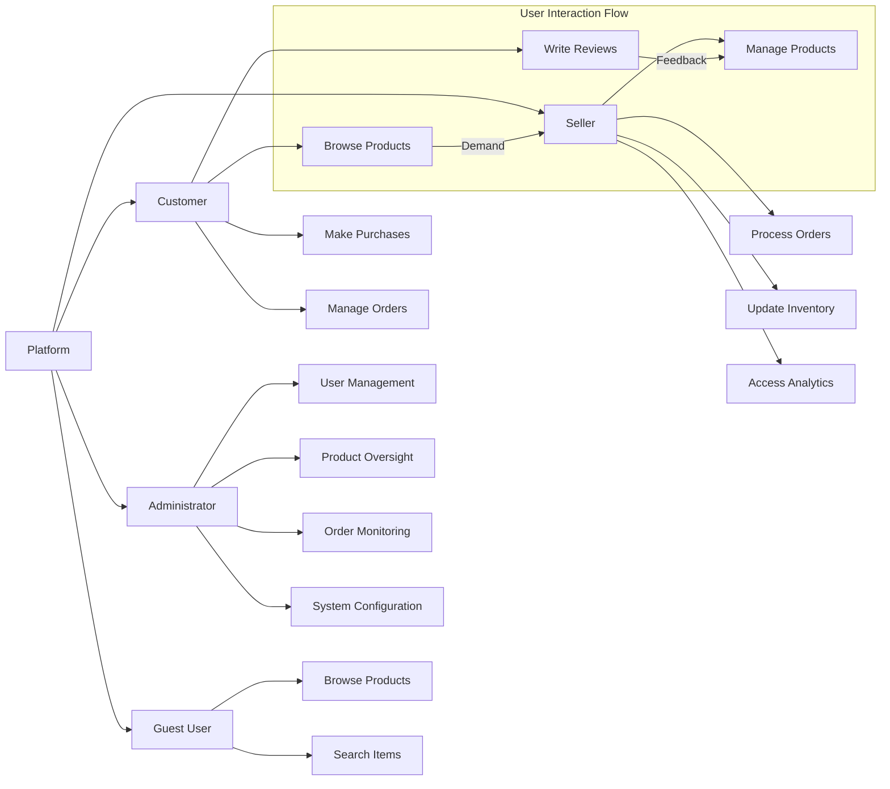
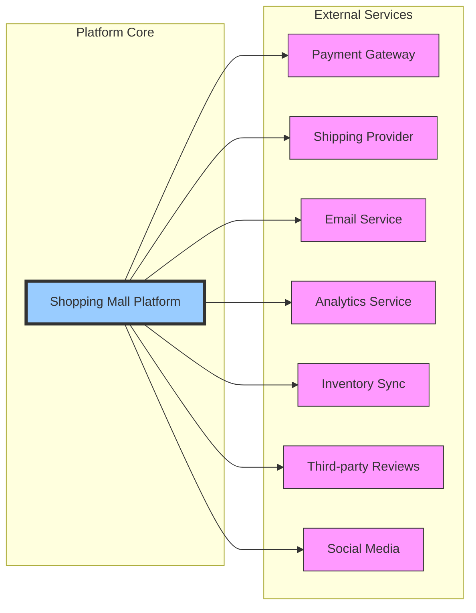

# E-commerce Shopping Mall Platform Requirements Analysis Report

## Business Model

### Why This Service Exists
The e-commerce shopping mall platform addresses the growing demand for online retail solutions that connect customers with multiple sellers in a unified marketplace. The platform fills a market gap by providing a comprehensive solution that combines product discovery, secure transactions, and seller management in a single system. With global e-commerce sales projected to reach $6.3 trillion by 2024, this platform capitalizes on the shift from traditional retail to digital marketplaces.

The platform differentiates itself from competitors through its multi-vendor approach, allowing various sellers to manage their inventory and sales independently while benefiting from the platform's established customer base, secure payment processing, and marketing reach. This creates a network effect where both customers and sellers benefit from increased platform activity.

### Revenue Strategy
The platform will generate revenue through multiple channels:
- Commission on each transaction (15% per sale)
- Subscription fees for premium seller accounts ($29.99/month)
- Featured listing promotions for sellers ($9.99-29.99 per week based on prominence)
- Logistics fee sharing for fulfillment services

Monetization will be phased: transaction commissions will be enabled from launch, premium subscriptions after reaching 500 active sellers, and promotional listings after achieving 10,000 monthly visitors.

### Growth Plan
User acquisition will focus on SEO optimization, targeted social media advertising, and referral programs. Seller recruitment will prioritize established small businesses with quality products but limited online presence. The platform will expand regionally, starting with domestic markets before international expansion.

### Success Metrics
- Monthly Active Users (MAU): Target 50,000 within 12 months of launch
- Daily Active Users (DAU): Target 15,000 within 12 months
- Average Order Value (AOV): Target $85
- Conversion Rate: Target 3.5% from view to purchase
- Seller Retention Rate: Target 85% month-over-month
- Customer Satisfaction Score: Target 4.5/5.0 in post-purchase surveys

## Core Features Overview

### User Management System
The platform supports multiple user roles with differentiated capabilities. User data privacy and security are paramount, with all personal information encrypted and access controlled by role-based permissions.

THE system SHALL support customer registration with email and password.
THE system SHALL support seller registration with business verification.
THE system SHALL support guest browsing with option to convert to registered customer.
THE system SHALL maintain secure user sessions using JWT tokens.

### Product Catalog and Discovery
The product catalog provides a structured hierarchy for merchandise with robust search and filtering capabilities. Products are organized by categories that support multiple levels of nesting to accommodate diverse product types.

THE system SHALL display products in organized categories and subcategories.
THE system SHALL provide full-text search with keyword matching across product names, descriptions, and attributes.
THE system SHALL allow filtering by price range, availability, ratings, and specific product attributes.
THE system SHALL support product tagging for enhanced discovery.

### Product Variants (SKU) Management
Products support multiple variants through a flexible SKU system that tracks inventory at the most granular level. Each SKU represents a unique combination of product options.

WHEN a product has multiple options, THE system SHALL display available combinations of colors, sizes, and other attributes.
THE system SHALL track inventory independently for each SKU variant.
THE system SHALL prevent purchase of out-of-stock variants.

### Shopping Cart and Wishlist Functionality
The platform provides users to manage their shopping experience, including temporary storage of items for later purchase and collection of favorite products.

THE system SHALL allow customers to add products to their shopping cart.
THE system SHALL allow customers to create and manage multiple wishlists.
THE system SHALL enable transfer of items between cart and wishlist.
THE system SHALL persist cart contents for 30 days for authenticated users.

### Order Processing and Payment
The order system transforms cart contents into confirmed transactions through a secure checkout process with multiple payment options.

THE system SHALL calculate order totals with applicable taxes and shipping fees.
THE system SHALL integrate with multiple payment gateways (credit card, PayPal, bank transfer).
THE system SHALL generate unique order numbers for tracking.
THE system SHALL process payment authorization before order confirmation.
THE system SHALL reduce inventory upon successful payment processing.

### Order Tracking and Shipping
Customers require visibility into their order status from confirmation through delivery.

THE system SHALL update order status through defined lifecycle states (Processing, Shipped, Delivered, Cancelled).
THE system SHALL provide tracking numbers and estimated delivery dates for shipped orders.
THE system SHALL notify customers of status changes via email.
THE system SHALL allow customers to view complete order history.

### Product Reviews and Ratings
Customer feedback provides social proof and helps improve product quality.

THE system SHALL allow customers to submit reviews for products they've purchased.
THE system SHALL calculate and display average product ratings.
THE system SHALL validate that reviewers have actually purchased the product.
THE system SHALL support rich reviews with text, images, and star ratings (1-5).

### Seller Management Portal
Sellers need tools to manage their business operations on the platform.

THE system SHALL provide sellers with a dashboard to manage their product listings.
THE system SHALL allow sellers to update product information, pricing, and inventory levels.
THE system SHALL provide sellers with sales analytics and performance metrics.
THE system SHALL support seller communication tools for customer inquiries.

### Inventory Management
Accurate inventory tracking prevents overselling and stockouts.

THE system SHALL update inventory levels in real-time when orders are confirmed.
THE system SHALL provide low-stock alerts to sellers when inventory falls below threshold.
THE system SHALL prevent overselling by checking availability at time of purchase.
THE system SHALL support bulk inventory updates through CSV import.

### Admin Dashboard and Oversight
Administrators require comprehensive oversight of platform operations.

THE system SHALL provide administrators with a dashboard to monitor all platform activities.
THE system SHALL allow administrators to manage user accounts, including suspension when necessary.
THE system SHALL provide tools for administrators to manage products and listings.
THE system SHALL enable administrators to process refunds and resolve disputes.

## Market Opportunity and Competitive Advantage

### Target Market
The platform targets consumers aged 18-45 who prefer online shopping for convenience and variety. Primary customer segments include:
- Value-conscious shoppers seeking competitive pricing
- Niche product seekers looking for specialized items
- Time-constrained individuals preferring home delivery

Sellers targeting the platform include:
- Small to medium-sized businesses with quality products
- Artisans and craft makers seeking wider audience
- Brands looking to expand digital presence

### Competitive Landscape
Primary competitors include established marketplaces like Amazon, Etsy, and eBay. While these platforms offer scale, they often charge higher fees and provide less personalized support.

### Differentiation Strategy
The platform differentiates through:
- Lower commission rates (15% vs. 20-30% on competitors)
- Enhanced seller tools with detailed analytics
- Superior customer support with 24-hour response time
- Community-focused features encouraging customer engagement
- Curated quality control to maintain high product standards

## User Roles and Key Stakeholders

The platform supports four distinct user roles:

### Customer
Customers are registered users who can browse the catalog, make purchases, write reviews, and manage their order history. They have the ability to create wishlists, save billing information, and receive personalized recommendations.

### Seller
Sellers operate vendor accounts that allow them to list products, manage inventory, and process orders from their store. They can access performance analytics, run promotions, and communicate with customers regarding their products.

### Administrator
Administrators have full system access to manage all users, products, orders, and platform settings. They handle disputes, process refunds, ensure compliance with platform policies, and maintain overall system health.

### Guest User
Unauthenticated visitors can browse products and search the catalog but cannot make purchases or access personalized features. They can add items to a temporary cart but must register or log in to complete checkout.

## Functional Requirements Summary

### User Authentication and Registration
WHEN a new user registers, THE system SHALL collect email, password, and essential profile information.
WHEN a user attempts to log in, THE system SHALL verify credentials and issue a JWT token upon successful authentication.
IF authentication fails, THEN THE system SHALL return appropriate error code and message.
THE system SHALL require email verification before enabling full account functionality.
THE system SHALL support password reset via email confirmation.

### Product Management
THE system SHALL organize products into a hierarchical category structure.
THE system SHALL allow products to have multiple images, detailed descriptions, and specification attributes.
WHEN a product is updated, THE system SHALL maintain version history for audit purposes.
THE system SHALL allow products to be marked as featured for promotional display.
IF a product is discontinued, THEN THE system SHALL archive it while preserving order history linkage.

### Shopping Cart Operations
THE system SHALL allow users to add, remove, and update quantities of items in their cart.
WHEN a user adds an item to cart, THE system SHALL verify current availability and pricing.
THE system SHALL calculate subtotals, taxes, and shipping estimates in real-time.
THE system SHALL preserve cart contents across sessions for authenticated users.
IF a cart item becomes unavailable, THEN THE system SHALL notify the user at checkout.

### Wishlist Management
THE system SHALL allow users to create multiple named wishlists.
THE system SHALL enable users to share wishlists via URL or email.
THE system SHALL monitor price changes on wishlist items and notify users of discounts.
THE system SHALL allow one-click transfer of wishlist items to shopping cart.
THE system SHALL support privacy settings for wishlists (public, shared, private).

### Order Processing
WHEN a user initiates checkout, THE system SHALL validate cart contents, user authentication status, and shipping address completeness.
THE system SHALL guide the user through checkout steps: shipping information, shipping method selection, payment method selection, and order review.
WHEN a user submits an order, THE system SHALL create an order record with unique order number, timestamp, and initial "pending" status.
THE system SHALL transfer cart items to order line items with fixed prices at time of purchase, preserving product and variant details.
WHEN an order is created, THE system SHALL reduce inventory counts for each ordered SKU immediately to prevent overselling.
WHEN an order is placed successfully, THE system SHALL send order confirmation to the customer with summary, order number, and expected timeline.

### Payment Processing
THE system SHALL integrate with PCI-compliant payment service providers.
THE system SHALL support credit/debit cards, PayPal, and bank transfers.
THE system SHALL display all applicable fees and taxes before final payment authorization.
THE system SHALL handle payment failures with clear user messaging and retry options.
THE system SHALL process refunds according to platform policy (within 5-10 business days).
THE system SHALL maintain complete audit trail of all financial transactions.

### Inventory Management
THE system SHALL track inventory at the SKU level for all products.
WHEN stock falls below predefined threshold, THE system SHALL notify the seller.
THE system SHALL prevent overselling by checking real-time availability at checkout.
THE system SHALL support inventory adjustments with reason codes (damage, loss, adjustment).
THE system SHALL provide inventory forecasting based on sales velocity.

### Product Reviews
THE system SHALL restrict reviews to customers who have purchased the product.
THE system SHALL allow editing of reviews within 7 days of submission.
THE system SHALL support moderation queue for potentially inappropriate content.
THE system SHALL calculate weighted average ratings considering reviewer credibility.
THE system SHALL display review timestamps and verified purchase indicators.

### Seller Operations
THE system SHALL provide sellers with real-time sales dashboards.
THE system SHALL allow bulk product upload and management via import tools.
THE system SHALL process commission calculations automatically with monthly statements.
THE system SHALL support seller-branded product pages with customized banners and descriptions.
THE system SHALL notify sellers of new orders and customer inquiries.

### Administrative Functions
THE system SHALL provide comprehensive search and filtering of user accounts.
THE system SHALL allow bulk operations on products and orders with appropriate safeguards.
THE system SHALL audit all administrator actions for security and compliance.
THE system SHALL support role-based access control with permission levels.
THE system SHALL generate business intelligence reports on key metrics.

## Non-functional Requirements

### Performance Requirements
THE system SHALL respond to user requests within 2 seconds under normal load.
THE system SHALL support at least 10,000 concurrent users during peak traffic.
THE system SHALL process checkout transactions within 3 seconds.
THE system SHALL maintain 99.9% uptime excluding scheduled maintenance.
THE system SHALL display search results within 1 second for common queries.

### Security Requirements
THE system SHALL encrypt all sensitive data (passwords, payment information) at rest and in transit.
THE system SHALL implement rate limiting to prevent brute force attacks.
THE system SHALL validate and sanitize all user inputs to prevent injection attacks.
THE system SHALL implement multi-factor authentication for administrator accounts.
THE system SHALL comply with PCI-DSS requirements for payment processing.
THE system SHALL conduct regular security audits and penetration testing.
THE system SHALL implement proper session management with token expiration.

### Reliability Requirements
THE system SHALL maintain data integrity during failures.
THE system SHALL implement automated backups with 15-minute intervals.
THE system SHALL support disaster recovery with maximum 1-hour downtime.
THE system SHALL implement circuit breakers for external service dependencies.
THE system SHALL provide health checks for all critical components.

### Usability Requirements
THE system SHALL support responsive design for various screen sizes.
THE system SHALL maintain consistent navigation and user interface patterns.
THE system SHALL provide clear error messages with recovery guidance.
THE system SHALL support accessibility standards (WCAG 2.1 AA).
THE system SHALL provide internationalization support for multiple languages.

### Scalability Requirements
THE system SHALL support horizontal scaling of application servers.
THE system SHALL implement caching strategies for high-traffic content.
THE system SHALL support database sharding for growth beyond initial capacity.
THE system SHALL monitor performance metrics for capacity planning.

## System Boundaries and Integrations

The e-commerce platform integrates with several external systems to provide complete functionality:

### Payment Gateway Integration
THE system SHALL integrate with multiple payment providers to process transactions.
WHEN a payment is processed, THE system SHALL send transaction details securely to the payment gateway.
WHEN payment confirmation is received, THE system SHALL update order status accordingly.
IF payment fails, THEN THE system SHALL return to checkout with specific error information.

### Shipping Provider Integration
THE system SHALL connect with major shipping carriers for rate calculation and label generation.
WHEN an order ships, THE system SHALL receive tracking information and update order status.
THE system SHALL provide pickup scheduling for return processing.

### Email Service Integration
THE system SHALL use third-party email services for transactional and marketing communications.
THE system SHALL track email delivery status and open rates for critical messages.
THE system SHALL support email template customization for branding.

### Analytics Service Integration
THE system SHALL send anonymized usage data to analytics platforms for business intelligence.
THE system SHALL respect user privacy preferences regarding data collection.
THE system SHALL prevent personally identifiable information from being sent to analytics.

## Key Technical Constraints

### Data Management
THE system SHALL ensure data privacy compliance with GDPR and CCPA regulations.
THE system SHALL implement data retention policies for different data types.
THE system SHALL support data export for users upon request.
THE system SHALL implement proper data anonymization for inactive accounts.

### Technology Choices
THE system SHALL use modern web technologies for scalability and maintainability.
THE system development SHALL prioritize using open standards and avoiding vendor lock-in.
THE system SHALL be containerized for consistent deployment across environments.

### API Design
THE system SHALL provide RESTful APIs for all core functionality.
THE system SHALL implement proper versioning for backward compatibility.
THE system SHALL provide comprehensive API documentation for internal teams.

## Document Relationships

This requirements analysis report serves as the foundation for all subsequent technical documentation:

- [User Roles and Authentication Specification](./02-user-roles.md) will detail the authentication flows
- [Functional Requirements Document](./03-functional-requirements.md) will expand on specific feature requirements
- [User Journey Documentation](./04-user-stories.md) will describe typical user scenarios
- [Order Process Flow](./05-order-process.md) will outline the complete order lifecycle
- [Product Catalog Structure](./06-product-catalog.md) will specify product organization
- [Shopping Cart and Wishlist Functionality](./07-wishlist-cart.md) will detail cart operations
- [Review System Requirements](./08-review-system.md) will cover review workflows
- [Administrator Features](./09-admin-features.md) will describe admin capabilities

## Developer Note
> *Developer Note: This document defines **business requirements only**. All technical implementations (architecture, APIs, database design, etc.) are at the discretion of the development team.*