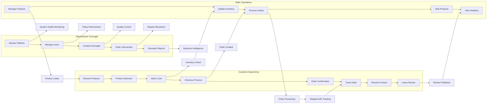

# User Roles and Permissions Specification for E-commerce Platform

## Introduction

This document defines the comprehensive user roles and permissions for the shoppingMall e-commerce platform. It outlines the business requirements for authentication, authorization, and role-based access control across all user types. The specifications focus on business logic and user capabilities without prescribing specific technical implementations, enabling backend developers to design a secure and functional access control system.

The platform supports four distinct user roles that reflect different user relationships with the marketplace: Customer, Seller, Administrator, and Guest. Each role has clearly defined permissions that align with their business function and responsibilities within the ecosystem.

## Customer Role Specifications

The Customer role represents registered users who purchase products through the shoppingMall platform. This role enables users to browse products, make purchases, and manage their shopping experience.

### Core Customer Capabilities

WHEN a customer accesses the platform, THE system SHALL allow them to browse and search products across the marketplace.

WHEN a customer views products, THE system SHALL display product details including images, description, pricing, and customer reviews.

WHEN a customer has products in their cart, THE system SHALL allow them to add products to their shopping cart from the product detail page.

WHEN a customer has products they want to save for later consideration, THE system SHALL allow them to add products to their wishlist.

WHEN a customer has completed their product selection, THE system SHALL allow them to proceed to checkout and complete their purchase.

WHEN a customer wishes to manage their information, THE system SHALL allow them to view and edit their personal profile including shipping addresses.

WHEN a customer has completed orders, THE system SHALL allow them to track the status of their orders through the fulfillment lifecycle.

WHEN a customer has purchased a product, THE system SHALL allow them to submit a product review and rating for their purchase.

WHEN a customer has placed an order they wish to modify, THE system SHALL allow them to view their order history and, if eligible, request cancellation or modification.

### Profile and Address Management

WHEN a customer accesses their profile, THE system SHALL display their personal information including name, contact details, and order history.

WHEN a customer adds a new address, THE system SHALL allow them to save multiple addresses with labels (e.g., home, work) and designate one as primary.

WHEN a customer updates their profile information, THE system SHALL save changes and reflect them in subsequent transactions.

IF a customer has an existing saved address, THEN THE system SHALL allow them to edit or delete addresses from their address book.

IF a customer attempts to use an email address that already exists during registration, THEN THE system SHALL prevent account creation and display an appropriate message.

### Authentication Requirements

WHEN a customer registers with the platform, THE system SHALL collect email address, password, first name, and last name to create an account.

WHEN a customer submits registration information, THE system SHALL validate that the email address is properly formatted and unique before creating the account.

WHEN a customer completes registration, THE system SHALL send an email verification link to confirm the validity of the email address.

WHEN a customer clicks the email verification link, THE system SHALL activate their account and allow full access to customer features.

WHEN a customer attempts to log in, THE system SHALL authenticate using the provided email and password combination.

IF a customer provides invalid login credentials, THEN THE system SHALL return an appropriate error message without revealing whether the email or password was incorrect to prevent user enumeration.

WHEN a customer successfully authenticates, THE system SHALL generate a JWT token containing their user ID, role, and permissions.

WHEN a customer initiates a password reset, THE system SHALL send a time-limited reset token to their registered email address.

WHEN a customer uses a valid password reset token, THE system SHALL allow them to create a new password and update their account.

THE system SHALL invalidate used or expired password reset tokens to prevent unauthorized access.

### Order Management and Fulfillment

WHEN a customer proceeds to checkout with items in their cart, THE system SHALL require them to select a shipping address and payment method.

WHEN a customer submits an order, THE system SHALL generate a unique order number and send an order confirmation via email.

WHEN an order is confirmed, THE system SHALL display the order status and provide tracking information as it progresses through fulfillment stages.

WHEN a customer wishes to modify an order, THE system SHALL allow cancellation requests only if the order has not yet entered processing or shipping.

IF a customer requests an eligible cancellation, THEN THE system SHALL process a full refund to their original payment method.

WHEN a customer receives their order, THE system SHALL prompt them to review the products they purchased after a reasonable delivery period.

IF a customer submits a refund request within policy guidelines, THEN THE system SHALL process the refund according to platform policies and display the status in their order history.

## Seller Role Specifications

The Seller role represents vendor accounts that manage their own product listings and inventory within the marketplace. This role enables businesses and individuals to sell products through the platform while maintaining control over their catalog and sales.

### Core Seller Capabilities

WHEN a seller accesses their dashboard, THE system SHALL allow them to manage their product listings in the marketplace catalog.

WHEN a seller has products to offer, THE system SHALL allow them to create new product listings with required information and images.

WHEN a product has multiple variations, THE system SHALL allow sellers to define product variants (SKUs) with different attributes like size, color, and configuration.

WHEN a seller has inventory to track, THE system SHALL allow them to set pricing for products and variants with options for promotional pricing.

WHEN a seller needs to manage stock, THE system SHALL allow them to manage inventory levels for each SKU with the ability to update quantities.

WHEN a seller wants to analyze their performance, THE system SHALL allow them to view sales reports and analytics for their products and store.

WHEN a customer places an order for their product, THE system SHALL allow sellers to receive notifications about new orders and customer inquiries.

WHEN a seller needs to update their offerings, THE system SHALL allow them to modify product information, images, and availability status as needed.

WHEN a seller wants to highlight products, THE system SHALL allow them to submit products for featured placement consideration.

### Product Management Workflow

WHEN creating a new product listing, THE seller SHALL provide:
- Product title
- Detailed description
- Primary and additional images
- Category assignment
- Base price
- Tax classification
- Shipping attributes
- Product attributes (brand, material, dimensions, etc.)

THE system SHALL validate that all required product information is provided before allowing publication.

WHEN a seller defines product variants, THE system SHALL allow them to specify available options (e.g., Size: S, M, L; Color: Red, Blue, Green) and automatically generate SKUs for each combination with independent inventory tracking.

WHEN a seller updates product information, THE system SHALL publish changes to the live catalog and make them visible to customers immediately.

IF a seller sets unusually low pricing, THEN THE system SHALL display confirmation prompts to prevent accidental pricing errors.

### Inventory and Order Fulfillment

WHEN a seller receives new stock, THE system SHALL allow them to update inventory counts for specific SKUs through manual entry or CSV import functionality.

WHILE managing inventory, THE system SHALL display current stock levels, recent sales velocity, and low stock warnings based on predefined thresholds.

WHEN inventory for a product variant reaches zero, THE system SHALL automatically mark it as "out of stock" in the catalog and prevent customers from placing new orders until inventory is replenished.

WHEN a customer places an order for a seller's product, THE system SHALL notify the seller and reserve the items in inventory while the order is being processed.

WHEN a seller ships an order, THE system SHALL allow them to input tracking information from the carrier, which is then shared with the customer for delivery monitoring.

IF a seller cannot fulfill an order due to inventory discrepancies or other issues, THEN THE system SHALL allow them to cancel the order with justification, triggering automatic customer notification and refund processing.

WHEN a seller needs to process returns, THE system SHALL provide tools to authorize returns, receive returned items, and process appropriate refunds or exchanges.

### Sales Reporting and Analytics

WHEN a seller accesses their dashboard, THE system SHALL display key performance metrics including daily sales volume, conversion rates, and customer engagement.

WHEN a seller analyzes their business performance, THE system SHALL provide sales reports showing revenue, units sold, and profit margins over customizable time periods.

WHEN a seller evaluates product success, THE system SHALL allow filtering reports by specific items, categories, or sales channels to analyze performance metrics.

WHEN a seller wants to understand customer behavior, THE system SHALL provide insights into customer demographics, purchase patterns, and geographic distribution.

WHEN a seller manages marketing efforts, THE system SHALL provide ROI analysis on promotions, featured listings, and other marketing initiatives.

## Administrator Role Specifications

The Administrator role represents system administrators with full access to manage all aspects of the shoppingMall platform. This role provides oversight and control over the entire marketplace ecosystem.

### Core Administrator Capabilities

WHEN an administrator accesses the dashboard, THE system SHALL provide comprehensive monitoring of all platform activities.

WHEN an administrator needs to manage user accounts, THE system SHALL allow them to view, search, and manage all user accounts regardless of role.

WHEN an administrator oversees the product catalog, THE system SHALL allow them to view all product listings and enforce platform policies and quality standards.

WHEN an administrator monitors orders, THE system SHALL provide visibility into all orders across the platform and enable intervention when necessary.

WHEN an administrator manages system configuration, THE system SHALL allow them to modify platform settings and business rules that govern the entire system.

WHEN an administrator needs business intelligence, THE system SHALL provide access to complete analytics and business intelligence reports.

WHEN an administrator resolves disputes, THE system SHALL allow them to enforce platform policies and guidelines consistently.

WHEN an administrator handles escalations, THE system SHALL enable them to resolve complex customer and seller issues that require intervention.

### User Account Management

WHEN an administrator searches user accounts, THE system SHALL allow filtering by account type, registration date, activity level, and other identifying characteristics.

WHEN reviewing a user account, THE administrator SHALL have access to complete account information, order history, transaction records, and recent activity logs.

IF an administrator identifies policy violations in user behavior, THEN THE system SHALL allow them to suspend the account with options to notify the user and provide the reason for action.

WHEN an administrator suspends an account, THE system SHALL prevent the user from logging in, placing orders, or accessing protected features while preserving historical data.

WHEN a user requires account recovery assistance, THE system SHALL allow administrators to reset passwords, verify identity, and restore account access.

WHEN an administrator performs sensitive actions, THE system SHALL create audit records with timestamps and administrator identifiers for compliance.

### Product and Category Oversight

WHEN an administrator manages product categories, THE system SHALL allow creating new categories, modifying existing ones, and organizing the hierarchical structure.

WHEN adding a new product category, THE administrator SHALL define the category name, description, parent category (for hierarchy), and associated attributes specific to products in this category.

WHEN a seller submits a product requiring approval, THE system SHALL present the product details to administrators for review with options to approve, request changes, or reject with explanation.

IF a product listing contains inappropriate content or violates platform policies, THEN THE system SHALL allow administrators to remove it from the catalog and notify the seller with a detailed explanation.

WHEN an administrator needs to verify product authenticity, THE system SHALL provide tools to validate product claims, manufacturer information, and compliance with regulatory standards.

WHEN an administrator monitors product listings, THE system SHALL highlight duplicate listings, misleading descriptions, and potential intellectual property violations.

WHEN an administrator manages pricing policies, THE system SHALL allow setting category-wide pricing guidelines, sale restrictions, and dynamic pricing rules.

### Order and Transaction Management

WHEN an administrator accesses order monitoring tools, THE system SHALL display all recent orders with current status, customer information, seller information, and transaction details.

WHERE a customer has an unresolved issue with an order, THE system SHALL allow administrators to view the complete order history, communication logs, and make administrative adjustments to resolve the matter.

WHEN an administrator processes refunds, THE system SHALL allow them to initiate full or partial refunds, modify refund reasons, and track refund status across payment processors.

WHEN an administrator handles disputes, THE system SHALL provide evidence collection tools, communication channels, and resolution workflows for buyer-seller conflicts.

WHEN an administrator monitors financial transactions, THE system SHALL provide reconciliation tools, fraud detection alerts, and audit trails for all monetary exchanges.

### Platform Analytics and Reporting

WHEN an administrator generates business reports, THE system SHALL compile data on key performance indicators including sales volume, conversion rates, customer acquisition costs, and seller performance metrics.

WHEN analyzing platform performance, THE system SHALL allow comparing metrics across time periods, identifying emerging trends, and exporting data for further analysis.

WHEN developing business strategy, THE system SHALL provide predictive analytics, market forecasting, and competitive benchmarking tools to support decision-making.

WHEN the administrator needs system health information, THE system SHALL display technical performance metrics, uptime statistics, error rates, and load capacity.

WHEN the administrator is evaluating platform improvements, THE system SHALL provide user behavior analytics, feature usage patterns, and customer satisfaction metrics.

## Guest Role Specifications

The Guest role represents unauthenticated users who browse the shoppingMall platform without logging in. This role enables product discovery and information gathering with limited access to customer-specific features.

### Core Guest Capabilities

WHEN a guest user accesses the platform, THE system SHALL allow them to browse the product catalog and view product information.

WHEN a guest user searches for products, THE system SHALL allow them to use search functionality with keywords and filters to find relevant items.

WHEN a guest user finds products of interest, THE system SHALL allow them to view detailed information including descriptions, images, specifications, and customer reviews.

WHEN a guest user identifies their preferred products, THE system SHALL allow them to add products to a temporary shopping cart for purchase consideration.

WHEN a guest user has assembled items in their cart, THE system SHALL allow them to initiate checkout with an option to create an account or complete guest checkout.

WHEN a guest user needs information about the platform, THE system SHALL allow them to access business policies, shipping information, return guidelines, and contact information.

### Account Conversion and Guest Limitations

WHERE a user attempts to access restricted features, THE system SHALL restrict guest access to account-specific functions including:
- Profile and address management
- Order placement with saved payment methods
- Order history and tracking
- Persistent wishlist saving
- Product reviews and ratings
- Saved payment information
- Personalized recommendations
- Loyalty program benefits

WHEN a guest attempts to access restricted features, THE system SHALL redirect them to login page with appropriate messaging while preserving their cart contents.

WHEN a guest attempts to complete a purchase, THE system SHALL require them to either create an account or proceed with guest checkout, providing all required information during the process.

WHEN a guest user creates an account during checkout, THE system SHALL transfer their cart contents to the new account and preserve all selected items and quantities.

IF a guest user abandons their session without completing purchase, THEN THE system SHALL preserve cart contents for a limited time (30 days) through browser storage mechanisms.

WHEN a guest returns with a preserved cart, THE system SHALL restore their items and prompt them to log in or create an account to complete the purchase.

## Authentication and Session Management

The authentication system SHALL implement secure user verification across all roles with consistent protocols and protection against common security threats.

### JWT Token Implementation and Security

THE system SHALL use JWT (JSON Web Tokens) for authentication with the following required payload structure:
- userId: Unique identifier for the authenticated user
- role: Current role of the user (customer, seller, admin, guest)
- permissions: Array of specific permissions granted to the role
- iat: Issued at timestamp (Unix epoch seconds)
- exp: Expiration timestamp (Unix epoch seconds)
- iss: Issuer identifier (platform domain)
- jti: JWT ID for unique token identification

THE access token expiration SHALL be set to 30 minutes of inactivity to balance security and user experience.
THE refresh token expiration SHALL be set to 14 days, requiring re-authentication after extended periods.

THE system SHALL sign all JWT tokens with HS256 algorithm using a secure secret key rotated periodically.

THE system SHALL validate JWT signature, expiration, and issuer on every protected API request.

THE system SHALL reject tokens with invalid signatures, expired timestamps, or incorrect issuer claims.

### Session Security and Management

THE session management system SHALL store JWT tokens securely using a combination of httpOnly cookies for primary authentication and localStorage for convenience features.

THE system SHALL implement token refresh mechanisms to maintain active sessions without requiring frequent re-authentication.

THE system SHALL provide logout functionality that invalidates current tokens on the client and notifies the authentication server to blacklist the token.

THE system SHALL support "remember me" functionality with longer-lived refresh tokens when explicitly requested by the user during login.

THE system SHALL detect and respond to suspicious login attempts through IP monitoring, device fingerprinting, and anomaly detection.

THE system SHALL allow users to view and manage active sessions across devices with options to revoke access from specific devices.

THE system SHALL implement rate limiting on authentication endpoints to prevent brute force attacks.

## Role-Based Access Control Matrix

The following matrix specifies the permissions available to each role in the system:

| Action | Customer | Seller | Administrator | Guest |
|--------|----------|--------|---------------|-------|
| Browse products | ✅ | ✅ | ✅ | ✅ |
| Search products | ✅ | ✅ | ✅ | ✅ |
| View product details | ✅ | ✅ | ✅ | ✅ |
| Add product to cart | ✅ | ✅ | ✅ | ✅ |
| Add product to wishlist | ✅ | ✅ | ✅ | ❌ |
| Create and manage addresses | ✅ | ✅ | ✅ | ❌ |
| Place orders | ✅ | ❌ | ✅ | ✅ |
| View order history | ✅ | ✅ | ✅ | ❌ |
| Request order cancellation | ✅ | ❌ | ✅ | ❌ |
| Submit product reviews | ✅ | ❌ | ✅ | ❌ |
| Manage own products | ❌ | ✅ | ✅ | ❌ |
| Set product pricing | ❌ | ✅ | ✅ | ❌ |
| Update inventory levels | ❌ | ✅ | ✅ | ❌ |
| View sales reports | ❌ | ✅ | ✅ | ❌ |
| Manage all user accounts | ❌ | ❌ | ✅ | ❌ |
| Oversee all product listings | ❌ | ❌ | ✅ | ❌ |
| Monitor all orders | ❌ | ❌ | ✅ | ❌ |
| Access system analytics | ❌ | ❌ | ✅ | ❌ |
| Modify system settings | ❌ | ❌ | ✅ | ❌ |
| Process refunds | ❌ | ❌ | ✅ | ❌ |
| Resolve disputes | ❌ | ❌ | ✅ | ❌ |
| Manage platform content | ❌ | ❌ | ✅ | ❌ |

*Guest users can place orders only through the guest checkout process, requiring completion of all required information during checkout as they have no saved data.

## User Journey Integration

## Cross-Functional Requirements

### Performance Expectations

THE system SHALL respond to user actions within 2 seconds under normal load conditions for all roles.

THE system SHALL maintain product catalog search functionality with results appearing within 1 second for common queries across all user types.

THE system SHALL handle checkout process completion within 5 seconds from initiation to confirmation for customer and guest users.

THE authentication system SHALL verify user credentials and issue JWT tokens within 500 milliseconds for all login scenarios.

THE system SHALL maintain 99.9% uptime excluding scheduled maintenance windows for all user-facing functionality.

### Error Handling and User Experience

WHEN an error occurs during user interaction, THE system SHALL display user-friendly error messages that suggest resolution steps appropriate to the user's role.

THE system SHALL log all errors with sufficient detail for technical diagnosis while protecting user privacy and not exposing system internals.

THE system SHALL implement graceful degradation strategies to maintain core functionality during partial system outages based on user priorities.

THE system SHALL provide appropriate recovery mechanisms for transaction failures, particularly during order placement and payment processing.

### Data Integrity and Validation

THE system SHALL validate all user inputs for proper format and acceptable values before processing for all user roles.

THE system SHALL maintain data consistency across related entities (e.g., order totals matching line item calculations, inventory levels reflecting actual stock).

THE system SHALL implement transactional integrity for critical operations such as order placement, inventory updates, and payment processing to prevent data corruption.

THE system SHALL implement audit trails for all administrative actions and sensitive operations to ensure accountability and support compliance requirements.

> *Developer Note: This document defines **business requirements only**. All technical implementations (architecture, APIs, database design, etc.) are at the discretion of the development team.*