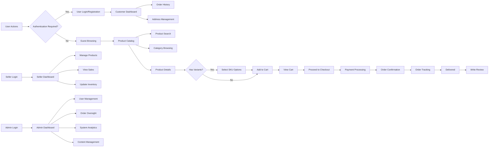

# Functional Requirements Specification for Shopping Mall Platform

This document outlines the complete functional requirements for the e-commerce shopping mall platform. The requirements are specified in natural language using EARS (Easy Approach to Requirements Syntax) format where applicable, focusing on business logic and user needs. This document provides backend developers with comprehensive, unambiguous requirements to guide implementation.

## 1. User Management Requirements

### Authentication and Profile Management

WHEN a guest user attempts to register, THE system SHALL collect email, password, and basic profile information and create a customer account.

WHEN a user submits registration information, THE system SHALL validate all fields, hash the password, and store the user record with customer role.

WHEN a user attempts to log in, THE system SHALL verify credentials and issue a JWT token containing userId, role, and permissions.

WHEN a user logs in successfully, THE system SHALL maintain the session for 30 days unless explicitly logged out.

IF a user attempts to log in with invalid credentials, THEN THE system SHALL return authentication error with message "Invalid email or password".

WHEN a user requests password reset, THE system SHALL send a time-limited reset link to the registered email address.

WHEN a user accesses profile settings, THE system SHALL display current information including name, email, and contact details.

WHEN a user updates profile information, THE system SHALL validate changes and persist the updated data to the user record.

### Address Management

WHEN a customer accesses address management, THE system SHALL display all saved addresses with designation as primary or secondary.

THE system SHALL allow customers to add, edit, and delete shipping addresses with fields for recipient name, street address, city, state, postal code, and country.

WHEN a customer adds a new address, THE system SHALL validate address format and save it with timestamp and location type (home, work, other).

THE system SHALL require at least one valid address to be marked as primary for order processing.

WHEN a customer proceeds to checkout, THE system SHALL display the primary address as default with option to select alternative saved addresses.

## 2. Product Catalog and Management

### Product Organization

THE system SHALL organize products into hierarchical categories and subcategories for intuitive browsing.

WHEN a user views the product catalog, THE system SHALL display products with thumbnail image, name, price, and rating summary.

THE system SHALL support product categorization with ability to assign products to multiple categories.

WHEN a product is created or updated, THE system SHALL validate required attributes including name, description, base price, and primary image.

### Product Search and Discovery

WHEN a user enters search terms, THE system SHALL return relevant products based on name, description, category, and attributes.

THE system SHALL support faceted search with filters for category, price range, brand, and other product attributes.

WHEN a user applies search filters, THE system SHALL update results dynamically with count indicators for each filter option.

THE system SHALL implement search relevance ranking with exact matches prioritized over partial matches.

WHEN no products match search criteria, THE system SHALL display helpful suggestions and popular alternative categories.

### Product Variants (SKU)

THE system SHALL support product variants through SKU (Stock Keeping Unit) system with unique identification for each variant.

WHEN a product has multiple options, THE system SHALL allow specification of variants based on attributes such as color, size, and material.

THE system SHALL generate unique SKU codes automatically when variants are defined and maintain inventory at the SKU level.

WHEN a user views a product with variants, THE system SHALL display available options with visual indicators and enable selection of specific combination.

THE system SHALL validate that variant combinations are properly defined and do not exceed practical limits for any product.

## 3. Shopping Cart and Wishlist

### Shopping Cart Functionality

WHEN a customer adds a product to cart, THE system SHALL create a cart item with product reference, selected variant (if applicable), and quantity.

THE system SHALL maintain cart contents for authenticated users across sessions and devices.

WHEN a guest user adds items to cart, THE system SHALL preserve cart contents during browsing session with option to save upon registration.

THE system SHALL validate inventory availability when items are added to cart and prevent adding quantities exceeding available stock.

WHEN a cart item includes a product variant, THE system SHALL specifically reference the selected SKU and display variant attributes clearly.

THE system SHALL calculate cart totals including item prices, applicable taxes, and estimated shipping based on destination.

WHEN a customer views the cart, THE system SHALL display items with product details, variants, prices, and quantity controls for adjustment.

IF a product in the cart becomes unavailable, THEN THE system SHALL notify the user and remove the item from cart.

### Wishlist Features

WHEN a customer adds a product to wishlist, THE system SHALL create a wishlist entry with product reference and timestamp.

THE system SHALL allow customers to create multiple wishlists for different purposes (e.g., gifts, personal, saved for later).

WHEN a customer views their wishlist, THE system SHALL display products with availability status and price information.

THE system SHALL allow customers to move items from wishlist to cart with single action, preserving selected variants if previously specified.

WHEN a product in wishlist goes on sale, THE system SHALL optionally notify the customer based on preference settings.

## 4. Order Processing System

### Order Placement

WHEN a customer initiates checkout, THE system SHALL validate cart contents, user authentication status, and shipping address completeness.

THE system SHALL guide the user through checkout steps: shipping information, shipping method selection, payment method selection, and order review.

WHEN a customer submits an order, THE system SHALL create an order record with unique order number, timestamp, and initial "pending" status.

THE system SHALL transfer cart items to order line items with fixed prices at time of purchase, preserving product and variant details.

WHEN an order is created, THE system SHALL reduce inventory counts for each ordered SKU immediately to prevent overselling.

WHEN an order is placed successfully, THE system SHALL send order confirmation to the customer with summary, order number, and expected timeline.

### Order Status and Tracking

THE system SHALL implement order lifecycle with statuses: pending, confirmed, processing, shipped, out for delivery, delivered, cancelled, refunded.

WHEN order status changes, THE system SHALL update the customer through email notification with new status and timestamp.

WHEN a customer views order history, THE system SHALL display all past orders with current status, totals, and quick access to details.

THE system SHALL provide real-time order tracking with timeline visualization showing progression through fulfillment stages.

WHEN a customer requests order cancellation, THE system SHALL evaluate fulfillment stage and either cancel immediately (if not processed) or initiate return process (if shipped).

IF a customer requests cancellation after order has shipped, THEN THE system SHALL provide return instructions and manage the return process.

THE system SHALL allow customers to view detailed order history including completed, cancelled, and refunded orders.

## 5. Payment Processing Requirements

### Payment Methods and Integration

THE system SHALL support multiple payment methods including credit/debit cards, digital wallets, and bank transfers.

WHEN a customer selects credit card payment, THE system SHALL securely collect card information and process through PCI-compliant payment gateway.

THE system SHALL never store full credit card numbers; sensitive payment data SHALL be tokenized by the payment processor.

WHEN a customer completes payment, THE system SHALL record transaction details including authorization code, amount, and timestamp.

IF payment processing fails, THEN THE system SHALL return specific error code and message to help the user resolve the issue without exposing sensitive details.

THE system SHALL implement payment reconciliation processes to ensure all transactions are properly accounted for in financial records.

THE system SHALL support partial refunds for orders with multiple items when only some items are returned.

## 6. Inventory Management

### SKU-Level Inventory Tracking

THE system SHALL track inventory for each product variant (SKU) independently with real-time availability updates.

WHEN a new product variant is created, THE system SHALL initialize inventory count to zero and require manual or automated stock allocation.

THE system SHALL prevent overselling by validating available stock before confirming order placement.

WHEN inventory for a SKU reaches predefined low stock threshold, THE system SHALL notify the seller or inventory manager.

THE system SHALL provide inventory adjustment capabilities for manual updates due to returns, damages, or physical count reconciliation.

WHEN a customer returns a product, THE system SHALL receive the item, validate condition, and restore inventory for the specific SKU.

THE system SHALL maintain inventory history log showing stock changes with timestamps, quantities, and reasons for each adjustment.

## 7. Product Reviews and Ratings

### Review Submission Process

THE system SHALL allow customers to submit product reviews only for items they have purchased.

WHEN a customer submits a review, THE system SHALL validate purchase history and accept the review if criteria are met.

THE system SHALL require reviews to include a star rating (1-5) and optional written comments.

WHEN a review is submitted, THE system SHALL moderate content for inappropriate language and publish after approval.

THE system SHALL prevent duplicate reviews from the same customer for the same product.

### Review Display and Moderation

THE system SHALL calculate and display average star rating for each product based on approved reviews.

WHEN a user views a product, THE system SHALL display reviews with customer name (anonymized if preferred), rating, comments, and submission date.

THE system SHALL implement helpfulness voting for reviews, allowing customers to indicate if a review was useful.

THE system SHALL allow editing of reviews by the original author within 7 days of submission, with edition timestamp noted.

## 8. Seller Account Features

### Seller Dashboard and Management

THE system SHALL provide seller accounts with access to dashboard showing sales metrics, order notifications, and inventory status.

WHEN a seller logs in, THE system SHALL display summary of recent orders, pending actions, and performance metrics.

THE system SHALL allow sellers to manage their product catalog including adding new products, updating existing ones, and discontinuing items.

WHEN a seller updates product information, THE system SHALL validate changes and apply them to the published listing.

THE system SHALL provide sales reporting with filters for time period, product, and order status to help sellers analyze performance.

## 9. Admin Dashboard Capabilities

### System Oversight and Management

THE system SHALL provide administrators with comprehensive dashboard for monitoring platform operations.

THE system SHALL allow administrators to view, edit, and manage all user accounts with appropriate audit logging.

THE system SHALL enable administrators to manage product listings, categories, and site content for platform consistency.

WHEN an administrator takes action on user accounts or content, THE system SHALL create audit records with timestamp, action type, and administrator ID.

THE system SHALL provide administrators with tools to manage orders, process refunds, and resolve customer issues.

THE system SHALL display system analytics including sales trends, user engagement, and performance metrics.

### System Configuration

THE system SHALL allow administrators to configure platform settings including tax rates, shipping options, and site policies.

THE system SHALL implement role-based access for administrative functions, with different permission levels for staff members.

## 10. Cross-Functional Requirements

### Performance Expectations

THE system SHALL respond to user actions within 2 seconds under normal load conditions.

THE system SHALL maintain product catalog search functionality with results appearing instantly for common queries.

THE system SHALL handle checkout process completion within 5 seconds from initiation to confirmation.

### Error Handling and User Experience

WHEN an error occurs during user interaction, THE system SHALL display user-friendly error messages that suggest resolution steps.

THE system SHALL log all errors with sufficient detail for technical diagnosis while protecting user privacy.

THE system SHALL implement graceful degradation strategies to maintain core functionality during partial system outages.

### Data Integrity and Validation

THE system SHALL validate all user inputs for proper format and acceptable values before processing.

THE system SHALL maintain data consistency across related entities (e.g., order totals matching line item calculations).

THE system SHALL implement transactional integrity for critical operations such as order placement and inventory updates.

> *Developer Note: This document defines **business requirements only**. All technical implementations (architecture, APIs, database design, etc.) are at the discretion of the development team.*