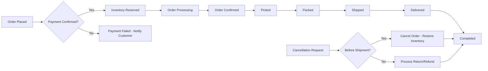
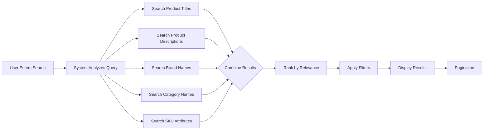
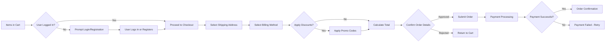

# Requirements Analysis Report for Shopping Mall E-commerce Platform

## Business Model Overview

### Why This Service Exists
The e-commerce shopping mall platform addresses the growing demand for online retail solutions that connect multiple sellers with customers in a unified marketplace. With the global e-commerce market projected to reach $6.4 trillion by 2024, there is significant opportunity to create a platform that simplifies online shopping for customers while providing sellers with tools to manage their products and inventory effectively.

The platform fills several market gaps:
- Independent sellers lack affordable, comprehensive e-commerce solutions
- Customers face challenges comparing similar products across different vendor websites
- Small businesses need integrated tools for inventory, order management, and customer engagement

### Revenue Strategy
The platform will generate revenue through multiple streams:
- Commission on each transaction (10-15% of product value)
- Subscription fees for premium seller accounts
- Featured listing fees for product placement
- Delivery service markups

### Growth Plan
User acquisition will focus on onboarding established small businesses as initial sellers, creating critical mass of products to attract customers. Growth will be sustained through:
- Word-of-mouth from satisfied sellers and customers
- Performance-based digital marketing
- Partnership programs with logistics providers
- Referral incentives for both buyers and sellers

### Success Metrics
Key performance indicators will include:
- Monthly active customers (target: 50,000 in first year)
- Number of active sellers (target: 500 in first year)
- Average order value (target: $85)
- Order fulfillment rate (target: 98%)
- Customer retention rate (target: 40% repeat customers)
- Platform commission revenue (target: $2M annual)

## User Roles and Authentication Requirements

### User Role Structure

The system will support four distinct user roles with clearly defined permissions:

| Action | Customer | Seller | Administrator | Guest |
|--------|----------|--------|---------------|-------|
| Browse products | ✅ | ✅ | ✅ | ✅ |
| Search products | ✅ | ✅ | ✅ | ✅ |
| Add to wishlist | ✅ | ❌ | ✅ | ❌ |
| Add to cart | ✅ | ❌ | ✅ | ❌ |
| Place orders | ✅ | ❌ | ✅ | ❌ |
| Write reviews | ✅ | ❌ | ✅ | ❌ |
| Manage inventory | ❌ | ✅ | ✅ | ❌ |
| Manage products | ❌ | ✅ | ✅ | ❌ |
| View order history | ✅ | ✅ | ✅ | ❌ |
| Cancel orders | ✅ | ❌ | ✅ | ❌ |
| Process refunds | ❌ | ❌ | ✅ | ❌ |
| Manage users | ❌ | ❌ | ✅ | ❌ |
| Manage platform settings | ❌ | ❌ | ✅ | ❌ |

### Core Authentication Functions

- Users can register with email address and password
- Users can log in to access their account
- Users can log out to end their session
- System maintains user sessions securely
- Users can verify their email address through confirmation link
- Users can reset forgotten passwords
- Users can change their password
- Users can manage addresses in their profile
- System allows guest users to browse products

### Authentication Flow Requirements

**User Registration**
THE system SHALL allow new users to create an account by providing:
- Email address
- Password (minimum 8 characters with at least one number)
- First name
- Last name

THE system SHALL validate that the email address is unique and properly formatted.

THE system SHALL send a confirmation email with an activation link.

**User Login**
WHEN a user submits valid login credentials, THE system SHALL authenticate the user and generate a valid session.

IF the user provides invalid credentials, THEN THE system SHALL return an appropriate error message without revealing whether the email or password was incorrect.

**Session Management**
THE system SHALL maintain user authentication state throughout the browsing and shopping session.

THE system SHALL expire inactive sessions after 30 days.

**Email Verification**
WHEN a user clicks the email verification link, THE system SHALL activate their account and allow full access to customer features.

## Functional Requirements

All functional requirements are specified in EARS (Easy Approach to Requirements Syntax) format to ensure clarity and testability.

### User Management Requirements

WHEN a customer accesses their profile, THE system SHALL display their personal information, saved addresses, order history, and wishlist.

WHEN a customer adds a new address, THE system SHALL allow them to save multiple addresses and designate one as primary.

WHEN a customer updates their profile information, THE system SHALL save the changes and reflect them in subsequent transactions.

IF a customer attempts to use an email address that already exists, THEN THE system SHALL prevent registration and display an appropriate message.

WHERE a user has forgotten their password, THE system SHALL allow them to reset it through email verification.

THE customer profile SHALL include fields for:
- First name
- Last name
- Email address
- Phone number
- Multiple shipping addresses
- Billing preferences

### Product Catalog Requirements

THE product catalog SHALL organize items into hierarchical categories (e.g., Electronics → Phones → Smartphones).

WHEN a user browses the product catalog, THE system SHALL display products with their:
- Title
- Primary image
- Price
- Rating summary
- Availability status

WHEN a user searches for products, THE system SHALL return relevant results based on:
- Product title
- Product description
- Category
- Brand
- SKU attributes

THE search functionality SHALL support filtering by:
- Price range
- Brand
- Category
- Rating
- Availability
- Product attributes (color, size, etc.)

THE product display page SHALL show detailed information including:
- Multiple product images
- Full description
- Technical specifications
- Customer reviews and ratings
- Available variants (SKUs)
- Seller information
- Shipping information

### Product Variant (SKU) Requirements

THE system SHALL support multiple product variants through SKU management.

Each SKU SHALL have unique identifying attributes such as:
- Color
- Size
- Material
- Configuration
- Storage capacity

WHEN a customer selects product options, THE system SHALL display the corresponding SKU with its specific price, availability, and image.

THE system SHALL ensure inventory is tracked separately for each SKU.

THE system SHALL prevent ordering of SKUs that are out of stock.

### Shopping Cart and Wishlist Requirements

WHEN a customer adds a product to their cart, THE system SHALL include the specific SKU selected, quantity, and price.

THE system SHALL allow customers to have multiple items in their cart simultaneously.

WHEN a customer views their cart, THE system SHALL display:
- Itemized list of products and SKUs
- Quantity for each item
- Individual prices
- Subtotal
- Estimated shipping
- Total cost

THE system SHALL allow customers to update quantities or remove items from the cart.

WHEN a customer adds a product to their wishlist, THE system SHALL save it for future consideration.

THE system SHALL allow customers to move items between wishlist and cart.

IF a product in the wishlist goes on sale, THEN THE system SHALL optionally notify the customer via email.

### Order Processing Requirements

WHEN a customer proceeds to checkout, THE system SHALL require them to:
- Select a shipping address
- Select a billing method
- Confirm order details

THE system SHALL calculate and display all costs including:
- Product costs
- Shipping fees
- Taxes
- Discounts
- Total amount due

WHEN a customer submits an order, THE system SHALL:
- Reserve inventory for the ordered SKUs
- Generate a unique order number
- Record order timestamp
- Capture payment
- Send order confirmation to customer
- Send order notification to seller(s)

THE system SHALL assign each order a status that progresses through the fulfillment lifecycle:
- Processing
- Confirmed
- Picked
- Packed
- Shipped
- Delivered
- Completed

WHEN an order status changes, THE system SHALL update all relevant parties and systems.

### Payment Processing Requirements

THE system SHALL support multiple payment methods including:
- Credit/debit cards
- Digital wallets
- Bank transfers (in supported regions)

WHEN a customer selects a payment method, THE system SHALL redirect them to a secure payment gateway or collect necessary information securely.

THE system SHALL never store complete credit card numbers; instead relying on payment provider tokenization.

IF a payment fails, THEN THE system SHALL notify the customer and allow them to retry with the same or different payment method.

THE system SHALL confirm successful payment before proceeding with order fulfillment.

### Order Tracking Requirements

WHEN a seller ships an order, THE system SHALL record the tracking number and shipping carrier.

THE customer order history SHALL display current status and, when available, tracking information.

THE system SHALL update order status automatically when tracking information indicates delivery.

WHERE a customer has enabled notifications, THE system SHALL send status updates via email or in-app messages.

### Product Review and Rating Requirements

THE system SHALL allow customers to submit reviews and ratings for products they have purchased.

WHEN a customer writes a review, THE system SHALL require:
- Star rating (1-5)
- Review title
- Written content

THE system SHALL verify that the customer has actually purchased the product before accepting a review.

THE system SHALL prevent duplicate reviews for the same product by the same customer.

THE system SHALL calculate and display average ratings based on all verified customer reviews.

THE system SHALL allow customers to sort reviews by:
- Most recent
- Highest rated
- Lowest rated
- Most helpful

### Seller Account Requirements

WHEN a seller logs in to their dashboard, THE system SHALL display:
- Total sales
- New orders
- Inventory levels
- Product performance metrics
- Customer reviews for their products

THE seller dashboard SHALL allow sellers to:
- Add new products
- Edit existing product information
- Manage product variants (SKUs)
- Update inventory levels
- View and process orders
- Set pricing
- Run promotions

WHEN a seller updates product inventory, THE system SHALL update availability across all sales channels immediately.

IF inventory reaches zero for a SKU, THE system SHALL mark it as out of stock and prevent new orders.

### Inventory Management Requirements

THE system SHALL track inventory at the SKU level with real-time updates.

WHEN an order is placed and confirmed, THE system SHALL reduce available inventory for the corresponding SKUs.

WHEN an order is cancelled or refunded, THE system SHALL restore inventory for the corresponding SKUs.

THE system SHALL allow sellers to set low-inventory thresholds that trigger alerts when stock falls below designated levels.

THE inventory system SHALL prevent overselling by ensuring available stock is sufficient before confirming orders.

### Order History and Cancellation Requirements

THE system SHALL maintain complete order history for each customer, accessible through their account.

THE order history SHALL include:
- Order number
- Date of purchase
- Items purchased
- Total amount
- Current status
- Shipping information

WHEN a customer wishes to cancel an order, THE system SHALL allow cancellation only if the order status is still "Processing" or "Confirmed".

IF a customer requests a refund, THE system SHALL process it according to the platform's refund policy and display the status in their order history.

### Administrator Dashboard Requirements

THE administrator dashboard SHALL provide system-wide oversight and management capabilities.

THE system SHALL allow administrators to:
- View all orders and their statuses
- Manage all products and listings
- Oversee seller accounts and performance
- Manage customer accounts
- Configure platform settings
- Generate business reports
- Monitor system performance

THE administrator dashboard SHALL display key business metrics including:
- Daily/weekly/monthly sales volume
- Number of active users
- Seller performance
- Customer satisfaction metrics
- System uptime and performance

## Business Rules for Key Workflows

### Order Fulfillment Workflow

### Product Search and Discovery Flow

### Shopping Cart to Order Flow

## Success Criteria and Validation

### User Scenario Success Conditions

**Customer Success Scenario**
- Browse products → Add to cart → Checkout → Payment → Order confirmation → Tracking → Delivery
- Required: 95% success rate for this primary flow

**Seller Success Scenario**
- Log in → View dashboard → Add product → Manage inventory → Process order → Complete shipment
- Required: 90% success rate for seller management flows

**Administrator Success Scenario**
- Log in → View system metrics → Manage products → Monitor orders → Generate reports
- Required: 100% access to all management functions

### Performance Requirements

THE system SHALL respond to user interactions within 2 seconds under normal load conditions.

THE product search function SHALL return initial results within 1 second.

THE checkout process SHALL complete within 45 seconds from cart to confirmation.

## Constraints and Limitations

- No database schemas or ERD diagrams provided in this document
- No API specifications included
- No technical architecture details
- No frontend UI/UX requirements
- Focus remains on business requirements and user needs

## Document Relationships

This requirements analysis report serves as the foundation for the following documents:

- [Service Overview Document](./01-service-overview.md)
- [User Roles and Authentication](./02-user-roles.md)
- [Functional Requirements](./03-functional-requirements.md)
- [User Stories](./04-user-stories.md)
- [Order Processing Workflow](./05-order-process.md)
- [Product Catalog Structure](./06-product-catalog.md)
- [Shopping Cart and Wishlist Functionality](./07-wishlist-cart.md)
- [Product Review System](./08-review-system.md)
- [Administrator Dashboard Features](./09-admin-features.md)

> *Developer Note: This document defines **business requirements only**. All technical implementations (architecture, APIs, database design, etc.) are at the discretion of the development team.*