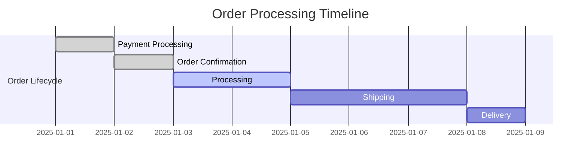
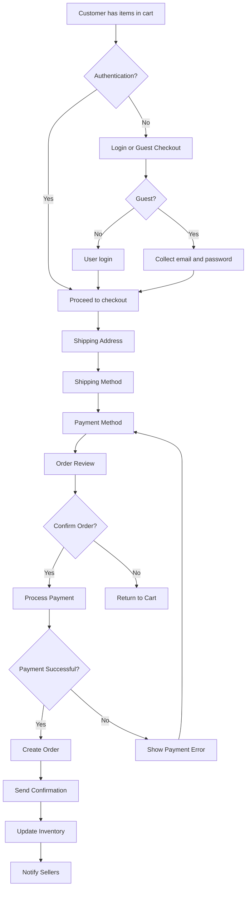
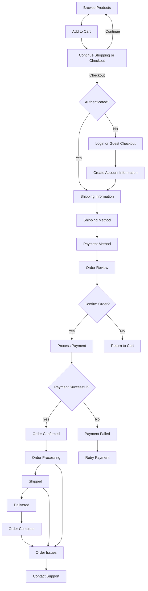
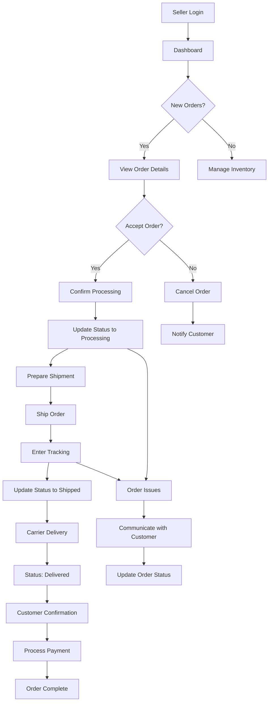
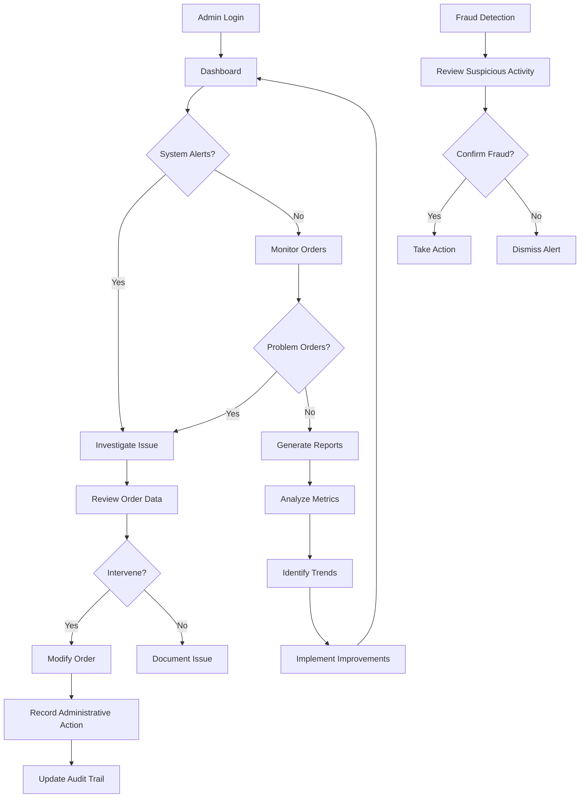

# Order Processing and Lifecycle Management

## 1. Introduction

### 1.1 Purpose of Order Processing System

The order processing system serves as the central transaction engine of the shoppingMall e-commerce platform. This system transforms items in a user's shopping cart into confirmed, trackable orders with proper inventory management, payment processing, and fulfillment coordination. 

This document defines the complete business requirements for all aspects of order processing, ensuring a seamless experience from cart finalization to delivery confirmation. The requirements focus exclusively on business logic, user workflows, and validation rules without specifying technical architecture or implementation details.

### 1.2 System Scope

The order processing system encompasses the following key components:
- Order creation and confirmation
- Payment authorization and processing
- Inventory management and allocation
- Order status tracking
- Shipping coordination
- Cancellation and refund processing
- Customer notifications
- Administrative oversight

All requirements are specified in natural language using EARS (Easy Approach to Requirements Syntax) format where applicable, providing clear guidance for backend developers while maintaining flexibility in technical implementation.

## 2. Order Lifecycle and States

### 2.1 Complete Order States

THE order processing system SHALL implement the following states to track the complete lifecycle of each order:

1. **CART**: Items are in shopping cart, no order has been initiated
2. **CREATED**: Order record exists but payment has not been confirmed
3. **PAYMENT_PENDING**: Payment processing is in progress
4. **PAYMENT_CONFIRMED**: Payment has been successfully processed
5. **PROCESSING**: Seller is preparing the order for shipment
6. **SHIPPED**: Order has been dispatched with tracking information
7. **OUT_FOR_DELIVERY**: Carrier has the order for final delivery
8. **DELIVERED**: Order has been delivered to the customer
9. **COMPLETED**: Order fulfillment has been confirmed
10. **CANCELLED**: Order was cancelled before completion
11. **REFUNDED**: Full or partial refund has been processed

### 2.2 State Transition Rules

THE system SHALL enforce the following state transition rules:

- Orders MAY transition from CART to CREATED only when proceeding to checkout
- Orders MAY transition from CREATED to PAYMENT_PENDING when initiating payment
- Orders MAY transition from PAYMENT_PENDING to PAYMENT_CONFIRMED upon successful payment
- Orders MAY transition from PAYMENT_PENDING to CREATED if payment fails
- Orders MAY transition from PAYMENT_CONFIRMED to PROCESSING when seller begins fulfillment
- Orders MAY transition from PROCESSING to SHIPPED when order is dispatched
- Orders MAY transition from SHIPPED to OUT_FOR_DELIVERY when carrier takes possession
- Orders MAY transition from OUT_FOR_DELIVERY to DELIVERED upon successful delivery
- Orders MAY transition from DELIVERED to COMPLETED after customer confirmation
- Orders MAY transition from any state to CANCELLED based on customer request or business rules
- Orders MAY transition from CANCELLED to REFUNDED after refund processing

### 2.3 Order State Visibility

THE system SHALL display order status to customers in a clear, chronological timeline format that shows:
- Current status
- Previous statuses with timestamps
- Next expected step
- Estimated timeline for progression to next state

THE system SHALL restrict visibility of internal administrative states to authorized personnel only.

THE customer dashboard SHALL display all orders grouped by status (e.g., "Processing", "Shipped", "Delivered", "Issues").

## 3. Authentication and Authorization Requirements

### 3.1 User Authentication for Order Placement

THE system SHALL require users to be authenticated before completing order placement.

THE guest checkout option SHALL allow users to place orders without creating an account, but SHALL require email address and password creation during checkout.

WHEN a guest user initiates checkout, THE system SHALL prompt for:
- Email address
- Password creation (for future login)
- Shipping information
- Payment details

THE system SHALL create a customer account automatically upon successful guest checkout completion.

WHEN a user attempts to place an order while authenticated, THE system SHALL verify their session is active and their profile information is complete.

THE system SHALL redirect unauthenticated users to the login page with an option to continue as guest when they attempt to proceed to checkout.

### 3.2 Role-Based Access Control

| Action | Customer | Seller | Admin | Guest |
|--------|----------|--------|-------|-------|
| Create order | ✅ | ❌ | ✅ | ✅ |
| View own orders | ✅ | ✅ | ✅ | ❌ |
| View customer orders | ❌ | ✅ | ✅ | ❌ |
| Modify order status | ❌ | ✅ | ✅ | ❌ |
| Cancel own order | ✅ | ❌ | ✅ | ❌ |
| Process refunds | ❌ | ❌ | ✅ | ❌ |
| View all orders | ❌ | ❌ | ✅ | ❌ |
| Export order data | ❌ | ❌ | ✅ | ❌ |

## 4. Order Placement Process

### 4.1 Cart Validation

WHEN a user proceeds to checkout, THE system SHALL perform comprehensive cart validation:

THE system SHALL verify all items in the cart are still available for purchase.

THE system SHALL verify pricing has not changed since items were added to cart.

THE system SHALL verify inventory availability for all items in the cart.

THE system SHALL verify the user's shipping address is complete and valid.

THE system SHALL calculate and display all costs including:
- Item subtotal
- Shipping fees (based on weight, destination, and service level)
- Taxes (calculated based on destination)
- Discounts and promotions
- Total amount due

### 4.2 Checkout Workflow

THE checkout process SHALL follow a progressive, step-by-step workflow:

1. **Cart Review**: Display all items, quantities, prices, and ability to modify cart
2. **Authentication**: Verify user authentication status or offer guest checkout
3. **Shipping Address**: Collect or confirm shipping address
4. **Shipping Method**: Display available shipping options with costs and delivery estimates
5. **Billing Information**: Collect payment method details
6. **Order Review**: Display complete order summary with final costs
7. **Place Order**: Confirm purchase and initiate payment processing

### 4.3 Order Creation

WHEN a user confirms order placement, THE system SHALL:

THE system SHALL create a unique order number following the format OM-YYYY-XXXXX where YYYY is the year and XXXXX is a sequential number.

THE system SHALL capture the current timestamp as the order creation time.

THE system SHALL generate a PDF invoice and store it for future reference.

THE system SHALL send order confirmation to the customer's email address.

THE system SHALL notify all relevant sellers of new orders containing their products.

THE system SHALL create order records for each seller if the order contains multiple sellers' items.

THE system SHALL apply any valid discounts or promotional codes to the order.

THE system SHALL create a coupon redemption record when a promotional code is used.

THE system SHALL validate that the user has not exceeded coupon usage limits.

THE system SHALL calculate and apply sales tax based on the shipping address and current tax rates.

THE system SHALL display the tax breakdown by jurisdiction when applicable (e.g., state, county, city taxes).

THE system SHALL store all order details as they existed at time of purchase, preserving pricing and product information even if subsequent changes occur.

## 5. Payment Processing Requirements

### 5.1 Payment Methods

THE system SHALL support the following payment methods:
- Credit/Debit cards (Visa, MasterCard, American Express)
- Digital wallets (Apple Pay, Google Pay)
- Bank transfers
- Buy now, pay later services
- Gift cards and platform credit

THE system SHALL display accepted payment methods with their respective logos on the checkout page.

THE system SHALL validate payment method details before submission:
- Card number format
- Expiration date
- CVV security code
- Billing address

### 5.2 Payment Security

THE system SHALL comply with PCI-DSS standards for all payment processing.

THE system SHALL use tokenization to protect sensitive payment information.

THE system SHALL never store complete credit card numbers in platform databases.

THE system SHALL use HTTPS with TLS 1.3+ for all payment-related communications.

THE system SHALL implement fraud detection algorithms that analyze:
- User behavior patterns
- Transaction amounts
- Shipping and billing address discrepancies
- Velocity checks (multiple transactions in short time)

### 5.3 Payment Workflow

THE payment process SHALL follow this sequence:

1. **Method Selection**: User selects preferred payment method
2. **Details Entry**: User enters required payment information
3. **Security Verification**: Apply 3D Secure or other authentication if required
4. **Authorization Request**: Send authorization request to payment processor
5. **Response Handling**: Process authorization response (approved, declined, error)
6. **Capture**: If approved, capture funds for settlement

### 5.4 Payment Failure Handling

WHEN a payment attempt fails, THE system SHALL:

THE system SHALL display a clear, user-friendly error message explaining the reason for failure.

THE system SHALL suggest potential remedies (e.g., "Please check your card details and try again")

THE system SHALL allow users to try a different payment method without restarting checkout.

THE system SHALL implement retry logic for temporary processing errors.

THE system SHALL lock the order from modification during payment processing to prevent double charging.

THE system SHALL release the order lock if payment exceeds 15 minutes without completion.

THE system SHALL send a failure notification to administrators for troubleshooting if the payment gateway returns system errors.

THE system SHALL log all payment attempts with appropriate security measures to protect sensitive information.

THE system SHALL implement rate limiting on payment attempts to prevent abuse or automated attacks.

## 6. Order Fulfillment and Tracking

### 6.1 Seller Fulfillment Process

WHEN a seller receives notification of a new order, THE system SHALL:

THE system SHALL display the order details including items, quantities, customer shipping address, and special instructions.

THE system SHALL provide buttons for the seller to update order status as they progress through fulfillment.

THE seller SHALL update the order status from "Processing" to "Shipped" when the order is dispatched.

WHEN marking an order as shipped, THE system SHALL require the seller to enter:
- Tracking number
- Shipping carrier
- Expected delivery date

### 6.2 Order Tracking Features

THE order tracking system SHALL provide customers with:

THE system SHALL display a visual timeline of the order status progression.

THE system SHALL provide the tracking number and direct link to the carrier's tracking page.

THE system SHALL send automated status updates via email and in-app notifications.

THE system SHALL display estimated delivery window based on shipping method and historical data.

THE system SHALL allow customers to report delivery issues directly from the tracking page.

THE system SHALL display delivery attempts and reasons for failed deliveries if applicable.

THE system SHALL allow customers to reschedule delivery if the initial attempt fails.

THE system SHALL display signature requirements and secure drop-off instructions if applicable.

## 7. Cancellation and Refund Policies

### 7.1 Customer Order Cancellation

THE customer MAY cancel their order under the following conditions:

- Orders in CREATED or PAYMENT_PENDING states may be cancelled at any time
- Orders in PAYMENT_CONFIRMED state may be cancelled within 1 hour of confirmation
- Orders in PROCESSING state may be cancelled with seller approval
- Orders in SHIPPED state cannot be cancelled but may be eligible for return

WHEN a customer requests cancellation, THE system SHALL:

THE system SHALL display the cancellation eligibility based on current order state.

THE system SHALL process full refunds immediately for cancellable orders.

THE system SHALL notify the seller when an order is cancelled.

THE system SHALL restore inventory for all items in cancelled orders.

THE system SHALL send confirmation of cancellation to the customer.

### 7.2 Refund Processing

THE system SHALL process refunds according to the following rules:

- Full refunds for cancelled orders
- Partial refunds for partial returns
- Restocking fees may apply (up to 15%) for non-defective returns
- Refunds to original payment method within 5-10 business days
- Immediate store credit option available on request

THE refund process SHALL:

THE system SHALL calculate refund amounts based on return reason and condition.

THE system SHALL process refunds through the original payment processor.

THE system SHALL update order status to REFUNDED when processing is complete.

THE system SHALL notify the customer of refund initiation and completion.

THE system SHALL document refund justification in the order audit trail.

THE system SHALL prevent multiple refund requests for the same order item.

THE system SHALL flag orders with refund patterns that may indicate potential abuse.

THE system SHALL allow administrators to override refund decisions in exceptional cases.

## 8. Error Handling Scenarios

### 8.1 Common Error Conditions

THE system SHALL handle the following error scenarios:

- **Inventory Unavailability**: If inventory changes between cart and checkout, THE system SHALL prevent order completion and notify the user
- **Payment Processing Errors**: If payment gateway is unavailable, THE system SHALL allow retry with appropriate timeout
- **Address Validation Failures**: If shipping address is invalid, THE system SHALL prompt for correction
- **Tax Calculation Issues**: If tax service is unavailable, THE system SHALL use cached rates and flag for review
- **Order Creation Failures**: If order record cannot be created, THE system SHALL preserve cart and allow retry

### 8.2 Data Integrity Protection

THE system SHALL implement safeguards to maintain data integrity:

THE system SHALL use transactional processing for order creation to ensure all related records are created or none are.

THE system SHALL implement idempotency keys for payment requests to prevent duplicate processing.

THE system SHALL maintain audit logs for all order modifications with timestamps and user IDs.

THE system SHALL prevent creation of orders with negative or zero total amounts.

THE system SHALL validate that order item quantities are positive integers.

THE system SHALL ensure all order line items reference valid products and SKUs.

THE system SHALL prevent deletion of orders with associated financial transactions.

THE system SHALL implement record-level locking during order modifications to prevent race conditions.

THE system SHALL maintain referential integrity between orders, order items, payments, and shipments.

### 8.3 System Failure Recovery

THE system SHALL implement recovery procedures for various failure scenarios:

WHEN the payment system fails after order creation but before payment confirmation, THE system SHALL roll back the order, release inventory, and notify appropriate personnel.

WHEN an order fails to process due to system errors, THE system SHALL queue the order for reprocessing with exponential backoff.

WHEN inventory updates fail during order processing, THE system SHALL trigger manual reconciliation process.

THE system SHALL maintain a dashboard for monitoring failed transactions and recovery status.

THE system SHALL implement automated alerts for orders stuck in intermediate states.

THE system SHALL provide administrative tools to manually resolve orders with processing issues.

THE system SHALL maintain backups of order data with point-in-time recovery capability.

## 9. User Journey Flows

### 9.1 Customer Order Journey

### 9.2 Seller Order Management Journey

### 9.3 Administrative Oversight Journey

## 10. Success Criteria and Validation

The order processing system SHALL be considered successful when:

- 99.9% of orders successfully transition from cart to payment confirmation
- Average order processing time (from checkout to confirmation) is under 15 seconds
- Payment success rate is 95% or higher
- Customer satisfaction with order process is 4.5/5.0 or higher
- Order error rate is less than 0.5% of total orders
- 99% of orders have accurate inventory allocation
- 98% of order status updates are reflected in customer view within 1 minute
- 90% of cancellation requests are processed within 5 minutes
- All critical order processing functions have 99.9% uptime
- Audit trails are complete for 100% of order modifications

## 11. Related Documents

This order processing specification integrates with the following documents:
- [User Roles and Permissions](./02-user-roles.md) for authentication requirements
- [Shopping Cart and Wishlist Functionality](./07-wishlist-cart.md) for cart-to-order transitions
- [Product Catalog Structure](./06-product-catalog.md) for item validation
- [Payment Processing Requirements](./05-order-process.md) for financial transaction details
- [Seller Account Features](./09-admin-features.md) for seller fulfillment workflows
- [Administrator Oversight](./09-admin-features.md) for system management functions

> *Developer Note: This document defines **business requirements only**. All technical implementations (architecture, APIs, database design, etc.) are at the discretion of the development team.*