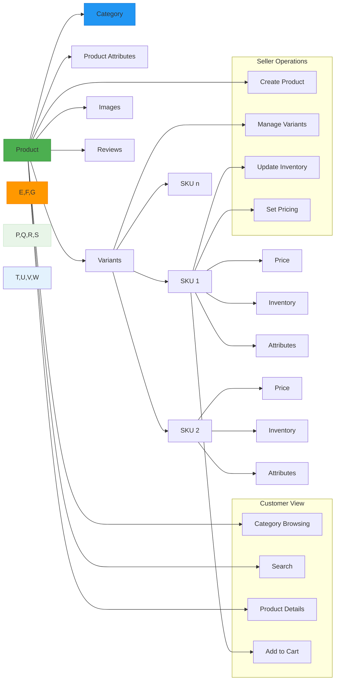

# Product Catalog and SKU Management Requirements

## 1. Product Categories

The shoppingMall platform requires a flexible hierarchical category system to organize products effectively. Categories form the foundation of product organization and discovery.

### Category Structure
THE system SHALL support hierarchical categories with unlimited nesting levels to accommodate diverse product types and organizational needs. Categories MUST be organized in a tree structure where each category can have zero or more subcategories.

WHEN a seller adds a new product, THE system SHALL require the product to be assigned to at least one category. Each product MAY be assigned to multiple categories to enhance discoverability.

THE category structure SHALL include the following attributes:
- Category name (required, unique within parent category)
- Description (optional, up to 1000 characters)
- Parent category (optional, for subcategories)
- Category image (optional, for display in navigation)
- Display order (number, for sorting within parent category)
- Active status (boolean, to hide/show category)

WHEN a category is marked as inactive, THE system SHALL hide the category and its subcategories from customer browsing but keep them accessible to sellers and administrators for management purposes.

IF a category contains subcategories, THEN THE system SHALL prevent deletion of the parent category until all subcategories are either moved to another parent or deleted.

THE category navigation SHALL be displayed in the main menu with top-level categories, and customers MAY expand categories to view subcategories.

### Category Management
WHEN a seller creates a new category for their store, THE system SHALL require administrator approval before the category becomes visible to customers. This prevents category spam and maintains catalog quality.

THE administrator SHALL have the ability to create, edit, and delete top-level categories that apply to the entire platform. Sellers MAY only manage categories for their own products and stores.

## 2. Product Attributes

Each product in the shoppingMall platform has core attributes that define its identity and presentation to customers.

### Core Product Information
THE product catalog SHALL include the following required attributes for every product:
- Product title (required, up to 200 characters)
- Product description (required, rich text with images, minimum 50 characters)
- Primary product image (required)
- Additional product images (optional, up to 10)
- Brand/manufacturer (optional, up to 100 characters)
- Base price (required, positive decimal number)
- Currency (required, default USD)
- Seller information (required, linking to seller account)
- Creation date (automatically captured)
- Last updated date (automatically updated)
- Product status (active, inactive, draft, discontinued)

THE product description SHALL support rich text formatting including paragraphs, lists, and embedded images to showcase product features effectively.

WHEN a product is created, THE system SHALL automatically generate a unique product SKU prefix based on the product title and seller ID for internal tracking.

THE base price SHALL be used as the foundation for variant pricing, with individual variants able to have price adjustments relative to the base price.

### Product Status Lifecycle
THE product status SHALL follow this lifecycle:
- Draft: Product is being created, only visible to the seller
- Active: Product is visible to customers and available for purchase
- Inactive: Product is hidden from customers but can be reactivated
- Discontinued: Product is permanently retired, no longer available

WHEN a product status changes from active to inactive, THE system SHALL remove the product from customer browsing views but maintain it in order history for existing customers.

IF a product has active inventory and receives no sales in the past 12 months, THEN THE system SHALL notify the seller to review the product status.

## 3. SKU Variants

The shoppingMall platform SHALL support product variants through a SKU (Stock Keeping Unit) system that allows for multiple configurations of the same product.

### Variant System Requirements
WHEN a product has multiple options such as color, size, or material, THE system SHALL create unique SKUs for each combination of options to track inventory and pricing separately.

THE variant system SHALL support the following option types:
- Color (with text name and optional color code)
- Size (with standardized size charts for different product types)
- Material/Composition
- Pattern/Design
- Capacity/Volume
- Any custom option defined by the seller

WHEN a seller sets up product variants, THE system SHALL allow the seller to specify which attributes create variations in the product and which are shared across all variants.

### SKU Attributes
THE system SHALL assign the following attributes to each SKU:
- Unique SKU code (required, alphanumeric, 8-20 characters)
- Product reference (required, linking to parent product)
- Variant attribute values (required, specific to this SKU)
- Price (required, may be adjusted from base price)
- Inventory count (required, non-negative integer)
- SKU status (active, out-of-stock, discontinued)
- Weight/dimensions (required for shipping calculations)
- Image reference (optional, specific to this variant)

THE SKU code SHALL be either automatically generated by the system or manually entered by the seller, but MUST be unique across the entire platform.

### Variant Management
WHEN a seller creates product variants, THE system SHALL generate SKUs for all possible combinations of the selected variant attributes. For example, a shirt with 3 colors and 4 sizes SHALL create 12 unique SKUs.

THE seller MAY customize individual SKU attributes such as price adjustments, specific images, and inventory levels for each variant combination.

WHEN a SKU's inventory reaches zero, THE system SHALL automatically update the SKU status to "out-of-stock" and make the variant unavailable for purchase, while keeping the product visible in the catalog.

IF a SKU has been out-of-stock for 90 consecutive days, THEN THE system SHALL notify the seller to either replenish inventory or discontinue the variant.

### Pricing and Inventory
THE system SHALL calculate the final price for each SKU based on the product's base price plus any variant-specific price adjustments.

THE price adjustment SHALL support both percentage-based and fixed amount adjustments to the base price.

THE inventory count FOR each SKU SHALL be updated in real-time during the order process to prevent overselling.

WHEN a customer adds a product to their cart, THE system SHALL reserve inventory for that SKU for 15 minutes to prevent other customers from purchasing the same item.

## 4. Search Functionality

The shoppingMall platform SHALL provide comprehensive search capabilities to help customers find products efficiently.

### Basic Search Requirements
WHEN a customer enters search terms in the search bar, THE system SHALL search across product titles, descriptions, brand names, category names, and relevant attributes to find matching products.

THE search results SHALL be displayed in order of relevance, taking into account:
- Exact matches in product title (highest priority)
- Matches in product description
- Brand name matches
- Category matches
- Attribute matches

THE system SHALL provide instant search suggestions as the customer types, showing matching product names, categories, and brands.

### Advanced Search and Filtering
THE customer MAY filter search results by:
- Category (with hierarchical category browsing)
- Price range (with adjustable sliders)
- Brand
- Specific attributes (color, size, material, etc.)
- Availability (in-stock items only)
- Customer ratings (4 stars and above, etc.)

WHEN filtering by price range, THE system SHALL display the minimum and maximum prices found in the current result set and allow the customer to adjust the range.

WHEN filtering by attributes such as color or size, THE system SHALL show only filter options that are available in the current result set (e.g., if searching for a specific brand, only show colors available for that brand).

THE search interface SHALL update results dynamically as filters are applied without requiring a page refresh.

### Search Ranking and Relevance
THE system SHALL use the following factors to determine search result ranking:
- Keyword match in product title
- Keyword match in product description
- Product popularity (sales volume)
- Customer ratings and reviews
- Recency of product addition
- Inventory availability

WHEN a search term matches a category name exactly, THE system SHALL promote products from that category to the top of the results.

THE search system SHALL handle common variations and misspellings of product names and categories to improve findability.

### Search Performance
THE search function SHALL return results within 2 seconds for common queries to ensure a responsive user experience.

THE system SHALL support pagination of search results, displaying 20 products per page with infinite scroll or page navigation options.

## 5. User Access and Permissions

Different user roles have varying levels of access to the product catalog management features.

### Customer Access
THE customer MAY browse products by category, use search functionality, view product details, and see available variants and prices.

THE customer SHALL NOT be able to create or modify products, categories, or SKUs.

### Seller Access
THE seller MAY create new products, define product variants, set prices and inventory levels, and manage their product catalog.

THE seller MAY only edit products and SKUs associated with their own store.

THE seller MAY request new categories for their products, subject to administrator approval.

### Administrator Access
THE administrator SHALL have full access to view, create, edit, and delete all products, categories, and SKUs across the entire platform.

THE administrator MAY override any product or category settings for quality control or business needs.

THE administrator SHALL review and approve category requests from sellers.

### Guest Access
THE guest MAY browse products, use search functionality, and view product details but SHALL NOT be able to purchase or access seller-specific features.

## 6. Business Rules and Constraints

The following business rules govern the product catalog system:

THE system SHALL require at least one active SKU for a product to be listed as active in the catalog.

THE product title SHALL be unique per seller, but different sellers MAY have products with the same title.

THE SKU code SHALL be unique across the entire platform, regardless of seller.

THE price FOR any SKU SHALL be a positive number greater than zero.

THE inventory count SHALL be a non-negative integer (zero or positive).

THE product description SHALL contain at least 50 characters to ensure sufficient product information.

THE system SHALL prevent publishing products with empty or "default" placeholder images.

## 7. Error Handling Scenarios

WHEN a seller attempts to create a product with a duplicate SKU code, THE system SHALL prevent saving and display an error message: "This SKU code is already in use. Please use a unique SKU code."

IF a customer searches for a product that does not exist, THEN THE system SHALL display search results for similar products and suggest alternative search terms.

WHEN a customer attempts to add an out-of-stock SKU to their cart, THE system SHALL display a message: "This item is currently out of stock. Please select a different option or check back later."

IF a seller attempts to delete a product that has associated orders, THEN THE system SHALL prevent deletion and display: "This product cannot be deleted because it has been purchased by customers. You may change the status to discontinued instead."

WHEN a search query times out due to complexity, THE system SHALL simplify the search parameters and retry, then display results with a message: "Showing simplified search results for [original query]."

## 8. Success Criteria

The product catalog system SHALL be considered successful when:

- Customers can easily find products through browsing and search
- Search results are relevant and load within 2 seconds
- Product variants are clearly displayed with available options
- Inventory levels are accurately reflected in real-time
- Sellers can efficiently manage their product catalogs
- The category structure supports the range of products offered
- Users can filter search results effectively by multiple criteria
- The system prevents overselling through proper inventory management

> *Developer Note: This document defines **business requirements only**. All technical implementations (architecture, APIs, database design, etc.) are at the discretion of the development team.*