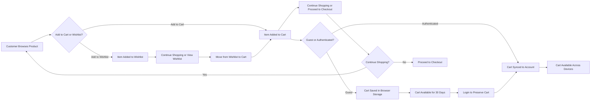
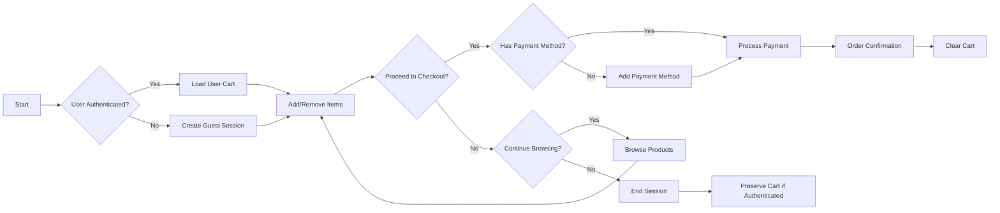
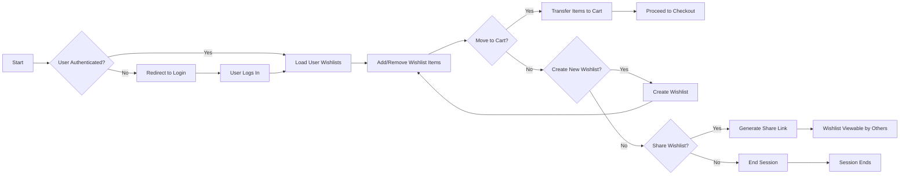
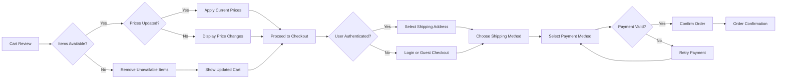

# Enhanced Wishlist and Cart Functionality Specification

## 1. Introduction and Overview

This document specifies the complete business requirements for the wishlist and shopping cart functionality within the e-commerce shopping mall platform. The shopping cart enables users to collect items they intend to purchase, while the wishlist allows users to save items for future consideration. These features are critical to the user experience, serving as the final decision point before purchase and as a relationship-building tool for future sales.

The cart and wishlist systems must work seamlessly across different user states (authenticated vs. guest), maintain data persistence through sessions, and provide intuitive interaction patterns that encourage conversion. The requirements focus exclusively on business logic, user workflows, and validation rules that developers must implement, without specifying technical architecture or database design.

## 2. User Roles and Authentication Requirements

### Authentication States

USERS interact with cart and wishlist functionality in two primary states: authenticated (logged in) and unauthenticated (guest). Each state has specific requirements for data persistence and access.

THE system SHALL support cart functionality for guest users, enabling them to add items to cart before logging in or creating an account.

THE system SHALL support wishlist functionality exclusively for authenticated users, requiring login or account creation to save items to wishlist.

### Role-Specific Capabilities

| Action | Customer | Seller | Admin | Guest |
|--------|----------|--------|-------|-------|
| Add items to cart | ✅ | ✅ | ✅ | ✅ |
| Add items to wishlist | ✅ | ✅ | ✅ | ❌ |
| View cart contents | ✅ | ✅ | ✅ | ✅ |
| View wishlist | ✅ | ✅ | ✅ | ❌ |
| Remove items from cart | ✅ | ✅ | ✅ | ✅ |
| Remove items from wishlist | ✅ | ✅ | ✅ | ❌ |
| Update item quantity | ✅ | ✅ | ✅ | ✅ |
| Save cart for later | ✅ | ✅ | ✅ | ❌ |
| Access across devices | ✅ | ✅ | ✅ | ❌ |

## 3. Wish List Functional Requirements

### Basic Wishlist Operations

THE authenticated user SHALL be able to add any product from the catalog to their personal wishlist.

THE system SHALL allow users to maintain multiple wishlists for different purposes (e.g., "Birthday Gifts", "Home Renovation", "Back to School").

THE user SHALL be able to create a new wishlist by providing a name and optional description.

THE system SHALL automatically create a default wishlist named "Favorites" for each new user upon first login.

THE user SHALL be able to rename any wishlist they own.

THE user SHALL be able to delete a wishlist and all items within it after confirming the action.

### Item Management in Wishlists

THE user SHALL be able to add a product and specific SKU (including selected color, size, and other variants) to a chosen wishlist.

THE user SHALL be able to view all items in a specific wishlist with product details including image, name, variant information, and current price.

THE user SHALL be able to remove individual items from a wishlist without affecting other items in the same or different wishlists.

THE system SHALL display the current stock status of wishlist items, indicating whether items are "In Stock", "Low Stock", or "Out of Stock".

THE system SHALL notify users via email when a product in their wishlist drops below the "Low Stock" threshold if configured in notification preferences.

THE system SHALL notify users via email when a previously "Out of Stock" item in their wishlist becomes available again.

THE system SHALL allow users to set price drop alerts for wishlist items, sending notifications when prices decrease.

### Wishlist Sharing and Social Features

THE user SHALL be able to generate a shareable link for any wishlist to share via email, social media, or messaging apps.

THE system SHALL support public and private wishlist visibility settings.

THE user SHALL be able to set a wishlist as public, allowing anyone with the link to view its contents without logging in.

THE user SHALL be able to set a wishlist as private, restricting access to only the owner.

THE system SHALL allow users to password-protect a public wishlist, requiring a password to view the contents.

THE system SHALL display a special indicator when a wishlist has been shared as a gift registry, showing purchase status of items.

## 4. Shopping Cart Functional Requirements

### Cart Persistence and Access

THE system SHALL maintain cart contents for authenticated users across sessions and devices.

THE system SHALL preserve guest cart contents for a minimum of 30 days through browser storage mechanisms.

THE system SHALL automatically merge guest cart contents with user accounts when guests complete registration or login.

WHEN a user logs in after previously browsing as a guest with items in cart, THE system SHALL merge guest cart items with existing account cart items, preserving all quantities and variants.

### Adding Items to Cart

THE user SHALL be able to add a product and specific SKU to their shopping cart from any product detail page.

THE user SHALL specify the quantity when adding items to cart, with a minimum quantity of 1.

THE system SHALL validate that requested quantities are available in inventory before adding to cart.

IF requested quantity exceeds available inventory, THEN THE system SHALL add the maximum available quantity to cart and notify the user of the adjustment.

THE user SHALL be able to add multiple quantities of the same SKU to their cart.

THE system SHALL prevent users from adding more than 99 units of a single SKU to the cart.

### Cart Item Management

THE user SHALL be able to view all items in their cart with product details including image, name, variant information, unit price, and total line item price.

THE user SHALL be able to remove individual items from the cart.

THE user SHALL be able to update the quantity of any item in the cart.

WHEN a user updates cart item quantity, THE system SHALL validate availability and adjust as necessary, notifying the user of any changes.

THE system SHALL recalculate cart totals in real-time when items are added, removed, or quantities are updated.

### Cart Validation and Business Rules

THE system SHALL validate that all items in the cart are still available for purchase and have not been discontinued.

THE system SHALL validate that prices have not changed since items were added to cart, displaying any price updates before checkout.

THE system SHALL validate that item variants (colors, sizes) selected are still available in the specified configuration.

THE system SHALL remove any items from the cart that have been discontinued or are no longer available when the cart is accessed.

THE system SHALL notify the user when items are automatically removed from cart due to unavailability.

IF an item in the cart has a price increase since it was added, THEN THE system SHALL display the updated price and allow the user to proceed or remove the item.

IF an item in the cart has a price decrease since it was added, THEN THE system SHALL automatically apply the lower price without requiring user action.

## 5. Cart-Wishlist Integration Requirements

### Moving Items Between Systems

THE user SHALL be able to move items directly from wishlist to cart with a single action.

THE user SHALL be able to add items from their wishlist to cart while maintaining the wishlist copy (copy operation rather than move).

THE system SHALL allow users to add all items from a wishlist to cart simultaneously as a "Buy All" function.

WHEN a user adds all items from a wishlist to cart, THE system SHALL validate each item's availability and quantity before adding, notifying the user of any items that cannot be added.

THE user SHALL be able to move items from cart to wishlist, removing them from the cart while adding to a selected wishlist.

THE user SHALL be able to copy items from cart to wishlist, maintaining the cart copy while adding to the wishlist.

### Wishlist as Cart Proxy

THE system SHALL allow users to designate a specific wishlist as their "Save for Later" collection that acts as an extension of their cart.

THE user SHALL be able to easily transfer items between the cart and their "Save for Later" wishlist with minimal interaction.

## 6. Business Rules and Validation Requirements

### Inventory Validation

THE system SHALL validate item availability against current inventory levels at multiple points: when adding to cart, when accessing cart, and immediately before checkout completion.

THE system SHALL prevent cart items from being reserved in inventory; inventory reservation occurs only during checkout processing.

THE system SHALL display real-time inventory status for cart items, indicating if items are "In Stock", "Low Stock", or "Limited Availability".

### Pricing Rules

THE system SHALL apply the current catalog price to cart items at checkout, not the price when initially added to cart (except for locked pricing scenarios).

THE system SHALL honor promotional pricing in cart if the promotion is still active at checkout.

THE system SHALL remove expired promotions from cart items and notify users of price changes.

### Cross-Border and Tax Considerations

THE system SHALL display cart contents and pricing in the user's selected currency when available.

THE system SHALL calculate and display estimated taxes based on the user's shipping address during cart review.

THE system SHALL calculate and display estimated international duties and customs fees for international shipments during cart review.

THE system SHALL not finalize tax calculations until shipping address is confirmed during checkout.

## 7. Error Scenarios and User Recovery

### Session-Related Issues

WHEN a user's session expires while they have items in cart, THE system SHALL preserve cart contents and restore them upon login.

IF a technical error prevents cart retrieval, THEN THE system SHALL provide a clear error message and option to contact customer support.

### Data Synchronization Issues

IF cart items cannot be synchronized across devices, THEN THE system SHALL display the most recent cart state and provide an option to merge carts manually.

THE system SHALL provide a "Recover Cart" function when cart data appears corrupted or inaccessible, attempting to restore from backup sources.

### Availability Issues

WHEN items in the cart become unavailable between browsing and checkout, THE system SHALL clearly identify affected items and provide options to remove them or continue with remaining items.

IF all items in the cart become unavailable, THEN THE system SHALL provide personalized product recommendations based on recently viewed or similar categories.

## 8. User Journey Flows

### Primary Flow Chart: Cart and Wishlist Interactions



### Typical User Scenarios

**Scenario 1: First-Time Visitor**
1. User browses as guest
2. Adds several items to cart
3. System saves cart in browser storage
4. User returns later - cart contents are restored
5. User decides to purchase and logs in
6. System merges guest cart with account cart
7. User proceeds to checkout

**Scenario 2: Returning Customer**
1. User logs in
2. System restores previously saved cart from account
3. User sees items from last visit still in cart
4. System notifies user of price changes on some items
5. User updates quantities as needed
6. User proceeds to checkout

**Scenario 3: Wishlist-Driven Purchase**
1. User maintains multiple wishlists
2. User shares birthday wishlist with family
3. Family members purchase items, showing as "Purchased" in registry
4. User reviews wishlist, seeing which items were purchased
5. User adds remaining desired items to cart for self-purchase
6. User completes checkout

**Scenario 4: Cross-Device Experience**
1. User adds item to cart on mobile device
2. User accesses platform from desktop computer
3. System synchronizes cart across devices
4. User sees same cart contents on desktop
5. User adds additional items from desktop
6. User completes purchase

## 9. Non-Functional Requirements

### Performance Requirements

THE system SHALL respond to user actions within 2 seconds under normal load conditions.

THE shopping cart loading function SHALL display cart contents within 2 seconds of request.

THE system SHALL update cart totals instantly (within 500ms) when items are added, removed, or quantities change.

THE system SHALL support cart operations (add, remove, update) with a 99.9% success rate during peak traffic periods.

THE system SHALL handle 10,000 concurrent users performing cart operations without degradation.

### Data Persistence Requirements

THE system SHALL store authenticated user cart data for a minimum of 6 months of inactivity.

THE system SHALL store guest cart data for a minimum of 30 days.

THE system SHALL back up cart data daily with recovery capability within 1 hour of failure.

THE system SHALL implement data retention policies that comply with privacy regulations.

### Security Requirements

THE system SHALL not expose other users' cart or wishlist data under any circumstances.

THE system SHALL implement secure storage mechanisms for cart data, especially when containing personally identifiable information.

THE system SHALL protect against cross-site scripting attacks in cart and wishlist interfaces.

THE system SHALL validate all cart modification requests against user authentication and authorization.

THE system SHALL use encrypted storage for all cart data that persists across sessions.

THE system SHALL implement rate limiting on cart-related APIs to prevent abuse.

### Reliability Requirements

THE system SHALL maintain data consistency for cart items during system failures.

THE system SHALL provide recovery mechanisms for cart data during service interruptions.

THE system SHALL implement transactional integrity for all cart modification operations.

THE system SHALL provide real-time synchronization of cart data across all user devices.

THE system SHALL implement failover mechanisms for cart services to ensure 99.9% availability.

## 10. Authentication Requirements

### Authentication Integration

WHEN an unauthenticated user accesses the platform, THE system SHALL create a temporary session for cart functionality.

WHEN a user registers or logs in, THE system SHALL merge the temporary session cart with the user's persistent cart data.

THE system SHALL maintain user authentication state throughout the shopping journey with secure session management.

THE system SHALL implement JWT token validation for all authenticated cart and wishlist operations.

THE authentication token SHALL include user role and permissions to determine access to cart and wishlist features.

IF authentication fails during cart operations, THE system SHALL redirect the user to login with return URL preservation.

THE system SHALL support session refresh mechanisms to maintain active sessions for cart operations.

### Role-Based Access Control

THE system SHALL implement comprehensive role-based access control for cart and wishlist functionality:

| Action | Customer | Seller | Admin | Guest |
|--------|----------|--------|-------|-------|
| Add items to cart | ✅ | ✅ | ✅ | ✅ |
| Add items to wishlist | ✅ | ✅ | ✅ | ❌ |
| View cart contents | ✅ | ✅ | ✅ | ✅ |
| View wishlist | ✅ | ✅ | ✅ | ❌ |
| Remove items from cart | ✅ | ✅ | ✅ | ✅ |
| Remove items from wishlist | ✅ | ✅ | ✅ | ❌ |
| Update item quantity | ✅ | ✅ | ✅ | ✅ |
| Save cart for later | ✅ | ✅ | ✅ | ❌ |
| Access across devices | ✅ | ✅ | ✅ | ❌ |
| Proceed to checkout | ✅ | ❌ | ✅ | ❌ |

## 11. Business Rules for Key Workflows

### Cart Lifecycle



### Wishlist Lifecycle



### Cart-to-Checkout Flow



### Guest to Authenticated Transition

```mermaid
graph LR
    A["Guest Browsing"] --> B["Add to Cart"]
    B --> C["Cart Stored in Session"]
    C --> D{"Login or Register?"}
    D -->|"Yes"| E["Authenticate User"]
    D -->|"No"| F["Continue as Guest"]
    E --> G["Merge Guest Cart with User Account"]
    G --> H["Access Saved Cart"]
    F --> I["Proceed to Checkout (Guest)"].".

## 12. Success Metrics and Validation

THE wishlist and cart system SHALL meet the following success criteria:

- Average cart recovery rate after user login: 95% success rate
- Percentage of users who add items from wishlist to cart: 40% conversion rate
- Average number of items per cart: minimum 3.5 items
- Cart conversion rate (cart additions to purchases): 25% minimum
- Time from cart addition to purchase: maximum 48 hours
- Wishlist creation rate per active user: 0.8 per month
- Shopping cart loading time: less than 2 seconds
- Add to cart success rate: 99.9% during peak traffic

## 13. Order Processing Integration

### Cart Checkout Process

THE system SHALL integrate the shopping cart with the order processing system through the following requirements:

WHEN a user proceeds to checkout from the cart, THE system SHALL validate all items are available and create a temporary order record.

THE system SHALL transfer cart items to order line items with fixed prices at time of purchase, preserving product and variant details.

WHEN an order is created, THE system SHALL reduce inventory counts for each ordered SKU to prevent overselling.

WHEN an order is successfully placed, THE system SHALL clear the cart and display confirmation to the user.

THE system SHALL record the purchase transaction with complete audit trail for financial reconciliation.

THE system SHALL send order confirmation to the customer with summary, order number, and expected fulfillment timeline.

THE system SHALL queue order fulfillment notifications to the appropriate sellers based on the items purchased.

## 14. Development Notes

> *Developer Notes: This document defines **business requirements only**. All technical implementations (architecture, APIs, database design, etc.) are at the discretion of the development team. Please ensure the implementation meets all stated business requirements while following best practices for system design, security, and scalability.*