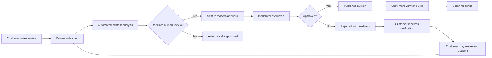
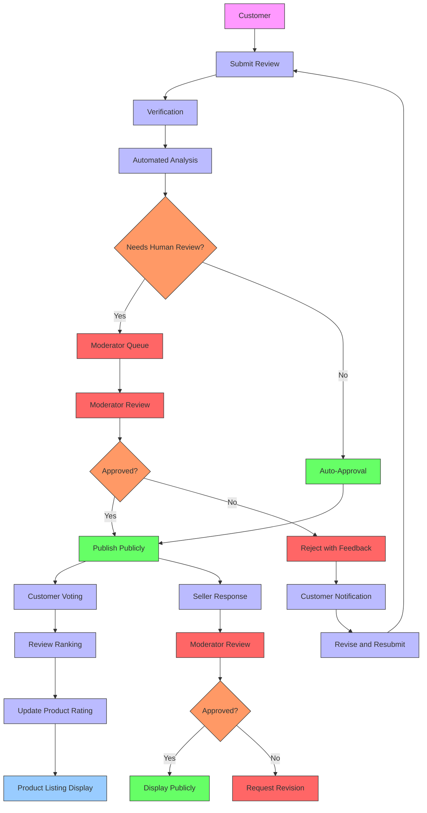

# Product Review and Rating System Requirements Specification

## Introduction

This document outlines the complete requirements for the product review and rating system in the shopping mall e-commerce platform. The review system enables customers to share their experiences with purchased products, providing valuable feedback for both prospective buyers and sellers. This specification covers all business requirements for review submission, verification, display, moderation, and integration with other platform features.

The review and rating system serves multiple purposes: building trust with potential customers through authentic user experiences, helping sellers improve their products based on customer feedback, enhancing product discovery through review-based filtering, and contributing to the platform's overall credibility. The system must balance openness with quality control, allowing genuine customer feedback while preventing abuse and maintaining content quality.

## Review Submission Requirements

### Customer Review Eligibility

THE system SHALL verify that customers have actually purchased a product before allowing them to submit a review. This prevents biased or fabricated reviews from competitors, sellers, or other non-customers.

WHEN a customer attempts to submit a review, THE system SHALL check their order history for completed transactions containing the product. Only customers with confirmed purchases can submit reviews.

THE system SHALL allow customers to submit exactly one review per product, regardless of the number of times they purchase it. This prevents manipulation of rating averages through multiple positive reviews.

IF a customer has purchased the same product multiple times, THEN THE system SHALL still limit them to a single review for that product, encouraging comprehensive feedback rather than multiple similar reviews.

### Review Submission Process

WHEN a customer accesses the review submission interface, THE system SHALL display a form with the following required fields:
- Star rating (1-5 stars, required)
- Review title (required, minimum 10 characters)
- Review content (required, minimum 50 characters)

THE review submission form SHALL also provide optional fields for:
- Product photos/videos from their experience
- Specific attribute ratings (quality, value, shipping speed)
- Purchase verification date

WHEN a customer submits a review, THE system SHALL save it with a "pending" status and make it visible to the customer but not to other users until approved.

THE system SHALL allow customers to edit or delete their reviews at any time before final approval from the moderation team.

### Technical Requirements for Review Content

THE system SHALL limit review text to a maximum of 5,000 characters to prevent excessively long content that may impact performance or user experience.

THE system SHALL support rich text formatting in reviews, allowing customers to use bold, italic, bullet points, and numbered lists to structure their feedback.

THE system SHALL allow customers to upload up to five media files per review, with a total size limit of 25MB for all files combined.

Media files SHALL be limited to common image formats (JPG, PNG, GIF) and video formats (MP4) with resolution up to 4K for video content.

THE system SHALL automatically optimize uploaded images and videos for web display, creating appropriate thumbnails and lower-resolution versions for different device types.

## Review Verification and Moderation

### Automated Review Verification

THE system SHALL automatically verify that review authors have purchased the product being reviewed by cross-referencing the user's order history with the product ID.

THE system SHALL display a "Verified Purchase" badge on reviews from customers who bought the product through the platform, increasing trust in the review's authenticity.

THE system SHALL prevent customers from reviewing their own products, even if they made a purchase through their seller account.

THE system SHALL detect and flag patterns of suspicious review activity, including:
- Multiple five-star reviews submitted rapidly from the same IP address
- Reviews containing suspicious keywords or promotional language
- Accounts that only submit positive reviews with no purchase history
- Coordinated review campaigns across multiple accounts

### Review Moderation Workflow

THE system SHALL route all submitted reviews through a moderation workflow before making them publicly visible.

THE initial moderation step SHALL be automated, using content analysis algorithms to flag potentially problematic reviews based on language patterns, sentiment, and content type.

REVIEW status lifecycle:
1. Draft (customer is writing)
2. Submitted (awaiting moderation)
3. Under review (moderator is evaluating)
4. Approved (publicly visible)
5. Rejected (not published)
6. Archived (removed from public view)

WHEN a review is approved, THE system SHALL make it publicly visible and include it in rating calculations.

WHEN a review is rejected, THE system SHALL notify the customer with general feedback about why their review was not published, without disclosing specific moderator identities.

THE system SHALL allow moderators to request additional information from review authors before making approval decisions.

### Moderator Capabilities

THE moderator interface SHALL allow authorized staff to view all review submissions with complete context including:
- Review content and rating
- Product information
- Customer purchase history
- Submitted media files
- Previous reviews from the same customer
- Similar reviews for the same product

THE moderation system SHALL provide tools for moderators to filter and sort review submissions by:
- Submission date
- Product category
- Rating (to prioritize extreme ratings)
- Review length
- Media included
- Flagged issues

THE system SHALL allow moderators to approve, reject, or request changes to reviews with appropriate documentation of their actions.

THE moderator decisions SHALL be logged with timestamp, moderator identification, and reason for the decision to maintain accountability and support quality control of the moderation process.

## Review Display and User Interface Requirements

### Review Aggregation and Calculations

THE system SHALL calculate an overall product rating by averaging all approved, verified reviews for that product.

THE average rating SHALL be displayed as a 5-star rating with half-star increments (e.g., 4.5 stars) to provide meaningful differentiation.

THE system SHALL recalculate average ratings in real-time when new reviews are approved or existing reviews are updated or removed.

THE system SHALL display the total number of reviews next to the average rating to provide context about the rating's reliability.

THE system SHALL show rating distribution, displaying how many reviews have given each star rating (1-5) to help customers understand rating composition.

### Review Sorting and Filtering

THE system SHALL allow customers to sort product reviews by:
- Most recent
- Highest rated
- Lowest rated
- Most helpful (by user votes)
- Most recent with media
- Most helpful with media

THE default sorting shall be "Most recent" to encourage engagement with current customer experiences.

THE system SHALL allow filtering reviews by:
- Verified purchases only
- Reviews containing photos or videos
- Specific time periods (past 30 days, 6 months, year)
- Rating ranges (4-5 stars, 1-2 stars, etc.)

### User Ratings of Reviews

THE system SHALL allow customers to vote whether a review was helpful or not helpful in their purchase decision.

THE helpfulness voting SHALL not require customers to have purchased the product, encouraging engagement with the review system.

THE system SHALL display the total number of helpful votes for each review to help customers identify the most useful feedback.

THE help text for voting SHALL clarify that customers should vote based on whether the review was informative and helpful, not whether they agree with the rating.

THE system SHALL prevent customers from submitting multiple votes for the same review to maintain vote integrity.

## Roles and Permissions

### Customer Access

THE customer MAY submit reviews for products they have purchased.
THE customer MAY vote on the helpfulness of other customers' reviews.
THE customer MAY edit or delete their own reviews before final approval.
THE customer SHALL NOT see or interact with reviews that have been rejected by moderators.

### Seller Access

THE seller MAY view all reviews and ratings for their products.
THE seller MAY see the average rating and total review count for their products.
THE seller MAY respond to customer reviews with public replies.
THE seller MAY report reviews they believe violate content policies.
THE seller SHALL NOT be able to edit, delete, or hide negative reviews.

### Moderator Access

THE moderator MAY view all review submissions regardless of status.
THE moderator MAY approve or reject reviews based on content policy.
THE moderator MAY request additional information from review authors.
THE moderator MAY escalate issues to administrators when necessary.
THE moderator SHALL follow documented review guidelines to ensure consistency.

### Administrator Access

THE administrator MAY oversee the entire review system and make policy decisions.
THE administrator MAY view moderation metrics and performance.
THE administrator MAY adjust moderation rules and automated filtering systems.
THE administrator MAY access audit logs for all review and moderation actions.
THE administrator MAY intervene in specific review disputes when escalated.

## Review Lifecycle and State Management

### Review Status Transitions

### Status Definitions

**Draft**: Review is being written but not yet submitted. Only visible to the author.

**Submitted**: Review has been submitted and is awaiting moderation. Visible only to the author.

**Under Review**: Review is being evaluated by a human moderator. Visible only to moderators and administrators.

**Approved**: Review has passed moderation and is publicly visible.

**Rejected**: Review did not meet content guidelines and is not published. Visible only to the author and moderators.

**Archived**: Review was public but has been removed from display (typically due to product discontinuation or policy changes).

## Business Rules and Constraints

### Content Policy Rules

THE review system SHALL prohibit content that includes:
- Personal identifiable information (PII) such as addresses, phone numbers, or contact details
- Hate speech, threats, or abusive language
- Profanity and explicit language
- Promotional content or marketing messages
- Irrelevant content not related to the product experience
- Comparison to competitors' products
- Requests for customer service or technical support

THE system SHALL not allow reviews that contain only a star rating without accompanying text, requiring minimum content for meaningful feedback.

THE system SHALL prevent the use of HTML or JavaScript in reviews to ensure security and prevent presentation issues.

### Timing and Frequency Rules

THE system SHALL only allow review submission after the estimated delivery date has passed, ensuring customers have received and used the product.

THE system SHALL wait seven days after delivery confirmation before sending review requests to allow customers time to use the product.

THE system SHALL limit customers to reviewing a maximum of five products per day to prevent spam or manipulation.

THE system SHALL implement a cooldown period of 24 hours between review submissions for the same customer.

### Privacy and Anonymity

THE system SHALL anonymize reviewer information on public displays, showing only first name and last initial (e.g., "John S.") to protect privacy.

THE full customer identity SHALL be visible only to moderators, administrators, and the seller for a specific review, when necessary for investigation.

THE system SHALL not display the date of purchase in public reviews, only the review submission date.

THE system SHALL not make reviewer purchase amounts, specific order details, or shipping information public.

## Notification System

### Automated Review Reminders

THE system SHALL automatically send a review invitation to customers 14 days after their order is marked as delivered.

THE review invitation SHALL be sent via email with a direct link to the review submission form for the purchased product.

THE system SHALL only send one review invitation per product per customer, regardless of multiple purchases of the same item.

THE system SHALL allow customers to opt out of future review invitation emails through a preference center.

WHEN a customer submits a review, THE system SHALL send a confirmation email thanking them for their feedback.

### Status Update Notifications

WHEN a review is approved and published, THE system SHALL notify the author via email.

WHEN a review is rejected, THE system SHALL notify the author via email with feedback about content policy violations and guidance for resubmission.

THE system SHALL provide sellers with email notifications when new reviews are published for their products.

THE system SHALL notify sellers when a customer's response to their product triggers a moderator review.

## Integration with Other Systems

### Order System Integration

THE review system SHALL integrate with the order management system to verify customer purchases against their order history.

WHEN an order status changes to "Delivered", THE system SHALL trigger the review eligibility timer, preparing for future review invitations.

THE system SHALL access product and variant information from the catalog system to ensure reviews are linked to the correct product and SKU.

### Product Catalog Integration

THE product catalog system SHALL display average ratings and review counts on all product listings.

THE search and filtering system SHALL allow customers to sort products by average rating and filter by minimum rating thresholds.

THE product detail page SHALL integrate the complete review system, displaying all approved reviews and the submission interface.

### Seller Dashboard Integration

THE seller dashboard SHALL display average ratings and total reviews for all products in the seller's catalog.

THE seller dashboard SHALL provide notifications for new reviews and customer responses.

THE seller dashboard SHALL include tools for managing public responses to customer reviews.

THE seller dashboard SHALL display review trend data, showing rating changes over time.

## Error Handling and Edge Cases

### Submission Edge Cases

WHEN a customer attempts to submit a review without completing all required fields, THE system SHALL display specific validation errors for each missing field.

IF a customer attempts to submit a review for a product they haven't purchased, THEN THE system SHALL display a message explaining they must have a purchase history to submit a review.

WHEN a customer tries to submit a duplicate review for a product they've already reviewed, THE system SHALL display a message and provide a link to edit their existing review.

IF a technical error occurs during review submission, THEN THE system SHALL preserve the customer's input and allow them to retry the submission.

### Content Violations

WHEN a review contains language that triggers automated filters, THE system SHALL flag it for human review rather than automatic rejection to prevent false positives.

IF a review includes images that violate content policy, THEN THE system SHALL flag the review for moderator evaluation rather than rejecting it immediately.

WHEN a customer includes contact information in a review, THE system SHALL either anonymize it or flag the review for moderator review depending on severity.

### Seller Response Scenarios

THE system SHALL allow sellers to respond to both positive and negative reviews to acknowledge feedback and demonstrate customer service.

WHEN a seller responds to a negative review, THE system SHALL send a notification to the reviewer to maintain conversation continuity.

THE system SHALL prevent sellers from using review responses for promotional content or price negotiations.

THE moderator team SHALL review all seller responses to ensure they comply with platform guidelines before publication.

## Performance Requirements

THE review submission form SHALL load within 2 seconds of being accessed.

THE review display on product pages SHALL load within 3 seconds, including all reviews, ratings, and images.

THE system SHALL support concurrent submission of reviews by at least 500 customers during peak periods without degradation.

THE average rating calculation SHALL update within 5 seconds of a new review being approved.

THE search and filtering of reviews SHALL return results within 1.5 seconds for standard queries.

THE system SHALL maintain review functionality even if other platform components experience temporary outages.

## Success Criteria

The product review system SHALL be considered successful when it meets the following criteria:

- 95% of submitted reviews are processed through moderation within 48 hours
- Customer satisfaction with the review system reaches 4.5/5.0 in surveys
- 70% of invited customers submit reviews within 30 days of delivery
- Less than 5% of approved reviews are later found to violate content policy
- Moderator teams can manage review volume with average decision time under 5 minutes per review
- Seller response rate to customer reviews reaches 40% within 7 days of publication
- The system prevents all attempts at review fraud or manipulation
- Review page load times meet performance targets 99.9% of the time

> *Developer Note: This document defines **business requirements only**. All technical implementations (architecture, APIs, database design, etc.) are at the discretion of the development team.*