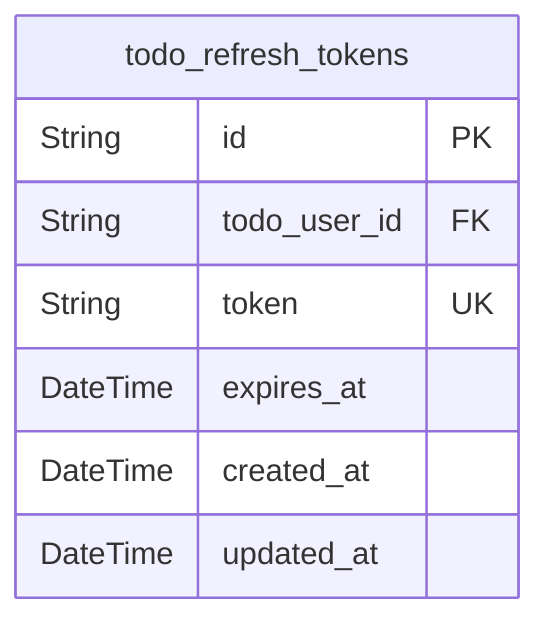
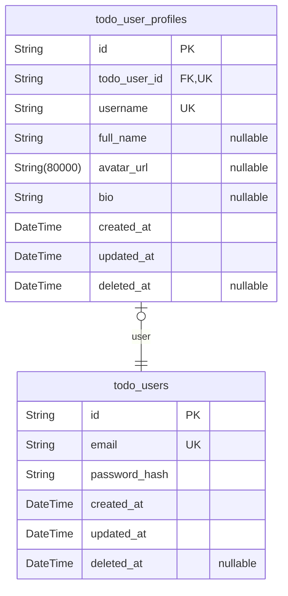
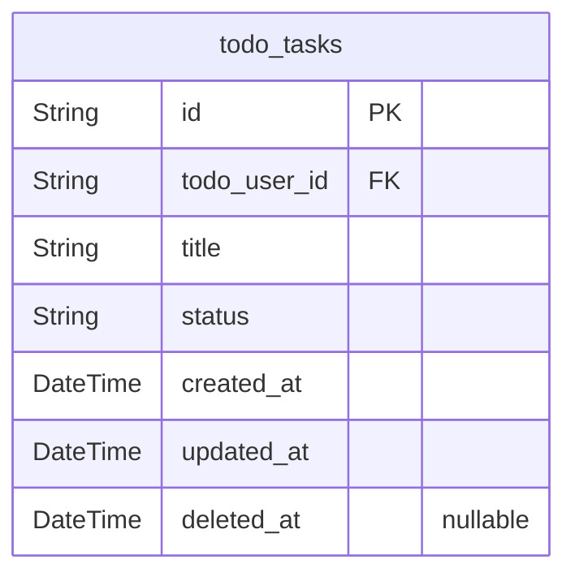

# Prisma Markdown

> Generated by [`prisma-markdown`](https://github.com/samchon/prisma-markdown)

- [Systematic](#systematic)
- [Actors](#actors)
- [Tasks](#tasks)

## Systematic

### `todo_refresh_tokens`

Stores refresh tokens for user authentication sessions. These tokens
allow users to obtain new access tokens without re-entering credentials
when the refresh token is still valid. The table supports the JWT-based
authentication system by maintaining long-lived tokens that can be
invalidated as needed.

Properties as follows:

- `id`: Primary Key.
- `todo_user_id`: User reference. [todo_users.id](#todo_users).
- `token`: The refresh token value as a secure string.
- `expires_at`: Timestamp when this refresh token expires.
- `created_at`: Timestamp when this refresh token was created.
- `updated_at`: Timestamp when this refresh token was last updated.

## Actors

### `todo_users`

User accounts for the Todo application. This table stores the core
identity and authentication information for users who interact with the
system. Users are the primary actors in the application, responsible for
creating and managing their tasks.

Properties as follows:

- `id`: Primary Key.
- `email`
  > User's email address used for authentication and communication. Must be
  > unique across the system.
- `password_hash`
  > BCrypt hash of the user's password for secure authentication. Never store
  > plain text passwords.
- `created_at`: Timestamp when the user account was created.
- `updated_at`: Timestamp when the user account was last updated.
- `deleted_at`
  > Timestamp when the user account was deleted (soft delete). NULL if
  > account is active.

### `todo_user_profiles`

User profile information for the Todo application. This table stores
personal information about users that extends their basic account data.
Profile data is subsidiary to the user account and is managed through the
user entity.

Properties as follows:

- `id`: Primary Key.
- `todo_user_id`: User account reference. [todo_users.id](#todo_users).
- `username`
  > Display name for the user. Unique across the system and used for
  > personalization.
- `full_name`: User's full name for display purposes.
- `avatar_url`: URL to the user's avatar image.
- `bio`: Short biography or description of the user.
- `created_at`: Timestamp when the profile was created.
- `updated_at`: Timestamp when the profile was last updated.
- `deleted_at`
  > Timestamp when the profile was deleted (soft delete). NULL if profile is
  > active.

## Tasks

### `todo_tasks`

Core entity representing a user's task in the Todo list application. This
table stores all task-related information including title, status, and
timestamps for audit purposes. Users can create, view, update, and delete
their own tasks.

Properties as follows:

- `id`: Primary Key.
- `todo_user_id`: User who owns this task. [todo_users.id](#todo_users).
- `title`
  > The task description or title entered by the user. Limited to 500
  > characters as per requirements.
- `status`
  > Current status of the task. Possible values: 'pending', 'completed'.
  > Tracks the task lifecycle.
- `created_at`
  > Timestamp when the task was created. Used for sorting tasks
  > chronologically and audit purposes.
- `updated_at`
  > Timestamp when the task was last updated. Automatically updated on any
  > modification for audit trail.
- `deleted_at`
  > Timestamp when the task was deleted. Used for soft delete functionality
  > and potential recovery.
