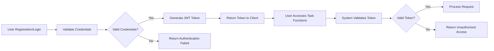
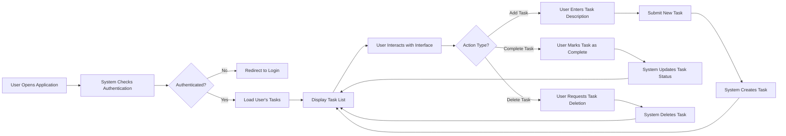
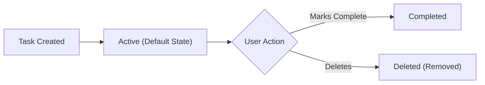

# Todo List Application - Requirements Analysis Report

## 1. Service Overview

### Business Model

#### Why This Service Exists
The Todo list application addresses the fundamental need for individuals to organize and track their tasks efficiently. Many users struggle with remembering tasks, prioritizing activities, or ensuring they complete all responsibilities. This application provides a simple, reliable solution that focuses exclusively on the core functionality needed for effective task management.

#### Problem Statement
Users often face information overload and struggle to maintain focus on their priorities. Without a simple tool to capture tasks, important items may be forgotten, leading to missed deadlines, reduced productivity, and increased stress. Existing solutions often include unnecessary complexity that distracts from the primary goal of tracking tasks.

#### Solution Vision
Create a minimal, intuitive Todo list application that allows users to capture and track tasks with maximum simplicity. The application focuses on the essential elements of task management: creating tasks, viewing them, marking completion, and removing them when no longer needed.

### Core Features
- Task creation: Users can add new tasks to their list
- Task viewing: Users can see all their tasks at once
- Task completion: Users can mark tasks as completed
- Task deletion: Users can remove tasks from their list

### Target Users
The primary user is an individual seeking to organize their personal or professional tasks. These users range from students managing assignments to professionals tracking work responsibilities to individuals organizing household chores. The application specifically targets users who want simplicity and do not require advanced features like due dates, priorities, or categorization.

## 2. Core Functional Requirements

### Task Management Functions

**Add New Task**
WHEN a user submits a task description, THE system SHALL create a new task in the user's task list with status "active".

**View All Tasks**
THE system SHALL display all tasks in the user's task list, grouped by status (active and completed).

**Mark Task as Completed**
WHEN a user requests to complete a task, THE system SHALL update the task status from "active" to "completed".

**Delete Task**
WHEN a user requests to delete a task, THE system SHALL permanently remove the task from their task list.

**Error Handling Requirements**

IF a user attempts to create a task with empty description, THEN THE system SHALL reject the request and return error message "Task description cannot be empty".

IF a user attempts to complete a non-existent task, THEN THE system SHALL return error message "Task not found".

IF a user attempts to delete a non-existent task, THEN THE system SHALL return error message "Task not found".

WHERE user is not authenticated, THE system SHALL deny access to all task management functions.

## 3. User Roles and Authentication

### User Role Definition

**User**: A registered individual who creates, views, updates, and deletes tasks in their personal Todo list.

### Authentication Requirements

**Core Authentication Functions**
- Users can register with email and password
- Users can log in to access their account
- Users can log out to end their session
- System maintains user sessions securely
- Users can verify their email address
- Users can reset forgotten passwords
- Users can change their password
- Users can revoke access from all devices

**Authentication Flow**

**Token Management**
- Token type: JWT
- Access token expiration: 30 minutes
- Refresh token expiration: 7 days
- JWT payload structure: {"userId": "string", "role": "user", "permissions": ["create_task", "read_tasks", "update_task", "delete_task"]}

## 4. Business Rules and Validation

### Data Validation Rules

THE system SHALL validate that task descriptions contain at least one non-whitespace character.

THE system SHALL limit task descriptions to 500 characters maximum.

THE system SHALL trim leading and trailing whitespace from task descriptions.

### Business Logic Rules

THE system SHALL ensure users can only access and modify their own tasks.

THE system SHALL maintain task creation timestamp for each task.

THE system SHALL maintain task completion timestamp for completed tasks.

## 5. Error Handling Scenarios

### Expected Error Conditions

**Authentication Errors**
- Invalid credentials: "Authentication failed - invalid email or password"
- Expired session: "Session expired - please log in again"
- Unauthorized access: "Unauthorized access - authentication required"

**Task Operation Errors**
- Empty task description: "Task description cannot be empty"
- Task not found: "Task not found or you don't have permission to access it"
- Invalid request format: "Invalid request format"

**System Errors**
- Database connection failure: "Service temporarily unavailable - please try again later"
- Server processing error: "Error processing request - please try again"

### Error Response Requirements

THE system SHALL return appropriate HTTP status codes for all error conditions:
- 400 Bad Request: Invalid input parameters
- 401 Unauthorized: Authentication required or failed
- 403 Forbidden: Insufficient permissions
- 404 Not Found: Requested resource not found
- 500 Internal Server Error: Unexpected system errors

THE system SHALL provide user-friendly error messages that guide users toward resolution without exposing sensitive system details.

## 6. Performance Expectations

### Response Time Requirements

THE system SHALL respond to task creation requests within 2 seconds under normal load.

THE system SHALL respond to task retrieval requests within 1 second under normal load.

THE system SHALL respond to task update and deletion requests within 2 seconds under normal load.

THE system SHALL authenticate users within 1 second under normal load.

### System Availability

THE system SHALL maintain 99.9% availability during business hours (6:00-22:00 in user's timezone).

THE system SHALL recover from restart within 2 minutes.

## 7. System Workflows

### User Journey: Creating and Managing Tasks

### Task State Model

> *Developer Note: This document defines **business requirements only**. All technical implementations (architecture, APIs, database design, etc.) are at the discretion of the development team.*