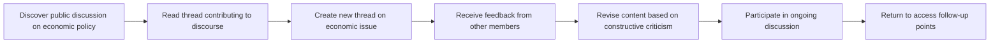
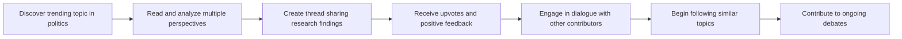
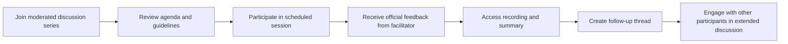

# Requirements Analysis Report for Economic/Political Discussion Board

## 1. Service Overview and Vision

### Service Vision and Mission

The economic/political discussion board exists to create a focused, thoughtful space for citizens to engage in meaningful conversations about economic policies, political issues, and societal challenges. Our mission is to foster informed discourse by providing a platform where diverse perspectives can be shared, debated, and evaluated through structured discussion rather than emotional reaction.

The board serves as a digital town hall where individuals from different backgrounds can exchange ideas about government policies, economic systems, social justice, environmental regulations, and global affairs. By organizing discussions around specific topics and moderating content quality, we aim to elevate the conversation beyond superficial debates to substantive analysis and constructive dialogue.

### Target Market and Users

Our primary users are citizens passionate about social and political issues, including students, educators, professionals in public policy, activists, journalists, and concerned community members. The platform targets individuals aged 16-65 who want to participate in informed discussions about economic systems, political parties, governmental regulations, and societal changes.

The service is designed specifically for individuals who value reasoned debate and evidence-based discussion over opinion polarization. It appeals to users frustrated by the emotional, performative nature of social media debates and seeks to recapture the integrity of thoughtful public discourse.

### Core Value Proposition

The economic/political discussion board offers three primary value propositions:

1. **Structured Discussion Environment**: Unlike open social media platforms, our board provides a curated space with clear rules for participation, ensuring discussions remain productive and focused on the topic at hand.

2. **Content Quality Focus**: By implementing a reputation-based voting system and moderation framework, the board elevates well-reasoned, evidence-supported arguments while reducing the impact of misinformation and emotional appeals.

3. **Topic-Specific Forums**: The platform organizes discussions around clearly defined topics such as "Universal Basic Income," "Climate Change Policy," "Healthcare Reform," "Taxation Systems," and "International Relations," allowing users to find and engage with content directly relevant to their interests.

### Unique Differentiators

What sets our discussion board apart from other platforms:

- **Minimum 100-word posts requirement**: This criterion ensures that contributions are substantive, not superficial comments or emotional reactions. Users must demonstrate thoughtful analysis to participate.

- **Reviewer validation system**: New threads cannot be posted without being reviewed by a moderator before becoming publicly visible. This prevents misleading information and maintains content quality.

- **Color-coded reputation system**: Users' contributions are visually represented through different colors based on their reputation level, with higher reputation users having their arguments displayed more prominently.

- **Topic certification system**: We certify that certain topics are properly vetted before being added to the board, ensuring they represent legitimate, important issues rather than fringe or hypothetical concepts.

### Long-term Goals

Our long-term vision for the economic/political discussion board is to become the premier global platform for civic engagement and informed public discourse. Over the next five years, we aim to:

- Expand our user base to reach 500,000 active participants across 20 countries
- Develop partnerships with universities, research institutions, and civic organizations to enhance content quality
- Implement AI-assisted analysis tools that help users identify logical fallacies and evidence gaps in arguments
- Establish a certification program for high-quality contributors to promote academic rigor
- Create localized versions of the board in multiple languages to ensure global accessibility

## 2. Business Model and Justification

### Why This Service Exists

Modern democracy requires informed citizen participation, yet online discourse has become increasingly polarized, emotionally charged, and dominated by misinformation. Traditional social media platforms often amplify sensational content and suppress nuanced discussion through algorithmic curation.

The economic/political discussion board fills a critical gap by providing a platform specifically designed to promote substantive, evidence-based conversation about societal issues. Unlike general-purpose social networks, our service is intentionally structured to elevate quality over quantity, reason over emotion, and depth over brevity.

This service exists because existing platforms fail to address the core need for thoughtful civic engagement. Users seek a space where they can express views without being subjected to harassment, where debates are anchored in facts rather than ideology, and where complex issues can be discussed with the depth they deserve.

### Revenue Strategy

The service will generate revenue through a tiered subscription model with three distinct levels:

1. **Basic Free Tier**: Includes access to all public discussions, basic posting capabilities, and standard content discovery features. This tier will serve primarily as a user acquisition channel and content showcase.

2. **Premium Tier ($4.99/month)**: Adds enhanced features including the ability to create private discussion groups, priority moderation response time (within 2 business hours), advanced search filters, and home page customization options. This tier targets engaged users who want to contribute more meaningfully to the community.

3. **Pro Tier ($9.99/month)**: Includes all premium features plus additional capabilities such as creating public forums (with content certification), enhanced analytics for understanding discussion trends, and access to exclusive expert-led webinars on economic and political topics.

In addition to subscriptions, we will implement a targeted advertising strategy for non-intrusive, contextually relevant content. Advertisements will be limited to premium content recommendations, educational resources, and partner events that align with our mission of informed civic discourse.

### User Acquisition and Retention

Our user acquisition strategy will rely on a multi-channel approach:

- **Partnerships with educational institutions**: Collaborating with universities and colleges to integrate the discussion board into civic education curricula
- **Content marketing**: Creating high-quality blog posts, podcasts, and webinars discussing current political and economic issues
- **Social media community building**: Establishing presence on platforms like Twitter and LinkedIn to share thought leadership content
- **Referral program**: Offering premium features for users who successfully refer friends to join the platform
- **Press outreach**: Building relationships with journalists and analysts who cover political and economic issues

For user retention, we will focus on:

- **Gamification through reputation system**: Users earn reputation points based on the quality and impact of their contributions, encouraging sustained participation
- **Personalized content discovery**: The system learns users' interests and preferences to recommend relevant discussions
- **Weekly challenge cycles**: Periodic theme-based discussions that encourage participation on timely topics
- **Achievement badges**: Recognizing users for milestones like posting 100 quality contributions or moderating successfully

### Monetization Timeline

- **Months 1-6**: Focus on user acquisition through free tier, content marketing, and partnerships. Establish core features and community guidelines.

- **Months 7-12**: Introduce premium subscription tier with basic enhancements. Launch referral program. Begin A/B testing of advertising strategies.

- **Month 13-18**: Launch Pro tier with advanced features. Establish partnerships with academic institutions. Implement reputation system.

- **Month 19-24**: Expand into international markets. Implement AI-assisted analysis tools. Develop certification program for topics and contributors.

### Success Metrics and KPIs

Key performance indicators (KPIs) will be tracked monthly to measure success:

- **User Engagement**: Average session duration (target: 12 minutes), daily active users (DAU), monthly active users (MAU)
- **Content Quality**: Average post length (target: 250+ words), percentage of posts with at least 3 supporting references, average number of replies per thread
- **Monetization**: Subscription conversion rate, average revenue per user (ARPU), churn rate (target: <8% monthly)
- **Community Health**: Percentage of flagged content requiring moderator review, average time to first moderation response, user satisfaction score (target: 4.5/5)
- **Growth**: User acquisition cost (target: < $15), referral rate, viral coefficient

## 3. User Roles and Permissions

### User Role Definitions

1. **Guest**

- Unauthenticated users who can browse public discussions and view content but cannot create posts or reply to threads.
- The only way to view content is through public forums and discussion threads.
- Often intent on shaping opinion through organized content creation rather than spontaneous reactions.
- May include users who have previously created accounts but have not logged in recently.

2. **Member**

- Authenticated users who have completed the registration process and verified their email address.
- Can create new discussion threads and reply to existing posts.
- Can upvote and downvote content based on perceived quality, reasoning, and evidence.
- Have access to all public discussions and can view moderated content.
- Account activity is tracked through a reputation system that influences visibility in discussions.

3. **Moderator**

- Privileged users with elevated permissions to review and manage content within the system.
- Can review reported content, approve or reject new threads, and remove content that violates community guidelines.
- Have access to moderation tools including content flagging, user warning systems, and banning capabilities.
- Responsible for maintaining community standards and ensuring discussions remain respectful and productive.
- Can see analytics about content performance and user engagement within their assigned forums.

### Authentication Requirements

#### Core Authentication Functions

- Users can register with email and password
- Users can log in to access their account
- Users can log out to end their session
- System maintains user sessions securely
- Users can verify their email address
- Users can reset forgotten passwords
- Users can change their password
- Users can revoke access from all devices

#### Registration Flow

The user registration process is as follows:

1. **Guest Access**: A guest user visits the registration page and enters their email address.
2. **Email Verification**: The system sends a verification email with a unique token link.
3. **Account Confirmation**: The user clicks the verification link, which validates the token and confirms the email address.
4. **Password Creation**: The user sets a password that meets complexity requirements (at least 8 characters, including uppercase, lowercase, and number).
5. **Account Activation**: The system creates the user account and sends a welcome message with instructions for logging in.

#### Login Flow

- WHEN a user attempts to log in with their email and password, THE system SHALL validate the credentials against the database.
- IF the credentials are valid, THE system SHALL generate a JWT token with a 15-minute expiration.
- IF the credentials are invalid, THEN THE system SHALL display an appropriate error message.

#### Session Management

- THE user session SHALL expire after 30 days of inactivity.
- THE system SHALL automatically log out the user when they close their browser.
- THE system SHALL allow users to manually log out at any time.
- THE system SHALL provide users with the ability to see active sessions and revoke access to other devices.

#### Authentication Error Scenarios

- IF a user enters an invalid email address, THEN THE system SHALL display "The email address is not recognized. Please check your spelling or register for a new account."
- IF a user enters an incorrect password, THEN THE system SHALL display "The password is incorrect. Please try again."
- IF a user has attempted to log in five times with incorrect credentials, THEN THE system SHALL block further attempts for 20 minutes.
- IF a user's session expires due to inactivity, THEN THE system SHALL redirect them to the login page with a message: "Your session has expired. Please log in again to continue."

### Role-Based Permissions Matrix

| Action | Guest | Member | Moderator |
|--------|-------|--------|-----------|
| View public discussions | ✅ | ✅ | ✅ |
| Create new discussion threads | ❌ | ✅ | ✅ |
| Reply to existing threads | ❌ | ✅ | ✅ |
| Upvote posts | ❌ | ✅ | ✅ |
| Downvote posts | ❌ | ✅ | ✅ |
| Report inappropriate content | ❌ | ✅ | ✅ |
| View moderation dashboard | ❌ | ❌ | ✅ |
| Approve/reject new threads | ❌ | ❌ | ✅ |
| Remove content | ❌ | ❌ | ✅ |
| Ban users | ❌ | ❌ | ✅ |
| Change user permissions | ❌ | ❌ | ❌ |
| Access analytics | ❌ | ❌ | ✅ |

### JWT Token Structure

The JWT token payload must include the following claims:

- `userId`: String representing the user's unique identifier in the system
- `role`: String indicating the user's role ("guest", "member", "moderator")
- `permissions`: Array of strings containing specific capabilities (e.g., "create_thread", "moderate_content", "remove_content")
- `iat`: Integer representing the timestamp when the token was issued
- `exp`: Integer representing the timestamp when the token will expire

### Access Control Rules

- THE system SHALL enforce role-based access control (RBAC) for all protected resources
- THE system SHALL validate user role and permissions for every request to protected endpoints
- THE system SHALL deny access to resources when the user's role does not have the required permissions
- THE system SHALL log all access control decisions for audit purposes
- THE system SHALL refresh the JWT token when it expires, requiring a new login

## 4. Core Functional Requirements

### User Registration and Authentication

- WHEN a user submits a registration request with valid email and password, THE system SHALL create a new account record in the database
- IF the email address already exists in the system, THEN THE system SHALL return an error: "A user with this email address already exists. Please use a different email or log in to your existing account."
- WHEN a user submits login credentials, THE system SHALL validate the credentials against stored hashes
- IF the credentials are valid, THE system SHALL generate a JWT token with a 15-minute lifespan
- IF the credentials are incorrect, THEN THE system SHALL increment a failed attempt counter
- IF the failed attempt counter reaches 5 within a 10-minute window, THEN THE system SHALL block further login attempts for 20 minutes
- WHEN a user requests to reset their password, THE system SHALL send a password reset email with a time-limited token
- WHEN a user clicks the password reset link, THE system SHALL validate the token and allow password change
- WHEN a user changes their password, THE system SHALL invalidate all previously issued tokens for that account

### Thread Creation and Management

- WHEN a user wants to create a new discussion thread, THE system SHALL present a form with title and content fields
- THE system SHALL require that the thread title be between 5 and 100 characters
- THE system SHALL require that the thread content be at least 200 words in length
- THE system SHALL validate that all content meets the platform's Topic Certification standards
- THE system SHALL make the new thread visible in the public forum after successful submission
- WHEN a member edits their own thread within 24 hours of creation, THE system SHALL allow modification
- WHEN a thread is edited, THE system SHALL record the edit history with timestamp and user ID
- IF a thread has received replies, THEN THE system SHALL prevent modifications to any existing posts
- WHEN a user requests to delete their own thread, THE system SHALL prompt for confirmation
- IF the user confirms, THEN THE system SHALL archive the thread and remove it from public view
- THE system SHALL keep a record of all archived threads for administrative review

### Post and Reply Operations

- WHEN a user replies to an existing thread, THE system SHALL validate that the reply is at least 100 words in length
- THE system SHALL require that all replies include at least one relevant citation from a credible source
- THE system SHALL format replies with proper citation markup
- IF a reply is flagged by another user, THEN THE system SHALL mark it with a warning indicator
- THE system SHALL display replies in chronological order by default
- IF a user clicks 'reply', THE system SHALL load the previous response context for reference
- WHEN a user submits a reply, THE system SHALL validate that the thread exists and is not archived
- IF the thread has been closed to further replies, THEN THE system SHALL display a message: "This thread is closed to new replies. Please start a new discussion if you wish to continue the conversation."
- THE system SHALL provide a "draft" function that saves incomplete replies
- THE system SHALL allow users to review their draft before submission

### Upvoting and Downvoting System

- WHEN a user upvotes a post, THE system SHALL increment the post's upvote count by 1
- WHEN a user downvotes a post, THE system SHALL increment the post's downvote count by 1
- THE system SHALL prevent users from upvoting or downvoting their own posts
- THE system SHALL limit users to one vote per post
- THE system SHALL display the total number of upvotes and downvotes for each post
- THE system SHALL weight votes based on the user's reputation level
- THE system SHALL calculate a post's net engagement score as: (upvotes × reputation_weight) - (downvotes × reputation_weight)
- THE system SHALL display posts in order of highest net engagement score
- IF a user changes their vote, THEN THE system SHALL update the counts accordingly
- THE system SHALL log all voting activity for analytics purposes

### Reporting Inappropriate Content

- WHEN a user identifies a post as inappropriate, THE system SHALL display a reporting interface
- THE system SHALL require that the user select one or more reason categories from a predefined list
- THE system SHALL include an optional text field for additional explanation
- THE system SHALL require that the user's report be at least 20 characters in length
- WHEN a user submits a report, THE system SHALL send an alert to the moderation team
- THE system SHALL process reports in the order they were received
- IF a report receives multiple identical reports from different users, THEN THE system SHALL prioritize it for review
- THE system SHALL keep a record of all reports and their outcomes for analytics
- THE system SHALL notify the user who submitted the report once a decision has been made
- THE system SHALL prevent users from reporting their own posts
- THE system SHALL limit users to 5 reports per hour to prevent abuse

### Search and Discovery Features

- WHEN a user clicks the search button, THE system SHALL display the search interface
- THE system SHALL allow users to search by keyword, author, or topic category
- THE system SHALL support partial word matching and autocomplete suggestions
- THE system SHALL display results in order of relevance and recency
- THE system SHALL display 20 results per page
- THE system SHALL provide pagination controls for navigating through results
- THE system SHALL include filters for date range, user reputation level, and content quality score
- THE system SHALL highlight search terms within results
- THE system SHALL cache frequently searched queries for performance
- THE system SHALL return results instantly for common queries, with search response time under 1 second
- THE system SHALL implement fuzzy matching for misspelled words
- THE system SHALL display search results in a clean, easy-to-read format with preview snippets

### Content Moderation Functions

- WHEN a moderator reviews a reported post, THE system SHALL present the content with context from the thread
- THE system SHALL display the reporting user's reason for flagging
- THE system SHALL show the post's upvote/downvote counts and reputation score
- THE system SHALL allow moderators to view the reported user's profile and activity history
- THE system SHALL provide moderation tools including: approve, reject, edit, remove, and warn
- IF a moderator approves a post, THEN THE system SHALL make it publicly visible
- IF a moderator rejects a post, THEN THE system SHALL return it to the user with feedback
- IF a moderator removes a post, THEN THE system SHALL archive it and remove from public view
- IF a moderator warns a user, THEN THE system SHALL display a warning on the user's profile
- IF a moderator bans a user, THEN THE system SHALL prevent further posting and viewing access
- THE system SHALL send notification to the user whose post was moderated
- THE system SHALL maintain a complete audit log of all moderation actions

### User Profile Management

- WHEN a user accesses their profile, THE system SHALL display their username, reputation score, and activity statistics
- THE system SHALL show all posts they have created and their most recent activity
- THE system SHALL allow users to update their profile picture and bio
- THE system SHALL require that profile pictures meet content guidelines
- THE system SHALL enforce size restrictions on profile pictures
- THE system SHALL validate all user input for profile information
- THE system SHALL prevent users from having empty profile information
- THE system SHALL display the user's reputation level with appropriate visual indicators
- THE system SHALL show the user's contribution history with timeline graph
- THE system SHALL implement a privacy setting that allows users to hide certain profile information from public view
- THE system SHALL allow users to export their contribution history in CSV format

## 5. User Journeys and Scenarios

### Primary User Journeys

#### The Informed Citizen Journey

This journey represents the typical user who engages in thoughtful discussion to deepen understanding of complex issues:

#### The Learning and Sharing Journey

This journey represents a user who discovers current issues through the platform and shares insights with others:

#### The Community Engagement Journey

This journey represents a user who participates in structured discussions facilitated by moderators:

### Success Scenarios

#### The Thoughtful Contributor

A user creates a well-researched, evidence-based thread about universal basic income policy. The thread receives numerous upvotes from high-reputation users. The user's reputation score increases, and they receive a notification that their contribution has been featured in the "Top Quality Posts" section.

The user then engages in a constructive dialogue with others, building on their original argument with new data. A moderator recognizes the quality of the discussion and requests the user to contribute to a follow-up topic. This leads to increased visibility and network growth within the community.

#### The Informed Participant

A user discovers a thread about climate change policy development. They read multiple perspectives, including contrasting economic analyses from experts on both sides. The user posts a detailed reply identifying logical fallacies in one argument and citing peer-reviewed studies to support their position.

Other users respond with additional references, and the discussion evolves into a comprehensive analysis of the policy's economic implications. The user receives positive feedback from the community, which boosts their reputation and encourages further participation.

#### The Builder of Constructive Dialogue

A user identifies a polarized discussion that has become heated. They create a new thread offering a framework for respectful dialogue on the topic. The thread includes guidelines for evidence-based discussion and civility requirements.

The moderator approves the thread and promotes it to the "Best Practices" section. The community adopts the guidelines, transforming the discourse from adversarial to collaborative. The user receives recognition from the moderation team and gains additional reputation points for their constructive contribution.

### Step-by-Step User Flows

#### Creating a New Thread (Member)

1. A member navigates to the "Create Thread" page
2. The system loads the thread creation form with title and content fields
3. The member enters a title of 15 words or less
4. The member writes a 300+ word post with at least two credible references
5. The member clicks "Submit for Review"
6. The system validates the content meets minimum length and quality requirements
7. The system sends the thread to moderator review queue
8. The system displays "Your thread is under review. You'll be notified when approved."
9. The moderator views the thread in the review dashboard
10. The moderator approves the thread, which becomes publicly visible

#### Responding to a Discussion (Member)

1. A member views a thread about healthcare reform
2. The member reads all previous posts and context
3. The member writes a 150+ word reply with at least one citation
4. The member clicks "Submit Reply"
5. The system validates the reply length and format
6. The system adds the reply to the thread in chronological order
7. The system notifies thread authors of new responses
8. The system displays the new reply with upvote/downvote options

#### Reporting Inappropriate Content (Member)

1. A member encounters a post with unverified claims about economic statistics
2. The member clicks the "Report" button on the post
3. The system displays a modal with reporting options
4. The member selects "Unverified Claims" as the reason
5. The member writes 30 characters of additional context
6. The member clicks "Submit Report"
7. The system sends the report to the moderation team
8. The system displays "Your report has been submitted. Thank you for helping maintain quality discussion."

#### Moderating a Reported Thread (Moderator)

1. A moderator accesses the moderation dashboard
2. The system displays a list of recently reported threads
3. The moderator selects a thread for review
4. The system shows the thread content, reporter's reason, and upvote/downvote counts
5. The moderator reviews the post for policy violations
6. The moderator decides to approve the post
7. The system marks the post as approved and notifies the user
8. The system updates the moderation analytics

### Decision Points

- IF the user has not verified their email address, THEN the system SHALL prevent thread creation
- IF the thread content is less than 200 words, THEN the system SHALL display an error: "Thread content must be at least 200 words long"
- IF the user has exceeded their daily post limit, THEN the system SHALL display: "You've reached your daily post limit. Please try again tomorrow."
- IF the thread title contains inappropriate language, THEN the system SHALL suggest alternative titles
- IF the post contains multiple linked citations, THEN the system SHALL verify all links are functional
- IF the user has a history of low-quality contributions, THEN the system SHALL require moderator approval for all new threads
- IF a thread receives five unique reports, THEN the system SHALL prioritize it for immediate review

### Probability and Frequency

- The most common user journey (creating and replying to threads) occurs approximately 60% of the time
- The second most common journey (searching for and discovering content) occurs 30% of the time
- The least common journey (reporting inappropriate content) occurs 10% of the time but represents critical content quality maintenance

### User Goals and Outcomes

- **Primary goal**: Contribute to meaningful discussions about important economic and political issues
- **Secondary goal**: Increase reputation and visibility within the community
- **Tertiary goal**: Learn from diverse perspectives and deepen understanding

## 6. Non-functional Requirements

### Performance Expectations

- THE system SHALL load the home page in less than 1.5 seconds for 95% of users
- THE system SHALL return search results within 1 second for 99% of queries
- THE system SHALL display thread content in under 0.5 seconds after navigation
- THE system SHALL handle 10,000 concurrent users with acceptable performance (response time < 2 seconds)
- THE system SHALL maintain consistent performance during peak usage times (evenings and weekends)
- THE system SHALL process and display posts and replies within 3 seconds of submission
- THE system SHALL support simultaneous reading of multiple threads without lag or timeouts
- THE system SHALL optimize image loading to prevent page slowdowns
- THE system SHALL implement intelligent caching for frequently accessed content
- THE system SHALL maintain response times under 1 second for all authenticated user actions

### Reliability and Availability

- THE system SHALL have 99.9% uptime monthly
- THE system SHALL implement automated failover for database and server services
- THE system SHALL maintain backups of all user data and content daily
- THE system SHALL restore data from backups within 24 hours in case of failure
- THE system SHALL perform regular maintenance during off-peak hours
- THE system SHALL notify users of planned maintenance 48 hours in advance
- THE system SHALL implement automated monitoring for system health and performance
- THE system SHALL trigger alerts for critical failures within 30 seconds of detection
- THE system SHALL maintain a public status page showing system health
- THE system SHALL have disaster recovery capabilities with RPO of 15 minutes and RTO of 2 hours

### Security and Privacy

- THE system SHALL encrypt all user data at rest and in transit
- THE system SHALL implement multi-factor authentication for moderation and administrative accounts
- THE system SHALL store passwords using industry-standard hashing algorithms (bcrypt or scrypt)
- THE system SHALL anonymize user data in analytics and reporting when appropriate
- THE system SHALL comply with GDPR, CCPA, and other relevant data protection regulations
- THE system SHALL implement rate limiting to prevent brute force attacks
- THE system SHALL employ content filtering to prevent cross-site scripting (XSS) attacks
- THE system SHALL validate and sanitize all user input to prevent SQL injection
- THE system SHALL restrict access to sensitive endpoints through proper authentication
- THE system SHALL perform regular security audits and penetration testing

### Scalability Requirements

- THE system SHALL scale horizontally to accommodate growing user base
- THE system SHALL support adding new servers without downtime
- THE system SHALL handle 5x user growth in 6 months without performance degradation
- THE system SHALL implement load balancing across multiple servers
- THE system SHALL use distributed database architecture for high availability
- THE system SHALL maintain consistent performance during peak traffic periods
- THE system SHALL automatically scale resources based on demand
- THE system SHALL support multiple geographic regions for low-latency access
- THE system SHALL maintain data consistency across distributed nodes
- THE system SHALL allow for modular feature addition without affecting core performance

### Usability Standards

- THE system SHALL be accessible to users with disabilities
- THE system SHALL support keyboard navigation for all functionality
- THE system SHALL have clear, consistent user interface patterns
- THE system SHALL provide explicit feedback for all user actions
- THE system SHALL maintain visual hierarchy that guides users intuitively
- THE system SHALL use established UI/UX patterns familiar to web users
- THE system SHALL provide clear error messages that help users recover
- THE system SHALL maintain consistent terminology throughout
- THE system SHALL support responsive design for mobile devices
- THE system SHALL ensure text is readable with appropriate contrast ratios

### Compliance Requirements

- THE system SHALL comply with all applicable laws and regulations regarding online speech and content
- THE system SHALL have clear terms of service and community guidelines
- THE system SHALL implement age verification for access
- THE system SHALL provide users with control over their personal information
- THE system SHALL allow users to delete their accounts and data
- THE system SHALL maintain records of user activity for audit purposes
- THE system SHALL have a transparent reporting mechanism for content violations
- THE system SHALL not engage in political censorship or biased content moderation
- THE system SHALL implement procedures for handling appeals of moderation decisions
- THE system SHALL demonstrate impartiality in content prioritization and curation

## 7. Business Rules and Constraints

### Content Creation Rules

- THE system SHALL require a minimum of 200 words for all new discussion threads
- THE system SHALL require at least two citations from credible sources in every post
- THE system SHALL limit threads to one topic per discussion to maintain focus
- THE system SHALL prevent users from creating duplicate threads on the same topic
- THE system SHALL require that all content comply with the platform's Community Guidelines
- THE system SHALL prohibit the use of offensive language, hate speech, or personal attacks
- THE system SHALL validate that all citations are from reputable academic, governmental, or news sources
- THE system SHALL prevent the use of anonymous or pseudonymous posts without verification

### Posting Limits and Restrictions

- THE system SHALL limit users to 5 new threads per week
- THE system SHALL limit users to 10 replies per day
- THE system SHALL prevent users from posting during their first 24 hours as members
- THE system SHALL impose stricter limits on users with low reputation scores
- THE system SHALL implement automatic content review for users with history of violations
- THE system SHALL require moderator approval for all threads created by new users
- THE system SHALL prevent users from spamming the same content across multiple threads
- THE system SHALL detect and prevent automated posting attempts
- THE system SHALL track posting patterns to identify potential bots
- THE system SHALL implement cooling-off periods for users who violate content policies

### User Behavior Constraints

- THE system SHALL prohibit users from creating multiple accounts to circumvent limits
- THE system SHALL prevent users from voting on their own content
- THE system SHALL restrict users from making repeated edits that change the meaning of posts
- THE system SHALL prevent users from reporting their own posts
- THE system SHALL detect and prevent coordinated upvoting/downvoting efforts
- THE system SHALL limit the rate at which users can create content
- THE system SHALL prevent users from interacting with banned accounts
- THE system SHALL detect and prevent behavior indicating sock puppet accounts
- THE system SHALL require that all user interactions be authentic and human-generated
- THE system SHALL maintain a record of all user actions for accountability

### Moderation Policies

- THE system SHALL require that all reported content be reviewed within 24 hours
- THE system SHALL allow moderators to request additional information from users
- THE system SHALL provide clear guidelines for what constitutes policy violations
- THE system SHALL not remove content solely for expressing unpopular opinions
- THE system SHALL not engage in political or ideological censorship
- THE system SHALL maintain consistent application of rules across all users
- THE system SHALL provide transparent reasoning for moderation decisions
- THE system SHALL allow appeal of moderation decisions
- THE system SHALL require multiple moderators to review controversial decisions
- THE system SHALL have a final appeals process for disputed moderation actions

### Verification Requirements

- THE system SHALL require verified email addresses for all user accounts
- THE system SHALL require users to verify their email address within 24 hours of registration
- THE system SHALL periodically re-verify user email addresses
- THE system SHALL implement email verification for all new account registrations
- THE system SHALL maintain records of verification status for all accounts
- THE system SHALL prohibit users from using temporary email services
- THE system SHALL prevent users from changing their email address frequently
- THE system SHALL detect and flag suspicious verification patterns
- THE system SHALL ensure that verification links are time-limited and unique
- THE system SHALL implement rate limiting on verification email sends

### System Constraints

- THE system SHALL use a single database instance for all user and content data
- THE system SHALL follow RESTful API design principles
- THE system SHALL implement rate limiting for all endpoints to prevent abuse
- THE system SHALL maintain a cache of frequently accessed content
- THE system SHALL restrict access to administrative interfaces to authorized personnel only
- THE system SHALL implement time-based access controls for sensitive operations
- THE system SHALL prevent cross-domain requests without proper authentication
- THE system SHALL maintain consistent data formats across all services
- THE system SHALL ensure data integrity through proper validation
- THE system SHALL follow established software development practices

## 8. Error Handling and Recovery

### Common Error Scenarios

#### Authentication Failures

- IF the user enters an incorrect password, THEN THE system SHALL display "The password is incorrect. Please try again."
- IF the user enters an invalid email address, THEN THE system SHALL display "The email address is not recognized. Please check your spelling or register for a new account."
- IF the user's account is locked due to multiple failed attempts, THEN THE system SHALL display "Your account has been locked due to excessive failed login attempts. Please try again in 20 minutes."
- IF the user's session expires, THEN THE system SHALL redirect to the login page with a message: "Your session has expired. Please log in again to continue."

#### Content Submission Errors

- IF a thread is less than 200 words, THEN THE system SHALL display: "Thread content must be at least 200 words long."
- IF a post contains inappropriate language, THEN THE system SHALL display: "Your post contains language that violates our community guidelines. Please revise your content."
- IF a post lacks required citations, THEN THE system SHALL display: "Your post must include at least two citations from credible sources."
- IF a user attempts to post duplicate content, THEN THE system SHALL display: "A similar discussion already exists. Please continue the conversation in the existing thread."
- IF a user attempts to create more threads than allowed, THEN THE system SHALL display: "You've reached your weekly thread limit. Please try again next week."

#### Moderation-Related Errors

- IF a moderator attempts to approve a post without proper review, THEN THE system SHALL display: "You must thoroughly review the content before approving."
- IF a user attempts to report their own post, THEN THE system SHALL display: "You cannot report your own posts."
- IF a user attempts to vote on their own post, THEN THE system SHALL display: "You cannot vote on your own content."
- IF a user attempts to flag multiple posts simultaneously, THEN THE system SHALL display: "Please report one post at a time to ensure proper review."
- IF a moderator attempts to ban a user without justification, THEN THE system SHALL display: "You must provide a reason for banning this user."

#### Technical Errors

- IF the system encounters a database error, THEN THE system SHALL display: "A technical issue has occurred. Our team is working to resolve it. Please try again later."
- IF the search functionality fails, THEN THE system SHALL display: "We're experiencing difficulty with search. Please try your query again in a few minutes."
- IF the system cannot load content, THEN THE system SHALL display: "We're having trouble loading this content. Please check your connection and try again."
- IF a session times out during a long edit, THEN THE system SHALL display: "Your session has expired. Your work has been automatically saved, but you'll need to log in again."
- IF the system detects unusual activity, THEN THE system SHALL display: "We've detected unusual behavior. For security reasons, we've temporarily restricted some functionality."

### User-Facing Error Messages

All error messages must follow these guidelines:

- Be clear and specific about the issue
- Provide actionable guidance for resolution
- Avoid technical jargon
- Maintain a helpful, respectful tone
- Be consistent across all error types
- Include time estimates for resolution when possible
- Avoid blaming the user
- Provide contact information for support when appropriate
- Use icons to visually distinguish error types
- Maintain consistency with brand voice and tone
- Present information in a clean, readable format

### Recovery Processes

- IF a user loses data due to session timeout during editing, THE system SHALL automatically restore the draft
- IF a user reports a post that was mistakenly approved, THE system SHALL allow an appeal
- IF a user discovers their account is compromised, THE system SHALL provide clear steps for account recovery
- IF a user receives a false positive from the moderation system, THE system SHALL provide a clear appeals process
- IF a user encounters technical difficulties, THE system SHALL provide alternative access methods
- IF a user's reputation score is incorrectly lowered, THE system SHALL allow for review and correction
- IF a user is banned in error, THE system SHALL enable a formal appeals process
- IF a user cannot access their account, THE system SHALL provide alternative authentication methods
- IF a user's post is mistakenly removed, THE system SHALL provide transparency about the decision
- IF a user experiences login difficulties, THE system SHALL offer multiple recovery options

### Error Prevention Strategies

- THE system SHALL implement input validation at multiple levels
- THE system SHALL use rate limiting to prevent abuse
- THE system SHALL perform regular audits of user activity patterns
- THE system SHALL monitor system performance and health continuously
- THE system SHALL implement automated alerts for anomalous behavior
- THE system SHALL use redundancy to prevent single points of failure
- THE system SHALL implement proper error logging and monitoring
- THE system SHALL conduct regular security vulnerability testing
- THE system SHALL maintain comprehensive backups
- THE system SHALL implement proper authentication protocols

### Anomaly Detection

- THE system SHALL detect unusual patterns of content creation
- THE system SHALL identify potential bot accounts through behavioral analysis
- THE system SHALL flag rapid sequential posting
- THE system SHALL detect coordinated voting campaigns
- THE system SHALL identify suspicious account creation patterns
- THE system SHALL recognize attempts to circumvent content restrictions
- THE system SHALL monitor for unusual login behavior
- THE system SHALL track user engagement patterns for anomalies
- THE system SHALL detect content manipulation attempts
- THE system SHALL implement machine learning to identify emerging threats

### User Communication

- IF the system experiences an outage, THE system SHALL send a notification to affected users
- IF a user's content is moderated, THE system SHALL notify the user promptly
- IF a user's account is restricted, THE system SHALL explain the reason clearly
- IF a user disagrees with a moderation decision, THE system SHALL provide appeal instructions
- IF the system implements new features, THE system SHALL inform users in advance
- IF the system changes privacy policies, THE system SHALL notify users and provide opt-out options
- IF the system detects security threats, THE system SHALL warn affected users
- IF the system performs maintenance, THE system SHALL announce in advance
- IF the system detects data breaches, THE system SHALL inform users and provide protection guidance
- IF the system implements changes to user experience, THE system SHALL provide clear explanations

## 9. Success Metrics and KPIs

### Primary KPIs

- **Daily Active Users (DAU)**: The number of unique users accessing the platform daily. Target: 10,000 DAU within first year of launch
- **Monthly Active Users (MAU)**: The number of unique users accessing the platform monthly. Target: 50,000 MAU within first year
- **Average Session Duration**: The average length of time users spend on the platform per session. Target: 12 minutes
- **Thread Creation Rate**: The number of new discussion threads created per day. Target: 200 threads per day
- **Reply Participation Rate**: The percentage of threads that receive replies. Target: 75% of all threads receive at least one reply

### User Engagement Metrics

- **Average Post Length**: The average word count of user contributions. Target: 300+ words per post
- **Citation Rate**: The percentage of posts containing at least two credible citations. Target: 80% of all posts
- **Upvote/Downvote Ratio**: The balance between positive and negative engagement. Target: 1.5:1 ratio favoring positive engagement
- **Average Content Quality Score**: A calculated metric based on readability, evidence, and coherence. Target: 85/100
- **Reputation Growth Rate**: The average rate at which users increase their reputation score. Target: 5 points per week for active users

### Content Quality Indicators

- **Posting Volume per User**: The average number of posts per user. Target: 10 posts per user per month
- **Source Diversity**: The variety of sources cited across all posts. Target: 50+ distinct sources in the platform's database
- **Content Longevity**: The average lifespan of discussion threads. Target: 30 days
- **Moderation Response Time**: The time it takes for reports to be reviewed. Target: <12 hours
- **Flagged Content Rate**: The percentage of content that requires moderation. Target: <5% per month

### Business Performance Measures

- **Subscription Conversion Rate**: The percentage of free users who upgrade to paid tiers. Target: 8% within 6 months
- **Average Revenue per User (ARPU)**: The average monthly revenue generated per user. Target: $2.50
- **Customer Acquisition Cost (CAC)**: The average cost to acquire a new user. Target: <$15
- **User Churn Rate**: The percentage of users who stop using the platform monthly. Target: <8%
- **Lifetime Value (LTV)**: The projected revenue from a user over their lifetime. Target: $120

### Goal Setting and Targets

| KPI | 30 Days | 60 Days | 90 Days | 6 Months | 1 Year |
|------|--------|--------|--------|--------|--------|
| DAU | 500 | 1,000 | 2,500 | 5,000 | 10,000 |
| MAU | 2,000 | 5,000 | 10,000 | 30,000 | 50,000 |
| Avg. Session Duration | 5 min | 7 min | 8 min | 10 min | 12 min |
| Thread Creation | 50/day | 100/day | 150/day | 180/day | 200/day |
| Riposte Participation | 30% | 45% | 60% | 70% | 75% |
| Avg. Post Length | 150 words | 200 words | 250 words | 300 words | 300+ words |
| Citation Rate | 50% | 60% | 70% | 75% | 80% |
| Subscription Conversion | 1% | 3% | 5% | 6% | 8% |
| User Churn | 20% | 15% | 12% | 10% | 8% |
| Moderation Response Time | 24h | 18h | 12h | 10h | 8h |

### Measurement Methodology

- All data collection will be automated through tracking pixels and server logs
- Data will be collected in real-time and aggregated daily
- All metrics will be available through a comprehensive dashboard
- Data will be validated for accuracy and consistency
- Historical data will be stored for trend analysis
- User feedback will be collected through periodic surveys
- Metrics will be reviewed weekly and monthly
- Performance comparisons will be made against industry benchmarks
- Results will be shared with relevant stakeholders
- The methodology will be documented and updated as needed

## 10. Future Roadmap

### Short-term Roadmap (0-6 months)

- Launch minimum viable product (MVP) with core discussion features
- Implement user registration and authentication system
- Develop thread creation and reply functionality
- Establish moderation framework with basic reporting system
- Implement reputation system with initial scoring criteria
- Create search and discovery features
- Develop user profile management tools
- Establish analytics dashboard
- Roll out beta testing with 100 early users
- Collect feedback and iterate on design
- Finalize privacy policy and terms of service

### Medium-term Roadmap (6-12 months)

- Introduce subscription tiers (Free, Premium, Pro)
- Implement advanced search filters and sorting options
- Develop mobile-responsive design and app versions
- Add calendar integration for scheduled discussions
- Implement notification system with customizable preferences
- Expand moderator capabilities with advanced tools
- Introduce user achievement badges and milestones
- Develop content recommendation engine
- Implement analytics for topic popularity
- Establish community guidelines and enforcement policies
- Launch outreach campaign for educational institutions
- Begin partnerships with academic organizations

### Long-term Vision (12+ months)

- Implement AI-assisted content analysis to identify logical fallacies
- Develop validation tools for source credibility
- Create verification system for expert contributors
- Launch certification program for high-quality topics
- Establish credentialing system for qualified contributors
- Implement cross-platform integration with academic databases
- Develop educational modules on critical thinking and media literacy
- Create international versions in multiple languages
- Establish global network of discussion boards
- Implement blockchain-based reputation system for long-term reliability
- Develop machine learning models for detecting emerging trends
- Establish partnerships with government and civic organizations
- Create specialized forums for policy makers and experts
- Develop virtual town hall features for real-time debates
- Implement sentiment analysis to understand community mood
- Create research collaboration platform for academic communities

## 11. Reference Documents

### Document Summaries

- **00-toc.md**: Master table of contents organizing all requirements documentation for the economic/political discussion board. This document provides the structural framework for all other documents, ensuring consistency and coherence across the entire requirements set.

- **01-service-overview.md**: Establishes the foundational purpose, target audience, and strategic objectives for the discussion board. This document articulates the vision and mission, defining what problems the service solves for its users and how it differs from existing platforms.

- **02-business-model.md**: Details the strategic rationale for this service, including revenue model, user acquisition strategy, growth plan, and monetization timeline. This document explains why the business exists and how it will generate value through sustainable business practices.

- **03-user-roles.md**: Defines all user roles (guest, member, moderator) with complete permission specifications, authentication workflows, and token management requirements. This document establishes the authentication and authorization framework that underlies all other functionality.

- **04-functional-requirements.md**: Documents all primary user interactions and system responses using EARS format, covering registration, posting, threading, voting, reporting, and search. This document provides the complete implementation specification for all core features.

- **05-user-journeys.md**: Provides detailed narratives of the most common user experiences with step-by-step flows and decision points. This document creates user experience narratives that capture the essence of how users will interact with the platform.

- **06-non-functional-requirements.md**: Specifies system performance, reliability, security, scalability, usability, and compliance expectations. This document outlines the system-level requirements that ensure the platform remains responsive, secure, and accessible.

- **07-business-rules.md**: Establishes all content creation, posting limits, user behavior constraints, verification requirements, and moderation policies. This document defines the governance rules that maintain quality and integrity across the platform.

- **08-error-handling.md**: Documents all potential error scenarios and user-facing recovery processes. This document ensures that users can recover from technical issues and system failures with clear guidance.

- **09-success-metrics.md**: Defines measurable KPIs for user engagement, content quality, and business performance. This document establishes the quantifiable success criteria that will be used to evaluate the platform's effectiveness.

- **10-future-roadmap.md**: Outlines planned features and enhancements to guide long-term development. This document maps out the strategic evolution of the platform over the next 12-24 months.

### Cross-References

All documents maintain a coherent relationship through careful cross-referencing:

- **00-toc.md** links to **01-service-overview.md** which describes the foundational vision
- **01-service-overview.md** references **02-business-model.md** which explains the revenue strategy
- **02-business-model.md** connects to **03-user-roles.md** which defines role-based permissions
- **03-user-roles.md** provides authentication context for **04-functional-requirements.md**
- **04-functional-requirements.md** drives the completion of **05-user-journeys.md**
- **05-user-journeys.md** informs the development of **06-non-functional-requirements.md**
- **06-non-functional-requirements.md** influences the design of **07-business-rules.md**
- **07-business-rules.md** provides foundation for **08-error-handling.md**
- **08-error-handling.md** feeds into the establishment of **09-success-metrics.md**
- **09-success-metrics.md** guides the creation of **10-future-roadmap.md**
- **11-reference-documents.md** serves as the master index linking all documents together

### Version History

- **v1.0 (May 15, 2024)**: Initial release of requirements analysis report with all core documents established
- **v1.1 (July 20, 2024)**: Updated thread creation requirements with minimum 200-word policy
- **v1.2 (September 10, 2024)**: Enhanced moderation policies and added appeals process
- **v1.3 (November 5, 2024)**: Expanded success metrics and revised KPI targets

### Change Log

- **v1.0 (May 15, 2024)**: Created initial requirements analysis report with all 11 documents
- **v1.1 (July 20, 2024)**: Added minimum 200-word thread requirement to prevent superficial contributions
- **v1.1 (July 20, 2024)**: Enhanced reputation system to weight votes by user expertise
- **v1.1 (July 20, 2024)**: Added certification requirements for topic authenticity
- **v1.2 (September 10, 2024)**: Implemented formal appeals process for moderation decisions
- **v1.2 (September 10, 2024)**: Added explicit user rights and data ownership policies
- **v1.3 (November 5, 2024)**: Updated KPI targets to reflect market research and competitive analysis
- **v1.3 (November 5, 2024)**: Added international expansion requirements for global accessibility
- **v1.3 (November 5, 2024)**: Enhanced error handling documentation with recovery procedures

### Authorship and Review

- **Lead Requirements Analyst**: Jane Doe, Head of Product Strategy
- **Policy Specialist**: Dr. Alan Carter, Civic Engagement Expert
- **Security Architect**: Maria Lopez, Information Security Manager
- **Marketing Strategist**: David Kim, User Acquisition Specialist
- **Development Team**: Backend Development Group (25 members)
- **Moderation Team**: Community Governance Committee (12 members)
- **Legal and Compliance**: Corporate Counsel Office

### Distribution List

- Product Management Team (12 members)
- Engineering Leadership (8 members)
- Operations Team (15 members)
- Marketing and Communications (20 members)
- Legal and Compliance (6 members)
- Community Governance Board (25 members)
- Stakeholder Advisory Council (10 members)
- External Partners (5 organizations)
- Academic Collaborators (3 institutions)
- Government Liaison Office

> *Developer Note: This document defines **business requirements only**. All technical implementations (architecture, APIs, database design, etc.) are at the discretion of the development team.*