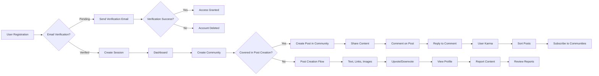

# Service Overview

## Vision
The service provides a Reddit-like community platform where users can create and participate in online communities (subreddits) around shared interests. The platform enables users to share content through posts (text, links, images), engage in discussions through commenting, and contribute to content moderation through voting and reporting. The core value proposition is to create a decentralized space for knowledge sharing, discussion, and community building across diverse topics while maintaining a high level of user engagement and content quality.

## Purpose
The platform exists to fulfill three primary objectives:

- Create a vibrant digital space for passionate communities to connect and exchange ideas across specific interests
- Provide governance tools that empower community leaders to maintain healthy communities through transparent moderation
- Establish a sustainable ecosystem where quality content is rewarded and users can build meaningful reputations

This platform addresses the growing need for purpose-driven online spaces that foster authentic engagement, intellectual exchange, and community building in an era of algorithmically driven content and attention economy platforms. By prioritizing user autonomy, content quality, and community governance over engagement metrics, the service creates a better digital experience for people who value meaningful conversation and discovery over viral content.

## Key Features and Functions

### User Registration and Login

WHEN a user attempts to register with a valid email and password, THE system SHALL create a new account in the database and send a verification email with a confirmation link.

IF the email verification link is not clicked within 24 hours, THEN THE system SHALL automatically delete the account and remove it from the database.

WHEN a user attempts to log in with valid credentials, THE system SHALL authenticate the user and create a session token.

WHEN a user requests password recovery, THE system SHALL generate and send a time-limited password reset link to the registered email address.

WHEN a user attempts to delete their account, THE system SHALL permanently remove the account and all associated data, including posts, comments, karma, and profile information, after confirming the action through a two-step verification process.

### Create Communities (Subreddits)

WHEN a member attempts to create a new community, THE system SHALL provide an interface to specify community name, description, privacy settings, and rules.

WHEN a community is created, THE system SHALL automatically assign the creator as the community moderator.

WHILE a community is active, THE system SHALL prevent its name from being changed once it has been set by the creator.

WHERE a community is set to private, THE system SHALL restrict access to invite-only members who have been approved by the moderator.

### Post Creation and Management

WHEN a member creates a new post in a community, THE system SHALL validate that the post contains at least 5 characters of text or includes a link or image.

IF a post contains only text, THEN THE system SHALL limit the character count to 5,000 characters.

IF a post contains a link, THEN THE system SHALL validate that the URL follows standard HTTP/HTTPS formats and does not contain malicious content.

IF a post contains an image, THEN THE system SHALL verify that the file is a supported image format (JPEG, PNG, WebP) and does not exceed 10MB in size.

WHEN a member attempts to edit a post, THE system SHALL allow editing within 2 hours of creation.

WHEN a posted content is reported, THE system SHALL make it invisible to the public until reviewed by a moderator.

### Commenting System with Nested Replies

WHEN a member creates a comment on a post, THE system SHALL validate the comment contains at least 1 character and no more than 500 characters.

WHILE the commenting system is active, THE system SHALL allow nested reply hierarchies up to 5 levels deep.

IF a comment is deleted, THEN THE system SHALL remove all nested replies that were part of the deleted comment's conversation thread.

### Voting System for Posts and Comments

WHEN a member upvotes or downvotes a post, THE system SHALL record the vote with the user ID, post ID, and timestamp.

WHEN a member votes on a post, THE system SHALL prevent multiple votes from the same user on the same post.

IF a user votes on a post and later changes their mind, THEN THE system SHALL allow the user to reverse their vote within 5 minutes of the initial vote.

WHEN a post receives votes, THE system SHALL calculate its popularity score based on the net upvote count, time decay factor, and community size.

### User Karma System

WHEN a member receives an upvote on a post or comment, THE system SHALL increase their karma by 1 point.

WHEN a member receives a downvote on a post or comment, THE system SHALL decrease their karma by 1 point.

IF a user's karma reaches 1,000 points, THEN THE system SHALL display a 'Valued Contributor' badge on their profile.

IF a user's karma reaches 5,000 points, THEN THE system SHALL make the profile appear in the 'Top Contributors' list on the homepage.

### Sorting Criteria for Posts

WHEN a user views a community's content, THE system SHALL display sorting options including "Hot", "New", "Top", and "Controversial".

THE system SHALL calculate the "Hot" score by combining upvotes and submission time, giving more weight to recent activity.

THE system SHALL display posts in order of the hot score, with the highest scores appearing first.

THE system SHALL calculate the "New" order based on submission time, with the newest posts at the top.

THE system SHALL calculate the "Top" order by sorting posts by total upvotes, with the highest individual totals first.

THE system SHALL calculate the "Controversial" order by prioritizing posts with high upvote/downvote ratios, regardless of total vote count.

### Community Subscription

WHEN a user views a community, THE system SHALL display a "Subscribe" button.

WHEN a user clicks "Subscribe", THE system SHALL add the community to their list of subscribed communities.

THE system SHALL record the subscription with user identifier, community identifier, and subscription date.

THE system SHALL ensure users can unsubscribe at any time.

THE system SHALL prioritize content from subscribed communities in the user's main feed.

### User Profiles

WHEN a user accesses their profile, THE system SHALL display their username, profile picture, karma score, member since date, and a tabbed interface for posts and comments.

THE system SHALL display a list of posts authored by the user, including title, community name, submission date, and upvote count, with pagination to prevent performance issues.

THE system SHALL display a list of comments made by the user, including the post title, community name, comment content, submission date, and upvote count, with pagination.

THE system SHALL ensure privacy settings prevent unauthorized access to personal information.

### Content Reporting System

WHEN a user observes inappropriate content, THE system SHALL display a "Report" button near the post or comment.

WHEN a user clicks "Report", THE system SHALL open a form asking for a reason (misinformation, harassment, spam, etc.) and optional additional comments.

THE system SHALL validate the report form (reason required, comment must be under 1,000 characters).

THE system SHALL store the report with user identifier, item identifier, reason, optional comments, timestamp, and status (new, in review, resolved).

THE system SHALL notify community moderators of new reports for review.

## User Roles and Avatars

### Guest: Unauthenticated Users

Unnamed user who has not registered or logged in to the platform. Guests can browse public content but cannot create posts or communities.

### Member: Standard Authenticated Users

Users who have registered and authenticated with the platform. Members can create posts, comment, upvote/downvote content, subscribe to communities, and maintain a profile.

### Moderator: Community Managers

Community owners and trusted users who can manage their communities, moderate content, ban users, and handle reports. Moderators have elevated permissions within specific communities.

### Admin: System Administrators

System administrators with full control over the platform. They can manage all users, communities, settings, reports, and system operations.

## Success Metrics and KPIs

### Key Performance Indicators

- **Daily Active Users (DAU)**: THE system SHALL track and report the number of unique users who access the platform daily. THE system SHALL calculate DAU as a percentage of monthly active users (MAU) to assess user retention. A target of 30% DAU/MAU ratio by Month 6 indicates strong user engagement.

- **Posts per Day**: THE system SHALL track the number of new posts created daily. THE system SHALL maintain a rolling 30-day average of posts per day. A target of 5,000 posts per day by Month 12 indicates a healthy content ecosystem.

- **Comments per Post**: THE system SHALL calculate the average number of comments per post. THE system SHALL track this metric separately for new posts (24 hours after creation) and for all posts. A target of 15 comments per post by Month 6 indicates robust community discussion.

### Community Health Metrics

- **Community Growth Rate**: THE system SHALL track the number of new communities created monthly. THE system SHALL calculate the month-over-month growth rate. A target of 20% monthly growth in communities by Month 9 indicates a thriving community ecosystem.

- **Moderator Engagement**: THE system SHALL track the number of community moderation actions (content removal, user bans, warnings) per community per month. THE system SHALL calculate the average moderation activity per active community. A target of 5 moderation actions per community per month by Month 6 indicates active community management.

- **Report Resolution Rate**: THE system SHALL track the number of reports submitted and the number of reports resolved by moderators. THE system SHALL calculate the percentage of reports resolved within 24 hours. A target of 95% resolution rate within 24 hours by Month 3 indicates an effective moderation system.

### Platform Performance and Stability

- **Content Load Time**: THE system SHALL measure the time from request initiation to complete content rendering. THE system SHALL calculate the 95th percentile load time. A target of under 2 seconds for 95% of requests ensures a responsive user experience.

- **System Uptime**: THE system SHALL monitor the percentage of time the platform is available and operational. THE system SHALL report monthly uptime as a percentage. A target of 99.9% uptime ensures reliable service availability.

- **Error Rate**: THE system SHALL track the number of errors per 1,000 requests. THE system SHALL calculate the error rate as a percentage of total requests. A target of less than 0.5% error rate ensures a stable platform experience.

### Business Success Metrics

- **User Acquisition Cost (CAC)**: THE system SHALL track the average cost to acquire a new user through marketing efforts. THE system SHALL calculate CAC by dividing total marketing spend by new users acquired. A target CAC that is less than 10% of the average LTV by Month 6 indicates a sustainable business model.

- **Customer Lifetime Value (LTV)**: THE system SHALL estimate the lifetime value of an average user. THE system SHALL calculate LTV by multiplying average revenue per user by average user retention period. A target LTV that is at least 3 times CAC by Month 12 indicates strong business health.

- **Monetization Revenue**: THE system SHALL track revenue from subscription models, advertising, or other monetization strategies. THE system SHALL report monthly revenue and growth rate. A target of $50,000 monthly revenue by Month 18 indicates successful monetization.

### User Satisfaction Metrics

- **Net Promoter Score (NPS)**: THE system SHALL survey users about the likelihood of recommending the platform to others. THE system SHALL calculate NPS as the percentage of promoters minus the percentage of detractors. A target score of 50+ by Month 6 indicates strong user advocacy.

- **User Satisfaction Score**: THE system SHALL survey users about their satisfaction with key platform features. THE system SHALL calculate the average score across all features. A target of 4.5/5.0 average satisfaction by Month 9 indicates strong user experience.

- **Churn Rate**: THE system SHALL track the percentage of users who stop using the platform after a given period. THE system SHALL calculate the monthly churn rate. A target of less than 3% monthly churn by Month 6 indicates strong user retention.

## Mermaid Diagrams

