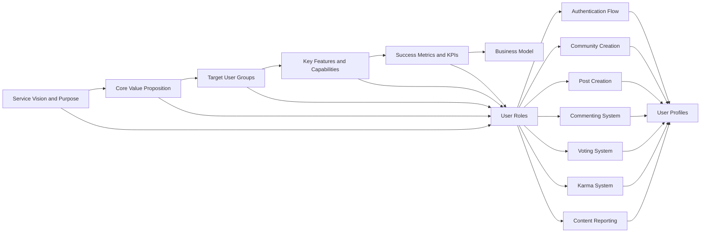

## Service Vision and Purpose

The community platform exists to create a vibrant, user-driven digital space where individuals can connect around shared interests, exchange ideas, and build meaningful relationships. The service provides the foundational infrastructure for forming and growing communities around any topic of interest, enabling users to create, share, and discuss content in a structured, governed environment.

This platform addresses the growing need for purpose-driven online spaces that foster authentic engagement, intellectual exchange, and community building in an era of algorithmically driven content and attention economy platforms. By prioritizing user autonomy, content quality, and community governance over engagement metrics, the service creates a better digital experience for people who value meaningful conversation and discovery over viral content.

## Core Value Proposition

The platform's unique value lies in its balanced approach to community building: it offers the freedom and dynamism of a social network with the organization and focus of a dedicated forum. Unlike traditional social media, where content is dictated by algorithms and user attention is commodified, this platform empowers users to create their own digital spaces with clear governance structures, transparent moderation, and meaningful participation models.

The value proposition is multilayered:

- **For Individual Users**: Access to curated communities focused on specific interests with minimal algorithmic interference, allowing them to discover relevant content and connect with like-minded individuals in a frictionless manner
- **For Community Builders**: Full control over their digital spaces including community branding, moderation tools, content organization, and membership management, with the ability to grow their communities organically
- **For Content Creators**: The ability to build audiences around specific topics, monetize their expertise, and receive meaningful engagement through the karma system that rewards quality contributions rather than popularity
- **For the Ecosystem**: A sustainable platform where community health is prioritized over platform growth, ensuring a high-quality experience that attracts and retains users over the long term

## Target User Groups

The platform serves three primary user groups:

### 3.1 Primary Users (Core Community Members)

- **Description**: Individuals who create content, participate in discussions, and actively engage with communities around their interests
- **Characteristics**: Typically aged 18-45, digitally native, passionate about specific topics (technology, hobbies, professional interests, current events, etc.), seeking meaningful connections and knowledge sharing
- **Needs**: Safe, organized spaces to discuss their passions; tools to build their reputation through contributions; clear community rules and moderation; reliable notification systems
- **Behaviors**: Post regularly to specific communities, upvote/downvote content based on quality, comment with thoughtful responses, engage in thread discussions, subscribe to communities of interest

### 3.2 Secondary Users (Passive Engagers and Discoverers)

- **Description**: Users who consume content but don't actively contribute, often seeking information or entertainment
- **Characteristics**: Visually oriented, time-constrained, interested in a wide variety of topics but may not be ready to commit to active participation
- **Needs**: Easy discovery of quality content; clean, intuitive interface; reliable sorting and filtering; trust in content quality and community standards
- **Behaviors**: Browse front page and community discovery sections, search for specific topics, read posts and comments, follow communities of interest, occasionally respond to content

### 3.3 Tertiary Users (Community Moderators and Administrators)

- **Description**: Trusted individuals responsible for maintaining community health and platform integrity
- **Characteristics**: Experienced in online governance, passionate about specific topics, responsible and attentive to community needs, willing to dedicate time to moderation
- **Needs**: Comprehensive moderation tools; clear reporting and handling mechanisms; visibility into community metrics; ability to manage trusted users
- **Behaviors**: Review reported content, moderate comments and posts, manage community settings, handle user disputes, mentor new members, enforce community rules

## Key Features and Capabilities

The platform is built around the following essential features that enable its core functionality:

### 4.1 Community Creation and Management

WHEN a user with appropriate permissions accesses the community creation interface, THE system SHALL provide a form to establish a new community. THE system SHALL validate the community name (must be unique across all communities) and category (must be selected from predefined options). THE system SHALL assign the creator as the initial community moderator. THE system SHALL store the community with a unique identifier, name, description, category, creation date, and status (active, pending approval, or disabled).

### 4.2 Post Creation and Management

WHEN a user selects a community to post in, THE system SHALL display a post creation form. THE system SHALL allow users to create posts with text content, URLs, and image attachments. THE system SHALL validate post text (maximum 5,000 characters), URLs (must be valid HTTP/HTTPS addresses), and images (maximum 10MB, acceptable formats: JPEG, PNG, GIF, WebP). THE system SHALL automatically generate a unique post identifier, timestamp, and initial vote count (zero). THE system SHALL store the post with the author identifier, community identifier, content, metadata, and status (active, pending moderation, or removed).

### 4.3 Commenting System with Nested Replies

WHEN a user opens a post to view comments, THE system SHALL render the post content followed by a comment section. THE system SHALL display existing comments with their author, timestamp, text content, vote count, and reply count. THE system SHALL render each comment with indentation proportional to its nesting level. WHEN a user clicks "Reply" on a comment, THE system SHALL display a reply form beneath that comment. THE system SHALL validate comment text (maximum 2,000 characters) and prevent submission if empty. THE system SHALL store comments with parent comment identifier (null for top-level comments) and nesting level information.

### 4.4 Voting System for Posts and Comments

WHEN a user views a post or comment, THE system SHALL display upvote and downvote buttons. THE system SHALL allow each user to upvote or downvote any post or comment only once per item. THE system SHALL update the vote count in real-time without requiring page refresh. THE system SHALL store the vote with user identifier, item identifier, vote type (up or down), timestamp, and user identifier in the voting history. THE system SHALL enforce a rule that users cannot vote on their own content.

### 4.5 User Karma System

WHEN a user creates a post or comment, THE system SHALL calculate karma points based on the quality of their contribution. THE system SHALL award 1 karma point for every upvote received on a post or comment. THE system SHALL penalize -1 karma point for every downvote received on a post or comment. THE system SHALL calculate the user's total karma by summing all positive and negative karma points. THE system SHALL display the user's karma score on their profile, allowing users to track their standing in the community.

### 4.6 Post Sorting and Filtering

WHEN a user views a community's content, THE system SHALL display sorting options including "Hot", "New", "Top", and "Controversial". THE system SHALL calculate the "Hot" score by combining upvotes and submission time, giving more weight to recent activity. THE system SHALL display posts in order of the hot score, with the highest scores appearing first. THE system SHALL calculate the "New" order based on submission time, with the newest posts at the top. THE system SHALL calculate the "Top" order by sorting posts by total upvotes, with the highest individual totals first. THE system SHALL calculate the "Controversial" order by prioritizing posts with high upvote/downvote ratios, regardless of total vote count.

### 4.7 Community Subscription

WHEN a user views a community, THE system SHALL display a "Subscribe" button. WHEN a user clicks "Subscribe", THE system SHALL add the community to their list of subscribed communities. THE system SHALL record the subscription with user identifier, community identifier, and subscription date. THE system SHALL ensure users can unsubscribe at any time. THE system SHALL prioritize content from subscribed communities in the user's main feed.

### 4.8 User Profile System

WHEN a user accesses their profile, THE system SHALL display their username, profile picture, karma score, member since date, and a tabbed interface for posts and comments. THE system SHALL display a list of posts authored by the user, including title, community name, submission date, and upvote count, with pagination to prevent performance issues. THE system SHALL display a list of comments made by the user, including the post title, community name, comment content, submission date, and upvote count, with pagination. THE system SHALL ensure privacy settings prevent unauthorized access to personal information.

### 4.9 Content Reporting System

WHEN a user observes inappropriate content, THE system SHALL display a "Report" button near the post or comment. WHEN a user clicks "Report", THE system SHALL open a form asking for a reason (misinformation, harassment, spam, etc.) and optional additional comments. THE system SHALL validate the report form (reason required, comment must be under 1,000 characters). THE system SHALL store the report with user identifier, item identifier, reason, optional comments, timestamp, and status (new, in review, resolved). THE system SHALL notify community moderators of new reports for review.

## Success Metrics and KPIs

The success of the platform will be measured through the following key performance indicators:

### 5.1 User Engagement Metrics

- **Daily Active Users (DAU)**: THE system SHALL track and report the number of unique users who access the platform daily. THE system SHALL calculate DAU as a percentage of monthly active users (MAU) to assess user retention. A target of 30% DAU/MAU ratio by Month 6 indicates strong user engagement.

- **Posts per Day**: THE system SHALL track the number of new posts created daily. THE system SHALL maintain a rolling 30-day average of posts per day. A target of 5,000 posts per day by Month 12 indicates a healthy content ecosystem.

- **Comments per Post**: THE system SHALL calculate the average number of comments per post. THE system SHALL track this metric separately for new posts (24 hours after creation) and for all posts. A target of 15 comments per post by Month 6 indicates robust community discussion.

### 5.2 Community Health Metrics

- **Community Growth Rate**: THE system SHALL track the number of new communities created monthly. THE system SHALL calculate the month-over-month growth rate. A target of 20% monthly growth in communities by Month 9 indicates a thriving community ecosystem.

- **Moderator Engagement**: THE system SHALL track the number of community moderation actions (content removal, user bans, warnings) per community per month. THE system SHALL calculate the average moderation activity per active community. A target of 5 moderation actions per community per month by Month 6 indicates active community management.

- **Report Resolution Rate**: THE system SHALL track the number of reports submitted and the number of reports resolved by moderators. THE system SHALL calculate the percentage of reports resolved within 24 hours. A target of 95% resolution rate within 24 hours by Month 3 indicates an effective moderation system.

### 5.3 Platform Performance and Stability

- **Content Load Time**: THE system SHALL measure the time from request initiation to complete content rendering. THE system SHALL calculate the 95th percentile load time. A target of under 2 seconds for 95% of requests ensures a responsive user experience.

- **System Uptime**: THE system SHALL monitor the percentage of time the platform is available and operational. THE system SHALL report monthly uptime as a percentage. A target of 99.9% uptime ensures reliable service availability.

- **Error Rate**: THE system SHALL track the number of errors per 1,000 requests. THE system SHALL calculate the error rate as a percentage of total requests. A target of less than 0.5% error rate ensures a stable platform experience.

### 5.4 Business Success Metrics

- **User Acquisition Cost (CAC)**: THE system SHALL track the average cost to acquire a new user through marketing efforts. THE system SHALL calculate CAC by dividing total marketing spend by new users acquired. A target CAC that is less than 10% of the average LTV by Month 6 indicates a sustainable business model.

- **Customer Lifetime Value (LTV)**: THE system SHALL estimate the lifetime value of an average user. THE system SHALL calculate LTV by multiplying average revenue per user by average user retention period. A target LTV that is at least 3 times CAC by Month 12 indicates strong business health.

- **Monetization Revenue**: THE system SHALL track revenue from subscription models, advertising, or other monetization strategies. THE system SHALL report monthly revenue and growth rate. A target of $50,000 monthly revenue by Month 18 indicates successful monetization.

### 5.5 User Satisfaction Metrics

- **Net Promoter Score (NPS)**: THE system SHALL survey users about the likelihood of recommending the platform to others. THE system SHALL calculate NPS as the percentage of promoters minus the percentage of detractors. A target score of 50+ by Month 6 indicates strong user advocacy.

- **User Satisfaction Score**: THE system SHALL survey users about their satisfaction with key platform features. THE system SHALL calculate the average score across all features. A target of 4.5/5.0 average satisfaction by Month 9 indicates strong user experience.

- **Churn Rate**: THE system SHALL track the percentage of users who stop using the platform after a given period. THE system SHALL calculate the monthly churn rate. A target of less than 3% monthly churn by Month 6 indicates strong user retention.

> *Developer Note: This document defines **business requirements only**. All technical implementations (architecture, APIs, database design, etc.) are at the discretion of the development team.*