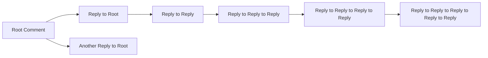

## Commenting System

### Commenting System Overview
The commenting system enables users to engage in discussions on posts within communities. It supports text-only comments, nested replies, and provides a complete interaction framework for users to share opinions, ask questions, and build community conversations. The system must support hierarchical comment structures, real-time interaction, and comprehensive moderation tools.

### User Roles and Permissions

#### Guest: Unauthenticated Users
- CAN view comments on public posts
- CANNOT create comments
- CANNOT edit or delete comments
- CANNOT reply to comments
- CANNOT report comments

#### Member: Standard Authenticated Users
- CAN create text-only comments on public posts
- CAN reply to any comment (nested replies)
- CAN edit their own comments within 15 minutes of creation
- CAN delete their own comments
- CAN report inappropriate comments
- CAN upvote/downvote comments
- CANNOT edit or delete others' comments
- CANNOT reply to comments after 30 days of comment creation

#### Moderator: Community Managers
- CAN create comments on any post
- CAN reply to any comment (nested replies)
- CAN edit all comments within their community
- CAN delete any comment within their community
- CAN report comments (for higher-level review)
- CAN upvote/downvote comments
- CAN manage comment threads (merge, split, lock)
- CAN apply community-specific comment rules

#### Admin: System Administrators
- CAN perform all member actions
- CAN perform all moderator actions
- CAN view all comments across all communities
- CAN access comment moderation history
- CAN enforce global comment policies
- CAN modify system-wide comment settings
- CAN review all comment reports
- CAN restore deleted comments

### Comment Creation Process

#### Core Commenting Functionality
WHEN a member attempts to comment on a post, THE system SHALL display the comment form below the post content.

THE system SHALL validate the comment content according to the following rules:
- IF the comment contains fewer than 5 characters, THEN THE system SHALL display an error message "Comment must be at least 5 characters long" and prevent submission.

THE system SHALL allow members to create text-only comments with the following constraints:
- MAXIMUM length: 1,500 characters
- IF the comment exceeds 1,500 characters, THEN THE system SHALL display an error message "Comment cannot exceed 1,500 characters" and prevent submission.
- IF the comment contains less than 5 characters, THEN THE system SHALL display an error message "Comment must be at least 5 characters long" and prevent submission.
- IF the comment contains any prohibited content (determined by content moderation system), THEN THE system SHALL display an error message "Comment contains inappropriate content" and prevent submission.

WHEN a member successfully submits a comment, THE system SHALL:
- Display the comment immediately below the post
- Update the post's comment count
- Increment the user's karma by 1 point
- Record the comment's creation timestamp
- Associate the comment with the poster's user ID and the post's post ID
- Send a notification to the post creator if they follow the commenting user
- Add the comment to the community's activity feed

#### Banning from Commenting
IF a member has been banned from a community, THEN THE system SHALL prevent the member from commenting on any posts within that community.

IF a member has been banned from the entire platform, THEN THE system SHALL prevent the member from creating any comments on any posts.

### Nested Reply Structure

#### Reply Hierarchy Requirements
THE system SHALL support a nested reply structure where comments can have multiple levels of replies.

THE maximum level of nesting SHALL be 5 levels deep (comment, reply, reply to reply, reply to reply to reply, and reply to reply to reply to reply).

WHEN a user replies to a comment, THE system SHALL:
- Create a new comment record with the parent comment ID referencing the original comment
- Display the reply immediately below the parent comment
- Indent the reply visually to indicate hierarchy
- Display the reply in chronological order (newest first)
- Increment the parent comment's reply count by 1
- Update the parent comment's last updated timestamp

#### Visual Representation

THE system SHALL prevent users from creating more than 5 levels of nesting. IF a user attempts to reply to a comment that is already at level 5, THEN THE system SHALL display an error message "Maximum nesting depth reached" and prevent the reply.

### Editing and Deleting Comments

#### Edit Functionality
WHEN a member attempts to edit their own comment, THE system SHALL:
- Display the original comment content in a text editor
- Allow the member to modify the comment text
- Enforce the same content validation rules as new comments (minimum 5 characters, maximum 1,500 characters, no prohibited content)
- IF the edited comment violates any content rules, THEN THE system SHALL display an appropriate error message and prevent saving.

WHILE a member is editing their comment, THE system SHALL display a warning message "Changes will be saved immediately upon submission. You cannot undo changes after saving.".

THE system SHALL allow members to edit their comments only within 15 minutes of creation. IF a member attempts to edit a comment after 15 minutes, THEN THE system SHALL display an error message "This comment cannot be edited. Only comments created within the last 15 minutes can be edited." and prevent editing.

#### Delete Functionality
WHEN a member attempts to delete their own comment, THE system SHALL:
- Immediately remove the comment from public view
- Decrease the post's comment count by 1
- Display a confirmation dialog with the message "Are you sure you want to delete this comment? This action cannot be undone."
- IF the member confirms deletion, THEN THE system SHALL permanently remove the comment from the database
- IF the member cancels deletion, THEN THE system SHALL return to the comment view without changes

THE system SHALL allow members to un-delete their comments for 1 hour after deletion. IF a member attempts to un-delete a comment after 1 hour, THEN THE system SHALL display an error message "This comment cannot be recovered. Recovery window has expired." and prevent un-deletion.

### Comment Moderation

#### Member-Initiated Reporting
WHEN a member reports a comment as inappropriate, THE system SHALL:
- Capture the report with the reporter's user ID, the commented content ID, and the reason for reporting
- Store this information in the report database
- Assign a priority level to the report based on the content and user reporting history
- Notify the community moderator if the comment is in a community the member moderates
- If the reporter is a moderator or admin, the report goes directly to the appropriate moderation queue

IF a member has reported the same comment within the past 24 hours, THEN THE system SHALL display a message "You have already reported this comment. Please wait 24 hours before reporting it again."

IF a member reports a comment that is already in the moderation queue, THEN THE system SHALL display a message "This comment is already under review. Your report has been added to the existing case."

#### Moderator Actions on Reports
WHEN a moderator reviews a report, THE system SHALL:
- Display all details of the report including the reporter's information, the original comment, and the reported reason
- Allow the moderator to take one of the following actions:
  - Approve the comment (no action)
  - Remove the comment (permanent deletion)
  - Modify the comment (edit content, then approve)
  - Warn the user (send private message)
  - Suspend the user's commenting privileges for a specified time
  - Ban the user from the community
  - Escalate to system administrator

THE system SHALL log all moderator actions with timestamp, action type, and moderator user ID.

#### Automated Moderation
THE system SHALL implement automated content moderation with the following rules:
- IF a comment contains 3 or more instances of the same word, THEN THE system SHALL flag it for review.
- IF a comment contains 2 or more URLs from untrusted domains, THEN THE system SHALL flag it for review.
- IF a comment contains 5 or more capital letters in a row, THEN THE system SHALL flag it for review.
- IF a comment contains more than 20% of its characters as punctuation, THEN THE system SHALL flag it for review.
- IF a comment contains a combination of warning words and patterns, THEN THE system SHALL flag it for review.

### Comment Display Logic

#### Comment Ordering
THE system SHALL allow users to sort comments by:
- HOT: Newest first based on creation time
- NEW: Newest first based on creation time
- TOP: Highest karma first
- CONTROVERSIAL: Most upvotes minus downvotes, with ties broken by creation time
- FOLLOWING: Comments from users the viewer is following

WHEN the user changes the sort order, THE system SHALL update the comment list immediately without requiring a page refresh.

#### Comment Visibility
THE system SHALL display comments in the following order:
- First, comments with zero karma
- Then, comments with positive karma
- Finally, comments with negative karma

THE system SHALL display the following information for each comment:
- Commenter's username
- Timestamp of creation (using local time relative to user's timezone)
- Karma score (number of upvotes minus downvotes)
- Upvote and downvote buttons
- Reply button
- Report button (visible to members, not guests)
- Edit button (visible only to the original poster within 15 minutes)
- Delete button (visible only to the original poster)
- Parent comment indication (for replies)
- Reply indicator (number of replies)
- Community name for comments in communal spaces

SPECIFICALLY:
- For root comments (comments at level 0), THE system SHALL display the comment body, karma, timestamps, and all interactive elements.
- For replies (level 1 and above), THE system SHALL indent the comment body and display the parent comment's username with an "@" symbol.
- THE system SHALL only display the "Reply" button on comments that are not at maximum nesting depth (level 5).

### Comment Pagination

#### Infinite Scroll Implementation
THE system SHALL implement infinite scroll for comment loading, with the following requirements:
- WHEN the user scrolls to the bottom of the comment list, THE system SHALL automatically load additional comments in batches of 10.
- THE system SHALL cache previously loaded comments to prevent re-fetching.
- THE system SHALL display a loading indicator during content fetching.
- THE system SHALL maintain the user's scroll position when new content loads.

#### Manual Pagination
IF the user chooses manual pagination, THE system SHALL:
- Display a "Load More" button at the bottom of the comment list
- Load 10 comments at a time when the button is clicked
- Disable the button while loading new content
- Display a summary of total comments displayed (e.g., "Showing 20 of 150 comments")

#### Performance Requirements
THE system SHALL ensure that comments load within 1.5 seconds for most users, even with 1,000 or more comments on a single post.

WHEN a user first visits a post, THE system SHALL load the first 20 comments immediately.

WHEN the user scrolls to the bottom of the current comments, THE system SHALL fetch the next 20 comments within 0.5 seconds of detection.

### Comment Search

#### Search Functionality
THE system SHALL provide a search feature for comments with the following requirements:

WHEN a user enters a search query in the comment search box, THE system SHALL:
- Search across all comment content (text only)
- Perform a case-insensitive search
- Return comments that contain any word from the query
- Display results in order of relevance (matches first, then by creation date)
- Highlight matching text in the results

THE system SHALL allow users to search for exact phrases by surrounding the query with quotation marks.

THE system SHALL return a maximum of 50 results per search.

THE system SHALL display a message "No comments found matching your search terms" when no results are found.

IF the search query contains fewer than 3 characters, THEN THE system SHALL display an error message "Search query must be at least 3 characters long".

### Business Rules and Validation

#### Character Limit Rules
THE system SHALL enforce the following character limits for comments:
- Minimum characters per comment: 5
- Maximum characters per comment: 1,500

IF a comment contains fewer than 5 characters, THEN THE system SHALL prevent submission and display an error message.

IF a comment exceeds 1,500 characters, THEN THE system SHALL prevent submission and display an error message.

#### Content Moderation Rules
THE system SHALL implement automated content filtering with the following rules:
- IF a comment contains any of the following prohibited phrases, THEN THE system SHALL block submission:
  - "porn"
  - "sex"
  - "adult"
  - "nudity"
  - "homemade"
  - "making money"
  - "get rich"
  - "free money"
  - "academic cheating"
  - "exam answers"
  - "plagiarism"

- IF a comment contains more than 3 instances of the same word, THEN THE system SHALL flag it for review.

- IF a comment contains more than 2 URLs from untrusted domains, THEN THE system SHALL flag it for review.

- IF a comment contains more than 5 capital letters in a row, THEN THE system SHALL flag it for review.

- IF a comment contains more than 20% of its characters as punctuation, THEN THE system SHALL flag it for review.

#### Time Constraints
THE system SHALL enforce the following time constraints:
- Comments can be edited within 15 minutes of creation
- Comments can be deleted within 24 hours of creation
- Deleted comments can be recovered within 1 hour of deletion

IF a member attempts to edit a comment after 15 minutes, THEN THE system SHALL display an error message "This comment cannot be edited. Only comments created within the last 15 minutes can be edited."

IF a member attempts to delete a comment after 24 hours, THEN THE system SHALL display an error message "This comment cannot be deleted. Only comments created within the last 24 hours can be deleted."

IF a member attempts to recover a deleted comment after 1 hour, THEN THE system SHALL display an error message "This comment cannot be recovered. Recovery window has expired."

### Error Handling and User Experience

#### Error Messages
THE system SHALL display appropriate error messages for the following scenarios:
- "Comment must be at least 5 characters long" (if comment is too short)
- "Comment cannot exceed 1,500 characters" (if comment is too long)
- "Comment contains inappropriate content" (if prohibited content detected)
- "You are not allowed to comment in this community" (if banned from community)
- "You have already reported this comment. Please wait 24 hours before reporting it again." (if reporting too frequently)
- "This comment is already under review. Your report has been added to the existing case." (if duplicate report)
- "Maximum nesting depth reached" (if attempting to create too many nested replies)
- "This comment cannot be edited. Only comments created within the last 15 minutes can be edited." (if editing too late)
- "This comment cannot be deleted. Only comments created within the last 24 hours can be deleted." (if deleting too late)
- "This comment cannot be recovered. Recovery window has expired." (if recovering too late)
- "Search query must be at least 3 characters long" (if search query too short)
- "No comments found matching your search terms" (if no results found)

#### Confirmation Dialogs
WHEN a member attempts to delete a comment, THE system SHALL display a confirmation dialog with the message:
"Are you sure you want to delete this comment? This action cannot be undone."

IF the member clicks "Cancel", THEN THE system SHALL return to the comment view without changes.
IF the member clicks "Delete", THEN THE system SHALL proceed with deletion and display a success message.

### Performance Requirements

THE system SHALL ensure the following performance characteristics:

- WHEN a user views a post with 100 comments, THE system SHALL load the initial comment list within 1.2 seconds.
- WHEN a user scrolls to the bottom of a comment list, THE system SHALL fetch the next batch of comments within 0.4 seconds.
- WHEN a user searches for comments, THE system SHALL return results within 0.8 seconds.
- WHEN a user posts a comment, THE system SHALL display it in the comment list within 1.0 second.
- WHEN a user edits a comment, THE system SHALL save the changes within 1.5 seconds.
- WHEN a user deletes a comment, THE system SHALL update the comment count within 0.5 seconds.
- WHEN a user votes on a comment, THE system SHALL update the karma score within 0.3 seconds.

THE system SHALL be optimized to handle 10,000 concurrent users viewing comments simultaneously without degradation.

THE system SHALL implement caching strategies to reduce database load and improve responsiveness.

THE system SHALL provide feedback to users during operations (e.g., loading spinners, success messages) to ensure a responsive user experience.

> *Developer Note: This document defines **business requirements only**. All technical implementations (architecture, APIs, database design, etc.) are at the discretion of the development team.*