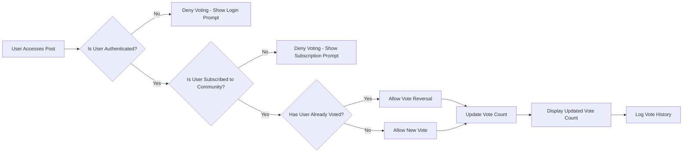

## Voting System

### Upvote/Downvote Mechanics

WHEN a user interacts with a post or comment, THE system SHALL display clear visual indicators for upvoting and downvoting, with the capability to show the current vote count in real-time.

WHEN a member attempts to upvote or downvote a post, THE system SHALL record the vote in the system and update the post's visible vote count instantly, reflecting the total of all upvotes minus all downvotes.

WHEN a member attempts to upvote or downvote a comment, THE system SHALL record the vote in the system and update the comment's visible vote count instantly, reflecting the total of all upvotes minus all downvotes.

THE system SHALL display the current vote count of posts and comments as a number adjacent to the vote buttons, formatted as a positive integer if votes are positive, zero if balanced, or negative if downvotes exceed upvotes.

THE system SHALL provide visual feedback when a user votes by changing the color of the vote button (e.g., blue for upvote, red for downvote) and displaying a confirmation animation.

THE system SHALL only allow a user to cast one vote (upvote or downvote) per post or comment, and SHALL prevent duplicate votes.

### Vote Limits

WHEN a member attempts to vote on a post or comment, THE system SHALL ensure they have not already voted on that specific post or comment.

THE system SHALL limit a member to one vote per post or comment, regardless of how many times they attempt to vote.

THE system SHALL prevent a member from voting on the same post or comment more than once, even if they try to change their vote from up to down or vice versa.

WHEN a member attempts to vote on a post they have already voted on, THE system SHALL deny the vote and display a user-friendly message: "You've already voted on this post. You can only vote once."

### Vote Reversal

WHEN a member clicks an already cast vote button (upvote or downvote) on a post or comment, THE system SHALL reverse the vote: a previously upvoted post becomes unvoted (neutral), and a previously downvoted post becomes unvoted (neutral).

WHEN a member reverses their vote on a post or comment, THE system SHALL update the vote count immediately, removing the original vote from the total.

WHEN a member reverses their vote on a post or comment, THE system SHALL return the vote button to its neutral state (the original color before voting, e.g., gray or gray-blue).

THE system SHALL allow members to change their vote from upvote to downvote or from downvote to upvote by clicking the opposite vote button.

WHEN a member changes their vote from upvote to downvote or vice versa, THE system SHALL record the new vote, update the total vote count, and display the change to the user.

### Voting Influence on Sorting

THE system SHALL rank posts by the number of votes (upvotes minus downvotes) as the primary factor in the 'Hot' sorting option, with newer posts receiving higher priority when vote counts are equal.

THE system SHALL sort posts by publication date in descending order for the 'New' sorting option, with the most recently created posts appearing first.

THE system SHALL sort posts by the total number of votes (upvotes minus downvotes) in descending order for the 'Top' sorting option, with posts having the highest vote counts appearing first.

THE system SHALL sort posts by the absolute value of the difference between upvotes and downvotes divided by the time since posting for the 'Controversial' sorting option, with the most debated posts (where upvotes and downvotes are nearly equal but the post is still visible) appearing first.

THE system SHALL calculate the 'Hot' score using the formula: `score = (upvotes - downvotes) / ((time since posting in hours + 2) ^ 1.5)`, where time is measured in hours from post creation.

When multiple posts have the same 'Hot' score, THE system SHALL sort them by the creation time, with more recent posts appearing first.

THE system SHALL update the sorting criteria in real-time when votes change, ensuring the post order reflects the latest vote totals instantly.

### Vote History

THE system SHALL maintain a persistent record of all votes cast by each member, including the post or comment ID, the type of vote (upvote or downvote), and the timestamp when the vote was cast.

THE system SHALL store vote history for a minimum of 10 years, ensuring all voting activity is traceable for audit and moderation purposes.

THE system SHALL provide the ability to view vote history through the user profile interface, displaying the list of posts and comments a user has voted on and their vote type.

THE system SHALL include in the vote history record whether the member reversed a vote and when.

THE system SHALL display the vote history on the user profile with filtering capabilities by post type (post or comment), vote type (upvote/downvote), and date range.

WHEN a member views their vote history on their profile, THE system SHALL display the total number of upvotes and downvotes they have cast.

### Vote Moderation

THE system SHALL detect unusual voting patterns as potential vote manipulation, including:
- Multiple votes from the same IP address within a short time frame
- Rapid consecutive votes from the same user
- Voting patterns that suggest coordinated downvoting of specific posts or users

IF a user exhibits vote manipulation behavior, THEN THE system SHALL flag the account for review by a moderation team.

IF a user is suspected of vote manipulation, THEN THE system SHALL temporarily restrict their voting privileges until the investigation is complete.

THE system SHALL maintain a log of all suspicious voting activity for audit and audit trail purposes.

THE system SHALL provide tools for community moderators to review and manage questionable vote patterns.

THE system SHALL allow moderators to restore or remove votes that have been flagged for being invalid due to manipulation.

### Vote Restrictions

WHILE a member is under suspension, THE system SHALL block their ability to vote on any posts or comments.

WHILE a post is under investigation for reporting, THE system SHALL temporarily lock voting on that post until the investigation is concluded.

IF a user has been banned from a community, THEN THE system SHALL prevent them from voting on any posts or comments within that community.

WHEN a user attempts to vote on a community they are not subscribed to, THE system SHALL deny the vote and display a message: "You must be subscribed to this community to vote on its content."

THE system SHALL prevent guests (unauthenticated users) from voting on any posts or comments.

WHEN a member attempts to vote on a post that is in a private community they are not a member of, THE system SHALL deny the vote and display the message: "You cannot vote on content in a private community unless you are a member."

THE system SHALL ensure that users cannot vote on their own posts or comments.

WHEN a member attempts to vote on their own post or comment, THE system SHALL deny the vote and display the message: "You cannot vote on your own content."

WHEN a member attempts to vote on a post that has been reported and is under review, THE system SHALL prevent the vote and display: "This post is currently being reviewed. Voting is temporarily paused."

THE system SHALL maintain a comprehensive permission matrix that defines which user roles can vote and under what conditions, based on the roles defined in [User Roles and Permissions](./03-user-roles.md).

### Mermaid Diagrams

