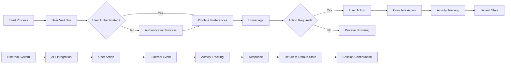

# Comprehensive Requirements Analysis Report: E-commerce Shopping Mall Platform

## 1. Service Overview & Business Model

### Why This Service Exists
The digital marketplace landscape presents significant challenges for small and medium-sized businesses seeking to establish an online presence. Existing e-commerce platforms often require extensive technical expertise, complex integrations, or high licensing fees that create substantial barriers to entry. This e-commerce shopping mall platform addresses this market gap by providing a comprehensive, no-code solution that transforms natural language requirements into fully functional, production-ready backend applications. By eliminating the need for programming knowledge, the platform democratizes access to sophisticated e-commerce capabilities, enabling businesses of all sizes to establish professional online storefronts with minimal technical expertise.

### How This Service Operates
The service functions as an automated backend engineering system that processes natural language requirements and generates complete NestJS + Prisma applications. This is achieved through a specialized team of AI agents that follow a waterfall development model with compiler-validated output. The platform's core value proposition lies in its ability to translate business goals expressed in conversational language directly into enterprise-grade technical implementations, significantly reducing the time, cost, and complexity associated with traditional application development.

### What This Service Delivers
The e-commerce shopping mall platform provides a complete, end-to-end solution for online retail operations. Customers gain access to a sophisticated digital marketplace featuring comprehensive product discovery capabilities, secure transaction processing, and personalized shopping experiences. Businesses benefit from powerful seller tools for inventory and order management, detailed analytics, and robust security features. Administrators maintain complete control over the platform's operations, content, and user management. The system supports multiple business models including multi-vendor marketplaces and single-seller operations, making it adaptable to diverse retail needs across industries.

## 2. User Actors & Permissions

### Actor Hierarchy and Responsibilities

| Actor | Primary Responsibilities | Access Level |
|--------|----------------------------|--------------| 
| customer | Browse products, manage shopping cart, place orders, write reviews, track order status, manage profile and addresses, handle payment methods, request cancellations/refunds | Read/Write for personal data, Read/Write for carts/orders/reviews | 
| seller | Register store, manage product catalog including variants and inventory, create/update product listings, process orders, view sales analytics, manage returns and exchanges | Read/Write for product data and order status, Read-only for customer data | 
| admin | Manage all users, approve new sellers, manage content, handle disputes, generate system reports, configure platform settings, monitor security | Full system access (Read/Write/Delete) across all data domains | 

### Authentication and Authorization

#### Core Authentication Functions
- Customers can register with email and password, with email verification required for account activation
- Customers can log in to access their account and personalized dashboards
- Customers can log out to end their session securely
- The system maintains user sessions with secure token handling
- Customers can verify their email address after registration
- Customers can reset forgotten passwords through a secure recovery process
- Customers can change their password at any time
- Customers can revoke access from all devices simultaneously
- Sellers can register with business information and undergo verification process
- Admins can log in with privileged credentials and access comprehensive management tools

#### Permission Matrix

| Action | customer | seller | admin | 
|--------|----------|--------|-------| 
| View product catalog | ✓ | ✓ | ✓ | 
| Add item to cart | ✓ | ✗ | ✗ | 
| Place order | ✓ | ✗ | ✗ | 
| Manage personal profile | ✓ | ✓ | ✓ | 
| Manage shipping addresses | ✓ | ✓ | ✓ | 
| View order history | ✓ | ✓ | ✓ | 
| Cancel order | ✓ | ✓ | ✓ | 
| Request refund | ✓ | ✓ | ✓ | 
| Write product review | ✓ | ✗ | ✗ | 
| Manage product listings | ✗ | ✓ | ✓ | 
| Update product variants (SKU) | ✗ | ✓ | ✓ | 
| View sales analytics | ✗ | ✓ | ✓ | 
| Process order fulfillment | ✗ | ✓ | ✓ | 
| Approve new seller accounts | ✗ | ✗ | ✓ | 
| Monitor system security | ✗ | ✗ | ✓ | 
| Configure platform settings | ✗ | ✗ | ✓ | 

#### JWT Token Management
- Access tokens expire after 15 minutes of inactivity or 30 minutes of session duration (whichever comes first)
- Refresh tokens expire after 7 days of inactivity
- Tokens are stored in httpOnly cookies for enhanced security
- JWT payload structure includes: userId, role (customer/seller/admin), and permissions array
- JWT secret key is managed via environment variables with regular rotation
- Token revocation is supported for account security and session management
- The system maintains a token blacklist to prevent reuse of compromised tokens
- Tokens are automatically refreshed when nearing expiration to prevent session interruption

### User Flow Diagram

## 3. Problem Definition and Market Gaps

### Key Pain Points
WHEN a customer searches for products online, THE system SHALL provide instant access to all relevant products regardless of seller, WITH the ability to filter by category, price, availability, and ratings.

WHEN a customer wants to purchase a product with multiple options (color, size, etc.), THE system SHALL allow the selection of specific product variants with real-time inventory visibility, AND prevent over-selling of out-of-stock variants.

WHEN a customer adds items to their shopping cart, THE system SHALL maintain the cart contents across multiple sessions and devices, AND alert the customer when inventory levels change.

WHEN a customer wants to change or cancel an order after placing it, THE system SHALL provide an immediate cancellation option within a 15-minute window after checkout, AND process refunds within 24 hours if cancellation occurs after this window.

WHEN a seller lists a product with variants, THE system SHALL allow creation of a master product with multiple SKUs (Stock Keeping Units) representing different colors, sizes, and configurations, WITH clear visual differentiation between variants.

### User Frustrations
IF a customer finds a product they like but see multiple listings for the same variant from different sellers, THEN THE system SHALL display all available options side-by-side with price comparison, AND highlight the seller with the best combination of price and shipping time.

IF a customer encounters a product with missing or incorrect specifications, THEN THE system SHALL display a clear flag indicating the issue, AND prevent the purchase until the product information is verified by the system.

WHEN a customer receives an order with incorrect items or missing components, THE system SHALL automatically detect the discrepancy through barcode scanning at fulfillment centers, AND trigger a replacement order with a 24-hour turnaround time.

### Market Gaps
WHERE a customer wants to purchase from a specific brand that offers customizations (personalization, engraving, etc.), THE system SHALL support configurable product options that update pricing in real-time and allow display of customization previews.

IF a customer wants to purchase multiple items from different sellers in one transaction, THEN THE system SHALL aggregate the items into a single order with consolidated shipping, AND provide a unified tracking number that shows the status of all individual shipments.

WHEN a customer wants to return multiple items from different sellers in one return package, THE system SHALL generate a single return label with separate return tracking numbers for each seller's fulfillment center, AND automatically credit the customer's account when each individual return is processed.

### Competitive Landscape
The shoppingMall platform differentiates itself from existing marketplaces by offering superior inventory management capabilities, real-time variant visibility, and a unified order management system that handles multi-seller transactions seamlessly. Unlike competitors that require customers to manage multiple purchases separately, shoppingMall provides a single, intuitive interface for all shopping activities.

## 4. Core Value Proposition
The shoppingMall platform provides a comprehensive solution for online retail by concerting the physical shopping experience with digital convenience. The system enables sellers to efficiently manage their products and inventory while providing customers with a seamless, reliable shopping experience. By integrating product variants, inventory tracking, and multi-seller order processing into a single platform, shoppingMall reduces the complexity of e-commerce for both merchants and customers, ultimately improving conversion rates, reducing return rates, and increasing customer loyalty.

## 5. Primary User Scenarios

### Customer Shopping Experience
WHEN a customer visits the platform, THE system SHALL display the homepage with featured products, trending items, and personalized recommendations based on browsing history.

WHEN a customer searches for products, THE system SHALL return results within 2 seconds for common queries, AND display results with filters for price range, ratings, availability, and shipping options.

WHEN a customer selects a product with variants (color, size), THE system SHALL show a visual selector with available options, AND display real-time inventory status for each variant.

WHEN a customer adds items to their cart, THE system SHALL update the cart total in real-time, AND maintain cart contents across sessions and devices.

WHEN a customer proceeds to checkout, THE system SHALL require address selection, payment method configuration, and shipping option choice, WITH the ability to save frequently used addresses and payment methods.

WHEN a customer completes checkout, THE system SHALL generate an order confirmation with tracking details, AND send notifications via email and app push when the order is shipped.

### Seller Product Management
WHEN a seller logs in to their dashboard, THE system SHALL display sales analytics, order management, and inventory status summary.

WHEN a seller wants to add a new product, THE system SHALL guide them through a product creation wizard that collects basic information, category selection, pricing, and image upload.

WHEN a seller creates a product with variants, THE system SHALL allow the creation of multiple SKUs with different attributes (color, size), AND set individual inventory levels for each SKU.

WHEN a seller receives an order, THE system SHALL display the order details with customer information, item list, quantities, and shipping address, WITH the ability to mark items as shipped.

WHEN a seller wants to update inventory levels, THE system SHALL allow real-time adjustment of stock counts, AND trigger alerts when inventory falls below predefined thresholds.

### Admin System Management
WHEN an admin logs in to the admin dashboard, THE system SHALL display system health, user activity, and recent events summary.

WHEN an admin wants to manage users, THE system SHALL allow user search, profile viewing, and action execution (suspend, ban, approve) with audit trail logging.

WHEN an admin wants to manage products, THE system SHALL allow product search, filtering by category, seller, and status, WITH the ability to approve, reject, or edit product listings.

WHEN an admin wants to manage orders, THE system SHALL allow order search, filtering by status and date, WITH the ability to view order details and update status (processing, shipped, delivered, cancelled).

WHEN an admin wants to generate reports, THE system SHALL provide predefined report templates for sales, user activity, and system metrics, WITH the ability to customize report parameters and export to PDF/CSV.

## 6. Secondary and Special Scenarios

### Gift Purchases
WHERE a customer wants to purchase a product as a gift, THE system SHALL allow gift wrapping option selection with customizable message, AND provide gift receipt that excludes pricing information.

### Subscription Products
WHEN a customer purchases a subscription product, THE system SHALL create a recurring billing cycle, AND send renewal reminders before each billing period.

### Marketplace Special Events
WHERE a marketplace hosts a special event (sale, promotion), THE system SHALL automatically apply discounts to qualifying products, AND display event banners and countdown timers.

### Product Bundles
WHEN a customer adds a product bundle to their cart, THE system SHALL automatically include all component items at the bundle price, AND prevent partial selections.

### Returns and Refunds
WHEN a customer initiates a return, THE system SHALL generate a return shipping label, AND display instructions for package preparation.

## 7. Exception Handling

### Authentication Errors
IF a customer enters invalid login credentials, THEN THE system SHALL display a clear error message explaining the issue, AND prevent additional attempts after 5 failed attempts within 15 minutes.

IF a customer's session expires due to inactivity, THEN THE system SHALL redirect to the login page with a message explaining why the session ended, AND preserve any incomplete form data.

### Payment Processing Errors
IF payment processing fails, THEN THE system SHALL display a detailed error message specifying the cause, AND prevent order completion until payment is successfully processed.

IF a payment authorization is declined, THEN THE system SHALL provide clear reasons for the decline, AND allow the customer to select a different payment method.

### Inventory Errors
IF a product variant is out of stock but appears available, THEN THE system SHALL immediately update the availability status and notify the customer, AND prevent purchase attempts for unavailable variants.

IF an inventory level falls below the minimum threshold, THEN THE system SHALL send an alert to the seller, AND prevent further sales until inventory is replenished.

### Order Processing Errors
IF a customer's order cannot be processed due to a system error, THEN THE system SHALL automatically save the order in a draft state, AND resume processing when the system stabilizes.

IF a payment is charged but the order cannot be fulfilled, THEN THE system SHALL issue an automatic refund within 24 hours.

### System Failures
IF the system experiences a critical failure, THEN THE system SHALL display a user-friendly maintenance message, AND preserve all active sessions and cart contents for recovery.

## 8. Performance Expectations
WHEN a user performs a search operation, THE system SHALL return search results within 2 seconds for common queries, WITH 99% of search requests completed in under 3 seconds.

WHEN a user visits the homepage, THE system SHALL load the initial view with basic content within 1 second, AND complete loading of all images and interactive components within 3 seconds.

WHEN a user adds an item to their cart, THE system SHALL update the cart immediately with visual feedback, AND preserve the change across device sessions.

WHEN a user completes checkout, THE system SHALL generate order confirmation within 3 seconds, WITH confirmation sent to the customer within 5 seconds.

WHEN a user views their order history, THE system SHALL display the first page of orders within 1.5 seconds, AND load additional pages as needed with smooth scrolling.

## 9. Security and Compliance

### Authentication Security
THE system SHALL implement secure password hashing using bcrypt with appropriate salt rounds, AND enforce strong password policies requiring at minimum 8 characters with uppercase, lowercase, number, and special character.

THE system SHALL use HTTPS for all communications, AND implement secure session management with short expiration times and rotation.

THE system SHALL provide multi-factor authentication options, INCLUDING at minimum SMS or authenticator app verification.

### Data Protection
THE system SHALL encrypt all personal data at rest using AES-256 encryption, AND maintain strict access controls for sensitive information.

THE system SHALL implement role-based access controls to ensure users only access data relevant to their role, AND log all access to sensitive data with audit trail.

THE system SHALL comply with GDPR and CCPA regulations, INCLUDING provide data access and deletion requests processing within 30 days.

### Payment Security
THE system SHALL use PCI-DSS compliant payment processing, AND never store credit card numbers in the database.

THE system SHALL implement tokenization for payment methods, INCLUDING ensure tokens are never exposed to unauthorized parties.

THE system SHALL perform regular security audits and vulnerability assessments, INCLUDING penetration testing at least annually.

## 10. External Integrations

### Payment Gateways
THE system SHALL integrate with major payment processors including Stripe, PayPal, and Authorize.net, WITH support for credit cards, digital wallets, and bank transfers.

### Shipping Carriers
THE system SHALL integrate with major shipping carriers including FedEx, UPS, and USPS, WITH real-time rate calculation and label generation capabilities.

### Third-party Apps
THE system SHALL provide RESTful API endpoints for integration with third-party applications including inventory management systems, accounting software, and customer relationship management platforms.

## 11. Business Rules and Constraints

### Order Fulfillment
WHEN a seller processes an order as shipped, THE system SHALL automatically update the order status to "shipped" and send tracking information to the customer, WITH the obligation to provide accurate tracking details within 24 hours.

IF an order remains unshipped for more than 48 hours after being marked as "processing", THEN THE system SHALL trigger an alert to the seller and notify the customer.

### Return Policy
THE system SHALL allow customers to initiate returns within 30 days of receipt, WITH the option to return items for refund or exchange.

IF a return request is approved, THEN THE system SHALL generate a return authorization and shipping label, AND initiate refund processing.

### Inventory Management
THE system SHALL implement real-time inventory tracking with synchronization across all sales channels, WITH automatic inventory deduction upon order confirmation.

IF a seller's inventory falls below the minimum threshold for any SKU, THEN THE system SHALL generate an automated reorder suggestion and notify the seller.

### Pricing Rules
THE system SHALL enforce price consistency across all sellers for identical products within the same category, WITH the ability to set price alerts for significant deviations.

THE system SHALL automatically apply seasonal sale pricing based on predefined schedules, AND ensure all sale prices are clearly visible to customers.

## 12. Event Processing

### Order Creation Event
WHEN an order is created, THE system SHALL trigger an event that notifies the relevant systems, INCLUDING the fulfillment center, payment processor, and customer notification service, WITH order details and processing priority.

### Inventory Update Event
WHEN an inventory level changes, THE system SHALL trigger an event that updates all affected systems, INCLUDING the product catalog, search engine, and seller dashboard, WITH real-time propagation of changes.

### Payment Success Event
WHEN a payment is successfully processed, THE system SHALL trigger an event that confirms the transaction, STARTS order processing, AND notifies the customer of successful payment and next steps.

### Customer Interaction Events
WHEN a customer performs significant actions (add to cart, checkout, rate product), THE system SHALL trigger events for analytics, marketing, and personalization, INCLUDING capture of user behavior data for future recommendations.

### System Alert Events
WHEN system thresholds are breached (high error rates, low inventory, security alerts), THE system SHALL trigger critical alerts to the appropriate personnel, INCLUDING email and SMS notifications with urgency classification and recommended actions.

> *Developer Note: This document defines **business requirements only**. All technical implementations (architecture, APIs, database design, etc.) are at the discretion of the development team.*