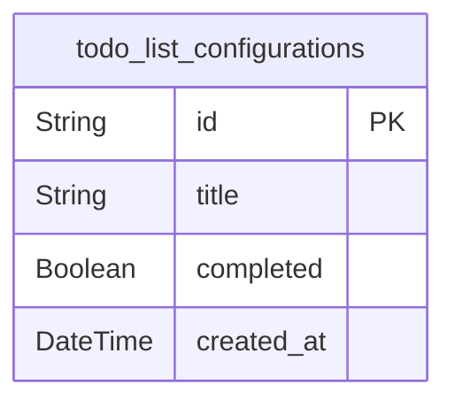
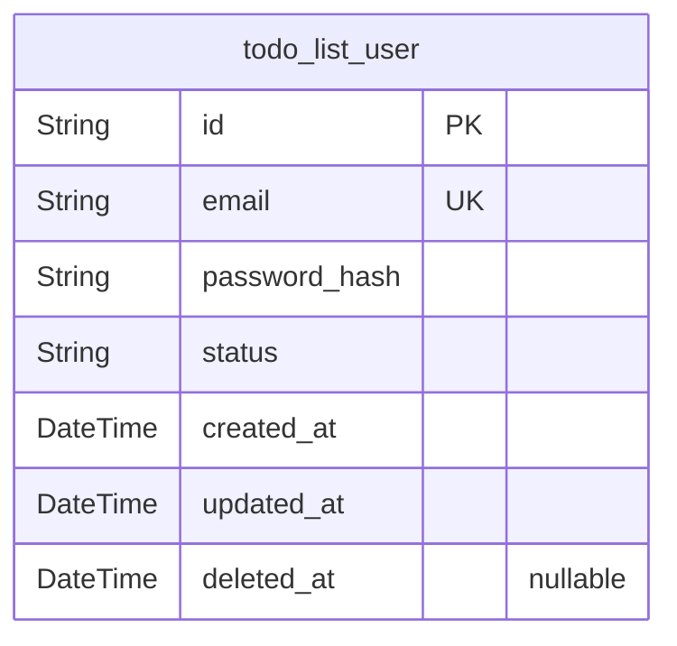
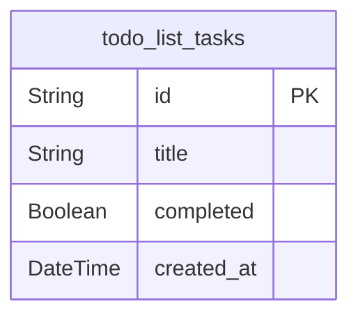

# Prisma Markdown

> Generated by [`prisma-markdown`](https://github.com/samchon/prisma-markdown)

- [Systematic](#systematic)
- [Actors](#actors)
- [Tasks](#tasks)

## Systematic

### `todo_list_configurations`

System configuration entity that defines foundational application
settings and behavior for the todo list application. This table stores
critical system parameters that control the application's operation and
user experience. Users directly manage these configurations through the
interface.

Properties as follows:

- `id`: Primary Key.
- `title`
  > Configuration title that describes the purpose of this setting.
  > Represents the human-readable identifier for the configuration.
- `completed`
  > Indicates whether the configuration is active or pending. True means the
  > configuration is complete and enabled, false means it's inactive or in
  > draft state.
- `created_at`
  > Timestamp when this configuration was created. Used for audit trails and
  > chronological ordering.

## Actors

### `todo_list_user`

User identity and authentication information, but not a person but a
**connection** basis. This entity represents users across the system,
including their authentication details and basic profile information.
Used for all user-related operations including login, profile management,
and access control.

Properties as follows:

- `id`: Primary Key.
- `email`: User's email address for login and notifications.
- `password_hash`
  > Securely hashed password for authentication. Never store plain text
  > passwords.
- `status`
  > User's current status (e.g., active, suspended, pending). Used for access
  > control and workflow.
- `created_at`: Timestamp when the user account was created.
- `updated_at`: Timestamp when the user account was last updated.
- `deleted_at`
  > Timestamp when the user account was soft-deleted. Null indicates active
  > account.

## Tasks

### `todo_list_tasks`

Main entity representing individual todo items. Each task has a unique
identifier, a title for user identification, a boolean status to track
completion, and a timestamp for when it was created. This model serves as
the primary business entity for task management, supporting all core
operations including creation, completion, and persistence across
sessions.

Properties as follows:

- `id`: Primary Key.
- `title`
  > Task title as entered by the user. Represents the primary identifier of
  > the task in the user interface.
- `completed`
  > Current completion status of the task. Indicates whether the task has
  > been completed by the user.
- `created_at`
  > Timestamp when the task was created. Used for sorting tasks by creation
  > order and provides audit trail for task management.
