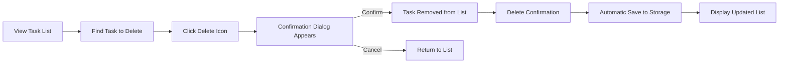

# Todo List Application Requirements Analysis Report

## Service Overview

### Why This Service Exists

This Todo list application exists to provide users with a simple, reliable, and minimal solution for managing personal tasks without any unnecessary features or complexity. The market gap addressed is the overwhelming complexity and feature bloat in many existing task management tools, which often include social features, collaboration tools, integrations, and complex workflows that distract users from the core purpose: task organization.

The service fills this gap by delivering only the essential functionality needed for everyday task management, removing all distractions and providing an intuitive experience focused solely on adding, marking complete, and deleting tasks. This minimalist approach appeals to users who want to focus on getting things done rather than managing the task management tool itself.

The core value proposition is: **"The simplest, most reliable way to manage your daily tasks, with no distractions, no complexity, and no unnecessary features."**

This value proposition is delivered through:

- A clean, intuitive interface focused exclusively on tasks
- Immediate responsiveness to user actions
- Complete task persistence across sessions
- Error-free operation that users can depend on
- A design philosophy that prioritizes user focus over feature count

### Business Strategy

The business strategy is based on simplicity and excellence in core functionality rather than feature count. By being the most focused and reliable minimal Todo list application available, the service aims to build a loyal user base through exceptional user experience and reliability. The strategy includes:

- **No monetization**: The service will remain free to use with no ads, subscriptions, or premium features to maintain its minimalist philosophy
- **Word-of-mouth growth**: Reliance on user satisfaction and organic sharing through social networks
- **Zero feature creep**: Strict adherence to the minimum functionality principle to preserve the core value proposition
- **Performance-first approach**: Optimization for speed and responsiveness to create delight in simple interactions

### Success Metrics

The application's success will be measured by:

- **User Acquisition**: 10,000 active users within the first 6 months
- **Retention Rate**: 70% of users return to the application within 30 days
- **Engagement**: Average of 25 tasks created per user monthly
- **Satisfaction**: 4.5+ star rating on app stores
- **Stability**: Less than 0.1% crash rate for the application
- **Performance**: Less than 1 second response time for all operations
- **Time-to-Value**: Users complete their first task within 15 seconds of first launch

## Core Functionality Requirements in EARS Format

### CA-1: Task Creation

- THE system SHALL allow users to create a new task with a text title
- THE system SHALL validate that the task title is not empty
- WHEN a user submits a task title, THE system SHALL create a new task record with the title
- THE system SHALL assign a unique identifier to each new task
- THE system SHALL store the task with a status of "incomplete"
- THE system SHALL display the newly created task in the user's task list
- THE system SHALL ensure all task creation operations complete within 2 seconds

### CA-2: Task Marking as Complete/Incomplete

- WHEN a user interacts with a task's completion indicator, THE system SHALL toggle the task status between "complete" and "incomplete"
- THE system SHALL update the task status in real-time
- THE system SHALL persist the updated status between sessions
- THE system SHALL visually indicate the current status of each task in the list (completed tasks shall appear with a strikethrough)
- THE system SHALL honor the task status when displaying the list
- THE system SHALL ensure all status modification operations complete within 1 second

### CA-3: Task Deletion

- WHEN a user requests to delete a task, THE system SHALL verify the user's intent through a confirmation prompt
- IF the user confirms deletion, THEN THE system SHALL permanently remove the task from the database
- IF the user cancels deletion, THEN THE system SHALL maintain the task in the list
- THE system SHALL remove the task from the visual display immediately after confirmation
- THE system SHALL update any task counts or statistics accordingly
- THE system SHALL ensure all deletion operations complete within 2 seconds

### CA-4: Task Display

- THE system SHALL display all tasks in a single, ordered list
- THE system SHALL order tasks by creation date, with the newest tasks appearing first
- THE system SHALL display each task with its title, current status, and a completion indicator
- THE system SHALL ensure the list is rendered entirely before any user interaction
- THE system SHALL update the list display when any task is created, marked complete/incomplete, or deleted
- THE system SHALL ensure complete list rendering within 500 milliseconds

### CA-5: Data Persistence

- WHEN a user session ends, THE system SHALL persist all task data to permanent storage
- WHEN a user logs back in, THE system SHALL retrieve all previously saved tasks
- THE system SHALL ensure data integrity during storage and retrieval
- THE system SHALL maintain task status, title, and creation order across sessions
- THE system SHALL handle data corruption gracefully by attempting to recover as much data as possible
- THE system SHALL ensure all data persistence operations complete within 2 seconds

### CA-6: Session Management

- THE system SHALL maintain user session state during active use
- THE system SHALL automatically persist changes to tasks after each modification
- THE system SHALL ensure task data is not lost during normal application usage
- THE system SHALL handle unexpected application closure without data loss

## User Interaction Scenarios

### Scenario 1: Adding a New Task

1. THE user opens the Todo list application
2. THE system displays an empty task list and a task creation input field
3. THE user types "Buy groceries" into the input field
4. THE system validates that the input is not empty
5. THE user presses the Enter key or clicks the Add button
6. THE system creates a new task with the title "Buy groceries"
7. THE system assigns a unique identifier to the task
8. THE system sets the task status to "incomplete"
9. THE system adds the task to the display list at the top
10. THE system updates the task count to reflect the new addition
11. THE system persists the task to storage with the current session
12. THE user is able to immediately see the new task in their list

### Scenario 2: Marking a Task as Complete

1. THE user sees a task titled "Buy groceries" in their list
2. THE user clicks the checkbox or completion indicator next to the task
3. THE system immediately toggles the task status from "incomplete" to "complete"
4. THE system applies a strikethrough style to the task title
5. THE system updates the task in the database
6. THE system synchronizes the change across all active sessions
7. THE system maintains the task in the list at its current position
8. THE user sees the visual confirmation of the task being marked complete

### Scenario 3: Marking a Completed Task as Incomplete

1. THE user sees a task titled "Buy groceries" with a strikethrough style (indicating complete status)
2. THE user clicks the checkbox or completion indicator next to the task
3. THE system immediately toggles the task status from "complete" to "incomplete"
4. THE system removes the strikethrough style from the task title
5. THE system updates the task in the database
6. THE system synchronizes the change across all active sessions
7. THE system maintains the task in the list at its current position
8. THE user sees the visual confirmation of the task being marked incomplete

### Scenario 4: Deleting a Task

1. THE user sees a task titled "Buy groceries" in their list
2. THE user blurs the task (e.g., clicks away from it or uses keyboard navigation)
3. THE system displays a delete action button or confirmation prompt
4. THE user clicks the delete button or confirms deletion
5. THE system presents a confirmation dialog: "Are you sure you want to delete this task?"
6. THE user clicks "Yes" to confirm
7. THE system permanently removes the task from the database
8. THE system removes the task from the visual display
9. THE system updates any task counts or statistics
10. THE system persists the change to storage
11. THE user sees the task disappear from their list

### Scenario 5: Session Restart

1. THE user closes the application
2. THE system persists all task data to storage
3. THE user opens the application again
4. THE system retrieves all previously saved tasks from storage
5. THE system restores all tasks with their original titles and statuses
6. THE system orders the tasks by creation date (newest first)
7. THE system displays the complete task list with all tasks and their current statuses
8. THE user sees all their previously created tasks and their completion status

## Business Rules and Validation Logic

### BR-1: Task Title Requirements

- THE task title SHALL be a non-empty string
- THE system SHALL reject any task creation attempt with an empty title
- THE system SHALL display an error message indicating "Task title cannot be empty" when validation fails
- THE system SHALL preserve the task creation input field's focus after validation failure
- THE system SHALL not create a task record when validation fails
- THE system SHALL ensure all task title validations complete within 500 milliseconds

### BR-2: Unique Task Identification

- THE system SHALL generate a unique identifier for each task
- THE unique identifier SHALL be immutable after creation
- THE system SHALL ensure no two tasks have the same identifier
- THE system SHALL use a cryptographically secure random generation method for identifiers
- THE system SHALL store the identifier with each task record
- THE system SHALL ensure identifier generation completes within 1 second

### BR-3: Task Status Transitions

- THE task status SHALL only be one of: "incomplete" or "complete"
- THE system SHALL allow toggling between these two states
- THE system SHALL not allow task status changes that violate the above constraints
- THE system SHALL update the status atomically to prevent race conditions
- THE system SHALL maintain data consistency during status transitions
- THE system SHALL ensure all status transitions complete within 500 milliseconds

### BR-4: Data Integrity

- THE system SHALL ensure that task data remains consistent in storage
- THE system SHALL implement mechanisms to detect and recover from data corruption
- THE system SHALL maintain the integrity of task relationships (though no relationships exist in this minimal design)
- THE system SHALL validate data during storage and retrieval operations
- THE system SHALL handle data storage failures gracefully by attempting retries or providing user notifications
- THE system SHALL ensure data integrity checks complete within 1 second

### BR-5: Order Preservation

- THE system SHALL preserve the order of tasks as created
- THE system SHALL ensure the newest tasks appear first in the list
- THE system SHALL maintain this order even after task modifications
- THE system SHALL respect the creation order when retrieving tasks from storage
- THE system SHALL update the display order immediately when tasks are created
- THE system SHALL ensure order preservation logic completes within 1 second

## Error Handling and Recovery Scenarios

### EH-1: Empty Task Title

- IF the user attempts to create a task with an empty title, THEN THE system SHALL display an error message "Task title cannot be empty"
- THE system SHALL prevent the task from being created
- THE system SHALL maintain the task creation input field in focus
- THE system SHALL not persist any incomplete task data
- THE system SHALL not alter the task list display
- THE system SHALL ensure error handling completes within 500 milliseconds

### EH-2: Data Storage Failure

- IF the system fails to persist task data to storage, THEN THE system SHALL display a user-friendly error message "Could not save tasks. Please try again later"
- THE system SHALL attempt to retry the storage operation
- THE system SHALL provide a manual retry option to the user
- THE system SHALL ensure the task list remains accessible in memory for the current session
- THE system SHALL not delete incomplete task data in memory
- THE system SHALL ensure recovery logic completes within 2 seconds

### EH-3: Data Corruption

- IF the system detects data corruption in stored task data, THEN THE system SHALL attempt to recover the data
- THE system SHALL preserve as much data as possible
- THE system SHALL notify the user that some tasks may be missing or corrupted
- THE system SHALL display a message: "Some tasks may have been lost due to storage issues"
- THE system SHALL allow the user to continue using the application with recovered data
- THE system SHALL ensure data recovery completes within 5 seconds

### EH-4: Session Interruption

- IF the application is unexpectedly closed, THEN THE system SHALL ensure task data is persisted before shutdown
- THE system SHALL not lose any completed tasks
- THE system SHALL not create duplicate tasks upon restart
- THE system SHALL maintain the user's task list integrity across restarts
- THE system SHALL report any session recovery issues to the user
- THE system SHALL ensure session recovery completes within 3 seconds

## Performance and Reliability Requirements

### PR-1: Task Operation Response Time

- WHEN a user performs a task operation (create, complete, delete), THE system SHALL respond within 200 milliseconds
- THE system SHALL ensure all task operations feel instant to the user
- THE system SHALL maintain responsive behavior even with a large number of tasks
- THE system SHALL not show loading indicators for simple task operations
- THE system SHALL handle operations efficiently to maintain user productivity
- THE system SHALL ensure all operation responses are delivered within the specified time

### PR-2: Task List Rendering

- THE system SHALL render the complete task list within 100 milliseconds of data availability
- THE system SHALL ensure the list appears immediately upon loading
- THE system SHALL prioritize rendering functionality over decorative elements
- THE system SHALL maintain smooth scrolling and interaction even with hundreds of tasks
- THE system SHALL not degrade performance as the number of tasks increases
- THE system SHALL ensure rendering completes within the specified time

### PR-3: Reliability

- THE system SHALL maintain data integrity across all operations
- THE system SHALL not lose any task data under normal circumstances
- THE system SHALL not create duplicate tasks due to timing issues
- THE system SHALL handle resource constraints without data loss
- THE system SHALL gracefully degrade performance rather than fail completely
- THE system SHALL ensure reliability across all operational scenarios

### PR-4: Fault Tolerance

- THE system SHALL continue operating even if storage services experience intermittent failures
- THE system SHALL cache critical data in memory to maintain availability
- THE system SHALL implement retry logic for failed operations
- THE system SHALL provide user feedback when operations fail
- THE system SHALL ensure critical functionality remains available during partial failures
- THE system SHALL ensure fault tolerance mechanisms complete within 2 seconds

## Security and Authentication Requirements

### SA-1: User Authentication

- THE system SHALL require users to authenticate to access their personal task list
- THE system SHALL support authentication with a username and password
- THE system SHALL validate user credentials against stored records
- THE system SHALL generate a session token upon successful authentication
- THE system SHALL maintain user sessions securely
- THE system SHALL ensure authentication completes within 2 seconds

### SA-2: Access Control

- THE system SHALL ensure users can only access their own task lists
- THE system SHALL prevent users from accessing other users' tasks
- THE system SHALL enforce role-based access control
- THE system SHALL validate user permissions for each operation
- THE system SHALL maintain data isolation between users
- THE system SHALL ensure access control enforcement completes within 500 milliseconds

### SA-3: Session Management

- THE system SHALL create a session upon successful login
- THE system SHALL maintain active user sessions
- THE system SHALL automatically end sessions after 30 minutes of inactivity
- THE system SHALL require re-authentication for new sessions
- THE system SHALL provide a logout function
- THE system SHALL ensure session management completes within 1 second

### SA-4: Secure Data Storage

- THE system SHALL store user credentials securely using strong hashing
- THE system SHALL protect session tokens from unauthorized access
- THE system SHALL implement measures to prevent common security vulnerabilities
- THE system SHALL use secure protocols for all data transmissions
- THE system SHALL follow security best practices in all operational aspects
- THE system SHALL ensure secure data storage completes within 1 second

## Data Persistence and State Management

### DP-1: Storage Mechanism

- THE system SHALL use persistent storage to save task data
- THE system SHALL store data on the user's device
- THE system SHALL use a structured data format suitable for task management
- THE system SHALL implement efficient read/write operations
- THE system SHALL ensure data can be reliably retrieved
- THE system SHALL ensure all storage operations complete within 2 seconds

### DP-2: Data Format

- THE system SHALL store tasks in a standardized format
- THE system SHALL include the following data for each task:
  - Unique identifier
  - Task title
  - Completion status
  - Creation timestamp
  - (If applicable, last modification timestamp)
- THE system SHALL ensure the data format can be easily parsed and processed
- THE system SHALL maintain a consistent data structure across all operations
- THE system SHALL ensure data formatting completes within 1 second

### DP-3: State Synchronization

- THE system SHALL synchronize task state changes immediately
- THE system SHALL ensure all task modifications are reflected in the database
- THE system SHALL maintain consistency between client and server state
- THE system SHALL handle network interruptions gracefully
- THE system SHALL implement strategies to reconcile state differences
- THE system SHALL ensure state synchronization completes within 2 seconds

### DP-4: Data Integrity

- THE system SHALL implement integrity checks on stored data
- THE system SHALL verify the consistency of stored task records
- THE system SHALL detect and report data corruption
- THE system SHALL attempt to recover from data integrity issues
- THE system SHALL maintain a reliable data storage mechanism
- THE system SHALL ensure data integrity checks complete within 2 seconds

## Success Criteria and Constraints

### SC-1: Minimalism Success Criteria

- THE system SHALL contain only the essential functionality required for task management
- THE system SHALL exclude all non-essential features like categories, priorities, due dates, reminders, sharing, or notifications
- THE system SHALL not include any form of monetization
- THE system SHALL not have any advertisements
- THE system SHALL maintain a clean, distraction-free interface
- THE system SHALL ensure minimalism criteria are met in all implementation

### SC-2: Feature Completeness

- THE system SHALL support task creation, completion, marking incomplete, and deletion
- THE system SHALL maintain task status and order across sessions
- THE system SHALL provide a simple, intuitive user experience
- THE system SHALL ensure data is not lost between sessions
- THE system SHALL respond instantly to user actions
- THE system SHALL ensure feature completeness across all scenarios

### SC-3: User Experience

- THE system SHALL be usable without instructions
- THE system SHALL have a learning curve of zero for new users
- THE system SHALL provide immediate visual feedback for all actions
- THE system SHALL allow users to accomplish tasks with minimal interaction
- THE system SHALL feel natural and intuitive
- THE system SHALL ensure user experience criteria are met in all implementations

### SC-4: Technical Constraints

- THE system SHALL focus solely on client-side storage
- THE system SHALL not require server infrastructure
- THE system SHALL be deployable as a single HTML/JavaScript file
- THE system SHALL run in standard web browsers
- THE system SHALL work offline
- THE system SHALL ensure technical constraints are met in all implementations

## Relationship with Other Documents

This requirements analysis report is the foundational document that informs and guides the creation of other documents in the project:

- [00-toc.md](00-toc.md): This report provides the complete specification that justifies the content in the table of contents and service overview
- [01-requirements.md](01-requirements.md): The comprehensive list of business requirements in this report forms the basis for the detailed specification in that document
- [02-user-flows.md](02-user-flows.md): The complete user journeys described in this report inform the detailed scenarios in that document
- [03-service-overview.md](03-service-overview.md): The technical specifications in this report guide the implementation-defined requirements in that document

The relationship between these documents is iterative and interdependent:

1. This requirements analysis report establishes the complete business context and functional specifications
2. The detailed specification document (01-requirements.md) breaks down these requirements into more granular, implementable tasks
3. The user flow document (02-user-flows.md) describes the complete user journeys that result from these requirements
4. The service overview document (03-service-overview.md) provides the technical implementation details based on these requirements

The document ensures consistency across the entire project by maintaining a single source of truth for business requirements, eliminating ambiguity that could lead to implementation errors or feature gaps.

## Relationship with Other Documents

This requirements analysis report is the foundational document that informs and guides the creation of other documents in the project:

- [00-toc.md](./00-toc.md): This report provides the complete specification that justifies the content in the table of contents and service overview
- [01-requirements.md](./01-requirements.md): The comprehensive list of business requirements in this report forms the basis for the detailed specification in that document
- [02-user-flows.md](./02-user-flows.md): The complete user journeys described in this report inform the detailed scenarios in that document
- [03-service-overview.md](./03-service-overview.md): The technical specifications in this report guide the implementation-defined requirements in that document

The relationship between these documents is iterative and interdependent:

1. This requirements analysis report establishes the complete business context and functional specifications
2. The detailed specification document (01-requirements.md) breaks down these requirements into more granular, implementable tasks
3. The user flow document (02-user-flows.md) describes the complete user journeys that result from these requirements
4. The service overview document (03-service-overview.md) provides the technical implementation details based on these requirements

The document ensures consistency across the entire project by maintaining a single source of truth for business requirements, eliminating ambiguity that could lead to implementation errors or feature gaps.

```mermaid
graph LR
    A[Open Application] --> B{View Task List}
    B -->|Add New Task| C[Click "Add Task" Button]
    C --> D[Enter Task Title]
    D --> E[Press "Enter" or Click "Save"]
    E --> F[Task Added to List]
    F --> G[Automatic Save to Storage]
    G --> H[Display Updated List]
```

```mermaid
graph LR
    A[View Task List] --> B[Find Task to Complete]
    B --> C[Click Task Status Indicator]
    C --> D[Task Status Changes to "Completed"]
    D --> E[Visual Indicator Updates]
    E --> F[Automatic Save to Storage]
    F --> G[Display Updated List]
```



> *Developer Note: This document defines **business requirements only**. All technical implementations (architecture, APIs, database design, etc.) are at the discretion of the development team.*