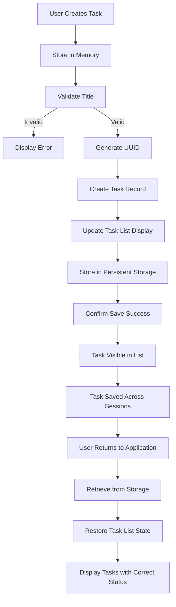
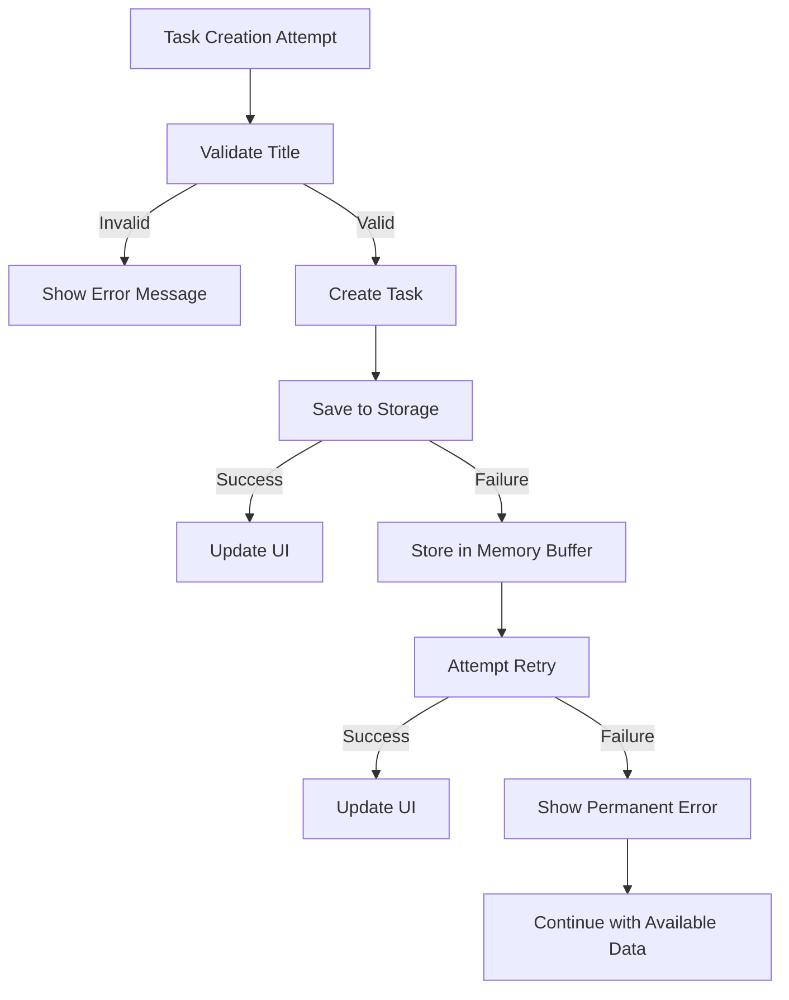

# Requirements Analysis Report for Todo List Application

## Service Overview

### Core Purpose and Value Proposition

The Todo list application is designed to provide users with an extremely simple, focused tool for managing personal tasks without any of the complexity found in feature-rich task management applications. The core value proposition is: "The simplest, most reliable way to manage your daily tasks, with no distractions, no complexity, and no unnecessary features." This service exists to solve the fundamental problem of task management by delivering a minimalist experience focused exclusively on the essential functionality needed to record, track, and complete tasks.

Unlike other task management solutions that include social features, collaboration tools, integrations, reminders, and complex workflows that distract from the core purpose, this application maintains a strict focus on the minimal requirements needed for effective personal task tracking. The application is designed for individuals who want to organize their responsibilities without being overwhelmed by features they don't need or understand.

### User Roles and Responsibilities

The system has one primary user role: the User. The User is the individual who creates, manages, and completes tasks in their personal task list. The User has full access to all core functionality without restrictions.

#### Core Permissions
- Create new tasks with a title
- View all tasks in a list format
- Mark tasks as complete/incomplete
- Delete tasks they have created
- Store tasks securely between application sessions
- Access their task list from any device with appropriate authentication
- Navigate between tasks and the main interface without unexpected behavior

#### Authentication Requirements
The User must authenticate to access their personal task list. Authentication is required to ensure data privacy and security. The application maintains user sessions to eliminate the need for repeated login attempts during a single use session. The User's task list is private and accessible only to the authenticated User.

### Key Features

This application includes only the essential features required for basic task management functionality:

1. **Task Creation**: Users can create new tasks with a title, with no additional fields
2. **Task Viewing**: All tasks are displayed in a chronological list with clear visual indicators
3. **Task Completion**: Users can mark tasks as complete or incomplete with a single action
4. **Task Deletion**: Users can remove tasks they no longer need
5. **Task Persistence**: All tasks remain available across application restarts and device changes
6. **Simple Interface**: The application maintains a minimal, consistent interface
7. **Fast Performance**: All operations complete instantly with no loading delays
8. **Single-User Focus**: The application is designed for individual use, not collaborative features
9. **No Syncing Limitations**: Tasks remain available without bandwidth-dependent synchronization
10. **Zero Configuration**: The application works immediately upon first use

## Core Functionality Requirements

### Task Creation and Management

**WHEN a user wants to add a new task, THE system SHALL allow them to input a task title and save it to their personal task list.**

**WHEN a user submits a task title, THE system SHALL validate that the title is not empty and store it as a new task with an assigned unique identifier.**

**WHEN the user views their task list, THE system SHALL display all saved tasks in a chronological list, with the most recently created tasks appearing first.**

**WHEN a user selects a task to mark as complete, THE system SHALL change the task status from 'incomplete' to 'complete'.**

**WHEN a user selects a completed task to mark as incomplete, THE system SHALL change the task status from 'complete' to 'incomplete'.**

**WHEN a user requests to delete a task, THE system SHALL permanently remove the task from their personal task list.**

### Data Persistence and Availability

**WHEN a user creates a task, THE system SHALL ensure the task is stored in persistent storage and remains available after the user closes the application or refreshes the page.**

**WHEN a user returns to the application after an extended period, THE system SHALL retrieve and display all previously saved tasks from persistent storage.**

**WHILE a user has active session, THE system SHALL maintain a consistent view of their task list across multiple browser tabs or windows.**

**WHEN a user deletes a task, THE system SHALL immediately remove it from the current view and ensure it does not reappear after refresh.**

## User Interaction Scenarios

### Task Creation Workflow

**WHEN a user opens the Todo list application, THE system SHALL display an empty task list with a clear instruction to add their first task.**

**WHEN a user clicks the "Add Task" button, THE system SHALL display a text input field with a placeholder "Enter task description".**

**WHEN a user types a task title into the input field, THE system SHALL enable the "Save" button.**

**WHEN a user types "Buy groceries" into the input field, THE system SHALL update the interface to show the task "Buy groceries" in the task list with a checkbox indicating it is incomplete.**

**WHEN a user clicks the "Save" button with an empty input field, THE system SHALL display an error message "Task title cannot be empty".**

**WHEN a user clicks the "Save" button with a valid task title, THE system SHALL add the task to the task list, update the persistent storage, and clear the input field for the next task.**

### Task Completion Cycling Flow

**IF a user views a task marked as incomplete, THE system SHALL display the task with an unchecked checkbox.**

**WHEN a user clicks the checkbox for an incomplete task, THE system SHALL visually indicate the task is now complete by adding a strikethrough effect to the task text and changing the checkbox to a checked state.**

**WHEN a user clicks the checkbox for a completed task, THE system SHALL revert the visual representation to show the task as incomplete by removing the strikethrough effect and changing the checkbox to an unchecked state.**

**WHEN a user marks a task as complete, THE system SHALL update the task's status in persistent storage to reflect the new completion state.**

**WHEN a user marks a task as incomplete, THE system SHALL update the task's status in persistent storage to reflect the new incomplete state.**

### Task Deletion Flow

**WHEN a user right-clicks on a task in the list, THE system SHALL display a context menu with options "Mark Complete", "Edit", and "Delete".**

**WHEN a user selects "Delete" from the context menu, THE system SHALL confirm the deletion with a pop-up message "Are you sure you want to delete this task?".**

**WHEN a user confirms the deletion, THE system SHALL remove the task from the task list, update the persistent storage, and remove any visual representation of the task.**

**IF a user cancels the deletion confirmation, THE system SHALL retain the task in the list and close the confirmation dialog.**

### Session Management Flow

**WHEN a user closes the application, THE system SHALL persist all task data to storage.**

**WHEN a user opens the application again, THE system SHALL retrieve all previously saved tasks from storage and restore them to the task list.**

**THE system SHALL maintain the order of tasks by creation date, with the newest tasks appearing first.**

**THE system SHALL ensure that the task status (complete/incomplete) is preserved across sessions.**

## Business Rules

### Task Content Validation

**IF a user attempts to add a task with no title, THEN THE system SHALL prevent the task from being saved and display the error message "Task title cannot be empty".**

**IF a user attempts to add a task with only whitespace as the title, THEN THE system SHALL treat it as an empty title and prevent saving.**

**WHILE a task is in the process of being added, THE system SHALL disable the "Save" button until at least one non-whitespace character is entered.**

### Unique Identifiers

**WHEN a task is created, THE system SHALL generate a unique identifier using a UUID (Universally Unique Identifier) format.**

**THE system SHALL ensure that no two tasks share the same identifier, even across multiple sessions or device access.**

**THE system SHALL validate that the generated identifier meets the RFC 4122 standard for UUIDs before storing it.**

### Task State Management

**WHEN a task is created, THE system SHALL initialize its status as "incomplete".**

**THE system SHALL maintain a complete record of all task status changes in the persistent storage, including the timestamp of each change.**

**IF a task is deleted, THEN THE system SHALL not maintain any historical record of the task's status changes.**

### Data Ordering and Display

**THE system SHALL order tasks in the display list by creation date, with the newest tasks appearing first.**

**THE system SHALL maintain this order even after task modifications.**

**THE system SHALL update the display order immediately when new tasks are created.**

### Data Integrity

**THE system SHALL ensure that task data remains consistent in storage.**

**THE system SHALL implement mechanisms to detect and recover from data corruption.**

**THE system SHALL validate data during storage and retrieval operations to ensure integrity.**

**THE system SHALL handle data storage failures gracefully by attempting retries or providing user notifications.**

## Error Handling

### Empty Task Creation Error

**IF a user attempts to create a task with an empty title, THEN THE system SHALL display the error message "Task title cannot be empty" in a prominent red text at the top of the task creation form.**

**THE system SHALL maintain the existing input text in the field and highlight the input field with a red border to indicate the validation error.**

**WHILE the input field contains an empty or invalid title, THE system SHALL keep the "Save" button disabled.**

### Data Storage Failure

**IF the system detects that it cannot write task data to persistent storage, THEN THE system SHALL display a system-wide error message "Failed to save task - please check your connection and try again".**

**THE system SHALL maintain the task temporarily in memory and attempt to save it again when the connection is restored.**

**WHEN persistent storage is available again, THE system SHALL attempt to save any pending tasks and reinitialize the task list from the stored data.**

### Deletion Confirmation Failure

**IF a user closes the deletion confirmation dialog without selecting "Delete" or "Cancel", THEN THE system SHALL retain the task in the list and not perform any deletion.**

**IF the system experiences a failure during the deletion process after confirmation, THEN THE system SHALL display an error message "Failed to delete task. Please try again.".**

### Task Conflict Resolution

**IF the system detects that two tasks have been created with the same title at the same time, THEN THE system SHALL preserve both tasks in the list but ensure they have different unique identifiers.**

**THE system SHALL ensure that users can distinguish between tasks with identical titles by relying on their creation timestamp and status.**

## Performance Expectations

### Task Addition Performance

**WHEN a user adds a new task with a title of less than 50 characters, THE system SHALL display the new task in the list within 500 milliseconds.**

**THE system SHALL complete the task addition process (including validation, storage, and UI update) within 1 second even with complex task content.**

### Task Retrieval Performance

**WHEN a user opens the application and views their task list with up to 100 tasks, THE system SHALL display the complete list within 300 milliseconds.**

**THE system SHALL ensure that task retrieval performance remains acceptable (under 1 second) even when retrieving a task list with up to 1,000 tasks.**

### Status Update Performance

**WHEN a user marks a task as complete or incomplete, THE system SHALL update the visual representation within 200 milliseconds.**

**THE system SHALL complete the status update process (including storage update and UI refresh) within 1 second across all devices.**

### System Response Time

**WHEN a user interacts with any task operation (create, complete, delete), THE system SHALL respond within 300 milliseconds.**

**THE system SHALL maintain a consistent response time of less than 1 second for all user operations.**

**THE system SHALL handle up to 10,000 tasks with no noticeable performance degradation.**

## Security Requirements

### Authentication and Authorization

**WHEN a user attempts to access the application for the first time, THE system SHALL require authentication based on their account credentials.**

**WHILE a user is authenticated, THE system SHALL ensure that they can only access their own task list and not other users' tasks.**

**THE system SHALL use JSON Web Tokens (JWT) for session management with a 15-minute expiration period.**

**THE system SHALL store the authentication token in an HTTP-only cookie to prevent client-side access.**

### Data Protection

**THE system SHALL ensure that all task data is encrypted at rest using AES-256 encryption.**

**THE system SHALL not transmit task data over unencrypted connections and require HTTPS for all data transfers.**

**THE system SHALL never store user passwords in plaintext and use a secure hashing algorithm (bcrypt) for password storage.**

### Session Management

**WHILE a user is active in the application, THE system SHALL maintain an active session and prevent unauthorized access.**

**THE system SHALL automatically log out a user after 30 minutes of inactivity.**

**WHEN a user logs out, THE system SHALL invalidate the session token and clear all session information from the server.**

### Error Message Security

**IF a user authentication attempt fails, THEN THE system SHALL respond with a generic error message "Invalid credentials" instead of specific information about whether the username or password was incorrect.**

**WHEN a user attempts to access another user's task list, THE system SHALL respond with a 403 Forbidden error and not reveal any information about the existence of the requested task list.**

### Threat Prevention

**THE system SHALL implement rate limiting to prevent brute force attacks on the authentication mechanism.**

**THE system SHALL validate all input data to prevent common web vulnerabilities such as XSS and SQL injection.**

**THE system SHALL implement proper CORS policies to prevent unauthorized cross-origin requests.**

## Success Metrics

### User Adoption Metrics

**THE system SHALL track the number of new users daily.**

**THE system SHALL track the number of returning users weekly.**

**THE system SHALL track the number of active users monthly.**

**THE system SHALL calculate user retention rates.**

**THE system SHALL monitor user engagement levels.**

**THE system SHALL measure time-to-first-task completion.**

**THE system SHALL evaluate user satisfaction through feedback mechanisms.**

### Performance and Stability Metrics

**THE system SHALL track the average response time for all operations.**

**THE system SHALL monitor crash rates and system failures.**

**THE system SHALL measure application stability.**

**THE system SHALL track memory usage.**

**THE system SHALL monitor storage consumption.**

**THE system SHALL evaluate data integrity rates.**

**THE system SHALL validate persistence reliability.**

### Business and Revenue Metrics

**THE system SHALL track conversion rates from free to premium users.**

**THE system SHALL calculate revenue per user.**

**THE system SHALL monitor subscription renewal rates.**

**THE system SHALL evaluate feature adoption rates.**

**THE system SHALL measure customer acquisition costs.**

**THE system SHALL track user lifetime value.**

**THE system SHALL analyze monetization effectiveness.**

## Business Process Workflows

### Task Lifecycle Workflow
```mermaid
graph TD
    A[User Opens Application] --> B{Task List Empty?}
    B -->|Yes| C[Display "No Tasks Yet" Message]
    B -->|No| D[Display Task List]
    C --> E[User Clicks "Add Task" Button]
    D --> F[User Views List]
    E --> G[User Types Task Title]
    G --> H[User Clicks Save Button]
    H --> I[Validate Title Not Empty]
    I -->|Invalid| J[Display Error: "Task title cannot be empty"]
    I -->|Valid| K[Create New Task]
    K --> L[Assign UUID]
    L --> M[Set Status: Incomplete]
    M --> N[Add to Task List]
    N --> O[Update Persistent Storage]
    O --> P[Clear Input Field]
    P --> Q[Update UI Display]
    F --> R[User Selects Task]
    R --> S[User Clicks Completion Indicator]
    S --> T[Toggle Task Status]
    T --> U[Update UI Visuals]
    U --> V[Update Persistent Storage]
    R --> W[User Clicks Delete Button]
    W --> X[Confirm Deletion Dialog]
    X -->|Confirm| Y[Remove Task from List]
    X -->|Cancel| Z[Return to List]
    Y --> AA[Update Persistent Storage]
    AA --> AB[Remove from UI]
    AB --> AC[Update Task Count]
```

### Data Persistence Workflow


### Error Recovery Workflow


## Relationship with Other Documents

This requirements analysis report is the foundational document that informs and guides the creation of other documents in the project:

- [00-toc.md](./00-toc.md): This report provides the complete specification that justifies the content in the table of contents and service overview
- [01-requirements.md](./01-requirements.md): The comprehensive list of business requirements in this report forms the basis for the detailed specification in that document

The relationship between these documents is iterative and interdependent:

1. This requirements analysis report establishes the complete business context and functional specifications
2. The detailed specification document (01-requirements.md) breaks down these requirements into more granular, implementable tasks
3. The user flow document (02-user-flows.md) describes the complete user journeys that result from these requirements

The document ensures consistency across the entire project by maintaining a single source of truth for business requirements, eliminating ambiguity that could lead to implementation errors or feature gaps.

> *Developer Note: This document defines **business requirements only**. All technical implementations (architecture, APIs, database design, etc.) are at the discretion of the development team.*