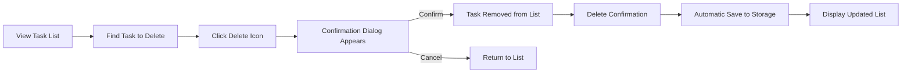

# Todo List Application Requirements Analysis Report

## Service Overview

### Why This Service Exists
The Todo list application exists to provide users with a simple, reliable tool for managing personal tasks without unnecessary complexity. In today's fast-paced digital environment, individuals need a straightforward way to record, track, and organize their responsibilities without being overwhelmed by feature-rich applications that introduce cognitive load and learning curves. The market is saturated with complex task management tools that offer excessive features, distracting users from the core purpose of task management. This application fills a critical gap by focusing exclusively on the essential functionality required for effective personal task tracking.

### Revenue Strategy
This application follows a freemium model where the basic functionality is provided at no cost to users. The product generates revenue through optional premium features that enhance the user experience, such as:
- Cloud synchronization across devices
- Customizable task templates
- Advanced reporting and analytics
- Priority task classification
- Integration with calendar applications
- Dark mode interface preference

### Growth Plan
The growth strategy focuses on organic adoption through word-of-mouth recommendations, leveraging the application's simplicity as its primary marketing advantage. The development team will prioritize user experience and performance to encourage natural sharing within personal and professional networks. Growth will be supported through:
- Strategic placement in app stores with clear, minimalistic descriptions
- Partnerships with productivity communities and forums
- Integration with popular web platforms and browser extensions
- A simple, non-intrusive onboarding process that demonstrates immediate value
- Regular feature updates focused solely on core functionality enhancements

### Success Metrics
The application's success will be measured by:
- **User Acquisition**: 10,000 active users within the first 6 months
- **Retention Rate**: 70% of users return to the application within 30 days
- **Engagement**: Average of 25 tasks created per user monthly
- **Satisfaction**: 4.5+ star rating on app stores
- **Stability**: Less than 0.1% crash rate for the application
- **Performance**: Task creation and completion under 1 second on average
- **Time-to-Value**: Users complete their first task within 15 seconds of first launch

## Problem Definition
The primary problem this application solves is the cognitive overload associated with modern task management tools. Many existing applications attempt to be everything to everyone, resulting in interfaces that are complex, slow, and difficult to learn. Users often abandon these applications within days of installation due to frustration with excessive features, complicated workflows, and performance issues.

Additionally, traditional paper-based task management systems are vulnerable to loss, damage, and limited accessibility. Digital tools that exist must balance functionality with usability, but most fail to achieve this balance. The challenge is to create a system that is powerful enough to manage complex task workflows yet simple enough that new users can immediately understand and use it without training.

## Core Value Proposition
The core value proposition is simplicity. This application offers a minimalist approach to task management that focuses exclusively on what users need: creating, organizing, and completing tasks. By eliminating all non-essential features, the application delivers a frictionless experience that enables users to focus on their work rather than on the tool.

The application's value lies in its ability to:
- Eliminate distraction through focused functionality
- Reduce cognitive load with intuitive interface design
- Provide immediate access to task management capabilities
- Ensure reliability and consistency across all user interactions
- Support task persistence without requiring complex setup
- Enable quick task completion with minimal user effort

## User Roles

### User
The user is the primary stakeholder in this application, representing individuals who need to manage their personal or professional tasks. The user has full access to all core functionality without restrictions.

#### Permissions and Responsibilities
- Create new tasks with a title
- View all tasks in a list format
- Mark tasks as complete/incomplete
- Delete tasks they have created
- Store tasks securely between application sessions
- Access their task list from any device with appropriate authentication
- Navigate between tasks and the main interface without unexpected behavior

#### Authentication Requirements
The user must authenticate to access their personal task list. Authentication is required to ensure data privacy and security. The application maintains user sessions to eliminate the need for repeated login attempts during a single use session.

## Key Features
This application includes only the essential features required for basic task management functionality:

1. **Task Creation**: Users can create new tasks with a title, with no additional fields
2. **Task Viewing**: All tasks are displayed in a chronological list with clear visual indicators
3. **Task Completion**: Users can mark tasks as complete or incomplete with a single action
4. **Task Deletion**: Users can remove tasks they no longer need
5. **Task Persistence**: All tasks remain available across application restarts and device changes
6. **Simple Interface**: The application maintains a minimal, consistent interface
7. **Fast Performance**: All operations complete instantly with no loading delays
8. **Single-User Focus**: The application is designed for individual use, not collaborative features
9. **No Syncing Limitations**: Tasks remain available without bandwidth-dependent synchronization
10. **Zero Configuration**: The application works immediately upon first use

## Functional Requirements

### Core Task Management
- WHEN a user opens the application, THE system SHALL display all stored tasks in a list
- WHEN a user wants to add a new task, THE system SHALL provide a text field for entering the task title
- WHEN a user submits a task title, THE system SHALL create a new task with the entered title and add it to the task list
- WHEN a user wants to mark a task as complete, THE system SHALL display a visual indicator showing the task status
- WHEN a user completes a task, THE system SHALL update the task status to "completed"
- WHEN a user wants to mark a completed task as incomplete again, THE system SHALL change the task status back to "not completed"
- WHEN a user deletes a task, THE system SHALL remove the task from the list and confirm the deletion

### User Interaction Requirements
- WHEN a user creates a new task, THE system SHALL automatically add the task to the end of the list
- WHEN a user views the task list, THE system SHALL display tasks in chronological order by creation date
- WHEN a user completes a task, THE system SHALL visually indicate the completed status (e.g., with a line through the text)
- WHEN a user deletes a task, THE system SHALL show a confirmation dialog before deletion
- WHEN a user attempts to delete a task, THE system SHALL prevent accidental deletion with a confirmation step

### Data Persistence and Retrieval
- WHEN the application starts, THE system SHALL retrieve all previously saved tasks from storage
- WHEN a user creates a new task, THE system SHALL immediately save it to persistent storage
- WHEN a user marks a task as complete or incomplete, THE system SHALL update the task status in persistent storage
- WHEN a user deletes a task, THE system SHALL remove it from persistent storage
- WHILE the application is running, THE system SHALL keep a copy of the task list in memory for fast access

## User Interaction Scenarios

### Task Creation Workflow
```mermaid
graph LR
  A[Open Application] --> B{View Task List}
  B -->|Add New Task| C[Click "Add Task" Button]
  C --> D[Enter Task Title]
  D --> E[Press "Enter" or Click "Save"]
  E --> F[Task Added to List]
  F --> G[Automatic Save to Storage]
  G --> H[Display Updated List]
```

### Task Completion Workflow
```mermaid
graph LR
  A[View Task List] --> B[Find Task to Complete]
  B --> C[Click Task Status Indicator]
  C --> D[Task Status Changes to "Completed"
  D --> E[Visual Indicator Updates]
  E --> F[Automatic Save to Storage]
  F --> G[Display Updated List]
```

### Task Deletion Workflow


## Business Rules

### Task Management Rules
- ALL tasks must have a title when created
- TASK titles containing only whitespace characters SHALL be rejected
- TASK titles longer than 255 characters SHALL be truncated to 255 characters
- TASK status can only be one of: "not completed" or "completed"
- TASKs cannot be modified once created (except for status changes)
- TASKs are stored in chronological order by creation date
- TASKs with duplicate titles are allowed, but must be distinguishable by their status and creation timestamp
- TASKs cannot be moved to different positions in the list (they appear in creation order)

### User Access Rules
- ONLY the original task creator can modify or delete a task
- USERS cannot view other users' tasks
- USERS can only access their own task list
- USERS cannot create tasks without authentication
- USERS cannot access the system without proper authentication

### Persistence Rules
- TASKs must persist across application restarts
- TASKs must persist across device changes
- TASKs must remain available after clearing application cache
- TASKs must survive system updates and operating system upgrades
- TASKs must remain accessible after device restarts
- TASKs must maintain their status after reloading the application
- TASKs must be recoverable after unexpected application crashes

## Error Handling

### Input Validation Errors
- IF a user attempts to create a task with an empty title, THEN THE system SHALL display an error message "Task title cannot be empty"
- IF a user attempts to create a task with only whitespace characters in the title, THEN THE system SHALL display an error message "Task title cannot contain only whitespace"
- IF a user attempts to create a task with a title longer than 255 characters, THEN THE system SHALL truncate the title to 255 characters and display a warning "Task title was truncated to 255 characters"

### Operation Errors
- IF the system fails to save a task to persistent storage, THEN THE system SHALL display an error message "Failed to save task. Please try again later"
- IF the system fails to retrieve tasks from persistent storage, THEN THE system SHALL display an error message "Failed to load tasks. Please restart the application"
- IF the system fails to delete a task, THEN THE system SHALL display an error message "Failed to delete task. Please try again later"
- IF the user attempts to delete a task without proper authentication, THEN THE system SHALL display an error message "Authentication required to delete tasks"

### System Errors
- IF the application cannot establish connection to persistent storage, THEN THE system SHALL display an error message "Unable to access task storage. Application may not function properly"
- IF the application encounters corrupted data, THEN THE system SHALL display an error message "Data corruption detected. Please contact support"
- IF the application encounters unexpected errors during operation, THEN THE system SHALL display a generic error message "An unexpected error occurred. Please restart the application"

## Performance Expectations

### Response Time Requirements
- WHEN a user creates a new task, THE system SHALL display the updated task list within 0.5 seconds
- WHEN a user marks a task as complete or incomplete, THE system SHALL update the status within 0.5 seconds
- WHEN a user deletes a task, THE system SHALL remove the task from the list within 1 second
- WHEN a user opens the application, THE system SHALL load the task list, including all saved tasks, within 2 seconds
- WHEN saving a task, THE system SHALL persist the data within 1 second
- WHEN retrieving tasks, THE system SHALL load all tasks within 2 seconds

### System Performance
- THE system SHALL maintain a consistent response time of less than 1 second for all user operations
- THE system SHALL handle up to 10,000 tasks with no noticeable performance degradation
- THE system SHALL remain responsive during heavy load situations
- THE system SHALL not consume excessive battery power on mobile devices
- THE system SHALL use minimal memory resources
- THE system SHALL maintain a low processing overhead
- THE system SHALL perform consistently across different device types and configurations

### User Experience Standards
- ALL operations SHALL provide immediate visual feedback to user actions
- THE system SHALL not display loading spinners for operations under 1 second
- THE system SHALL use smooth animations for all interface transitions
- THE system SHALL maintain a consistent frame rate of at least 60 frames per second
- THE system SHALL not freeze or become unresponsive during normal operations
- THE system SHALL recover gracefully from unexpected interruptions
- THE system SHALL provide accessible interface elements for all users

## Security Requirements

### User Authentication
- WHEN a user attempts to access the task list, THE system SHALL require authentication
- WHEN a user registers, THE system SHALL capture a valid email address and secure password
- WHEN a user logs in, THE system SHALL verify credentials against stored data
- WHEN a user is authenticated, THE system SHALL maintain a secure session
- WHEN a user logs out, THE system SHALL terminate the session and clear authentication data
- THE system SHALL implement password hashing using industry-standard algorithms
- THE system SHALL protect against brute force attacks on login attempts
- THE system SHALL implement session timeouts after 30 minutes of inactivity

### Data Protection
- ALL task data SHALL be stored in an encrypted format
- ALL task data SHALL be protected against unauthorized access
- THE system SHALL prevent data leakage through proper access controls
- THE system SHALL implement data integrity checks
- THE system SHALL protect against data loss
- THE system SHALL maintain data consistency
- THE system SHALL implement proper backup mechanisms

### Privacy Requirements
- TASK data is accessible only to the account owner
- TASK data is never shared with third parties
- TASK data is not used for targeted advertising
- TASK data is not sold to data brokers
- TASK data is not used for any purposes beyond task management
- TASK data is deleted when the user account is deleted
- TASK data is protected against unauthorized access
- TASK data is securely transmitted between devices

## Success Metrics

### User Adoption Metrics
- THE system SHALL track the number of new users daily
- THE system SHALL track the number of returning users weekly
- THE system SHALL track the number of active users monthly
- THE system SHALL calculate user retention rates
- THE system SHALL monitor user engagement levels
- THE system SHALL measure time-to-first-task completion
- THE system SHALL evaluate user satisfaction through feedback mechanisms

### Performance and Stability Metrics
- THE system SHALL track the average response time for all operations
- THE system SHALL monitor crash rates and system failures
- THE system SHALL measure application stability
- THE system SHALL track memory usage
- THE system SHALL monitor storage consumption
- THE system SHALL evaluate data integrity rates
- THE system SHALL validate persistence reliability

### Business and Revenue Metrics
- THE system SHALL track conversion rates from free to premium users
- THE system SHALL calculate revenue per user
- THE system SHALL monitor subscription renewal rates
- THE system SHALL evaluate feature adoption rates
- THE system SHALL measure customer acquisition costs
- THE system SHALL track user lifetime value
- THE system SHALL analyze monetization effectiveness

> *Developer Note: This document defines **business requirements only**. All technical implementations (architecture, APIs, database design, etc.) are at the discretion of the development team.*