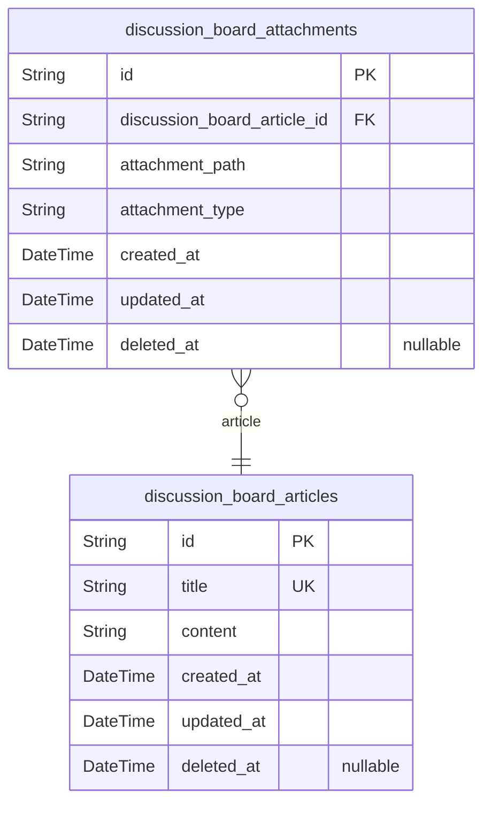

# Prisma Markdown

> Generated by [`prisma-markdown`](https://github.com/samchon/prisma-markdown)

- [Articles](#articles)

## Articles

### `discussion_board_articles`

Core discussion board articles with title, content, and timestamp
information for economic/political discussions

Properties as follows:

- `id`: Primary Key.
- `title`: Title of the discussion board article (2-100 characters)
- `content`: Body content of the discussion board article (10-5000 characters)
- `created_at`: Timestamp when article was created
- `updated_at`: Timestamp when article was last updated
- `deleted_at`: Timestamp when article was soft-deleted (nullable)

### `discussion_board_attachments`

Attachment files (images/PDFs) related to discussion board articles

Properties as follows:

- `id`: Primary Key.
- `discussion_board_article_id`
  > ID of the discussion board article this attachment belongs to. {@link
  > discussion_board_articles.id}.
- `attachment_path`: Path to the attachment file within the file storage system
- `attachment_type`: MIME type of the attachment (e.g., 'image/jpeg', 'application/pdf')
- `created_at`: Timestamp when attachment was created
- `updated_at`: Timestamp when attachment was last updated
- `deleted_at`: Timestamp when attachment was soft-deleted (nullable)
