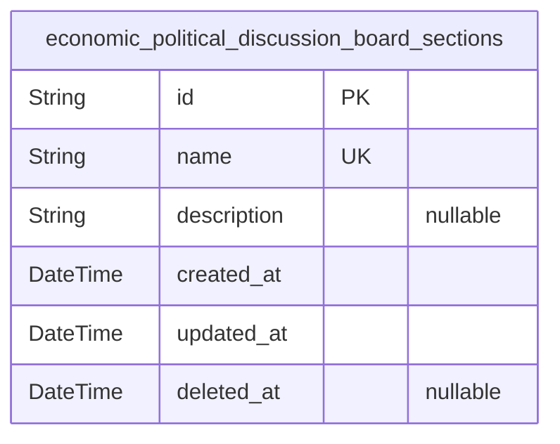
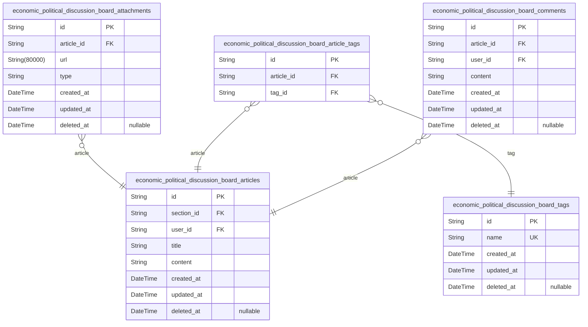
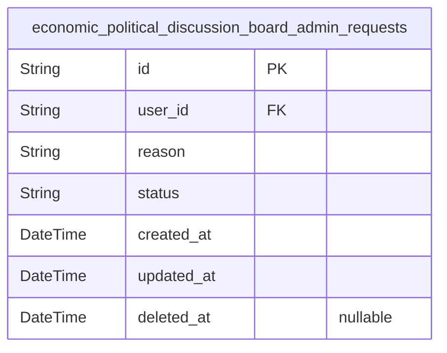
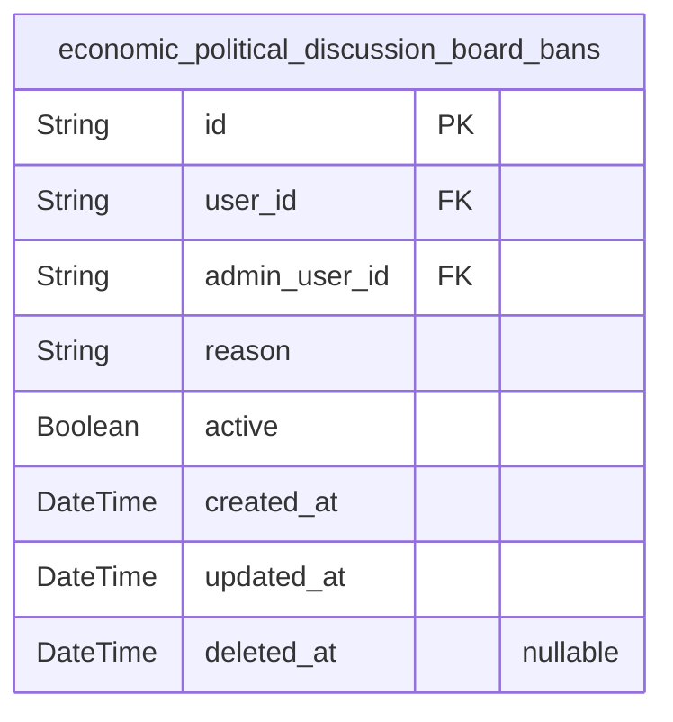
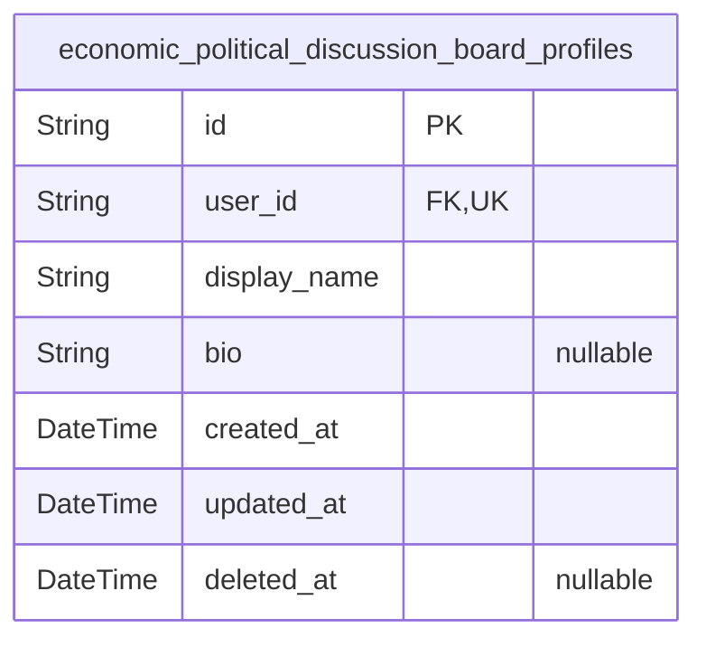

# Prisma Markdown

> Generated by [`prisma-markdown`](https://github.com/samchon/prisma-markdown)

- [Actors](#actors)
- [Sections](#sections)
- [Content](#content)
- [AdminRequests](#adminrequests)
- [Bans](#bans)
- [Profiles](#profiles)

## Actors

```mermaid
erDiagram
"economic_political_discussion_board_guests" {
  String id PK
  String device_id UK
  DateTime created_at
  DateTime updated_at
  DateTime deleted_at "nullable"
}
"economic_political_discussion_board_guest_sessions" {
  String id PK
  String guest_id FK
  String ip
  String href
  String referrer
  DateTime created_at
  DateTime expired_at
}
"economic_political_discussion_board_users" {
  String id PK
  String email UK
  String password_hash
  String role
  DateTime created_at
  DateTime updated_at
  DateTime deleted_at "nullable"
}
"economic_political_discussion_board_user_sessions" {
  String id PK
  String user_id FK
  DateTime created_at
  DateTime expired_at
  String ip "nullable"
  String href "nullable"
  String referrer "nullable"
}
"economic_political_discussion_board_user_password_resets" {
  String id PK
  String user_id FK,UK
  String token UK
  DateTime expires_at
  DateTime created_at
  DateTime updated_at
  DateTime deleted_at "nullable"
}
"economic_political_discussion_board_user_email_verifications" {
  String id PK
  String user_id FK
  String token UK
  DateTime expires_at
  DateTime created_at
  DateTime updated_at
  DateTime deleted_at "nullable"
  Boolean verified "nullable"
}
"economic_political_discussion_board_admins" {
  String id PK
  String email UK
  String password
  String role
  DateTime created_at
  DateTime updated_at
  DateTime deleted_at "nullable"
}
"economic_political_discussion_board_admin_sessions" {
  String id PK
  String admin_id FK
  String ip
  String href
  String referrer
  DateTime created_at
  DateTime expired_at
}
"economic_political_discussion_board_admin_password_resets" {
  String id PK
  String admin_id FK
  String token UK
  DateTime expires_at
  DateTime created_at
  DateTime updated_at
  DateTime deleted_at "nullable"
}
"economic_political_discussion_board_admin_audit_logs" {
  String id PK
  String admin_id FK
  String action_type
  String target_type "nullable"
  String target_id "nullable"
  DateTime created_at
  DateTime updated_at
  DateTime deleted_at "nullable"
}
"economic_political_discussion_board_guest_sessions" }o--|| "economic_political_discussion_board_guests" : guest
"economic_political_discussion_board_user_sessions" }o--|| "economic_political_discussion_board_users" : user
"economic_political_discussion_board_user_password_resets" |o--|| "economic_political_discussion_board_users" : user
"economic_political_discussion_board_user_email_verifications" }o--|| "economic_political_discussion_board_users" : user
"economic_political_discussion_board_admin_sessions" }o--|| "economic_political_discussion_board_admins" : admin
"economic_political_discussion_board_admin_password_resets" }o--|| "economic_political_discussion_board_admins" : admin
"economic_political_discussion_board_admin_audit_logs" }o--|| "economic_political_discussion_board_admins" : admin
```

### `economic_political_discussion_board_guests`

Temporary guest accounts identified by device for viewing public content
without registration. This table stores device-specific identifiers to
enable anonymous access and tracking of guest sessions without requiring
user registration.

Properties as follows:

- `id`: Primary Key.
- `device_id`: Unique identifier for the guest device (used for session tracking).
- `created_at`: Timestamp when the guest account was created.
- `updated_at`: Timestamp when the guest account was last updated.
- `deleted_at`: Timestamp when the guest account was marked as deleted (soft delete).

### `economic_political_discussion_board_guest_sessions`

Short-lived session tokens for anonymous guest access with 30-minute
inactivity timeout.

Stores connection metadata for unauthenticated users navigating the
platform, including IP, navigation context, and session expiration
details. Used exclusively for tracking temporary guest access without
authentication.

Properties as follows:

- `id`: Primary Key.
- `guest_id`
  > Belongs to a guest account's {@link
  > economic_political_discussion_board_guests.id}.
- `ip`: Client's IP address during session establishment.
- `href`: Current navigation URL when session was created.
- `referrer`: Previous navigation URL when session was created.
- `created_at`: Session creation timestamp.
- `expired_at`: Session expiration timestamp (30 minutes after creation).

### `economic_political_discussion_board_users`

Registered user accounts with email/password credentials and
authentication state. Supports role-based access control with user,
admin, and super-admin levels for managing platform access. All user
account operations are audited with timestamp tracking. The email field
serves as the primary authentication identifier and requires unique
verification.

Properties as follows:

- `id`: Primary Key.
- `email`: User's email address, validated and unique for authentication.
- `password_hash`: Password hash for secure authentication.
- `role`: User role (user, admin, super-admin) governing access permissions.
- `created_at`: Timestamp of user account creation.
- `updated_at`: Timestamp of last user account update.
- `deleted_at`: Timestamp of account deletion for soft deletes (NULL if active).

### `economic_political_discussion_board_user_sessions`

JWT session tokens with access (15min) and refresh (7day) validity for
authenticated users. Stores connection metadata including IP, href, and
referrer for security auditing and session management.

Properties as follows:

- `id`: Primary Key.
- `user_id`
  > Belongs to the user's {@link
  > economic_political_discussion_board_users.id}.
- `created_at`: Session creation timestamp, used for expiration tracking and analytics.
- `expired_at`
  > Session expiration timestamp (15 minutes from creation), enforced for
  > security.
- `ip`: Client IP address where session was initiated.
- `href`: Request URL where session was initiated.
- `referrer`: Referrer URL that led to session initiation.

### `economic_political_discussion_board_user_password_resets`

Password reset tokens for users with 15-minute expiration duration to
recover account credentials. Manages temporary tokens generated during
password recovery flow, each token valid for exactly 15 minutes before
expiration.

Properties as follows:

- `id`: Primary Key.
- `user_id`: User's identifier [economic_political_discussion_board_users.id](#economic_political_discussion_board_users)
- `token`: Unique token string for password reset verification.
- `expires_at`: Token expiration timestamp (15 minutes after creation).
- `created_at`: Token creation timestamp.
- `updated_at`: Token last update timestamp.
- `deleted_at`: Soft delete timestamp for expired tokens.

### `economic_political_discussion_board_user_email_verifications`

Email verification tokens for new user registration with expiration times
and verification status tracking. Each token is tied to a user account
and expires after a fixed period.

- Unique token required to prevent duplicate verification attempts
- Composed user_id + expires_at index enables efficient expiration checks
- Verification status tracks whether email was successfully validated

Properties as follows:

- `id`: Primary Key.
- `user_id`
  > The user associated with this email verification token. {@link
  > economic_political_discussion_board_users.id}.
- `token`: Unique verification token sent to user's email for account activation.
- `expires_at`: The expiration timestamp for the verification token.
- `created_at`: Timestamp when the verification token was created.
- `updated_at`: Timestamp of the last update to the verification token status.
- `deleted_at`: Timestamp when the token was soft-deleted (if applicable).
- `verified`: Indicates whether the associated email has been successfully verified.

### `economic_political_discussion_board_admins`

Administrator accounts with elevated privileges and authentication state.

Properties as follows:

- `id`: Primary Key.
- `email`: Unique email address for authentication.
- `password`: Password for authentication.
- `role`: User role: 'user', 'admin', or 'super-admin'.
- `created_at`: Record creation timestamp.
- `updated_at`: Last update timestamp.
- `deleted_at`: Soft delete timestamp (null if active).

### `economic_political_discussion_board_admin_sessions`

JWT session tokens with access (15min) and refresh (7day) validity for
administrator accounts. Tracks session lifetime and client context for
security.

Includes required fields for session management: access token expiration
(15min) and refresh token validity (7day), client network context (IP,
href, referrer), and audit timestamps for security monitoring.

Properties as follows:

- `id`: Primary Key.
- `admin_id`
  > The administrator associated with this session. {@link
  > economic_political_discussion_board_admins.id}.
- `ip`: The client IP address from which the session was created.
- `href`: The current URL path where the session was initiated.
- `referrer`: The referring URL that led to the session creation.
- `created_at`: Timestamp when the session was created.
- `expired_at`: Timestamp when the session expires and becomes invalid.

### `economic_political_discussion_board_admin_password_resets`

Password reset tokens with 15-minute expiration for admin account
recovery, storing verification tokens and expiration timestamps for
security purposes.

Properties as follows:

- `id`: Primary Key.
- `admin_id`: Admin account's [economic_political_discussion_board_admins.id](#economic_political_discussion_board_admins).
- `token`: One-time verification token for password reset.
- `expires_at`: Timestamp when password reset token expires (15 minutes after creation).
- `created_at`: Timestamp when token was created.
- `updated_at`: Timestamp when token was last updated.
- `deleted_at`: Timestamp when token was soft-deleted.

### `economic_political_discussion_board_admin_audit_logs`

Audit trail of all administrative actions including content moderation
and user management, tracking admin identities, action types, and targets
with exact timestamping.

This table captures all administrative operations performed by admins in
the system, providing a historical record of actions taken against
articles, sections, users, and other entities. The audit system ensures
complete visibility into administrative decisions while maintaining
referential integrity through the admin_id foreign key.

Properties as follows:

- `id`: Primary Key.
- `admin_id`
  > The admin responsible for the action. {@link
  > economic_political_discussion_board_admins.id}.
- `action_type`
  > Type of administrative action performed (e.g., 'moderate_article',
  > 'ban_user', 'update_section').
- `target_type`: Type of entity affected by action (e.g., 'article', 'user', 'section').
- `target_id`
  > Identifier of the target entity affected by the action (UUID string),
  > null when target is not applicable.
- `created_at`: Timestamp when administrative action was recorded.
- `updated_at`: Timestamp when audit log record was last modified.
- `deleted_at`: Timestamp when audit log was soft-deleted (null for active records).

## Sections

### `economic_political_discussion_board_sections`

Section definitions for organizing articles into economic and political
topics, with unique name and descriptive metadata for user navigation.

Sections provide topic categorization for articles, enabling users to
browse content by economic and political subtopics. Each section has a
unique name (2-50 characters) and descriptive overview, allowing admins
to manage topic structure without affecting existing content.

Section management allows creation, editing, and deletion of topics with
proper content reassignment protocols (articles remain visible when
sections are deleted).

Properties as follows:

- `id`: Primary Key.
- `name`
  > Unique section name for topic identification. Matches requirement 6.1
  > (2-50 characters).
- `description`
  > Section topic description for user context. Matches 6.1 requirement
  > (5-250 characters).
- `created_at`: Timestamp when section was created. Standard required field.
- `updated_at`: Timestamp when section was last modified. Standard required field.
- `deleted_at`
  > Timestamp when section was soft-deleted. Standard optional field for
  > audit.

## Content

### `economic_political_discussion_board_articles`

Stores user-published articles with content, title, section
relationships, and metadata.

Properties as follows:

- `id`: Primary Key.
- `section_id`
  > Section that the article belongs to. {@link
  > economic_political_discussion_board_sections.id}
- `user_id`
  > User who wrote the article. {@link
  > economic_political_discussion_board_users.id}
- `title`: Article title (5-100 characters)
- `content`: Article content (minimum 100 characters)
- `created_at`: Timestamp when the article was created
- `updated_at`: Timestamp when the article was last updated
- `deleted_at`: Timestamp when the article was soft-deleted (null if active)

### `economic_political_discussion_board_attachments`

Manages file attachments linked to articles (5 max per article). Includes
URL, file type (file/image), and timestamps with soft delete capability.

Attachment records are directly managed through content operations. Each
attachment must belong to a single article, supporting the "Article has
many Attachments" relationship pattern established in content management
workflows.

Properties as follows:

- `id`: Primary Key.
- `article_id`
  > Article this attachment belongs to. {@link
  > economic_political_discussion_board_articles.id}
- `url`: File URL stored in cloud storage. URL must be valid and accessible.
- `type`: File type: 'file' or 'image'. Determines processing and display.
- `created_at`: Record creation timestamp. Automatically set on insertion.
- `updated_at`: Record last update timestamp. Automatically updated on modifications.
- `deleted_at`: Soft delete timestamp if record was deactivated. Nullable.

### `economic_political_discussion_board_tags`

Tracks user-defined tags for article categorization. Users can create,
assign, and search tags across articles. Tags are unique and independent
entities, allowing flexible categorization of content.

Properties as follows:

- `id`: Primary Key.
- `name`
  > Tag identifier name (e.g., 'economy', 'politics'). Must be unique across
  > all tags.
- `created_at`: Timestamp when the tag was created.
- `updated_at`: Timestamp of the last modification to the tag.
- `deleted_at`: Soft delete timestamp (null if not deleted).

### `economic_political_discussion_board_article_tags`

Junction table connecting articles to multiple tags, enabling
many-to-many relationship between articles and tags.

This table allows an article to have multiple tags while ensuring each
tag-article association is unique.

Related to: [economic_political_discussion_board_articles](#economic_political_discussion_board_articles), {@link
economic_political_discussion_board_tags}

Properties as follows:

- `id`: Primary Key.
- `article_id`
  > Article reference. {@link
  > economic_political_discussion_board_articles.id}.
- `tag_id`: Tag reference. [economic_political_discussion_board_tags.id](#economic_political_discussion_board_tags).

### `economic_political_discussion_board_comments`

Holds user comments on articles with content and timestamping. Each
comment belongs to a single article and user, with timestamps for
creation and updates. Supports independent comment moderation, searching,
and management workflows.

Properties as follows:

- `id`: Primary Key.
- `article_id`
  > Associated article's {@\link
  > economic_political_discussion_board_articles.id}.
- `user_id`
  > User who posted the comment's {@\link
  > economic_political_discussion_board_users.id}.
- `content`: Comment content with minimum 10 characters, maximum 500 characters.
- `created_at`: Timestamp when comment was created.
- `updated_at`: Timestamp when comment was last updated.
- `deleted_at`: Timestamp when comment was soft-deleted (nullable).

## AdminRequests

### `economic_political_discussion_board_admin_requests`

Admin role promotion requests with status tracking and reason documentation

Properties as follows:

- `id`: Primary Key.
- `user_id`
  > Refers to the user requesting admin role promotion. {@link
  > economic_political_discussion_board_users.id}.
- `reason`: Reason provided for role promotion request.
- `status`: Current status of the request (pending, approved, rejected).
- `created_at`: Timestamp when the request was created.
- `updated_at`: Timestamp when the request was last updated.
- `deleted_at`: Timestamp when the request was soft-deleted (if applicable).

## Bans

### `economic_political_discussion_board_bans`

Tracks user bans with reason, ban status, and the administrator who
applied the ban. Each ban entry is linked to the banned user and the
administrator who initiated the ban, with soft delete support for audit
trails.

Properties as follows:

- `id`: Primary Key.
- `user_id`: Ban applies to a user.
- `admin_user_id`: Administrator who applied the ban.
- `reason`: Reason for the ban as provided by the administrator.
- `active`: Indicates if ban is currently active (true) or lifted (false).
- `created_at`: Timestamp when ban was created.
- `updated_at`: Timestamp when ban was last updated.
- `deleted_at`: Timestamp when ban was soft-deleted.

## Profiles

### `economic_political_discussion_board_profiles`

Stores user profile details including display name (2-30 characters) and
bio (up to 250 characters), linked to user accounts via foreign key.

Properties as follows:

- `id`: Primary Key.
- `user_id`
  > Link to user account. {@link
  > economic_political_discussion_board_users.id}.
- `display_name`: User's public display name (2-30 characters)
- `bio`: User biography description (up to 250 characters)
- `created_at`: Timestamp of profile creation
- `updated_at`: Timestamp of last profile update
- `deleted_at`: Timestamp of profile deletion (soft delete)
