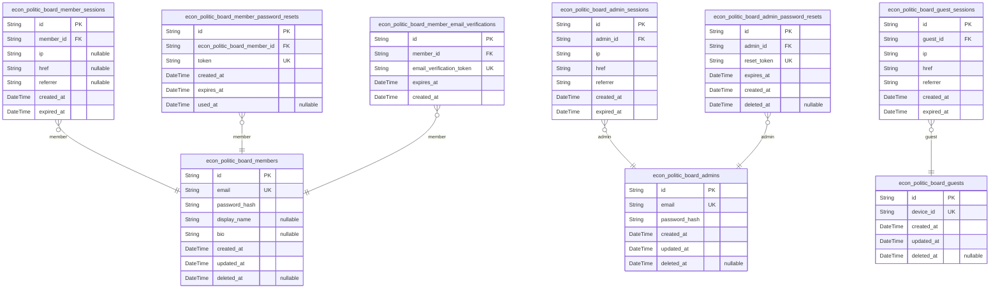
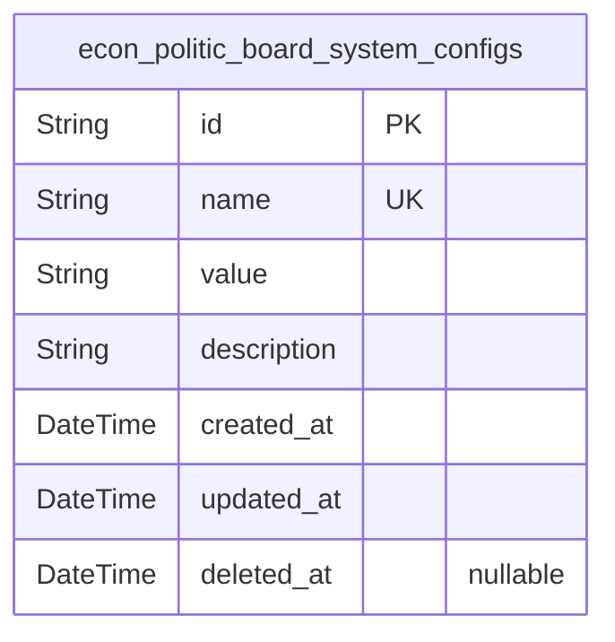
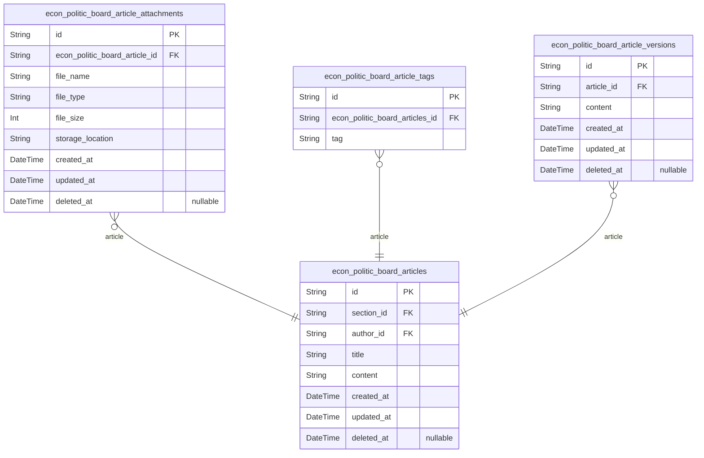
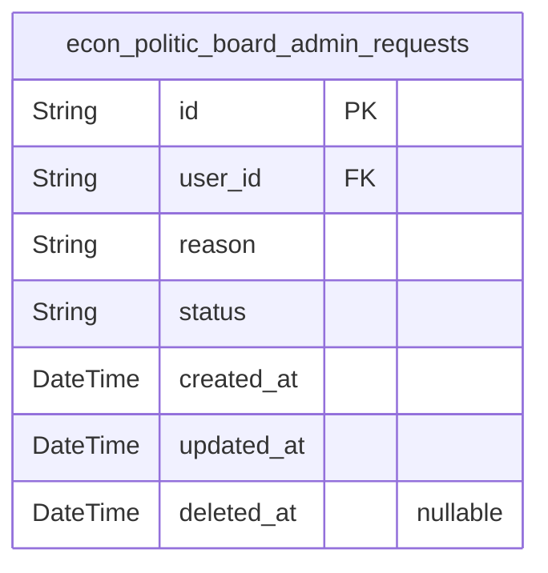
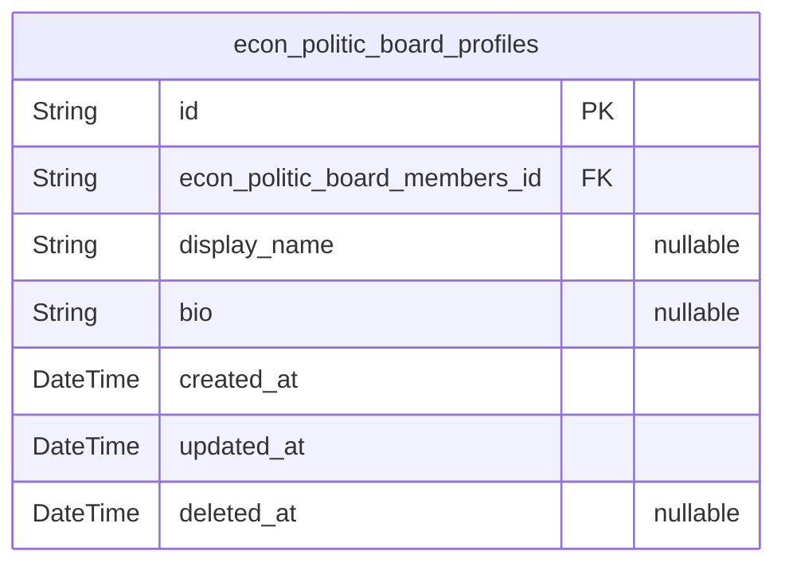
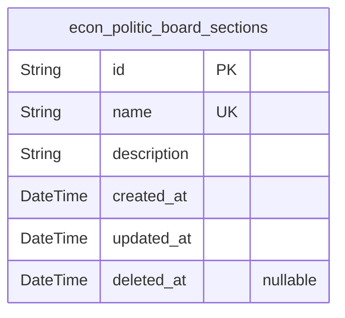

# Prisma Markdown

> Generated by [`prisma-markdown`](https://github.com/samchon/prisma-markdown)

- [Actors](#actors)
- [Systematic](#systematic)
- [Articles](#articles)
- [Administration](#administration)
- [Profile](#profile)
- [Sections](#sections)

## Actors

### `econ_politic_board_guests`

Temporary guest accounts for unauthenticated users identified by device
fingerprint with no password requirements. Each guest account is tied to
a device identifier and has a short-lived session for browsing without
registration. Guests can browse sections and view articles but cannot
create content or interact beyond anonymous viewing.

Properties as follows:

- `id`: Primary Key.
- `device_id`
  > Device fingerprint identifier used to track guest sessions. Must be
  > unique per device for temporary account linkage.
- `created_at`
  > Account creation timestamp indicating when the guest session was
  > initiated.
- `updated_at`
  > Last modification timestamp tracking session updates for device
  > fingerprint management.
- `deleted_at`
  > Soft delete timestamp indicating when the guest account was expired or
  > cleared.

### `econ_politic_board_members`

Regular authenticated user accounts with email/password credentials.
Stores user profile information including display name and bio text.

Used as the primary identity entity for users within the
economic/political discussion board platform. Each account represents a
distinct user type that can participate in the platform by creating
articles, comments, and managing their profile.

Accounts require email verification before becoming fully active.
Passwords are stored as hashes for security, with password reset
functionality available for recovery.

The email field is mandatory and must be unique across all members. The
display name field is optional, allowing users to choose whether to show
a public identifier. The bio field is also optional and provides space
for a short profile description.

Properties as follows:

- `id`: Primary Key.
- `email`
  > User's email address used for authentication and communication. Must be
  > unique across all members.
- `password_hash`: Password hash used for authentication. Never store plain passwords.
- `display_name`: User's display name visible to other users. Maximum 30 characters.
- `bio`: User's bio text describing their profile. Maximum 500 characters.
- `created_at`: Timestamp of when this member account was created.
- `updated_at`: Timestamp of when this member account was last updated.
- `deleted_at`
  > Timestamp of when this member account was deleted. (Null means not
  > deleted.)

### `econ_politic_board_member_sessions`

Member session tracking for authenticated users with JWT access tokens.

Stores session lifecycle information for authenticated members, including
authentication context and connection details. Each session belongs to
exactly one authenticated member and can have multiple concurrent active
sessions.

Session tokens have limited validity (1 hour access, 30 days refresh) to
meet security requirements. Session data includes connection metadata (IP
address, URL references) for audit purposes.

All sessions follow a strict lifecycle with non-null expiration times to
prevent unlimited access tokens. Created and expired timestamps enable
session history analysis and security monitoring.

Properties as follows:

- `id`: Primary Key.
- `member_id`: Member who owns this session. [econ_politic_board_members.id](#econ_politic_board_members).
- `ip`: IP address of the session connection.
- `href`: Connection URL (e.g., /dashboard).
- `referrer`: Referrer URL from which the user initiated the session.
- `created_at`: Session creation timestamp.
- `expired_at`: Session expiration timestamp (1 hour after creation).

### `econ_politic_board_member_password_resets`

Password reset tokens used for securely resetting member passwords. These
tokens are generated upon password reset request and expire after 1 hour
to prevent abuse.

Each token is unique and directly associated with a member during the
password recovery process. Tokens are marked as used when successfully
applied, providing clear audit trail of all password reset activities.
The table enforces strict expiration timing to maintain security
integrity.

The token must be unique across the system, and tokens should be
generated using cryptographically secure random value generation. All
token-related operations are managed exclusively through the password
reset workflow, not through direct user actions.

Properties as follows:

- `id`: Primary Key.
- `econ_politic_board_member_id`
  > Member who requested password reset. {@link
  > econ_politic_board_members.id}.
- `token`
  > UUID-based token string for password reset verification. Must be unique
  > across all entries for security.
- `created_at`: Timestamp when the password reset token was generated.
- `expires_at`
  > Timestamp when the password reset token expires after 1 hour. Tokens
  > always expire, never "unlimited".
- `used_at`
  > Timestamp when the token was successfully used to reset the password.
  > Empty if token was never used.

### `econ_politic_board_admins`

Administrator accounts with email/password authentication for managing
content and moderating user interactions.

Stores administrative user credentials and basic profile information.
Each admin must register with a valid email, and the system handles
secure password storage using bcrypt hashing.

Administrators can access all content management features and user
moderation tools. Admin accounts persist until explicitly deleted by
another administrator.

The system maintains audit trails for account creation and modification
using standard timestamps and soft delete support.

Properties as follows:

- `id`: Primary Key.
- `email`
  > Email address used for authentication and system communication. Must be
  > unique across all administrators and valid per email format rules.
- `password_hash`
  > Securely hashed password for authentication, stored using bcrypt. Never
  > store plain text passwords.
- `created_at`: Timestamp of when the admin account was created.
- `updated_at`: Timestamp of when the admin account was last updated.
- `deleted_at`
  > Timestamp of when the admin account was deleted. If null, the account is
  > active.

### `econ_politic_board_admin_sessions`

Administrator session management with JWT tokens for secure access.

Stores active session records for administrators with access (1-hour) and
refresh (30-day) tokens. Each session is tied to a specific administrator
and includes connection metadata for audit purposes.

Session tokens expire after 1 hour for access tokens and 30 days for
refresh tokens, ensuring secure access management. The session creation
timestamp allows for session history analysis and audit trails.

All sessions are recorded with IP address, connection URL, and referrer
information to track access patterns and detect security anomalies.

Properties as follows:

- `id`: Primary Key.
- `admin_id`: Administrator account's [econ_politic_board_admins.id](#econ_politic_board_admins)
- `ip`: IP address of the user connecting from.
- `href`: Connection URL used for the session.
- `referrer`: Referrer URL of the client connection.
- `created_at`: Session creation timestamp.
- `expired_at`: Session expiration timestamp (1 hour for access, 30 days for refresh).

### `econ_politic_board_admin_password_resets`

Admin password reset tokens for secure password recovery workflows.
Stores temporary reset tokens with 1-hour expiration associated with
administrator accounts, facilitating secure password reset processes
without storing passwords.

Tokens are generated during password reset requests and expire after 1
hour for security. Each token is tied to a specific administrator record,
allowing verification of the request's owner without requiring password
storage.

When tokens expire, they're automatically removed from the system, and
users must request a new reset link. Soft delete capability ensures token
records can be purged after expiration without losing audit history.

Properties as follows:

- `id`: Primary Key.
- `admin_id`: Associated administrator account's {@link econ_politic_board_admins.id.
- `reset_token`
  > Secure one-time token for password reset requests. Generated as random
  > UUID with SHA-256 hashing for security.
- `expires_at`: Token expiration datetime. Set to 1 hour from creation for security.
- `created_at`: Token creation timestamp for audit purposes.
- `deleted_at`: Soft delete timestamp for record retention policies.

### `econ_politic_board_guest_sessions`

Temporary guest sessions for unauthenticated browsing.

Stores connection context for users who access the platform without
logging in. Each session has a short 5-minute expiration period for
security. Tracks connection metadata including IP address, URL, and
referrer information for audit purposes. Sessions are tied to guest
accounts (identified by device fingerprint, not email).

Properties as follows:

- `id`: Primary Key.
- `guest_id`: Reference to guest account.
- `ip`: IP address used for the session connection.
- `href`: Connection URL used to initiate the session.
- `referrer`: Referrer URL that led to this session.
- `created_at`: Timestamp when the session was created.
- `expired_at`: Timestamp when the session expires (5 minutes from creation).

### `econ_politic_board_member_email_verifications`

Verification tokens for new member registration.

Stores tokens sent to members during account creation to verify their
email addresses. Each token is valid for exactly 1 hour and is tied to a
specific member account for verification tracking.

Tokens expire automatically and are not manually managed through the
application. These tokens are created during the registration process and
serve as the mechanism for confirming a member's email address.

Unlike password resets, these tokens cannot be regenerated without
creating a new account, ensuring email verification is a one-time process
during initial sign-up.

Properties as follows:

- `id`: Primary Key.
- `member_id`
  > Member this verification token belongs to. {@link
  > econ_politic_board_members.id}
- `email_verification_token`
  > Unique token string sent to member's email for verification. Used to
  > confirm email address during registration.
- `expires_at`: Timestamp indicating when this token expires (1 hour from creation).
- `created_at`: Timestamp indicating when this token was created (sent to member's email).

## Systematic

### `econ_politic_board_system_configs`

System-wide configuration settings and feature flags that control
platform behavior, accessibility, and user experience across the entire
application.

Stores key-value pairs for configuration parameters, where the key
represents the setting name (e.g., 'comment_min_length',
'article_max_tags') and the value represents the current setting value.
This table also includes human-readable descriptions for each
configuration setting.

These configuration settings can be modified through the platform's
administrative interface to adjust platform behavior without requiring
code changes. System configurations include settings related to content
rules, user experience features, and platform capabilities.

Properties as follows:

- `id`: Primary Key.
- `name`
  > Unique configuration key name (e.g., 'comment_min_length',
  > 'article_max_tags'). Used to identify this configuration setting.
- `value`
  > Current value of the configuration setting (e.g., '10', '5'). Can be a
  > number, string, or boolean represented as string.
- `description`
  > Human-readable description of what this configuration setting does and
  > its purpose in the system.
- `created_at`: Timestamp when this configuration setting was added to the system.
- `updated_at`: Timestamp when this configuration setting was last modified.
- `deleted_at`: Timestamp when this configuration setting was deleted (soft delete).

## Articles

### `econ_politic_board_articles`

Core articles representing economic or political discussions written by
users.

Articles serve as the primary user-generated content for the platform,
allowing members to share their perspectives on various topics. Each
article is associated with a specific section (Politics, Economy, Current
Affairs) and has a clear author relationship.

The title field captures the main topic of the article with a minimum of
5 characters for sufficient context and maximum of 100 characters to
prevent overly verbose titles.
The content field requires at least 50 characters to ensure substantive
discussion content is provided rather than empty or minimal entries.
The article structure follows an append-only pattern for historical
tracking with no direct modifications to past content, instead creating
new article versions for edits.

Properties as follows:

- `id`: Primary Key.
- `section_id`: Section the article belongs to. [econ_politic_board_sections.id](#econ_politic_board_sections)
- `author_id`: Author of the article. [econ_politic_board_members.id](#econ_politic_board_members)
- `title`
  > Main topic or headline of the article. Must be 5-100 characters for
  > contextual relevance while remaining concise.
- `content`
  > Core discussion content of the article. Minimum 50 characters ensures
  > substantial contribution rather than minimal content.
- `created_at`: When the article was first created.
- `updated_at`: When the article was last modified.
- `deleted_at`
  > When the article was marked for deletion (soft delete) with no immediate
  > physical removal from storage.

### `econ_politic_board_article_attachments`

File attachments for articles, supporting document and image uploads with
metadata.

Stores all files attached to articles including images, PDFs, and other
document formats. Each attachment is linked to a specific article, with
metadata about the file name, size, type, and storage location. The
attachment is only linked to a single article and cannot be shared across
multiple articles.

File types are limited to standard web formats (images: JPEG, PNG, GIF;
documents: PDF, DOCX, XLSX) to ensure security and compatibility. Each
article can have up to 10 attachments with a maximum total size of 50MB
as specified in the business requirements.

Attachments are stored with a timestamp for creation, update, and soft
deletion for audit purposes while the original article content remains
accessible.

Properties as follows:

- `id`: Primary Key.
- `econ_politic_board_article_id`
  > Article attachment belongs to article's {@link
  > econ_politic_board_articles.id}.
- `file_name`: Original file name of the attachment, including extension.
- `file_type`: MIME type of the file (e.g., image/jpeg, application/pdf).
- `file_size`
  > File size in bytes, limited to a total of 50MB per article across all
  > attachments.
- `storage_location`: Where the file is stored (URL or path), typically a cloud storage path.
- `created_at`: Timestamp when the attachment was created.
- `updated_at`: Timestamp when the attachment was last modified.
- `deleted_at`
  > Timestamp when the attachment was soft-deleted, allowing audit while
  > maintaining article integrity.

### `econ_politic_board_article_tags`

Tag values used for categorization and filtering of articles.

Each article can have up to five tags, with a maximum length of 20
characters and no spaces. Tags provide an additional layer of content
organization beyond the article's section.

Tag management is done through the article creation and editing
workflows, not as standalone entities. The tag values are stored as
strings with strict validation to ensure consistency across the platform.

Properties as follows:

- `id`: Primary Key.
- `econ_politic_board_articles_id`
  > Article to which this tag is associated. {@link
  > econ_politic_board_articles.id}
- `tag`
  > Tag value used for categorization of an article. Maximum length: 20
  > characters. Tags must not contain spaces.

### `econ_politic_board_article_versions`

Stores historical versions of article content changes with full content
snapshots for auditing and version rollback capabilities.

Each version records the exact content state at the time of article
editing, maintaining a complete history of changes without loss of data.
Version history is automatically generated on every article edit,
requiring no user intervention for version tracking.

The table supports full content retrieval for any version, enabling
features like 'View Previous Version' while preserving the ability to
compare changes over time. Historical versions remain intact even if the
original article is edited, deleted, or modified, ensuring a complete
audit trail of all content modifications.

Properties as follows:

- `id`: Primary Key.
- `article_id`: Reference to the parent article. [econ_politic_board_articles.id](#econ_politic_board_articles).
- `content`
  > Full article content at the time of version creation, including all text
  > and formatted structure. Stores the complete content that was active
  > during the article edit.
- `created_at`
  > Timestamp when this version was created (matches the point of article
  > edit).
- `updated_at`
  > Timestamp when this version was last modified (for historical
  > consistency, same as created_at but maintained for completeness).
- `deleted_at`
  > Timestamp when this version was soft-deleted (if applicable for audit
  > purposes), null indicates active version.

## Administration

### `econ_politic_board_admin_requests`

Tracks administrator role requests from users, allowing regular users to
request administrator privileges with reasons and status tracking for
super administrators to review.

Each request includes the user's reason for requesting admin access
(minimum 50 characters), the current status of the request
(pending/approved/rejected), and timestamps for creation and updates.
Super administrators review these requests to manage administrative roles
across the platform.

This table maintains a clear record of all admin access requests to
ensure transparency and accountability in the role management process.

Properties as follows:

- `id`: Primary Key.
- `user_id`: User who made the request. [econ_politic_board_members.id](#econ_politic_board_members).
- `reason`
  > Reason provided by the user for requesting administrator privileges. Must
  > be at least 50 characters in length and meet specific content guidelines
  > to ensure proper context for review.
- `status`
  > Current status of the administrator request. Valid values: 'pending',
  > 'approved', 'rejected'. This field determines the action to be taken by
  > super administrators for each request.
- `created_at`: Timestamp when the administrator request was created.
- `updated_at`: Timestamp when the administrator request was last updated.
- `deleted_at`
  > Timestamp when the request was soft-deleted. Used for audit trails while
  > removing it from active views.

## Profile

### `econ_politic_board_profiles`

User profile storage for display names and bios with business constraints.

Stores additional user information beyond the core identity provided in
the authentication system. Profile data is optional for users to provide
and can be updated at any time, but cannot be set to null permanently
(must maintain minimal user visibility information). The display name
field enforces a maximum length of 30 characters as specified in the
business rules.

The bio field provides a text-based description for user profiles with a
maximum length of 500 characters for consistent content presentation
across the platform. Both profile fields are optional but should be
present for users who choose to establish a profile.

Properties as follows:

- `id`: Primary Key.
- `econ_politic_board_members_id`: Reference to the core member identity
- `display_name`
  > Custom user display name visible to others. Maximum 30 characters as per
  > business rules.
- `bio`
  > User profile bio text for additional self-description. Maximum 500
  > characters as per business rules.
- `created_at`: Date and time the profile was created, used for historical tracking.
- `updated_at`: Date and time the profile was last updated, used for tracking changes.
- `deleted_at`: Date and time the profile was marked as deleted (soft delete).

## Sections

### `econ_politic_board_sections`

Section entities representing topics like Politics, Economy, Current
Affairs with unique names and descriptions.

Sections serve as organizational containers for articles, allowing users
and administrators to categorize content into distinct topic areas. Each
section is characterized by a unique name and descriptive summary,
providing context for content within that category.

Administrators manage sections through creation, editing, and viewing
operations. Sections are referenced by articles to establish their
categorization, forming one-to-many relationships where each article
belongs to exactly one section.

Section names must be unique across the entire platform and follow the
system's uniqueness requirements. All sections support soft deletion for
content management without permanent data loss.

Properties as follows:

- `id`: Primary Key.
- `name`
  > Section name (e.g., Politics, Economy) with maximum 50 characters, must
  > be unique.
- `description`
  > Section description up to 250 characters detailing the section's purpose
  > and content scope.
- `created_at`: Timestamp when the section was created.
- `updated_at`: Timestamp when the section was last updated.
- `deleted_at`
  > Soft delete timestamp; section is considered deleted when this field has
  > a value.
