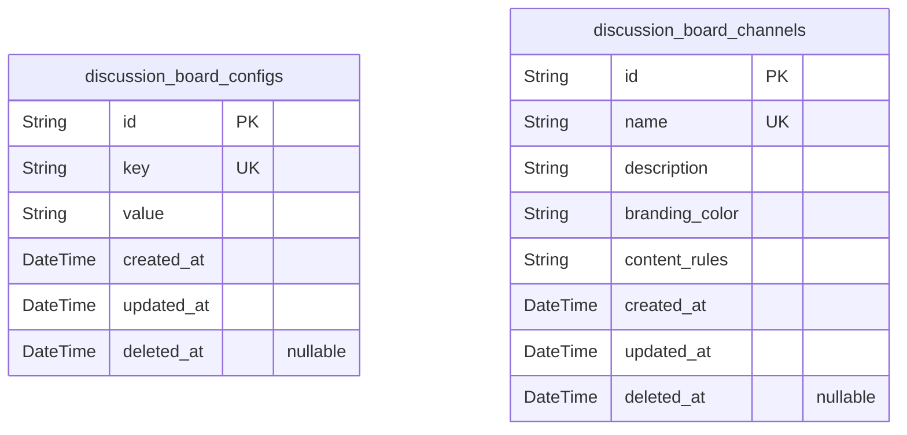
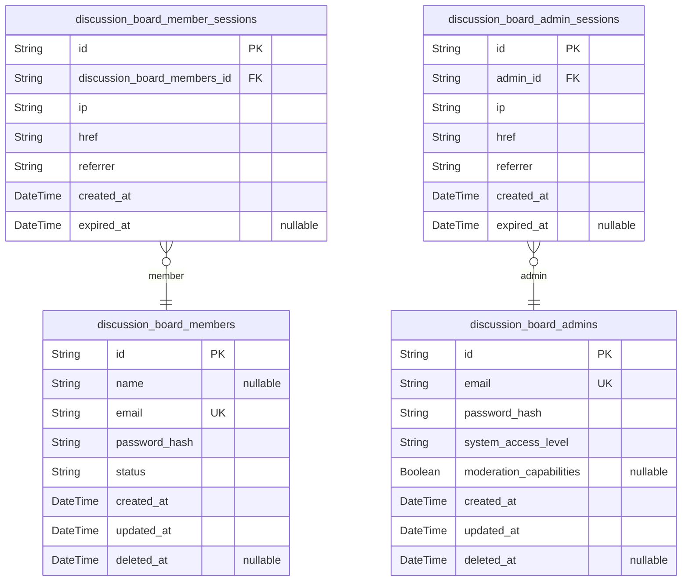
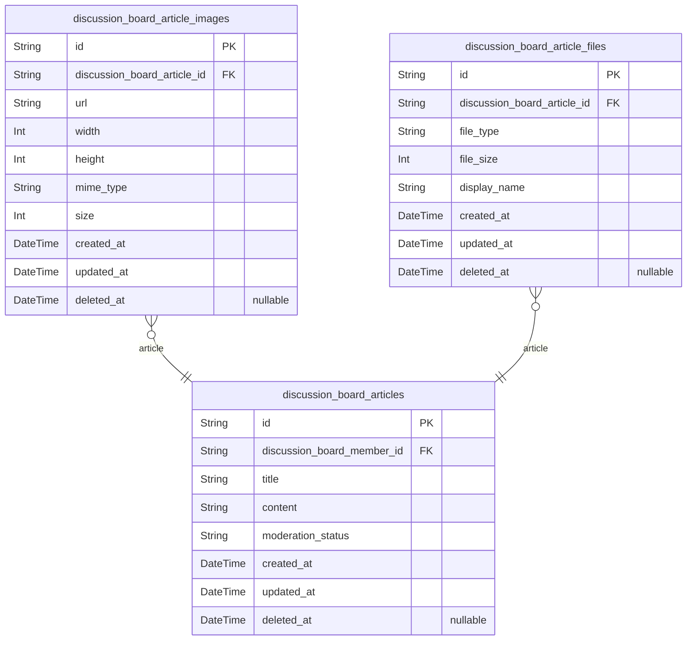
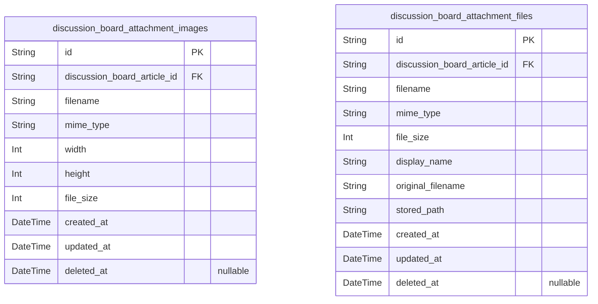
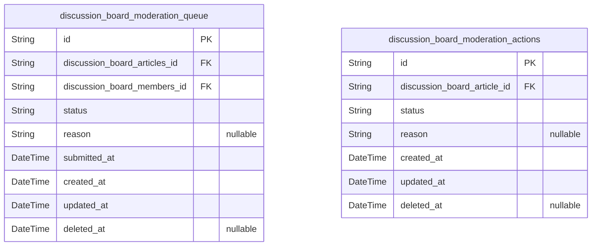

# Prisma Markdown

> Generated by [`prisma-markdown`](https://github.com/samchon/prisma-markdown)

- [Systematic](#systematic)
- [Actors](#actors)
- [Articles](#articles)
- [Attachments](#attachments)
- [Moderation](#moderation)

## Systematic

### `discussion_board_configs`

System-wide configuration key-value stores.

This table stores all system configuration parameters as key-value pairs.
Each configuration key appears exactly once, allowing for easy reading
and update of settings.

The value is stored as a string to accommodate various configuration
types (boolean, numeric, string) that will be parsed by the application.
Configuration updates trigger timestamps for tracking changes.
Soft deletion is supported to maintain historical configuration states
without removing records from the database.

Key configuration features include:
- Feature flags for enabling/disabling platform features
- Performance parameters such as rate limits and timeouts
- Global settings affecting user experience

Properties as follows:

- `id`: Primary Key.
- `key`: Configuration parameter name, must be unique across all configurations.
- `value`
  > Configuration parameter value, stored as a string representing the actual
  > value (e.g., 'true' for boolean, '50' for integer). The application
  > parses this value to the appropriate type.
- `created_at`: Timestamp when the configuration was created.
- `updated_at`: Timestamp when the configuration was last updated.
- `deleted_at`: Timestamp when the configuration was soft-deleted (null means active).

### `discussion_board_channels`

Channel configuration entities for organizing discussion content.

Stores named channels with branding and content rules to structure
discussions into thematic topics. Each channel has unique branding for
visual differentiation in the UI.

Channels are foundational to the forum's structure and cannot be deleted
from the system (only hidden for moderation). Business rules dictate that
a channel must have a unique name, description, and branding.

Channel rules define required content formatting, post types, and
behavior guidelines to maintain topic focus and quality across the
discussion platform.

Properties as follows:

- `id`: Primary Key.
- `name`: Channel name displayed to users. Must be unique across all channels.
- `description`: Detailed description of the channel's purpose and scope for users.
- `branding_color`: Hex color code used for branding. Example: #3498db.
- `content_rules`
  > Text rules for content posted in this channel. Includes formatting
  > requirements and topic restrictions.
- `created_at`: Time when the channel was created.
- `updated_at`: Time when the channel was last updated.
- `deleted_at`: Time when the channel was soft-deleted. Null if active.

## Actors

### `discussion_board_members`

Core member account details for authenticated users.

Stores authentication credentials, basic profile information, and
membership status for registered members.

Each member has a unique email address for login and profile management.
Account status tracks validity (active, suspended, banned), supporting
moderation workflows.

Email is required for login and must be unique. Password is securely
hashed, and temporal fields track creation/modification with soft delete
capability for data integrity.

Properties as follows:

- `id`: Primary Key.
- `name`: User's display name for public profiles, may be left blank.
- `email`
  > Member's email address used for authentication. Must be unique across all
  > members.
- `password_hash`: Securely hashed password for authentication. Never stored in plain text.
- `status`
  > Current membership status indicating account validity (active, suspended,
  > banned).
- `created_at`: Timestamp when member account was created.
- `updated_at`: Timestamp of last account modification.
- `deleted_at`: Timestamp of soft deletion to preserve audit trails.

### `discussion_board_admins`

Administrative accounts with elevated system privileges and moderation
capabilities.

Stores accounts for system administrators who can manage user content,
configure system settings, and perform moderation actions. Each admin
account includes authentication credentials, access level configuration,
and system role details.

Admins have distinct capabilities compared to regular members, with
permissions for full system access and moderation workflows.
Scenario: An admin account created by superadmin for system management
requires secure password storage and predefined access levels.

Properties as follows:

- `id`: Primary Key.
- `email`
  > Admin email address used for authentication and account recovery. Must be
  > unique across all administrative accounts.
- `password_hash`
  > Password hash storing the admin's authentication credentials. Does not
  > store plaintext passwords for security reasons.
- `system_access_level`
  > Administrative access level representing the privileges granted to this
  > account. Valid values: 'superadmin', 'full-access', 'moderation-only'.
- `moderation_capabilities`
  > Indicates if the admin account has moderation capabilities. True for
  > admins who can review and manage content.
- `created_at`: Timestamp when the admin account was created.
- `updated_at`: Timestamp when the admin account was last modified.
- `deleted_at`: Timestamp when the admin account was marked for deletion (soft delete).

### `discussion_board_member_sessions`

Tracks active login sessions for members, including expiration timestamps
and device information.

Records session details for authenticated members to enable secure
session management and activity tracking. Each session links to a
specific member through the primary account.

Supports session duration tracking, device identification (IP address),
and connection context (URLs and referrers) necessary for security
monitoring and user activity audits.

Properties as follows:

- `id`: Primary Key.
- `discussion_board_members_id`: Member's account identifier. [discussion_board_members.id](#discussion_board_members).
- `ip`: IP address associated with the session connection.
- `href`: Full URL used for the connection.
- `referrer`: URL that referred to the current connection.
- `created_at`: Timestamp of session creation.
- `expired_at`: Timestamp when session expires (nullable if session is ongoing).

### `discussion_board_admin_sessions`

Tracks active admin login sessions with connection details for audit and
activity tracking.

Maintains session connection context including client IP, URL, and
referrer information. Session data is managed through admin identity
flows rather than standalone operations.

Includes session creation and expiration timestamps for activity
monitoring and session management.

Required fields follow exact session table specification without
additional metadata. Composite index on [admin_id, created_at] ensures
efficient query patterns for activity streams.

Properties as follows:

- `id`: Primary Key.
- `admin_id`: Associated admin account. [discussion_board_admins.id](#discussion_board_admins).
- `ip`: IP address of client connecting to system.
- `href`: Connection URL for session tracking.
- `referrer`: Referrer URL from which session was initiated.
- `created_at`: Session creation timestamp.
- `expired_at`: Session expiration timestamp.

## Articles

### `discussion_board_articles`

Core table storing article content and moderation workflow states.

Articles represent user-generated content in the discussion board. Each
article is authored by a member, contains a title, content body, and
follows a moderation workflow from submission to publication.

Article content remains intact even if the author is deleted or changes
their status, ensuring historical record integrity. Moderation status
tracks the article's progression through review queues and final
publication state.

Properties as follows:

- `id`: Primary Key.
- `discussion_board_member_id`: Author of the article. [discussion_board_members.id](#discussion_board_members).
- `title`: Article title reflecting core content.
- `content`: Main article content body with markdown support.
- `moderation_status`
  > Current status in moderation workflow. Valid values: pending, approved,
  > rejected.
- `created_at`: Article creation timestamp.
- `updated_at`: Last modification timestamp.
- `deleted_at`: Deletion timestamp for soft delete implementation.

### `discussion_board_article_images`

Stores uploaded images associated with discussion board articles.
Contains file metadata, dimensions for display purposes, and automatic
resizing parameters for optimized content delivery.

Each image record is created when media is uploaded to an article. Images
can be deleted independently but remain linked to their parent article
for historical consistency. The table supports batch image uploads and
individual image management through the article's media interface.

All image metadata is stored at original resolution to enable consistent
scaling across different display contexts. The table design allows for
efficient filtering by article ID and upload timestamp.

Properties as follows:

- `id`: Primary Key.
- `discussion_board_article_id`: Article this image belongs to. [discussion_board_articles.id](#discussion_board_articles)
- `url`: Full URL path to the image file in storage.
- `width`: Image width in pixels at original resolution.
- `height`: Image height in pixels at original resolution.
- `mime_type`: MIME type of the image file (e.g., image/jpeg).
- `size`: File size in bytes.
- `created_at`: Timestamp when image was uploaded.
- `updated_at`: Timestamp when image metadata was last modified.
- `deleted_at`: Timestamp when image was soft-deleted (null if active).

### `discussion_board_article_files`

Stores uploaded files attached to articles with type, size, and display
information for PDF, DOCX, and XLSX formats.

Maintains complete metadata for all file attachments across articles,
including file type constraints and display preferences. Each file
attachment is uniquely associated with a specific article through the
system's reference structure. Supports soft deletion for content
moderation while preserving historical attachment records. File size and
type validations enforce platform-wide attachment rules established in
the Attachment component.

Independent file listing and filtering capabilities allow users to access
all attachments across articles regardless of their parent article
context. The attachment metadata enables sorting and filtering based on
file type and size, supporting use cases across different content types.

Properties as follows:

- `id`: Primary Key.
- `discussion_board_article_id`: Article this file belongs to. [discussion_board_articles.id](#discussion_board_articles).
- `file_type`
  > MIME type identifier for the file. Valid values: application/pdf,
  > application/vnd.ms-excel,
  > application/vnd.openxmlformats-officedocument.wordprocessingml.document.
- `file_size`: File size in bytes. Follows platform size limits of maximum 50MB.
- `display_name`
  > User-visible name for the file. Used in UI for attachment listings and
  > downloads.
- `created_at`: Timestamp of when the file was attached to the article.
- `updated_at`: Timestamp of last modification to attachment metadata.
- `deleted_at`
  > Timestamp when attachment was soft-deleted. Null indicates active
  > attachment.

## Attachments

### `discussion_board_attachment_images`

Stores uploaded discussion board images along with their resolution and
metadata for display purposes.

Each image attachment is independently managed but linked to a specific
article through its foreign key reference. The resolution data (width,
height) and file size support client-side display optimization and
validation logic for image upload requirements. Soft deletion is
supported via the deleted_at timestamp to maintain audit trails of image
usage without permanently removing data.

Properties as follows:

- `id`: Primary Key.
- `discussion_board_article_id`: Associated discussion board article. [discussion_board_articles.id](#discussion_board_articles).
- `filename`: Original file name of the uploaded image.
- `mime_type`: MIME type of the image (e.g., image/jpeg).
- `width`: Width of the image in pixels.
- `height`: Height of the image in pixels.
- `file_size`: Size of the file in bytes.
- `created_at`: Timestamp when the attachment was created.
- `updated_at`: Timestamp when the attachment was last updated.
- `deleted_at`: Timestamp when the attachment was soft-deleted (if applicable).

### `discussion_board_attachment_files`

Stores file attachments with MIME type validation, size limits, and
display information for PDF, DOCX, and XLSX formats.

This table manages all file attachments in the discussion board platform
that are not restricted to specific content types. It captures essential
metadata for user-facing file operations including download, preview, and
display.

File attachments can be linked to discussion articles through a foreign
key relationship. Each attachment record maintains its own metadata
regardless of which article it's associated with, supporting features
like global file search and independent file management.

The system validates file types to ensure PDF, DOCX, and XLSX formats are
allowed in the standard library, making this table compatible with file
processing workflows.

Properties as follows:

- `id`: Primary Key.
- `discussion_board_article_id`
  > Article attachment's lifetime is tied to the parent article. {@link
  > discussion_board_articles.id}.
- `filename`: Actual filename of the attached file stored on the server.
- `mime_type`
  > MIME type of the document including format specification
  > (application/pdf, application/vnd.ms-excel).
- `file_size`: File size in bytes. Enforces size limits for different document types.
- `display_name`: The name shown to users when displaying the file to them.
- `original_filename`: Original filename as provided by the user during upload.
- `stored_path`: Server path where the file is permanently stored.
- `created_at`: Timestamp when the attachment was first uploaded to the system.
- `updated_at`
  > Timestamp when the attachment metadata was last modified, not including
  > content updates.
- `deleted_at`
  > Timestamp when the attachment was soft-deleted, or null indicating it's
  > still active.

## Moderation

### `discussion_board_moderation_queue`

Tracks articles that require moderator review before being published,
with article submission status and initial submission time.

This table manages all articles awaiting content moderation. Each entry
represents an article submission requiring verification before
publication. The status field tracks moderation progress (pending,
approved, rejected).

Articles remain associated with their original content even after
moderation, preserving historical workflow context. Moderators can view
the submission time, original article details, and reason for rejection
if applicable.

The foreign key to articles ensures historical linkage while allowing
article content updates without affecting moderation history.

Properties as follows:

- `id`: Primary Key.
- `discussion_board_articles_id`
  > Reference to the article being moderated {@link
  > discussion_board_articles.id}.
- `discussion_board_members_id`
  > Creator member who submitted the article {@link
  > discussion_board_members.id}.
- `status`
  > Current moderation status. Valid values: pending, approved, rejected.
  > Status transitions follow moderation workflow rules.
- `reason`
  > Reason for rejection (if applicable). Used by moderators to communicate
  > rejection rationale to submitters.
- `submitted_at`
  > Timestamp when the article was submitted for moderation. Used for queue
  > prioritization and workflow tracking.
- `created_at`: Entry creation timestamp for the moderation queue record.
- `updated_at`: Last update timestamp for the queue record.
- `deleted_at`: Soft delete timestamp for record management without data loss.

### `discussion_board_moderation_actions`

Records all moderator actions on articles including approvals, rejections
with required reasons, and timestamps for all moderation activities.

Stores each moderation action with its status (approved, rejected,
pending), rejection reason (when applicable), and timestamps. Each action
references an article in the Discussion Articles component for context.
Supports audit trails and historical analysis through complete recording
of all moderation decisions, including reasons for rejections.

The reason field is required when the status is 'rejected' but optional
for other statuses. Soft deletion capabilities allow for content recovery
without data loss.

Properties as follows:

- `id`: Primary Key.
- `discussion_board_article_id`: The article that was moderated. {@link discussion_board_articles.id.
- `status`: Moderation action status. Valid values: approved, rejected, pending.
- `reason`
  > Reason for rejection. Required when status is 'rejected'. Optional for
  > other statuses.
- `created_at`: Timestamp when the moderation action was created.
- `updated_at`: Timestamp when the moderation action was last updated.
- `deleted_at`
  > Timestamp when the moderation action was soft-deleted. Null indicates
  > active status.
