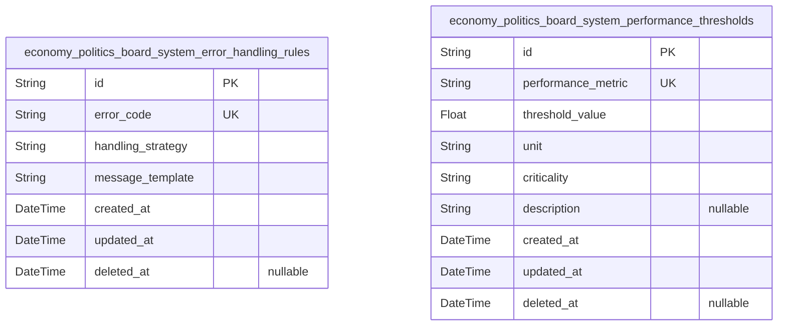
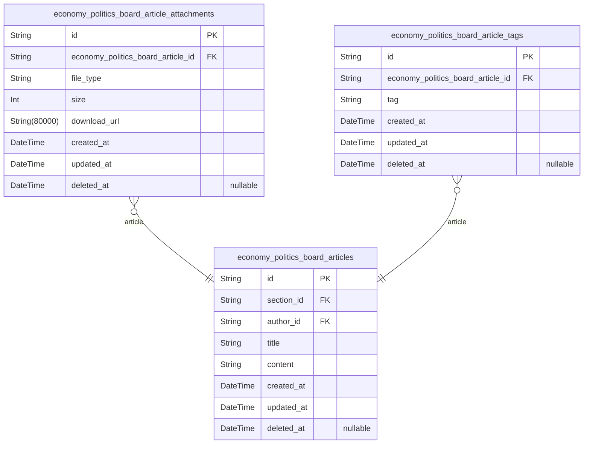
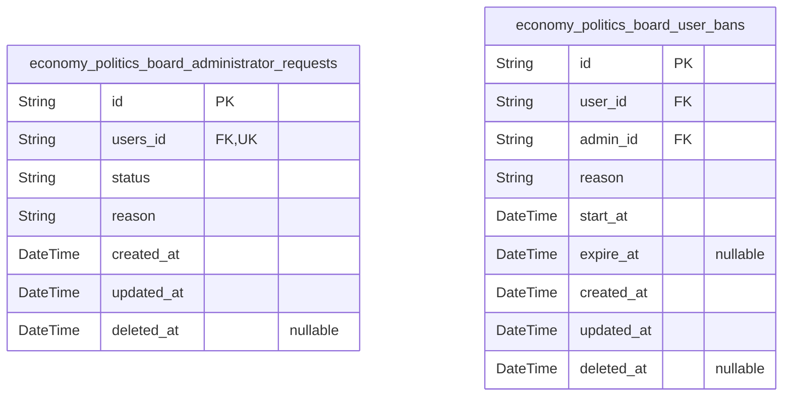
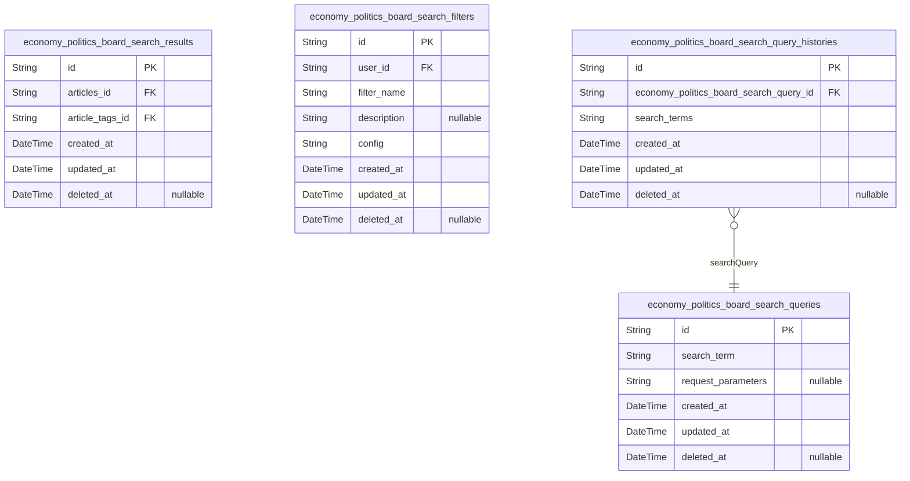

# Prisma Markdown

> Generated by [`prisma-markdown`](https://github.com/samchon/prisma-markdown)

- [Actors](#actors)
- [Systematic](#systematic)
- [Sections](#sections)
- [Articles](#articles)
- [Administration](#administration)
- [Search](#search)

## Actors

```mermaid
erDiagram
"economy_politics_board_users" {
  String id PK
  String email UK
  String password_hash
  DateTime created_at
  DateTime updated_at
  DateTime deleted_at "nullable"
}
"economy_politics_board_user_sessions" {
  String id PK
  String user_id FK
  String ip
  String(80000) href
  String(80000) referrer
  DateTime created_at
  DateTime updated_at
  DateTime expired_at
}
"economy_politics_board_user_password_resets" {
  String id PK
  String economy_politics_board_users_id FK
  String token UK
  DateTime expires_at
  Boolean is_used
  DateTime created_at
  DateTime updated_at
  DateTime deleted_at "nullable"
}
"economy_politics_board_user_email_verifications" {
  String id PK
  String users_id FK
  String token UK
  DateTime expires_at
  DateTime used_at "nullable"
  String status
  DateTime created_at
  DateTime updated_at
  DateTime deleted_at "nullable"
}
"economy_politics_board_admins" {
  String id PK
  String email UK
  String password_hash
  DateTime created_at
  DateTime updated_at
  DateTime deleted_at "nullable"
}
"economy_politics_board_admin_sessions" {
  String id PK
  String economy_politics_board_admin_id FK
  String ip
  String href
  String referrer
  DateTime created_at
  DateTime expired_at
}
"economy_politics_board_admin_password_resets" {
  String id PK
  String admin_id FK
  String token UK
  DateTime expires_at
  DateTime used_at "nullable"
  DateTime created_at
  DateTime updated_at
  DateTime deleted_at "nullable"
}
"economy_politics_board_admin_email_verifications" {
  String id PK
  String admin_id FK
  String token UK
  DateTime expires_at
  DateTime verified_at "nullable"
  DateTime created_at
  DateTime updated_at
  DateTime deleted_at "nullable"
}
"economy_politics_board_super_admins" {
  String id PK
  String email UK
  String password_hash
  DateTime created_at
  DateTime updated_at
  DateTime deleted_at "nullable"
}
"economy_politics_board_super_admin_sessions" {
  String id PK
  String economy_politics_board_super_admins_id FK
  String ip
  String href
  String referrer
  DateTime created_at
  DateTime expired_at
}
"economy_politics_board_super_admin_password_resets" {
  String id PK
  String super_admin_id FK
  String token UK
  DateTime expires_at
  DateTime created_at
  DateTime updated_at
  DateTime deleted_at "nullable"
}
"economy_politics_board_super_admin_email_verifications" {
  String id PK
  String super_admin_id FK
  String token UK
  DateTime expires_at
  DateTime created_at
  DateTime updated_at
  DateTime verified_at "nullable"
  DateTime deleted_at "nullable"
}
"economy_politics_board_user_sessions" }o--|| "economy_politics_board_users" : user
"economy_politics_board_user_password_resets" }o--|| "economy_politics_board_users" : user
"economy_politics_board_user_email_verifications" }o--|| "economy_politics_board_users" : user
"economy_politics_board_admin_sessions" }o--|| "economy_politics_board_admins" : admin
"economy_politics_board_admin_password_resets" }o--|| "economy_politics_board_admins" : admin
"economy_politics_board_admin_email_verifications" }o--|| "economy_politics_board_admins" : admin
"economy_politics_board_super_admin_sessions" }o--|| "economy_politics_board_super_admins" : superAdmin
"economy_politics_board_super_admin_password_resets" }o--|| "economy_politics_board_super_admins" : superAdmin
"economy_politics_board_super_admin_email_verifications" }o--|| "economy_politics_board_super_admins" : superAdmin
```

### `economy_politics_board_users`

Registered users with email/password credentials and authentication status.

Represents the primary identity record for standard community members.
This table contains core user authentication data including email and
password hash. Each user has a unique email address for login purposes.

Key relationships:
- Linked to user_sessions (many-to-one)
- Linked to user_password_resets (many-to-one)
- Linked to user_email_verifications (many-to-one)

Properties as follows:

- `id`: Primary Key.
- `email`
  > Email address for user authentication. Must follow valid email format
  > standard.
- `password_hash`: Securely hashed password for authentication.
- `created_at`: Account creation timestamp.
- `updated_at`: Last account modification timestamp.
- `deleted_at`: Account deletion timestamp (for soft delete).

### `economy_politics_board_user_sessions`

JWT session tokens with access/refresh support and expiration handling
for regular user accounts. Tracks login sessions with security metadata
including IP, user agent, and session duration for security auditing and
session management.

Properties as follows:

- `id`: Primary Key.
- `user_id`: User account's [economy_politics_board_users.id](#economy_politics_board_users).
- `ip`: IP address from where session was initiated.
- `href`: URL of request that initiated the session.
- `referrer`: Referer URL of request that initiated the session.
- `created_at`: Exact moment session was created.
- `updated_at`: Last update timestamp for security purposes.
- `expired_at`: When session automatically expires (24 hours from creation).

### `economy_politics_board_user_password_resets`

Password reset tokens for user authentication management with expiration
and usage tracking.

This table stores tokens for password reset requests with expiration
dates and usage status. Tokens are unique per user session and
automatically expire to ensure security. Managed strictly through
user-related operations within the authentication workflow.

Properties as follows:

- `id`: Primary Key.
- `economy_politics_board_users_id`
  > User's [economy_politics_board_users.id](#economy_politics_board_users) that requested the
  > password reset.
- `token`: Unique password reset token for authentication and verification.
- `expires_at`: When the password reset token expires (must be a future timestamp).
- `is_used`
  > Whether the password reset token has already been used for a password
  > change.
- `created_at`: Record creation timestamp for audit purposes.
- `updated_at`: Last update timestamp when the record changes.
- `deleted_at`: When record was soft-deleted (for audit trail).

### `economy_politics_board_user_email_verifications`

Tracks email verification tokens for users, including status and
expiration. Associated with a user record through the users_id foreign
key. Ensures verification process integrity with timestamp tracking of
each token's lifecycle.

Properties as follows:

- `id`: Primary Key.
- `users_id`: The associated user's identifier. [economy_politics_board_users.id](#economy_politics_board_users)
- `token`: Email verification token string.
- `expires_at`: Expiration timestamp for the verification token.
- `used_at`: Timestamp when the token was used for verification.
- `status`: Current status of the verification: pending, verified, or expired.
- `created_at`: Timestamp when the verification record was created.
- `updated_at`: Timestamp of the last update to the verification record.
- `deleted_at`
  > Timestamp when the record was marked as deleted (soft delete), or null if
  > not deleted.

### `economy_politics_board_admins`

Administrators with email/password credentials and elevated permissions.

This table stores administrator identities that require authentication
and have elevated permissions beyond regular users.

- **Email** is used for credential matching
- **Password hash** stores securely hashed credentials
- **Temporal fields** support auditing and soft deletion
- **Unique email constraint** ensures valid sign-in identifiers

Properties as follows:

- `id`: Primary Key.
- `email`: Unique email address for admin account (must match standard email format).
- `password_hash`: Password hash stored securely (using bcrypt algorithm).
- `created_at`: Timestamp when admin account was created.
- `updated_at`: Timestamp when admin account was last updated.
- `deleted_at`: Timestamp when admin account was soft-deleted (null if not deleted).

### `economy_politics_board_admin_sessions`

JWT session tokens for administrators with enhanced security. Tracks
active sessions for administrators with enhanced security requirements,
including IP, headers, and referrer information for audit purposes.

Properties as follows:

- `id`: Primary Key.
- `economy_politics_board_admin_id`
  > Reference to the administrator who owns this session. {@link
  > economy_politics_board_admins.id}
- `ip`: IP address from which the session was initiated.
- `href`: Current URL or request URI for the session.
- `referrer`: URL that referred the user to this session.
- `created_at`: Timestamp when the session was created.
- `expired_at`: Timestamp when the session expires (must be NOT NULL for security).

### `economy_politics_board_admin_password_resets`

Password reset tokens specifically for administrator accounts.

Contains unique tokens with expiration tracking, usage verification, and
audit trail for secure password resets. Implements necessary security
features including token generation with 128-bit entropy and time-bound
validity.

Reference: Admin authentication via {

Properties as follows:

- `id`: Primary Key.
- `admin_id`: Admin user account this reset token belongs to. {
- `token`: Unique one-time token for password reset process
- `expires_at`: Expiration timestamp for token validity (max 1 hour)
- `used_at`: Timestamp when token was successfully used for reset
- `created_at`: Record creation timestamp
- `updated_at`: Record last update timestamp
- `deleted_at`: Soft delete timestamp for audit trail

### `economy_politics_board_admin_email_verifications`

Email verification tokens for administrator accounts, enabling secure
email address validation during registration or update processes. Each
token is time-bound, single-use, and linked to the administrator's
account for verification context.

Properties as follows:

- `id`: Primary key.
- `admin_id`
  > Reference to associated administrator account. {@link
  > economy_politics_board_admins.id}
- `token`: Unique verification token sent to administrator's email address.
- `expires_at`: Timestamp when verification token expires (24 hours after creation).
- `verified_at`: Timestamp when email address was successfully verified.
- `created_at`: Timestamp when the verification token was created.
- `updated_at`: Timestamp when the verification token record was last updated.
- `deleted_at`: Timestamp when the verification token record was soft-deleted.

### `economy_politics_board_super_admins`

Super administrators with email/password credentials and all permissions.
Represents the highest authority level with full platform access and
management capabilities, distinct from standard administrators. This
table stores core identity and authentication details for super
administrators, while their sessions are handled separately through
dedicated session tables to maintain proper relational structure and
security practices.

Properties as follows:

- `id`: Primary Key.
- `email`
  > User's primary contact email address for authentication and
  > notifications. Must be unique across all actor types and pass valid email
  > format validation.
- `password_hash`
  > Securely hashed password used for authentication. Stored using
  > industry-standard hashing algorithms with salting for security.
- `created_at`: Timestamp when the super administrator account was created.
- `updated_at`: Timestamp when the super administrator account details were last modified.
- `deleted_at`
  > Timestamp when the super administrator account was marked for deletion
  > (soft delete). Null indicates active account.

### `economy_politics_board_super_admin_sessions`

JWT session tokens for super administrators with maximum security,
including connection metadata and expiration tracking. All session data
is append-only for security auditing.

Properties as follows:

- `id`: Primary Key.
- `economy_politics_board_super_admins_id`: Super administrator's [economy_politics_board_super_admins.id](#economy_politics_board_super_admins).
- `ip`: User's IP address during login.
- `href`: Request URL when session was created.
- `referrer`: Origin URL from where request was made.
- `created_at`: Timestamp when session was created.
- `expired_at`: Timestamp when session expires, calculated based on security policies.

### `economy_politics_board_super_admin_password_resets`

Password reset tokens for super administrator accounts, storing token
values, expiration, and associated admin references. Each token is
uniquely associated with a super administrator account and expires after
a set period.

Key relationship: Belongs to super_admins actor table (one-to-many
relationship: one super admin can have multiple password reset tokens).

Properties as follows:

- `id`: Primary Key.
- `super_admin_id`
  > Reference to the super administrator's account. {@link
  > economy_politics_board_super_admins.id}.
- `token`
  > Unique token used for password reset verification. Must be generated as a
  > secure random string.
- `expires_at`: Expiration timestamp of the password reset token. Must be in UTC format.
- `created_at`: Timestamp when the password reset token was created.
- `updated_at`: Timestamp of the last update to the token record.
- `deleted_at`
  > Timestamp when the token was invalidated (soft delete). Null indicates
  > active token.

### `economy_politics_board_super_admin_email_verifications`

Tracks email verification tokens for super administrators. Each token is
generated for a super administrator's email address during the
registration process, allowing them to verify ownership before account
activation.

The email verification lifecycle:
1. Token generated with expiration (default 24 hours)
2. User receives verification email
3. Token validated to activate account
4. Verification token marked as verified

All verification tokens are automatically expired after 24 hours to
maintain security.

Properties as follows:

- `id`: Primary Key.
- `super_admin_id`
  > References the super_admin whose email is being verified. {@link
  > economy_politics_board_super_admins.id}.
- `token`: Secure random token used to verify the email address.
- `expires_at`: Timestamp when the verification token expires (24 hours after creation).
- `created_at`: Timestamp when the verification token was created.
- `updated_at`: Timestamp when the verification token status was last updated.
- `verified_at`
  > Timestamp when the email address was successfully verified. NULL if not
  > yet verified.
- `deleted_at`: Timestamp when the verification record was soft-deleted.

## Systematic

### `economy_politics_board_system_error_handling_rules`

Stores system error codes, handling strategies, and message templates for
error handling scenarios including system-wide error configuration.

This table is used to define how different error types should be handled
across the platform, with configurable message templates that support
dynamic replacement of variables.

Critical for consistent error communication and user experience during
error states.

Properties as follows:

- `id`: Primary Key.
- `error_code`: Unique error identifier that corresponds to specific error conditions.
- `handling_strategy`: Strategy for handling this error type (e.g., 'retry', 'log', 'notify')
- `message_template`
  > Template string for error messages that will be dynamically rendered with
  > context variables.
- `created_at`: Timestamp when the error configuration was created.
- `updated_at`: Timestamp when the error configuration was last updated.
- `deleted_at`
  > Timestamp when the error configuration was marked as deleted (soft
  > delete).

### `economy_politics_board_system_performance_thresholds`

Defines measurable performance thresholds for critical system operations
and user experience metrics. Includes response time requirements for
search, content handling, and concurrent requests, with criticality
levels indicating severity. All thresholds are system-defined and managed
via configuration.

Properties as follows:

- `id`: Primary Key.
- `performance_metric`
  > Name of the performance metric (e.g., 'search_response_time',
  > 'request_throughput'). This is the identifier for the threshold category.
- `threshold_value`
  > The threshold value against which performance is measured. For example, a
  > response time threshold of 200ms is represented as 200.0.
- `unit`
  > Measurement unit for the threshold value (e.g., 'ms', 'sec',
  > 'requests_per_second'). Must be a valid metric unit.
- `criticality`
  > Criticality level of the threshold (high, medium, low). Indicates the
  > severity of the threshold breach.
- `description`
  > Additional details and context about this threshold, including use cases
  > and business implications.
- `created_at`: Timestamp of when the threshold was created.
- `updated_at`: Timestamp of the last update to the threshold.
- `deleted_at`: Timestamp of when the threshold was soft-deleted, if applicable.

## Sections

### `economy_politics_board_sections`

Stores section definitions including unique name, descriptive content,
and creation metadata for article categorization. Sections are required
to have unique names and descriptive content (minimum 20 characters).

Properties as follows:

- `id`: Primary Key.
- `name`: Unique section identifier displayed to users.
- `description`
  > Detailed description of the section's purpose and topic focus (minimum 20
  > characters).
- `created_at`: Timestamp when the section was created.
- `updated_at`: Timestamp when the section was last updated.
- `deleted_at`
  > Timestamp when the section was soft-deleted (nullable for soft delete
  > implementation).

## Articles

### `economy_politics_board_articles`

Main article content including title, content, section reference, and
author with creation timestamp. Articles are created by users, organized
within sections, and support text content with minimum 50 character
requirement. This table connects articles to their section and author
through foreign keys. Note: article attachments are stored separately in
economy_politics_board_article_attachments and tags in
economy_politics_board_article_tags tables.

Properties as follows:

- `id`: Primary Key.
- `section_id`
  > Section this article belongs to. {@link
  > economy_politics_board_sections.id}
- `author_id`
  > Author of this article (user identity). {@link
  > economy_politics_board_users.id}
- `title`: Article title (minimum 5 characters).
- `content`: Article content (minimum 50 characters).
- `created_at`: Article creation timestamp.
- `updated_at`: Article last update timestamp.
- `deleted_at`: Article deletion timestamp (for soft delete).

### `economy_politics_board_article_attachments`

File attachments associated with articles, including file type, size, and
download URL. Each attachment is linked to a single article and managed
as part of article content.

Attachments are stored as separate records to maintain article content
integrity and support 1:N relationship between articles and their
attachments.

Properties as follows:

- `id`: Primary Key.
- `economy_politics_board_article_id`: Parent article's [economy_politics_board_articles.id](#economy_politics_board_articles).
- `file_type`: MIME type of the file attachment.
- `size`: Size of the file in bytes.
- `download_url`: Permanent URL for file download.
- `created_at`: Record creation timestamp.
- `updated_at`: Last modification timestamp.
- `deleted_at`: Soft delete timestamp (null when not deleted).

### `economy_politics_board_article_tags`

User-added tags for article categorization with maximum 5 tags per
article. Tags must be free text limited to 30 characters with no
duplicates allowed per article.

This table is managed exclusively through the article entity
(economy_politics_board_articles) and requires no standalone API
endpoints. Tags serve as secondary categorization for search and section
filtering.

**Why subsidiary?**
- Tags require article context for meaningful use
- Users add/remove tags through article management flows
- No independent management capabilities exist (unlike primary entities)

Properties as follows:

- `id`: Primary Key.
- `economy_politics_board_article_id`: Article this tag belongs to [economy_politics_board_articles.id](#economy_politics_board_articles).
- `tag`: User-provided tag text limited to 30 characters for categorization.
- `created_at`: Timestamp of tag creation.
- `updated_at`: Timestamp of last tag update.
- `deleted_at`: Timestamp of tag deletion (soft delete).

## Administration

### `economy_politics_board_administrator_requests`

Tracks user requests to become administrators with status, reason, and
timestamps. Each user can submit only one active request (pending) at a
time. Requires user context and approval status tracking for
administrative workflows.

Properties as follows:

- `id`: Primary Key.
- `users_id`: User who submitted the request. {@link economy_politics_board_users.id.
- `status`: Current status of the request (pending, approved, rejected).
- `reason`: Reason provided by the user requesting administrator privileges.
- `created_at`: Timestamp when the request was submitted.
- `updated_at`: Timestamp of the last modification to the request.
- `deleted_at`: Timestamp when the request was marked as deleted.

### `economy_politics_board_user_bans`

Records user bans with details, reasons, duration and admin
justification. Banned users cannot login to the platform. Each ban entry
tracks the reason and optional expiration date.

- Ban reasons require minimum 10 characters
- Expiration dates may be indefinite (NULL)
- Linked to both user and admin tables

Properties as follows:

- `id`: Primary Key.
- `user_id`: User being banned's [economy_politics_board_users.id](#economy_politics_board_users).
- `admin_id`: Admin who imposed the ban's [economy_politics_board_admins.id](#economy_politics_board_admins).
- `reason`: Reason for ban (min 10 characters).
- `start_at`: Start date/time of ban.
- `expire_at`: Expiration date/time of ban (optional for indefinite bans).
- `created_at`: When the ban record was created.
- `updated_at`: When the ban record was last updated.
- `deleted_at`: When the ban was logically deleted (soft delete).

## Search

### `economy_politics_board_search_queries`

Stores user search terms with timestamps and request parameters. This
table captures the search terms entered by users and the parameters used
for each search, enabling the system to track and analyze search
patterns.

Each record represents a single search term and its associated request
parameters. The table is used to support the search and filtering
features of the platform, particularly for tracking search history and
improving search relevance.

Properties as follows:

- `id`: Primary Key.
- `search_term`: The actual search term entered by the user.
- `request_parameters`
  > Additional parameters from the search request, stored as JSON string for
  > flexibility.
- `created_at`: Timestamp when the search query was first recorded.
- `updated_at`: Timestamp when the search query record was last updated.
- `deleted_at`: Timestamp when the search query was soft-deleted (if applicable).

### `economy_politics_board_search_results`

Caches search results for performance, linked to articles and tags.
Stores optimized query results for faster search operations while
maintaining reference to source articles and associated tags.

Properties as follows:

- `id`: Primary Key.
- `articles_id`: Belonged article's [economy_politics_board_articles.id](#economy_politics_board_articles).
- `article_tags_id`: Belonged tag's [economy_politics_board_article_tags.id](#economy_politics_board_article_tags).
- `created_at`: Record creation timestamp.
- `updated_at`: Last update timestamp.
- `deleted_at`: Soft delete timestamp if deleted.

### `economy_politics_board_search_filters`

Persistent user filter configurations for tag-based search. Stores
user-specific preferences such as tag combinations, search parameters,
and filter criteria.

This table captures saved filter configurations that users can reuse
across multiple searches. Each record is uniquely tied to a user's
account and is intended for personalizing search results without
requiring repeated configuration.

The 'config' field stores filter settings as JSON string formatted data
(e.g., {"tags":["economy","politics"],"recent":true}).

Properties as follows:

- `id`: Primary Key.
- `user_id`
  > User who created this filter configuration {@link
  > economy_politics_board_users.id}.
- `filter_name`
  > Descriptive name of the filter configuration (e.g., 'Recent Articles',
  > 'Economy Focus').
- `description`: Optional description of the filter's purpose or content.
- `config`
  > Serialized filter configuration data in JSON format defining tag
  > preferences and search parameters.
- `created_at`: Timestamp when the filter configuration was created.
- `updated_at`: Timestamp when the filter configuration was last modified.
- `deleted_at`
  > Timestamp when the filter configuration was logically deleted (soft
  > delete).

### `economy_politics_board_search_query_histories`

Tracks historical search queries performed by each user, enabling
personalized search recommendations and analytics. This table captures
full user search terms for historical analysis and recommendation
generation while maintaining user-level ownership of search history
entries.

This subsidiary table depends directly on user activity and is managed
through user interaction workflows. It contains no business attributes
beyond search context, with no independent CRUD operations required.

Properties as follows:

- `id`: Primary Key.
- `economy_politics_board_search_query_id`
  > The search query that this history entry belongs to. {@link
  > economy_politics_board_search_queries.id}.
- `search_terms`
  > The search terms entered by the user, used for recommendations and search
  > history tracking.
- `created_at`: Timestamp when the search entry was created.
- `updated_at`: Timestamp when the search entry was last updated.
- `deleted_at`: Timestamp when the search entry was soft-deleted, if applicable.
