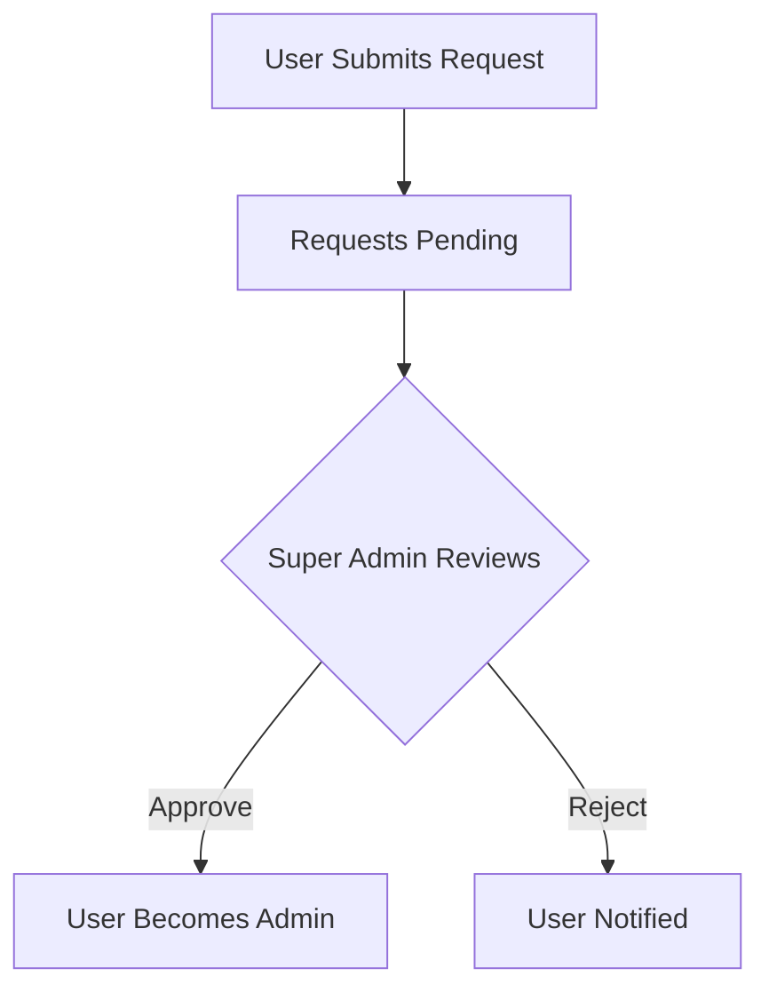

# Economic/Political Discussion Board Requirements

## Service Overview
> This platform enables community-driven discussion around economic and political topics. Users can create, manage, and discuss articles in categorized sections. Administrators oversee content quality and platform integrity.

### Core Features
- User account management with secure authentication
- Profile customization for personal branding
- Section-based article organization
- Multi-format article support (text, images, files)
- Comprehensive commenting system
- Administrative content governance
- Advanced search capabilities

### User Journey Overview
1. **Registration**: Users sign up with email and password
2. **Profile Setup**: Customize display name and bio
3. **Article Creation**: Create articles in designated sections with attachments and tags
4. **Discussion Participation**: Comment on articles and engage with others
5. **Administrative Oversight**: Administrators manage sections and content

## Business Model

### Primary Value Proposition
A safe, moderated platform for economic and political discussions where users can share insights, debate topics, and participate in meaningful conversations.

### User Engagement Model
- **Content Creation**: Users generate articles on current topics
- **Content Discovery**: Users browse sections and search content
- **Community Interaction**: Users engage through comments and profiles
- **Moderation**: Administrators ensure respectful, relevant discussions

### Revenue Strategy (Future)
- Premium member options with enhanced features
- Advertisement opportunities for relevant business content
- Sponsored topic sections for corporate partnerships

## User Actors and Capabilities

### 1. Regular User
**Authentication**: Email and password login

**Core Capabilities**:
- User Registration
  WHEN a user provides valid email and password, THE system SHALL create a new account within 3 seconds
  WHEN a user registration attempt fails, THE system SHALL provide specific error messages (invalid email format, password too short)

- Profile Management
  WHEN a user edits their display name, THE system SHALL validate name length (5-32 characters)
  WHEN a user updates their bio, THE system SHALL sanitize HTML content to prevent XSS attacks

- Article Management
  WHEN a user creates an article, THE system SHALL require title and content (both at least 10 characters)
  WHEN a user attaches files, THE system SHALL limit to 20 files per article with max 10MB each

- Commenting
  WHEN a user submits a comment, THE system SHALL require at least 5 characters of content
  WHEN a comment contains profanity, THE system SHALL automatically flag it for moderation

### 2. Regular Administrator
**Authentication**: Must be approved by Super Administrator

**Core Capabilities**:
- Section Management
  WHEN an administrator creates a section, THE system SHALL validate section name uniqueness
  WHEN an administrator deletes a section, THE system SHALL prompt for article migration

- Content Moderation
  WHEN an administrator deletes an article, THE system SHALL notify the author
  WHEN an administrator bans a user, THE system SHALL record reason and timestamp

- User Management
  WHEN an administrator bans a user, THE system SHALL prevent login attempts
  WHEN an administrator reviews ban requests, THE system SHALL display user submission reason

### 3. Super Administrator
**Authentication**: Must be approved by existing Super Administrator

**Core Capabilities**:
- Administrator Management
  WHEN a Super Administrator approves an administrator request, THE system SHALL grant regular administrator permissions
  WHEN a Super Administrator demotes a Super Administrator, THE system SHALL prevent self-demotion

- Platform Governance
  WHEN a Super Administrator reviews all banned users, THE system SHALL display user, reason, and date
  WHEN a Super Administrator views all pending administrator requests, THE system SHALL list reasons

## Functional Requirements

### 1. User Account Management

**User Registration**
- Users sign up with email and password
  REQUIREMENT: Users MUST provide valid email address (must match standard format)
  REQUIREMENT: Password MUST be at least 8 characters with alphanumeric and special characters

**User Authentication**
- Users log in with email and password
  REQUIREMENT: Login process SHALL fail after 5 attempts with 15-minute lockout
  REQUIREMENT: Session tokens SHALL expire after 24 hours of inactivity

**Password Management**
- Users can change their password
  REQUIREMENT: Change process SHALL require current password
  REQUIREMENT: New password MUST be stronger than old password

**Account Deletion**
- Users can delete their account
  REQUIREMENT: Account deletion SHALL permanently remove all associated content
  REQUIREMENT: Deletion process SHALL require multi-step confirmation (email + password)

### 2. User Profile System

**Profile Creation**
- Each user has a profile with display name and bio
  REQUIREMENT: Display name MUST be between 5-32 characters
  REQUIREMENT: Bio SHALL allow up to 250 characters with basic HTML formatting

**Profile Customization**
- Users can edit display name and bio
  REQUIREMENT: Edit process SHALL not change email address
  REQUIREMENT: Edits SHALL be immediately visible to other users

**Profile Viewing**
- Users can view other users' profiles
  REQUIREMENT: Profile view SHALL show public info (display name, bio, article count)
  REQUIREMENT: Profile page SHALL list all articles and comments created by user

### 3. Section Management

**Section Creation**
- Sections are created and managed by administrators
  REQUIREMENT: Section creation SHALL require unique name per platform
  REQUIREMENT: Section description SHALL be at least 20 characters

**Section Browsing**
- Users can view list of all sections
  REQUIREMENT: Section list SHALL display name and description
  REQUIREMENT: Section list SHALL be alphabetically ordered by name

**Article Browsing by Section**
- Users can browse articles within specific section
  REQUIREMENT: Section browsing SHALL display title, author, tags, and comment count
  REQUIREMENT: Article list SHALL be paginated with 20 items per page

### 4. Article System

**Article Creation**
- Users create articles in any section
  REQUIREMENT: Article creation SHALL require title (minimum 5 characters)
  REQUIREMENT: Article creation SHALL require content (minimum 50 characters)

**Attachments**
- Users can attach files (images, documents)
  REQUIREMENT: Attachments SHALL be stored as file records with download URLs
  REQUIREMENT: Max 20 attachments per article, each <= 10MB

**Tags**
- Users can add tags to articles
  REQUIREMENT: Tags SHALL be free text with maximum 30 characters each
  REQUIREMENT: Max 5 tags per article

**Article Editing**
- Users can edit their articles
  REQUIREMENT: Edit process SHALL maintain publication date
  REQUIREMENT: Changes SHALL be visible immediately to all users

**Article Deletion**
- Users can delete their articles
  REQUIREMENT: Deletion SHALL trigger immediate content removal
  REQUIREMENT: Author SHALL receive confirmation of deletion

### 5. Article Listing System

**Pagination**
- List is paginated (20 articles per page)
  REQUIREMENT: Page navigation SHALL show current page, total pages, and previous/next links
  REQUIREMENT: Pagination SHALL maintain current sort criteria

**Sorting**
- Users can sort articles by:
  - Newest first
  - Oldest first
  REQUIREMENT: Sorting SHALL update article display without reload
  REQUIREMENT: Default sort SHALL be newest first

**Article Listing Display**
- Each article shows: title, author, tags, comment count, time posted
  REQUIREMENT: Title SHALL be a clickable link to full article
  REQUIREMENT: Time posted SHALL use relative timestamp (e.g., 2 hours ago)

### 6. Article Viewing

**Full Article Display**
- Users view single article with full content
  REQUIREMENT: Article display SHALL show title, author, content, attachments
  REQUIREMENT: Attachments SHALL be downloadable
  REQUIREMENT: Tags and publication date SHALL be visible

### 7. Commenting System

**Comment Creation**
- Users write comments on articles
  REQUIREMENT: Comments SHALL require minimum 5 characters
  REQUIREMENT: Comments SHALL be displayed in chronological order

**Comment Viewing**
- Users view all comments on article
  REQUIREMENT: Comment view SHALL display author, content, timestamp
  REQUIREMENT: Comments SHALL show timestamp in relative format

**Comment Editing/Deletion**
- Users can edit/delete their own comments
  REQUIREMENT: Editing SHALL preserve comment date
  REQUIREMENT: Deletion SHALL remove comment immediately and update comment count

### 8. Search and Filtering

**Search**
- Search by title or content
  REQUIREMENT: Search SHALL match partial words
  REQUIREMENT: Search SHALL return results within 2 seconds

**Tag Filtering**
- Filter articles by tags
  REQUIREMENT: Filter SHALL show tag frequency
  REQUIREMENT: Multiple tags SHALL return articles matching ALL tags

### 9. Administrative System

**Administrator Request Management**
- Any user can submit request to become administrator
  REQUIREMENT: Request SHALL require justification text
  REQUIREMENT: Pending requests SHALL display submission date and reason

**Approval Process**
- Super Administrators approve/reject requests
  REQUIREMENT: Approval SHALL require Super Administrator credentials
  REQUIREMENT: Approval process SHALL send notification to user

**Administrative Powers**
- Administrator capabilities beyond normal users
  REQUIREMENT: Administrators SHALL create sections
  REQUIREMENT: Administrators SHALL delete any article
  REQUIREMENT: Administrators SHALL delete any comment

### 10. Banning System

**Ban Process**
- Administrators can ban users
  REQUIREMENT: Ban SHALL require recorded reason (min 10 characters)
  REQUIREMENT: Banned users SHALL be barred from all platform features

**Ban Management**
- Administrators view banned users
  REQUIREMENT: Banned user list SHALL include user, reason, date
  REQUIREMENT: Banned users SHALL remain visible in historical articles

## Business Processes

### Article Creation Workflow

```mermaid
graph TD
  A[User clicks "Create Article"] --> B[Select Section]
  B --> C[Enter Title and Content]
  C --> D[Add Tags]
  D --> E[Add Attachments]
  E --> F[Submit]
  F --> G[Article Created]
  G --> H[Visible in Section]
```

### Commenting Workflow

```mermaid
graph TD
  A[User Views Article] --> B[Clicks "Add Comment"]
  B --> C[Enters Comment Text]
  C --> D[Submits Comment]
  D --> E[Comment Appears]
  E --> F[Others View Comment]
```

### Administrator Approval Workflow

