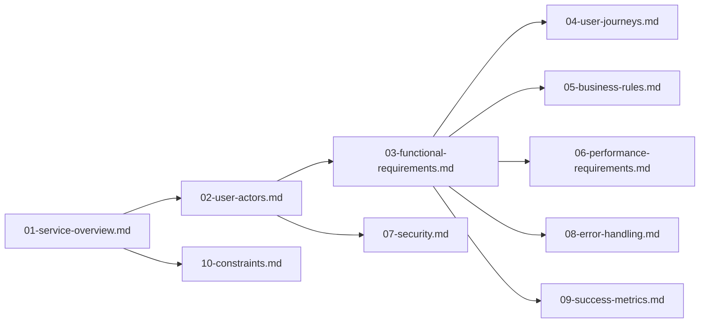

# Table of Contents

The following table of contents defines the complete documentation structure for the Discussion Board project. This document serves as the **foundation** for all other technical documentation and ensures comprehensive coverage of requirements for all stakeholders.

## Core Purpose
This Discussion Board is designed to provide a simple, minimal platform for users to share economic and political discussions with image and file attachments—without the complexity of user registration or moderation. The business model is based on **zero transactional cost** with no user login requirement, allowing anyone to post content immediately.

## Document Catalog
All documentation is structured in a logical, progressive order from business justification to technical implementation requirements. Each document serves a specific purpose and is referenced appropriately.

### Business Foundation Documents

#### `01-discussionBoard-service-overview.md`
- **Purpose**: Define the foundational purpose, business justification, and core value proposition for the discussion board.
- **Target Audience**: Business stakeholders
- **Key Focus**: Business model, value proposition, target audience, and success metrics
- **Reference**: [Service Overview Document](./01-discussionBoard-service-overview.md)

### User and Access Management

#### `02-discussionBoard-user-actors.md`
- **Purpose**: Outline specific user roles, permissions, and behavior requirements.
- **Target Audience**: Development team
- **Key Focus**: User actor statuses, permission structure, authentication requirements
- **Reference**: [User Actor Definition](./02-discussionBoard-user-actors.md)

### Functional Requirements

#### `03-discussionBoard-functional-requirements.md`
- **Purpose**: Enumerate all functional requirements in natural language with business-focused specifications.
- **Target Audience**: Development team
- **Key Focus**: Post creation, attachment handling, content management, user interaction flows
- **Reference**: [Functional Requirements Document](./03-discussionBoard-functional-requirements.md)

### User Experience

#### `04-discussionBoard-user-journeys.md`
- **Purpose**: Describe the primary user journey from initial access through content creation to engagement.
- **Target Audience**: Product managers
- **Key Focus**: New visitor journey, post creation flow, engagement experience
- **Reference**: [User Journey Documentation](./04-discussionBoard-user-journeys.md)

### Business Logic

#### `05-discussionBoard-business-rules.md`
- **Purpose**: Define the business rules and content validation requirements.
- **Target Audience**: Business stakeholders
- **Key Focus**: Content validation, attachment restrictions, moderation rules
- **Reference**: [Business Rules Document](./05-discussionBoard-business-rules.md)

### Performance Expectations

#### `06-discussionBoard-performance-requirements.md`
- **Purpose**: Specify expected performance characteristics and user experience goals.
- **Target Audience**: Development team
- **Key Focus**: Response times, content loading, system capacity
- **Reference**: [Performance Requirements Document](./06-discussionBoard-performance-requirements.md)

### Security and Privacy

#### `07-discussionBoard-security.md`
- **Purpose**: Describe basic security expectations and privacy handling for the discussion board.
- **Target Audience**: Business stakeholders
- **Key Focus**: Data protection, user privacy, security constraints
- **Reference**: [Security and Privacy Document](./07-discussionBoard-security.md)

### Error Handling

#### `08-discussionBoard-error-handling.md`
- **Purpose**: Define error scenarios and user-friendly recovery processes.
- **Target Audience**: Development team
- **Key Focus**: Common error scenarios, user error messages, recovery processes
- **Reference**: [Error Handling Documentation](./08-discussionBoard-error-handling.md)

### Success Metrics

#### `09-discussionBoard-success-metrics.md`
- **Purpose**: Define measurable success criteria and metrics for evaluating effectiveness.
- **Target Audience**: Business stakeholders
- **Key Focus**: Key performance indicators, success measurement, target goals
- **Reference**: [Success Metrics Document](./09-discussionBoard-success-metrics.md)

### Project Scope

#### `10-discussionBoard-constraints.md`
- **Purpose**: Outline key constraints and limitations for the development project scope.
- **Target Audience**: Project leads
- **Key Focus**: Scope limitations, technical constraints, business boundaries
- **Reference**: [Project Constraints Document](./10-discussionBoard-constraints.md)

## Implementation Flow

The documentation should be approached in this logical sequence throughout the development cycle:

1. **Start with Foundation**: Begin with `01-service-overview.md` to establish business context
2. **Define User Roles**: Follow with `02-user-actors.md` to establish user permissions
3. **Specify Requirements**: Progress to `03-functional-requirements.md` for detailed feature specifications
4. **Explain User Experience**: Continue with `04-user-journeys.md` for comprehensive workflow understanding
5. **Ground in Business Rules**: Reference `05-business-rules.md` for validation and constraints
6. **Validate Performance**: Use `06-performance-requirements.md` for user experience benchmarks
7. **Consider Security**: Ensure security considerations are addressed via `07-security.md`
8. **Plan for Errors**: Implement error handling from `08-error-handling.md`
9. **Measure Success**: Finalize with `09-success-metrics.md` for key success indicators
10. **Constrain the Scope**: Reference `10-constraints.md` throughout to maintain minimal scope

## Visual Representation of Document Relationships

## Business Justification

This discussion board serves a clear purpose: to provide a straightforward platform for community discussions without complex requirements or user registration. The minimal design reduces barriers to entry, with the focus on immediate content creation and engagement. This approach ensures that users can contribute to economic and political discussions **instantly** with **zero setup**.

## Stakeholder Alignment

### Business Stakeholders
- **What They Get**: Clear understanding of business model, success metrics, and project scope
- **How It Helps**: Aligns project goals with business objectives without technical distractions
- **Document Usage**: Relies primarily on `01-service-overview.md`, `05-business-rules.md`, `09-success-metrics.md`, and `10-constraints.md`

### Development Team
- **What They Get**: Complete requirements specification, user flows, and implementation guidance
- **How It Helps**: Directly translates requirements into technical implementation with minimal ambiguity
- **Document Usage**: Relies primarily on `02-user-actors.md`, `03-functional-requirements.md`, `04-user-journeys.md`, `06-performance-requirements.md`, and `08-error-handling.md`

### Product Managers
- **What They Get**: Insight into user experience, journey flows, and feature implementation
- **How It Helps**: Ensures product vision aligns with actual user experience
- **Document Usage**: Relies primarily on `04-user-journeys.md` and `03-functional-requirements.md`

> *Developer Note: This document defines **business requirements only**. All technical implementations (architecture, APIs, database design, etc.) are at the discretion of the development team.*