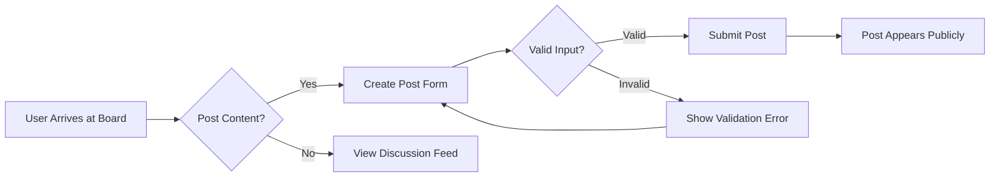

# Discussion Board Requirements Analysis

## Service Purpose

This Discussion Board is designed to provide a simple, minimal platform for users to share economic and political discussions with image and file attachments—without the complexity of user registration or moderation. The business model is based on **zero transactional cost** with no user login requirement, allowing anyone to post content immediately.

## Business Justification

This service fills a critical gap in making public discourse more approachable without technical barriers. Unlike traditional forums with registration requirements, this board prioritizes immediate participation—allowing anyone to post immediately without registration or account setup.

## Core Value Proposition

- **Zero-entry barriers**: No registration required to start discussions
- **Direct engagement**: Articles may be immediately commented on
- **Minimalist interface**: Focused on content without distractions
- **Instant visibility**: All posts appear publicly without approval workflows
- **File attachments**: Support for images (JPG/PNG) and PDF files up to 10MB

## Target Audience

- General public users who want to share opinions without complex setup
- Community members interested in economic and political discussions
- Casual content creators who want immediate publishing without login requirements
- Users preferring a frictionless experience over account management

## Success Metrics

- **Initial adoption**: 50+ discussions created within first 2 weeks of launch
- **Engagement rate**: 30% of posts will have at least one comment within 24 hours
- **Daily active users**: 25+ unique active users per day within 30 days
- **Participant retention**: 40% of first-time posters will return within 7 days
- **Attachment usage**: 40% of posts will include at least one attachment (image/PDF)

## Business Model

The board operates as a free, ad-supported platform. Revenue will be generated through targeted display ads, with no subscription or transactional fees. Ads will be contextually relevant to the discussion topics to maintain user engagement without disrupting the conversational flow.

## User Experience Flow

## Key Business Requirements

WHEN a guest user wants to create a new discussion post, THE system SHALL provide a simple form with four fields: "Title" (text input), "Content" (text area), "Image Attachment" (JPG/PNG ≤5MB), and "PDF Attachment" (PDF ≤10MB).

WHEN a guest successfully submits a valid post with attachments, THE system SHALL display the post immediately in the main discussion feed sorted by creation time.

WHEN a guest attempts to submit a post with a title fewer than 2 characters, THE system SHALL display an error message "Title must be at least 2 characters."

WHEN a guest attempts to submit a post with content fewer than 10 characters, THE system SHALL display an error message "Content must be at least 10 characters."

WHEN a guest attempts to upload an image file larger than 5MB, THE system SHALL display an error message "Image file too large (max 5MB allowed)."

WHEN a guest attempts to upload a PDF file larger than 10MB, THE system SHALL display an error message "PDF file too large (max 10MB allowed)."

WHEN a guest attempts to upload a file with unsupported format (e.g., DOCX, XLSX, MP3), THE system SHALL display an error message "Unsupported file type - only JPG, PNG, and PDF allowed."

## Content Validation Rules

- Title must be between 2-100 characters
- Content must be between 10-5000 characters
- Maximum of 3 attachments per post
- Total attachment size must not exceed 20MB (combined)
- Only JPG, PNG, and PDF file types allowed

## Error Handling

WHEN a guest user attempts to create a post with no content, THE system SHALL display the error "Article content must be at least 10 characters."

WHEN a guest user attempts to upload multiple files exceeding the 20MB total limit, THE system SHALL display the error "Combined attachments size must not exceed 20MB total."

## Performance Requirements

WHEN a user loads the discussion board homepage, THE system SHALL load the initial set of posts within 1.5 seconds.

WHEN a user submits a post with attachments, THE system SHALL provide confirmation within 3 seconds.

WHEN a user views a post with images, THE system SHALL display images within 2 seconds.

## Business Justification

This platform addresses the need for a simple, accessible way for users to share economic and political discussions without complex setup. The minimal design reduces barriers to entry while maintaining a productive discussion environment. By removing registration requirements, users can contribute to meaningful conversations immediately without friction.

> *Developer Note: This document defines **business requirements only**. All technical implementations (architecture, APIs, database design, etc.) are at the discretion of the development team.*