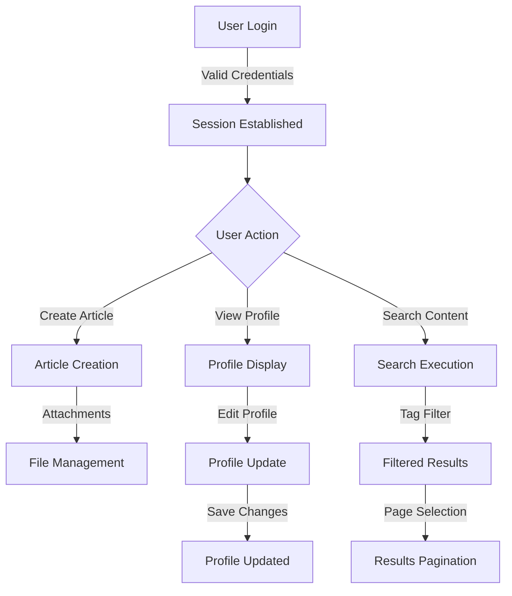

# Economic/Political Discussion Board - Requirements Specification

## Section 1: Service Overview

### Purpose & Vision
The Economic/Political Discussion Board (EPDB) establishes a dedicated platform for meaningful discourse on critical economic and political topics. The platform's purpose is to empower users with tools for sharing insights, engaging in constructive debates, and accessing high-quality content through organized sections and advanced search capabilities. This addresses a significant gap in the current digital landscape where broader forums lack specialized structure for these topics.

### Scope & Boundaries
#### In-Scope Features
- **User Account Management**: Users can sign up, log in, change passwords, delete accounts (with associated content deletion)
- **User Profiles**: Display name, bio text, profile viewing, article/comment listings
- **Section Management**: Creation/editing/deletion by administrators only (with section name and description)
- **Article Management**: Creation with title, content, section, attachments, tags; editing/deletion by authors
- **Article List**: Paginated, customizable sorting (newest/oldest), minimal display per article
- **Article Viewing**: Full content, attachments, comments, download capabilities
- **Search & Filtering**: Title/content search with pagination, tag-based filtering
- **Comment System**: Single-level comments, editing/deletion by authors, oldest-first sorting
- **Admin System**: Role management (regular/super admin), content moderation, user management, banning
- **Banning System**: Record ban reasons, maintain visibility of banned users' content

#### Out-of-Scope Features
- Frontend UI/UX design
- Email notification systems
- Payment gateways (beyond basic subscription logic)
- External API integrations
- Complex analytics dashboards

### Value Proposition

#### For Users
EPDB provides a specialized space for economic and political discussions with rich media support (attachable files/images). Users benefit from organized sections (Politics, Economy), advanced search with tag filtering, and the ability to document insights with attachments—all without clutter from unrelated content.

#### For Administrators
Administrators receive a comprehensive governance toolkit including section management, content moderation, user management with documented ban reasons, and role management. This enables effective community governance while maintaining transparency.

#### For Business
Revenue model combines premium subscriptions (60%), sponsored sections (30%), and targeted advertising (10%). This strategy supports sustainable growth with measurable success metrics:
- 20,000 active users within 6 months
- 15% premium conversion rate
- $50k revenue by month 6
- 90% positive user survey rating

## Section 2: User Requirements

### User Registration and Authentication
**WHEN** a new user visits the platform **AND** submits a valid email and password **THEN** THE system SHALL create a new user account **AND** respond with confirmation message. **WHEN** a registered user attempts to log in with valid credentials **THEN** THE system SHALL validate credentials **AND** establish a session with a JWT token valid for 24 hours. **WHEN** an existing user requests password change **THEN** THE system SHALL verify current password before updating to new password.

### User Profile Management
**WHEN** a user visits their profile page **THEN** THE system SHALL display their display name, bio, list of authored articles, and list of written comments. **WHEN** a user submits update to display name or bio **THEN** THE system SHALL save changes and update all relevant displays within 5 seconds. **WHEN** a user views another user's profile **THEN** THE system SHALL display visible profile information but hide account deletion functionality.

### User Account Deletion
**WHEN** a user requests account deletion **THEN** THE system SHALL confirm the request through a second authentication step **AND** delete the account along with all associated articles and comments within 24 hours. **WHEN** a user account is deleted **THEN** THE system SHALL invalidate associated authentication tokens immediately.

## Section 3: Article Management Requirements

### Article Creation Requirements
**WHEN** a user creates an article **THEN** THE system SHALL require title, content, and mandatory section selection. **WHEN** a user attaches files to an article **THEN** THE system SHALL allow multiple files (images and PDFs) with maximum 100MB total per article. **WHEN** a user adds tags to an article **THEN** THE system SHALL store up to 5 free-text tags per article, separated by commas.

### Article Modification Requirements
**WHEN** an author edits their article **THEN** THE system SHALL allow modification of title, content, attachments, and tags. **WHEN** an author deletes their article **THEN** THE system SHALL remove the article from all lists and views while maintaining visibility of associated comments (which will show author as "deleted user").

### Article View Requirements
**WHEN** a user views an article **THEN** THE system SHALL display title, author, full content, attachments, tags, and timestamp (in Seoul time zone). **WHEN** a user clicks on an attached file **THEN** THE system SHALL initiate file download without requiring additional authentication steps.

## Section 4: Admin System Requirements

### Administrator Role Management
**WHEN** a regular user submits an administrator request **THEN** THE system SHALL store the request with reason text. **WHEN** a super administrator reviews a pending request **THEN** THE system SHALL allow approval or rejection. **WHEN** an administrator is approved **THEN** THE system SHALL upgrade their role to regular administrator status.

### Administrator Permissions
**WHEN** a regular administrator accesses the admin dashboard **THEN** THE system SHALL grant full permissions including article and comment management. **WHEN** a super administrator moderates user requests **THEN** THE system SHALL allow promotion/demotion of regular administrators to super administrators. **WHEN** a super administrator demotes another super administrator **THEN** THE system SHALL prevent self-demotion and maintain one super administrator at all times.

### User Banning Requirements
**WHEN** an administrator bans a user **THEN** THE system SHALL record the reason text in permanent audit logs. **WHEN** a user is banned **THEN** THE system SHALL prevent logins while maintaining visibility of their existing content. **WHEN** an administrator unban a user **THEN** THE system SHALL restore account access without altering previously published content.

## Section 5: Content and Search Requirements

### Article Search Requirements
**WHEN** a user performs a search by title or content **THEN** THE system SHALL return paginated results (15 items per page). **WHEN** a user filters results by tags **THEN** THE system SHALL display only articles matching all specified tags. **WHEN** a user sorts results by 'newest first' **THEN** THE system SHALL order results with most recent articles first.

### Comment System Requirements
**WHEN** a user writes a comment on an article **THEN** THE system SHALL save the comment with author, content, and timestamp. **WHEN** a user views article comments **THEN** THE system SHALL display all comments sorted oldest-first. **WHEN** a user edits their own comment **THEN** THE system SHALL update the comment with current timestamp.

## Section 6: Business Rules

### Article Requirements
All articles SHALL have at least 50 words in content. File attachments SHALL be limited to 100MB total per article. Tags SHALL be limited to 5 per article with a maximum of 20 characters each. Section selection SHALL require at least one valid existing section.

### Comment Requirements
All comments SHALL have at least 10 words. Comments SHALL not exceed 500 characters. Single-level reply structure SHALL be maintained with no nested conversation threads.

### User Account Requirements
Email addresses SHALL contain a valid domain and structure. Passwords SHALL meet minimum complexity (8 characters, 1 uppercase, 1 lowercase, 1 number). User display names SHALL not exceed 30 characters.

### System Constraints
All timestamps SHALL be recorded in Asia/Seoul time zone. Session token expiration SHALL be 24 hours for security. Data retention for deleted accounts SHALL be 30 days before permanent removal.

## Visual Representation

