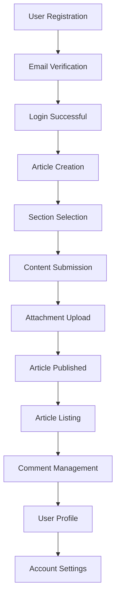

# Economic/Political Discussion Board Requirements Specification

## User Account

### Registration Flow

WHEN a guest user attempts to create an account, THE system SHALL:

1. Present a registration form requiring email and password inputs
2. Validate email format using standard rules (contains '@' and valid domain)
3. Create user account with status 'pending' upon valid submission
4. Send verification email with confirmation link within 5 seconds
5. Display success message upon email submission

### Email Verification

WHEN a user clicks the verification link, THE system SHALL:

1. Update account status to 'verified'
2. Generate JWT authentication token
3. Redirect user to login page with success message

### Authentication Requirements

WHEN a user attempts to log in, THE system SHALL:

1. Validate credentials against database within 1 second
2. Return user-friendly error for invalid credentials: "Invalid email or password"
3. Generate JWT token with 15-minute expiration
4. Store tokens using HTTP-only cookies for security
5. Automatically log out after 15 minutes of inactivity

### Password Management

WHEN a user requests password change, THE system SHALL:

1. Verify current password validity
2. Allow new password creation with minimum 8 characters
3. Confirm new password meets complexity requirements
4. Update password hash immediately after confirmation

### Account Deletion

WHEN a user requests account deletion, THE system SHALL:

1. Confirm deletion request through email verification
2. Permanently remove all related articles and comments
3. Notify user upon successful deletion
4. Ensure deleted user data cannot be recovered

## User Profile

### Profile Structure

WHEN a user creates profile for first time, THE system SHALL:

1. Request display name (50 characters max, no special characters)
2. Request bio text (500 characters max)
3. Store profile with user ID

### Profile Management

WHEN a user edits profile, THE system SHALL:

1. Allow modification of display name and bio
2. Validate length constraints before saving
3. Preserve existing profile data during edits

### Profile Viewing

WHEN a user views another user's profile, THE system SHALL:

1. Display display name and bio
2. Show list of articles ordered by date (newest first)
3. Show list of comments ordered by date (newest first)

## Sections

### Section Management

WHEN an administrator creates a new section, THE system SHALL:

1. Require section name (50 characters max, no special characters)
2. Require section description (200 characters max)
3. Store section with unique identifier

### Section Browsing

WHEN a user browses sections, THE system SHALL:

1. Display all available sections with name and description
2. Order sections alphabetically
3. Allow users to browse articles within specific sections

## Articles

### Article Creation

WHEN a user creates an article, THE system SHALL:

1. Require title (minimum 5 characters, maximum 100)
2. Require content (minimum 100 characters)
3. Require section selection from available options
4. Allow multiple attachments (PDF, DOC, XLS, PNG, JPG)
5. Enforce 25MB total attachment size limit

### Article Management

WHEN a user edits their article, THE system SHALL:

1. Allow modification of title, content, attachments, and tags
2. Preserve existing attachments during edits
3. Allow adding new tags while maintaining existing ones

### Article Deletion

WHEN a user deletes their article, THE system SHALL:

1. Permanently remove article and all associated attachments
2. Delete all comments on the article
3. Update article list to reflect deletion

## Article List

### Pagination and Sorting

WHEN a user views article list in a section, THE system SHALL:

1. Display articles with pagination (default 10 per page)
2. Show title, author, tags, comment count, and time posted
3. Allow sorting by:
   a. Newest first (default)
   b. Oldest first

### Search and Filtering

WHEN a user searches articles by title or content, THE system SHALL:

1. Return articles matching search terms (case-insensitive)
2. Display search results with pagination
3. Allow filtering by tags with multiple selection

## Viewing an Article

### Article Display

WHEN a user views single article, THE system SHALL:

1. Display full title, author, and time posted
2. Show complete article content
3. Display all attached files with download options
4. Show all tags applied to the article
5. Allow users to view author's profile from article page

## Comments

### Comment Requirements

WHEN a user submits a comment, THE system SHALL:

1. Require comment content (minimum 1 character, maximum 500)
2. Store comment with user ID, article ID, and timestamp
3. Sort comments by chronological order (oldest first)
4. Display author name and comment date

### Comment Management

WHEN a comment author edits their comment, THE system SHALL:

1. Allow modification of comment content
2. Update timestamp of last modification
3. Preserve all comment metadata

WHEN a comment author deletes their comment, THE system SHALL:

1. Remove comment immediately
2. Update comment count for associated article
3. Ensure no trace of deleted comment remains

## Administrator System

### Administrator Activation

WHEN a user submits administrator request, THE system SHALL:

1. Require reason text for request
2. Store request in pending list
3. Notify super administrators of new request

### Super Administrator Privileges

SUPER administrators SHALL have all capabilities of regular administrators plus:

1. Ability to approve/reject administrator requests
2. Ability to promote regular administrators to super administrator
3. Ability to demote other super administrators to regular administrators

### Administrator Operations

WHEN an administrator performs actions, THE system SHALL:

1. Allow creation, editing, and deletion of sections
2. Permit deletion of any article or comment
3. Enable ban/unban of users with documented reasons
4. Provide access to all user activity logs

## Banning System

### User Banning

WHEN an administrator bans a user, THE system SHALL:

1. Record ban reason (text field)
2. Preserve all user content (articles, comments) visible but non-editable
3. Prevent user from logging in
4. Display ban reason to super administrators in user report

### Ban Management

WHEN a user is banned, THE system SHALL:

1. Update user status to 'banned'
2. Store ban timestamp and reason
3. Provide option to unban with documented reason
4. List all banned users in administrator interface

## Business Context Integration

The discussion platform creates a structured environment for economic and political discourse. The system ensures:

1. **Verified Identity**: Email verification for all accounts establishes baseline credibility
2. **Categorized Discussions**: Sections reduce polarization by organizing topics by theme
3. **Quality Control**: Article requirements ensure substantive content (minimum 100 characters)
4. **Community Health**: Comment moderation and banning system maintains respectful discourse
5. **Scalable Architecture**: Modular design supports future expansion to additional topics and regions

## Mermaid Diagram Specifications

## Performance Requirements

- Article creation: < 2 seconds for 95% of cases
- Article list pagination: < 1 second handling up to 10,000 articles
- Search results: < 1.5 seconds for 95% of queries
- Concurrent access: Maintain performance with 1,000+ active users

## Error Validation

| Error Scenario | System Response |
|----------------|-----------------|
| Invalid credentials | "Invalid email or password" |
| Password mismatch | "New passwords do not match" |
| Missing verification | "Please verify your email first" |
| Duplicate email | "Email is already registered" |
| Attachment size > 25MB | "Attachment size limit is 25MB" |