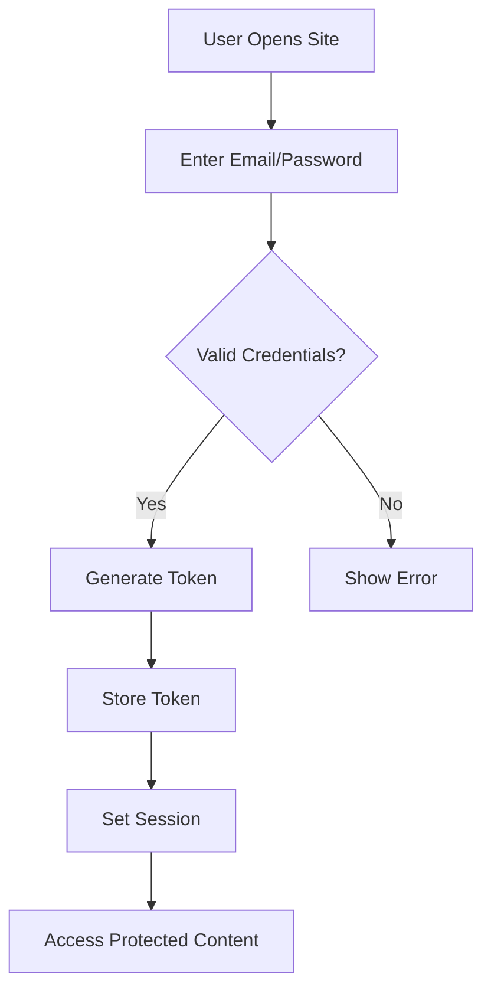

# Detailed Requirements Specification

## 1. Functional Requirements

### 1.1 User Account Management

WHEN a user submits registration form with valid email and password, THE system SHALL create a new account with email verification within 15 seconds and send confirmation email.

WHEN a user submits login credentials, THE system SHALL authenticate user within 1 second, verify email confirmation status, and generate secure session token.

WHEN a user submits password change request, THE system SHALL enforce password complexity (minimum 8 characters, 1 uppercase, 1 number), send verification email, and update credentials within 3 seconds.

WHEN a user submits account deletion request, THE system SHALL permanently remove user account and all associated articles/comments within 5 seconds, with notification to user that all content is irrevocably deleted.

### 1.2 User Profile Management

WHEN a user views their profile, THE system SHALL display display name, bio, article count, and profile link with 200ms loading time.

WHEN a user edits display name or bio, THE system SHALL validate input (max 100 characters), save updates within 1 second, and update all references across the platform.

WHEN a user views another user's profile, THE system SHALL display all published articles with pagination and visible tags within 300ms.

### 1.3 Section Management

WHEN an administrator creates a new section, THE system SHALL require unique name (max 50 characters) with description (max 250 characters) and validate inputs before submission.

WHEN a user browses articles in a section, THE system SHALL display articles with title, author, tags, comment count, and time posted in paginated list (20 articles per page).

WHEN a user sorts articles by date, THE system SHALL allow sorting by newest first or oldest first within 500ms response time.

### 1.4 Article Management

WHEN a user creates an article, THE system SHALL require title (min 5 characters), content (min 100 characters), section selection, and at least one attachment. Articles with insufficient content SHALL be rejected with specific feedback.

WHEN a user uploads files to an article, THE system SHALL accept images (max 10MB each) and documents (max 50MB), store them securely with S3-compatible storage, and display thumbnails within 2 seconds.

WHEN a user edits their article, THE system SHALL allow modification of title, content, attachments, and tags with version tracking and history.

WHEN a user deletes their article, THE system SHALL permanently remove it and associated attachments within 3 seconds with no recovery option.

### 1.5 Commenting System

WHEN a user posts a comment, THE system SHALL require content (min 10 characters), limit to 500 characters, and display within 1 second.

WHEN a user views comments on an article, THE system SHALL display comments sorted by oldest first, showing author, content, and time posted in paginated list (10 comments per page).

WHEN a user edits their comment, THE system SHALL allow modification of content within 300ms and update all references across the platform.

WHEN a user deletes their comment, THE system SHALL permanently remove it within 2 seconds with no recovery option.

### 1.6 Administrator System

WHEN a user submits administrator request, THE system SHALL collect reason text (min 20 characters), send notification to super administrator, and show request status to requesting user within 2 hours.

WHEN a super administrator approves a request, THE system SHALL grant regular administrator privileges within 5 minutes and send confirmation email.

WHEN a regular administrator creates a section, THE system SHALL validate inputs and create with appropriate permissions.

WHEN a super administrator promotes a regular administrator, THE system SHALL change role within 5 minutes and send notification to both parties.

### 1.7 Banning System

WHEN an administrator bans a user, THE system SHALL require documented reason (min 10 characters), record ban timestamp, and prevent future logins immediately.

WHEN a user is banned, THE system SHALL retain their articles and comments visible with [Banned User] label on profiles and article authorship.

WHEN a user is banned, THE system SHALL prevent access to all restricted areas with clear error message stating ban reason.

WHEN a super administrator unbans a user, THE system SHALL restore account access within 2 minutes and send notification to both parties.

## 2. User Scenarios

### 2.1 New User Registration

Scenario: A new user registers for the platform.

1. User opens registration page.
2. User enters valid email and password meeting security requirements.
3. User clicks register button.
4. System validates email and password.
5. System creates account and sends confirmation email.
6. User clicks confirmation link.
7. System verifies account and redirects to home page.

SUCCESS CRITERIA: Account creation completed within 30 seconds, no security vulnerabilities detected, email confirmation arrives within 2 minutes.

### 2.2 Article Creation

Scenario: A user creates a new article in the Economy section.

1. User navigates to Economy section.
2. User clicks "Create Article" button.
3. User selects title ("US Inflation Analysis"), content ("Data shows 3.2% inflation..."), and attaches two graphs.
4. User selects "Economy" section and adds tags: "inflation", "data".
5. User clicks submit.
6. System validates all fields, processes attachments, and posts article.

SUCCESS CRITERIA: Article appears with attached files, tags, and correct section within 2 seconds after submission.

## 3. Authentication and Authorization

WHEN a user accesses API resources, THE system SHALL require valid JWT token in Authorization header with permission checks.

WHEN a user without proper permissions attempts an action, THE system SHALL return 403 Forbidden with specific reason text.

WHEN a session expires, THE system SHALL prompt for re-authentication after 2 hours of inactivity.

WHEN two-factor authentication is enabled, THE system SHALL require second factor verification for privileged actions.

## 4. Business Rules

### Content Validation Rule

IF an article lacks proper source attribution for economic data, THEN THE system SHALL prevent publication until evidence is provided.

### User Status Rule

WHEN a user has a verified economic background, THEN THE system SHALL display "Expert" badge with their username.

### Premium Feature Rule

WHEN a premium user accesses restricted content, THEN THE system SHALL verify subscription status within 0.5 seconds with no latency impact on user experience.

### Session Management Rule

WHEN a user logs out, THEN THE system SHALL invalidate session token and prevent token reuse immediately.

## Mermaid Diagram: User Authentication Flow

