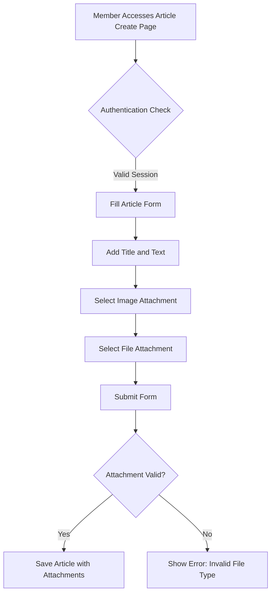

# Tech-Simple Discussion Platform Requirements

## 1. Service Overview

### Core Value Proposition
The discussion platform delivers a straightforward economic/political discourse space without registration barriers, focusing on article sharing with media attachments. This enables community members to share perspectives on local and global issues through structured content without technical overhead.

### Business Goals
- Create an open forum for political/economic discussions with minimal friction
- Support article creation with image and file attachments
- Maintain simple content moderation by administrators
- Ensure secure session handling with standard authentication
- Limit file attachments to prevent system overload

### Target Audience
- Individuals interested in economic/political topics
- Community members seeking to share insights without technical barriers
- Administrators monitoring content quality

## 2. User Actors and Permissions

### Guest (Unauthenticated User)
- **Purpose**: Individuals accessing discussion content without account
- **Primary Role**: View public discussion content
- **Business Limitation**: Cannot create posts or access private features
- **EARS Requirement**:
  WHEN a guest visits the platform, THE system SHALL display only public articles with view-only interface

### Member (Authenticated User)
- **Purpose**: Registered users participating in discussions
- **Primary Role**: Create, edit, delete own articles with media attachments
- **Business Limitation**: Can only modify own content
- **EARS Requirement**:
  WHEN a member creates an article, THE system SHALL validate attachments against allowed MIME types (image/jpeg, image/png, application/pdf)

### Admin (System Administrator)
- **Purpose**: Platform managers maintaining content quality
- **Primary Role**: Moderate content, manage user accounts
- **Business Limitation**: Cannot interact with discussion articles as regular users
- **EARS Requirement**:
  WHEN an article is reported as inappropriate, THE system SHALL notify admin with moderation tools available within 24 hours

### Permissions Matrix

| Action | Guest | Member | Admin |
|--------|-------|--------|-------|
| View All Articles | ✅ | ✅ | ✅ |
| Create New Article | ❌ | ✅ | ❌ |
| Edit Own Article | ❌ | ✅ | ❌ |
| Delete Own Article | ❌ | ✅ | ❌ |
| Attach Image | ❌ | ✅ | ❌ |
| Attach File | ❌ | ✅ | ❌ |
| Moderate Content | ❌ | ❌ | ✅ |

- **EARS Requirement**:
  WHEN a member attempts to edit another user's article, THE system SHALL prevent modification and display error message USER_NOT_AUTHORIZED

## 3. Article Creation Feature

### Core Process

- **EARS Requirement**:
  WHEN a member selects an image for attachment, THE system SHALL display preview of image before submission

### Attachment Specifications
- **Image Limit**: Maximum 1 image per article (all sizes accepted, but system will resize to 1200x800px)
- **File Limit**: Maximum 1 file per article (PDF or DOCX format only)
- **Size Limit**: Maximum 10MB per attachment, total article size maximum 20MB

- **EARS Requirement**:
  WHEN an attachment exceeds size limit, THE system SHALL display error message ATTACHMENT_SIZE_EXCEEDED with specific upload limit details

## 4. Security Requirements

### Authentication Security
- **Session Management**:
  - WHEN user logs in successfully, THE system SHALL create session with 30-minute expiration clock
  - WHEN session expires during article edit, THE system SHALL automatically save draft and request re-login

- **Security Implementation**:
  - HTTPOnly cookies for session storage
  - Secure HTTPS for all authentication flows
  - JWT tokens with HS256 algorithm for session integrity

### Content Security
- **File Scanning**:
  - WHEN a file is uploaded, THE system SHALL automatically scan for malware before saving
  - WHEN malware detected, THE system SHALL block upload with error message MALWARE_DETECTED

- **Valid MIME Types**:
  - Images: `image/jpeg`, `image/png`, `image/gif`
  - Files: `application/pdf`, `application/msword`, `application/vnd.openxmlformats-officedocument.wordprocessingml.document`

- **EARS Requirement**:
  WHEN an unknown MIME type is uploaded, THE system SHALL reject file with error code INVALID_FILE_TYPE

## 5. Error Handling Requirements

| Error Code | Description | Business Context |
|------------|-------------|------------------|
| ATTACHMENT_SIZE_EXCEEDED | File exceeds size limit | User needs to reduce file size |
| INVALID_FILE_TYPE | Unsupported file format | User needs to submit correct format |
| MALWARE_DETECTED | File contains malware | System security protects platform |
| USER_NOT_AUTHORIZED | Attempting unauthorized action | User cannot access restricted feature |

- **EARS Requirement**:
  WHEN an error occurs during article creation, THE system SHALL display: (1) error code, (2) user-friendly message, (3) recommended action
