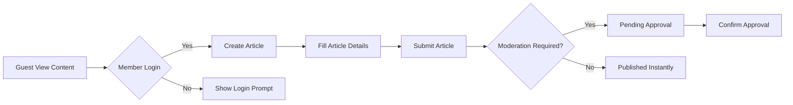
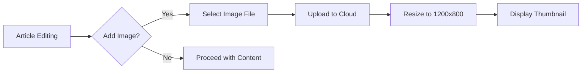
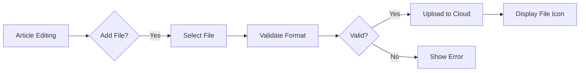

# Discussion Board Requirements Analysis

## Service Overview

This document details the core functionality requirements for the economic/political discussion board application. The system enables community members to create discussion threads with text, images, and file attachments while maintaining a straightforward user experience as requested. The platform operates under strict simplicity constraints with no complex features or revenue model.

## Core Business Requirements

### Article Creation

**Business Requirement (Y1)**
WHEN a member creates an article, THE system SHALL require a minimum of 50 characters in both the title and main content text.

**Business Requirement (Y2)**
WHEN a member submits an article, THE system SHALL display a success message "Your article has been submitted for review" and redirect to the article's public URL.

**Business Requirement (Y3)**
WHILE creating an article, THE system SHALL display a character count indicator showing "30 characters remaining" when content reaches 200 characters.

**Business Requirement (Y4)**
IF an article has less than 50 characters in main content, THEN THE system SHALL block submission and display "Article must contain at least 50 characters of text".

### Image Attachment System

**Business Requirement (Y5)**
WHEN a user selects an image for upload, THE system SHALL accept only JPG, PNG, or GIF formats with maximum 5MB file size.

**Business Requirement (Y6)**
WHEN an image is uploaded, THE system SHALL automatically resize it to maximum dimensions of 1200x800 pixels.

**Business Requirement (Y7)**
THE system SHALL display a watermark "Photo included" below each released image in published posts.

### File Attachment System

**Business Requirement (Y8)**
WHEN a user selects a file for attachment, THE system SHALL accept PDF, DOCX, or XLSX formats with maximum 10MB file size.

**Business Requirement (Y9)**
THE system SHALL display a file type icon and size indicator (e.g., "File attached (PDF - 2.3MB)") for each attachment.

**Business Requirement (Y10)**
THE system SHALL limit attachments to one file per article.

### Moderation Workflow

**Business Requirement (Y11)**
WHEN an unverified account submits an article, THEN THE system SHALL queue it for moderation before public display.

**Business Requirement (Y12)**
WHEN an administrator rejects an article, THE system SHALL require a rejection reason from the administrator.

**Business Requirement (Y13)**
IF rejection reason is not provided, THEN THE system SHALL display "Please provide a reason for rejecting this article".

**Business Requirement (Y14)**
WHEN an article is rejected, THE system SHALL display "Article rejected. Reason: [reason provided]" to the creator.

## Business Process Diagrams

### Article Creation Workflow

### Media Attachment Process

### File Attachment Process

## Business Constraints

- **Simplicity Constraint**: Platform must maintain minimal feature set with no comments, voting, or category systems.
- **Performance Constraint**: All content interactions must complete within 3 seconds during peak usage.
- **Privacy Constraint**: No personal data collection beyond basic account details.
- **Security Constraint**: All uploads must pass content safety checks before public display.
- **Capacity Constraint**: System must support 500 simultaneous connections with current infrastructure.

## Implementation Guidelines

- **Authentication Flow**: Guest users must log in to create articles. All user accounts are verifiable via email confirmation.
- **Attachment Handling**: Images and files are stored in cloud storage with CDN delivery for fast loading.
- **Moderation Trigger**: Unverified email accounts automatically trigger moderation queue.
- **Error Handling**: All validation errors display clear, actionable messages to users.
- **User Display**: All content follows consistent styling with emphasis on readability.

> *Note: This document defines business requirements only. Technical implementation details are out of scope for this analysis.*