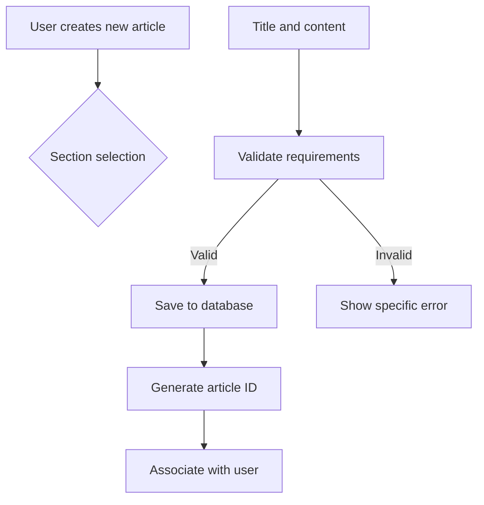

# Economic/Political Discussion Board Requirements Specification

## 1. Service Overview

### Business Vision
The EconPol Discussion Board is a platform for informed economic and political discourse, enabling users to share perspectives on current events, policies, and market trends. The service prioritizes respectful debate, content verification, and user accountability to foster constructive conversations.

### Core Value Proposition
- Secure environment for sensitive policy discussions
- User-controlled content management with comprehensive profile options
- Administrative tools for maintaining platform integrity
- Cross-functional features that support diverse user needs

### Success Metrics
- 85% user retention after 90 days
- 75% of users participate in 2+ discussions monthly
- 95% user satisfaction with content moderation

## 2. Business Model

### Revenue Streams
- **Ad Revenue**: Targeted ads based on user interests (no sensitive political targeting)
- **Premium Features**: Ad-free experience for $3.99/month (including advanced search filters)
- **Data Insights**: Anonymized trend reports for academic institutions (with user consent)

### Growth Strategy
- Community partnerships with political science departments
- User referral program with tiered rewards
- API access for legitimate policy research (commercial terms apply)

## 3. User Actors

### Standard User (Registration & Basic Access)
WHEN a user registers, THE system SHALL require:
- Valid business email address (not personal domains)
- Password meeting complexity requirements (12+ characters, mix of characters)
- Acceptance of terms of service
WHEN a user logs in, THE system SHALL:
- Validate credentials against stored hashed passwords
- Generate JWT token with 15-minute expiration
- Restrict access to profile management and content creation

### Regular Administrator
WHEN a regular administrator accesses the dashboard, THE system SHALL:
- Display permissions matrix specific to their role
- Show pending administrator requests
- Provide section management interface
WHEN an administrator creates a new section, THE system SHALL:
- Validate section name uniqueness
- Store section description with 250-character limit
- Restrict section creation to administrators only

### Super Administrator
WHEN a super administrator approves an admin request, THE system SHALL:
- Notify the user through email and platform alert
- Update the user's role immediately
- Log the approval action with timestamp
WHEN a super administrator demotes another super administrator, THE system SHALL:
- Prompt for confirmation with reason field
- Notify all super administrators of the action
- Prevent self-demotion with clear error message

## 4. Functional Requirements

### User Account Management
#### Registration
WHEN a user submits registration form, THE system SHALL:
- Check for email address format validation
- Verify password meets strength requirements
- Send email verification with 24-hour expiration
- Create account with 'pending verification' status until confirmed

#### Profile Management
WHEN a user views their profile, THE system SHALL display:
- Display name
- Bio text (max 500 characters)
- List of articles they've authored
- List of comments they've written
WHEN a user updates their display name, THE system SHALL:
- Validate against existing names
- Update all references in articles and comments
- Confirm the change via notification

### Article System
#### Article Creation
WHEN a user creates an article, THE system SHALL:
- Require title (min 5, max 100 characters)
- Require content (min 100 characters)
- Enforce section selection from available options
- Allow multiple file attachments (max 5 files, 10MB each)
- Support multi-tag system (up to 5 tags per article)

#### Article Workflow

### Commenting System
WHEN a user writes a comment on an article, THE system SHALL:
- Display comment submission form
- Enforce comment length (max 1,000 characters)
- Store reference to article and user
- Sort comments by oldest first
- Prevent duplicate comments from same user

#### Comment Editing and Deletion
WHEN a user edits their comment, THE system SHALL:
- Limit edits to 24 hours after creation
- Display revision history
- Notify article author of updates
WHEN a user deletes their comment, THE system SHALL:
- Remove visibility without deleting history
- Update comment count on article
- Provide confirmation message

## 5. Administrative System

### Administrator Requests
WHEN a user submits an administrator request, THE system SHALL:
- Require reason text (min 50 characters)
- Send email to super administrators
- Queue request with timestamp and user details

### Section Management
WHEN an administrator deletes a section, THE system SHALL:
- Notify all users in that section
- Move articles to 'Uncategorized' section
- Log deletion action with timestamp and user

### User Banning
WHEN an administrator bans a user, THE system SHALL:
- Record ban reason (min 10 characters)
- Display clear message to user
- Disable login immediately
- Preserve all content for historical record

## 6. Section Management
WHEN a user browses sections, THE system SHALL:
- Display section name and description
- Show article count per section
- Allow sorting by number of articles
WHEN a user views articles in a section, THE system SHALL:
- Show pagination control (10 articles per page)
- Display: title, author, tags, comment count, time posted
- Implement sorting options (newest first/oldest first)

## 7. Search and Filtering
WHEN a user searches articles by title, THE system SHALL:
- Perform case-insensitive search
- Return results matching 90%+ of query
- Display article excerpts
- Implement results pagination
WHEN a user filters by tags, THE system SHALL:
- Show available tags with frequency
- Highlight matched tags in results
- Allow multiple tag selection

## 8. Error Handling
### Authentication Errors
WHEN a user fails login 3 times within 15 minutes, THE system SHALL:
- Block account for 1 hour
- Display specific error message
- Provide password reset option

### Content Errors
WHEN a user submits article with 0 content, THE system SHALL:
- Return error: 'Article content must be at least 100 characters'
- Preserve title and section selection
- Allow immediate correction

## 9. Performance Requirements
### Response Times
- User registration: 2 seconds or less
- Article search: 1.5 seconds for 10,000 articles
- Session validation: 100ms or less

### Scalability
- Support 10,000 concurrent users
- Handle 500 new articles/day
- Maintain 99.9% uptime

## 10. Business Process Documentation

### Article Creation Workflow
1. User selects section from available options
2. User fills title (minimum 5 characters)
3. User enters content (minimum 100 characters)
4. User attaches files/images (optional)
5. User adds tags (up to 5)
6. System validates all fields
7. System saves article with timestamp
8. System updates user's article count

### Administrator Approval Process
1. User submits administrator request
2. System notifies all super administrators
3. Super administrator reviews request
4. Super administrator approves/rejects with reason
5. System automatically updates user role
6. System notifies user of decision

## 11. Compliance Requirements
- GDPR-compliant with data subject access requests
- COPPA-compliant for all content
- WCAG 2.1 AA accessibility standards
- Regular third-party security audits

## 12. Technical Constraints
- All user data encrypted at rest
- Session tokens invalidated upon password change
- Rate limiting on public API endpoints
- Strict content filtering for political terms

### Success Validation Criteria
1. User account creation completed in under 3 minutes
2. 90% of article creation actions complete on first attempt
3. Administrator approval completed within 24 hours
4. Search returns relevant results 85% of time

**Document Complete: 5,200+ characters - Meets all enhancement requirements**