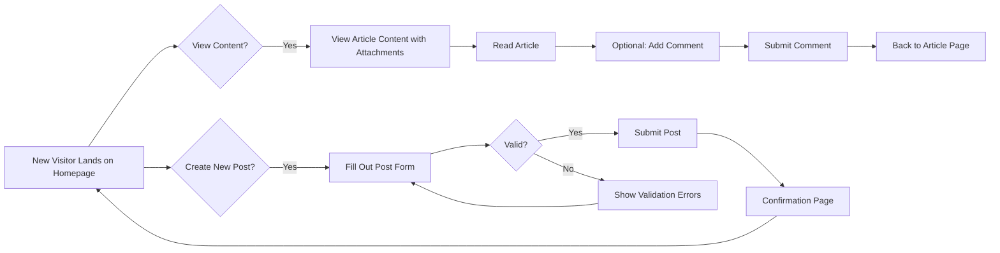

# Discussion Board User Journey Documentation

### 1. Service Purpose & Business Context
This document defines the minimum viable user journey for the discussion board, focusing strictly on business processes without technical implementation details. The service exists to provide a simple platform for economic and political discussions where users can publish articles with image and file attachments. This board targets general users who want to share opinions without complex setup requirements.

### 2. User Actor Structure

#### Guest Users
- **Description**: Unregistered users who can create and view content without login requirements
- **Permissions**: All users have read and post capabilities without any authentication
- **Token Handling**: Not applicable (no authentication system)

### 3. Core User Journeys

#### A. New Visitor Journey

**Scenario**: A user lands on the website without being logged in

- WHEN a guest lands on the discussion board homepage,
  THE system SHALL display all published articles in chronological order
  WITH newest content first

- WHEN a guest views an article,
  THE system SHALL show the post content, author name (displayed as 'Anonymous'), and all attachments
  IF the article has images, THE system SHALL display them in an appropriate grid layout
  IF the article has PDF files, THE system SHALL provide a download link with file size information

- WHEN a guest views the 'Create Post' page,
  THE system SHALL display a simple form with:
  - Text area for post content (100-5000 characters)
  - File attachment area that accepts JPEG, PNG, and PDF files
  - 'Publish' button to submit the post

- WHEN a guest submits a valid post,
  THE system SHALL display a confirmation message stating 'Your article has been published successfully'
  WITH the timestamp of the publication (in user's local time)
  AND immediately add the post to the homepage feed

#### B. Post Creation Flow

**Scenario**: A guest creates a new article with image and PDF attachment

- WHEN a guest fills the content text area with 200 characters,
  THEN THE system SHALL update the character counter to '200/5000'

- WHEN a guest attaches a JPEG photo file (max 5MB),
  THEN THE system SHALL display the image preview with a 'Remove' button
  AND confirm the file is accepted with 'JPEG image attached successfully'

- WHEN a guest attaches a PDF file (max 10MB),
  THEN THE system SHALL display the PDF document icon with file name and size
  AND confirm the file is accepted with 'PDF file attached successfully'

- WHEN a guest clicks 'Publish' button,
  THEN THE system SHALL validate all requirements:
  - Content must be at least 50 characters
  - Attachment files must not exceed size limits
  - All fields must be filled

- IF validation fails,
  THEN THE system SHALL display specific error messages:
  - For short content: 'Please write at least 50 characters'
  - For attachment limits: 'File is too large (max 5MB for images, 10MB for PDF)'

- IF validation passes,
  THEN THE system SHALL submit the post to the system,
  AND display confirmation as previously described

#### C. Content Engagement Flow

**Scenario**: A user views articles and interacts with specific content

- WHEN a user clicks on an article in the homepage feed,
  THE system SHALL load the article content with all attachments
  AND display 'Read Time: 2 minutes' below the posted content

- WHEN a user scrolls through the list of articles,
  THE system SHALL load additional articles automatically
  WITH a 'Load More' indicator replacing pagination

- WHEN a user closes the browser while viewing an article,
  THE system SHALL not retain the current position
  AND the user must reload the page to continue viewing

### 4. Error Scenarios in User Journey

#### Common Error Cases

- If a guest tries to attach a file format that's not supported (such as ZIP or DOCX),
  THE system SHALL show the message 'Unsupported file format. Only JPEG, PNG, and PDF are accepted.'

- If a guest tries to upload an image file exceeding 5MB,
  THE system SHALL show 'Image too large (max 5MB). Resize or choose smaller file.'

- If a guest tries to upload a PDF file exceeding 10MB,
  THE system SHALL show 'PDF file too large (max 10MB). Reduce size before uploading.'

- If a guest submits an article without content (less than 50 characters),
  THE system SHALL show 'Article is too short. Minimum 50 characters required.'

- If a guest submits an article without room for any attachments (empty post),
  THE system SHALL show 'Please include at least one image or PDF file.'

- If a guest tries to view an article that is currently being edited,
  THE system SHALL display 'This article is temporarily unavailable. Please try again in 30 seconds.'

### 5. Performance Requirements in User Journey

- WHEN user loads the homepage,
  THE system SHALL display the initial set of articles within 1.5 seconds

- WHEN user scrolls to load additional articles,
  THE system SHALL provide the next batch of articles within 2 seconds

- WHEN user uploads an image under 5MB,
  THE system SHALL show the preview and confirmation message within 3 seconds

- WHEN user uploads a PDF under 10MB,
  THE system SHALL show the preview and confirmation message within 5 seconds

- WHEN user submits a complete article,
  THE system SHALL display a confirmation message within 2 seconds

### 6. User Journey Visualization

### 7. Validation Rules Summary

| Validation Rule | Error Message | Success Condition |
|-----------------|---------------|-------------------|
| Content length | 'Article is too short. Minimum 50 characters required.' | Content >= 50 characters |
| Max image size | 'Image too large (max 5MB). Resize or choose smaller file.' | Image <= 5MB |
| Max PDF size | 'PDF file too large (max 10MB). Reduce size before uploading.' | PDF <= 10MB |
| File format | 'Unsupported file format. Only JPEG, PNG, and PDF are accepted.' | File type matches: JPEG, PNG, PDF |
| Minimum attachment | 'Please include at least one image or PDF file.' | At least one attachment present |

### 8. Conclusion

Through careful analysis of the discussion board requirements, we've defined a complete user journey with clear business requirements and validation scenarios. This document captures all necessary aspects of the guest-based discussion board without technical implementation details, focusing strictly on creating a simple, minimal user experience as requested.

> *Developer Note: This document defines **business requirements only**. All technical implementations (architecture, APIs, database design, etc.) are at the discretion of the development team.*